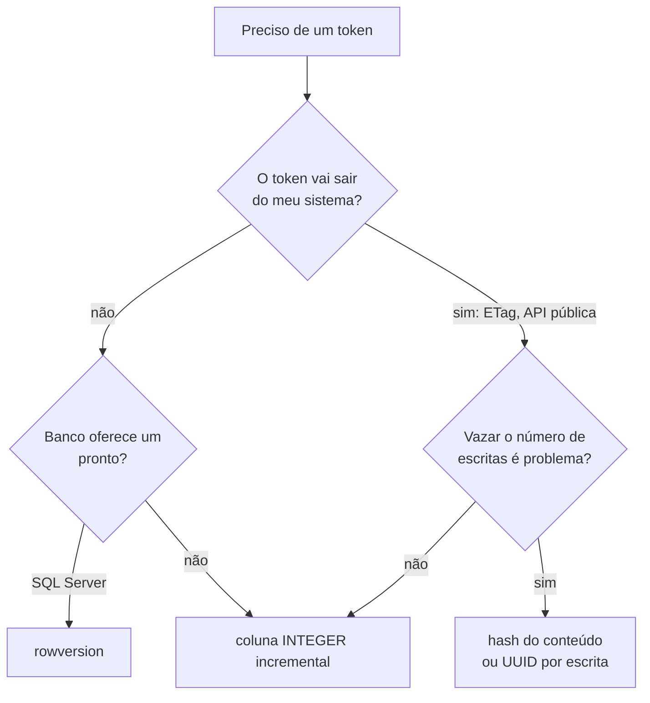

# 05 · Manual de uso — referência consultável

`Nível: intermediário` · `Atualizado em: 14/08/2026`

> **Nota sobre este arquivo.** Optimistic locking não é um produto com CLI e flags, então
> este manual foi **reinterpretado**, como prevê o preset: em vez de comandos, ele reúne
> **a sintaxe, os nomes, os códigos de erro e as opções** que cada tecnologia usa para
> expressar a mesma ideia. Organizado por tarefa, para consulta durante a programação.

Índice rápido:
[1. Decidir](#1-decidir-preciso-de-optimistic-locking) ·
[2. SQL](#2-sql-puro) ·
[3. Escolher o token](#3-escolher-o-token-de-versão) ·
[4. ORMs](#4-orms-e-frameworks) ·
[5. HTTP](#5-http) ·
[6. NoSQL e filas](#6-nosql-caches-e-filas) ·
[7. Erros](#7-códigos-e-mensagens-de-erro-por-tecnologia) ·
[8. Retentativa](#8-política-de-retentativa) ·
[9. Obsoleto](#9-o-que-está-obsoleto) ·
[10. Truques](#10-truques-que-só-quem-usa-há-anos-conhece)

---

## 1. Decidir: preciso de optimistic locking?

Percorra de cima para baixo e pare na primeira linha que se aplicar.

| Se… | Use | Não use |
|---|---|---|
| A operação é um **delta comutativo** (`saldo -= 10`, `curtidas += 1`) | `UPDATE t SET x = x - ? WHERE id = ? AND x >= ?` | versão |
| A operação é **inserir se não existir** | `INSERT ... ON CONFLICT DO NOTHING` / chave única | versão |
| O usuário **lê, pensa e devolve** um formulário | **optimistic locking** | lock pessimista (seguraria o lock durante o pensamento) |
| A transação é **curta e totalmente no servidor**, com contenção alta | `SELECT ... FOR UPDATE` (pessimista) | otimista (retentaria demais) |
| Você precisa de **exclusão mútua entre processos** (só um pode agir) | lock consultivo / lease / `SELECT FOR UPDATE` | otimista |
| Você precisa de **serializabilidade** entre operações complexas | `SET TRANSACTION ISOLATION LEVEL SERIALIZABLE` + retentativa em `40001` | versão manual (não cobre anomalias entre linhas) |
| Duas edições em **campos diferentes** devem coexistir | versão por campo, ou merge no conflito | versão única na linha (gera conflito falso) |
| O dado é **um documento colaborativo em tempo real** | CRDT / OT | versão (o usuário perderia digitação) |

Detalhamento em [`14-otimista-vs-pessimista.md`](14-otimista-vs-pessimista.md).

---

## 2. SQL puro

### 2.1 O padrão canônico

```sql
-- 1. LER
SELECT id, saldo, version FROM conta WHERE id = 42;

-- 2. (trabalhar fora da transação, o tempo que for preciso)

-- 3. GRAVAR informando a versão lida
UPDATE conta
   SET saldo = 150,
       version = version + 1
 WHERE id = 42
   AND version = 7;

-- 4. conferir o número de linhas afetadas: 1 = ok, 0 = conflito
```

### 2.2 Como ler "linhas afetadas" em cada linguagem

| Tecnologia | Como obter |
|---|---|
| SQL interativo (`psql`) | a própria saída: `UPDATE 1` ou `UPDATE 0` |
| JDBC | `int n = ps.executeUpdate();` |
| JPA/Hibernate | automático — lança `OptimisticLockException` |
| .NET ADO.NET | `int n = cmd.ExecuteNonQuery();` |
| EF Core | automático — lança `DbUpdateConcurrencyException` |
| Python DB-API (psycopg, sqlite3) | `cur.rowcount` |
| Django ORM | `n = Model.objects.filter(pk=..., version=v).update(...)` |
| Node `pg` | `res.rowCount` |
| Node `node:sqlite` | `res.changes` |
| Ruby / ActiveRecord | automático — lança `ActiveRecord::StaleObjectError` |
| Go `database/sql` | `n, _ := res.RowsAffected()` |
| PHP PDO | `$stmt->rowCount()` |

> **Pegadinha do MySQL:** por padrão, o cliente reporta *rows matched*, não *rows changed*.
> Se você gravar o **mesmo valor** que já estava lá, `affectedRows` pode vir `0` mesmo sem
> conflito. Ative `useAffectedRows` (Connector/J) ou `CLIENT_FOUND_ROWS`, ou — melhor —
> garanta que a versão sempre muda, o que já resolve o problema por construção.

### 2.3 Variações úteis

```sql
-- Devolver o novo estado sem um SELECT extra (PostgreSQL, SQLite 3.35+, MariaDB 10.5+)
UPDATE conta SET saldo = 150, version = version + 1
 WHERE id = 42 AND version = 7
 RETURNING id, saldo, version;
-- zero linhas retornadas = conflito
```

```sql
-- Distinguir "conflito" de "não existe" em um comando só (PostgreSQL)
WITH alvo AS (SELECT version FROM conta WHERE id = 42),
     mudou AS (
       UPDATE conta SET saldo = 150, version = version + 1
        WHERE id = 42 AND version = 7
       RETURNING 1
     )
SELECT (SELECT count(*) FROM alvo)  AS existe,
       (SELECT count(*) FROM mudou) AS aplicou;
-- existe=0            -> 404
-- existe=1, aplicou=0 -> 409/412 (conflito)
-- existe=1, aplicou=1 -> 200
```

```sql
-- Versão só quando o conteúdo realmente muda (evita conflito por salvamento sem alteração)
UPDATE conta
   SET saldo = 150,
       version = CASE WHEN saldo IS DISTINCT FROM 150 THEN version + 1 ELSE version END
 WHERE id = 42 AND version = 7;
```

```sql
-- Sem coluna de versão: comparar os valores lidos (versionless / "dirty check")
UPDATE conta
   SET saldo = 150
 WHERE id = 42
   AND saldo = 100          -- os valores exatamente como foram lidos
   AND titular = 'Ana';
-- Funciona, mas quebra com NULL (use IS NOT DISTINCT FROM) e com float.
```

### 2.4 Tipos de coluna de versão

| Tipo | Vantagem | Risco |
|---|---|---|
| `INTEGER`/`BIGINT` incremental | simples, comparável, legível em log | precisa ser incrementado por quem escreve |
| `TIMESTAMP` de atualização | vem de graça se você já tem `updated_at` | **relógio**: duas escritas no mesmo milissegundo colidem sem detectar; NTP para trás quebra tudo |
| `UUID`/aleatório | não vaza volume de escrita; ótimo para ETag público | não dá para ordenar nem dizer "quanto ficou para trás" |
| `xmin` (PostgreSQL) | zero manutenção, é o ID da transação | **envelhece**: o `xmin` muda em `VACUUM FULL`/`pg_upgrade`; não use como token durável |
| `rowversion` (SQL Server) | mantido pelo banco, monotônico no banco inteiro | específico do SQL Server |
| hash do conteúdo | detecta "mudou de verdade", ideal para ETag | custo de CPU; precisa de serialização canônica |

Discussão completa em [`13-tokens-de-versao.md`](13-tokens-de-versao.md).

---

## 3. Escolher o token de versão



Regras que valem sempre:

1. **O servidor gera o token, nunca o cliente.**
2. **Um token por escrita aceita** — se duas escritas puderem gerar o mesmo, não há detecção.
3. **Nunca use `updated_at` como único token** se a resolução for de segundos.
4. **Não use campos de negócio** (como `status`) como token: eles mudam por outros motivos.

---

## 4. ORMs e frameworks

### 4.1 JPA / Hibernate (Java)

```java
@Entity
public class Conta {
    @Id Long id;

    @Version                    // basta isto: o Hibernate cuida do resto
    private long version;       // permitido: int/Integer, short/Short, long/Long, Timestamp

    private BigDecimal saldo;
}
```

| Recurso | Sintaxe | Observação |
|---|---|---|
| Versão simples | `@Version` | **um** atributo por entidade; nunca atribua você mesmo |
| Sem coluna de versão | `@OptimisticLocking(type = OptimisticLockType.DIRTY)` | compara só os campos alterados |
| idem, tudo | `@OptimisticLocking(type = OptimisticLockType.ALL)` | compara todos os campos; `UPDATE` fica enorme |
| Excluir campo da checagem | `@OptimisticLock(excluded = true)` | ex.: contador de acessos |
| Forçar bump de versão ao ler | `em.lock(obj, LockModeType.OPTIMISTIC_FORCE_INCREMENT)` | protege agregados: editar filho invalida o pai |
| Só validar no commit | `LockModeType.OPTIMISTIC` | relê a versão no fim da transação |
| Exceção | `jakarta.persistence.OptimisticLockException` (Hibernate: `StaleObjectStateException`) | |

Pegadinhas conhecidas:

- `@Version` em `Timestamp` herda todos os problemas de relógio da seção 2.4.
- Em Spring Data JPA, `save()` numa entidade *detached* com `version = null` faz **INSERT**,
  não UPDATE. É a origem de "duplicou o registro em vez de atualizar".
- `@DynamicUpdate` muda o SQL gerado e interage com `OptimisticLockType.DIRTY`.

### 4.2 EF Core (.NET)

```csharp
public class Conta {
    public int Id { get; set; }
    public decimal Saldo { get; set; }

    [Timestamp]                       // mapeia para rowversion no SQL Server
    public byte[] RowVersion { get; set; }
}
```

```csharp
// Alternativa portátil (PostgreSQL, SQLite): token explícito
modelBuilder.Entity<Conta>().Property(c => c.Version).IsConcurrencyToken();
// PostgreSQL: modelBuilder.Entity<Conta>().UseXminAsConcurrencyToken();
```

```csharp
try { await db.SaveChangesAsync(); }
catch (DbUpdateConcurrencyException ex) {
    var entry  = ex.Entries.Single();
    var banco  = await entry.GetDatabaseValuesAsync();   // estado atual
    var meu    = entry.CurrentValues;                    // o que eu queria gravar
    var lido   = entry.OriginalValues;                   // o que eu tinha lido
    // três conjuntos = base para merge campo a campo
}
```

### 4.3 ActiveRecord (Rails)

```ruby
# migration: basta a coluna com o nome mágico
add_column :contas, :lock_version, :integer, null: false, default: 0
```

```ruby
begin
  conta.update!(saldo: 150)
rescue ActiveRecord::StaleObjectError => e
  # e.record e e.attempted_action
end
```

| Recurso | Sintaxe |
|---|---|
| Desligar globalmente | `ActiveRecord::Base.lock_optimistically = false` |
| Outro nome de coluna | `self.locking_column = 'versao'` |
| Recarregar e refazer | `conta.reload; retry` |

### 4.4 Django (Python)

O Django **não tem** optimistic locking embutido. As três formas usuais:

```python
# a) update() com filtro de versão — a mais direta e a que eu recomendo
n = Conta.objects.filter(pk=42, version=7).update(saldo=150, version=F('version') + 1)
if n == 0:
    raise ConflictError()
```

```python
# b) F() para deltas (não é optimistic locking; é delta atômico — e é o certo para contadores)
Conta.objects.filter(pk=42).update(saldo=F('saldo') - 10)
```

```python
# c) pessimista, quando o caso pedir
with transaction.atomic():
    conta = Conta.objects.select_for_update().get(pk=42)
```

Pacotes de terceiros: `django-concurrency` (adiciona `VersionField` e exceção própria).
Avalie a manutenção do pacote antes de adotar.

### 4.5 Outros

| Tecnologia | Mecanismo |
|---|---|
| **Sequelize** (Node) | `version: true` nas opções do modelo; lança `SequelizeOptimisticLockError` |
| **TypeORM** (Node) | decorador `@VersionColumn()`; `OptimisticLockVersionMismatchError` |
| **Prisma** (Node) | não tem nativo; use `updateMany({ where: { id, version } })` e cheque `count` |
| **SQLAlchemy** (Python) | `__mapper_args__ = {"version_id_col": versao}`; lança `StaleDataError` |
| **GORM** (Go) | não tem nativo; use `db.Model(&x).Where("version = ?", v).Updates(...)` e cheque `RowsAffected` |
| **Salesforce Apex** | `System.DmlException` com `UNABLE_TO_LOCK_ROW`; ou compare `LastModifiedDate` | 

---

## 5. HTTP

### 5.1 Cabeçalhos

| Cabeçalho | Direção | Para quê |
|---|---|---|
| `ETag: "7"` | resposta | o token de versão do recurso |
| `If-Match: "7"` | requisição | **grave só se ainda for a versão 7** — é o optimistic locking |
| `If-None-Match: "7"` | requisição | *cache* (`GET`) ou "crie só se não existir" (`If-None-Match: *` em `PUT`) |
| `Last-Modified` / `If-Unmodified-Since` | ambos | alternativa por data; resolução de **1 segundo** — fraca demais para concorrência |

### 5.2 Códigos de status

| Código | Quando |
|---|---|
| `200` / `204` | escrita aceita; devolva o `ETag` novo |
| `400` | `If-Match` malformado, ou fraco (`W/"7"`) — comparação forte é exigida |
| `404` | o recurso não existe |
| `409 Conflict` | conflito **semântico** ("o pedido já foi cancelado") |
| `412 Precondition Failed` | a pré-condição `If-Match` não bateu — o caso canônico |
| `428 Precondition Required` | o cliente omitiu `If-Match` e o servidor exige |

> **Comparação forte (RFC 9110).** `If-Match` usa comparação forte: um ETag fraco (`W/"7"`)
> **nunca** casa. Se sua API emite `W/` (o Express faz isso por padrão em respostas JSON),
> `If-Match` falhará sempre e o sintoma não vai parecer ter relação com a causa.

### 5.3 Receita de servidor

```
GET  /recurso/42        -> 200 + ETag: "7"
PUT  /recurso/42        + If-Match: "7"   -> 200 + ETag: "8"
PUT  /recurso/42        + If-Match: "7"   -> 412 + ETag: "8" + estado atual no corpo
PUT  /recurso/42        (sem If-Match)    -> 428
PUT  /recurso/42        + If-None-Match: * -> 201 se não existir, 412 se existir
PATCH /recurso/42       + If-Match: "7"   -> mesma semântica do PUT
```

Devolva **sempre o estado atual no corpo do 412**: poupa uma ida e volta e fecha uma janela
para um novo conflito.

---

## 6. NoSQL, caches e filas

| Sistema | Mecanismo | Erro no conflito |
|---|---|---|
| **DynamoDB** | `ConditionExpression: "version = :v"` + `UpdateExpression: "SET version = :v1"` | `ConditionalCheckFailedException` (consome WCU mesmo falhando) |
| **MongoDB** | `findOneAndUpdate({_id, __v: 7}, {$set: {...}, $inc: {__v: 1}})` | resultado `null`; Mongoose tem `__v` e `VersionError` |
| **Redis** | `WATCH chave` → `MULTI` → `EXEC` (aborta se a chave mudou) | `EXEC` retorna `nil` |
| **etcd** | transação `Txn().If(Compare(ModRevision(k), "=", rev))` | `Succeeded == false` |
| **Consul KV** | `PUT ?cas=<ModifyIndex>` | corpo `false` |
| **Cosmos DB** | `IfMatchEtag` na requisição | HTTP `412` |
| **S3** | `If-Match` / `If-None-Match` em `PutObject` (condicional) | HTTP `412` |
| **Elasticsearch** | `?if_seq_no=&if_primary_term=` | HTTP `409` |
| **Kafka** | produtor idempotente com `epoch`/*fencing token* | `ProducerFencedException` |
| **Cassandra** | `UPDATE ... IF version = 7` (LWT, usa Paxos) | `[applied]=false`; **caro**, use com parcimônia |
| **Firestore** | `runTransaction` — reexecuta o bloco no conflito | retentativa automática |
| **Git** | o hash do commit pai é o token; `push` não *fast-forward* | *rejected — non-fast-forward* |

Aprofundamento em [`18-sistemas-distribuidos.md`](18-sistemas-distribuidos.md).

---

## 7. Códigos e mensagens de erro por tecnologia

Guarde esta tabela: é o que você vai procurar no meio de um incidente.

| Tecnologia | Erro / código | Significa |
|---|---|---|
| SQL padrão | `SQLSTATE 40001` | *serialization failure* — refaça a transação inteira |
| PostgreSQL | `ERROR: could not serialize access due to concurrent update` | conflito em `REPEATABLE READ` |
| PostgreSQL | `ERROR: could not serialize access due to read/write dependencies among transactions` | conflito em `SERIALIZABLE` (SSI) |
| PostgreSQL | `ERROR: deadlock detected` (`40P01`) | abraço mortal; um dos lados foi abortado |
| MySQL/InnoDB | `ERROR 1213 (40001): Deadlock found when trying to get lock` | idem |
| MySQL/InnoDB | `ERROR 1205: Lock wait timeout exceeded` | esperou demais por lock **pessimista** |
| Oracle | `ORA-08177: can't serialize access for this transaction` | conflito em `SERIALIZABLE` |
| SQL Server | `Error 1205: deadlock victim` | escolhido como vítima do deadlock |
| JPA/Hibernate | `OptimisticLockException` / `StaleObjectStateException` | versão não bateu |
| EF Core | `DbUpdateConcurrencyException` | idem |
| ActiveRecord | `ActiveRecord::StaleObjectError` | idem |
| SQLAlchemy | `StaleDataError` | idem |
| DynamoDB | `ConditionalCheckFailedException` | condição falhou |
| HTTP | `412 Precondition Failed` | `If-Match` não bateu |
| SQLite | `SQLITE_BUSY: database is locked` | **não é conflito de versão** — é contenção de arquivo |

> Confundir `40001` com "erro do banco" e transformá-lo em `500` é um clássico. `40001` é
> **esperado** em `SERIALIZABLE`: significa "refaça", não "quebrou".

---

## 8. Política de retentativa

Parâmetros e o que cada um resolve:

| Parâmetro | Valor típico | Efeito de errar |
|---|---|---|
| Máximo de tentativas | 3 a 5 (interativo) · 10 a 50 (lote) | alto demais mascara contenção estrutural |
| Atraso base | 5 a 50 ms | baixo demais = efeito manada |
| Teto | 1 a 5 s | sem teto, a latência explode na cauda |
| Estratégia | **exponencial com *full jitter*** | sem jitter, todos voltam juntos e colidem de novo |
| Só retentar se… | erro for de conflito (`40001`, `412`, `OptimisticLockException`) | retentar `TypeError` só multiplica o bug |
| Reler a cada tentativa | **sempre** | sem reler, falha eternamente |
| Idempotência | chave de idempotência em efeitos externos | retentativa duplica cobrança, e-mail, pedido |

```
atraso_i = aleatório(0, min(teto, base × 2^i))
```

Código pronto e comentado: [`07-projeto-modelo/src/retry.js`](07-projeto-modelo/src/retry.js).
Discussão: [`19-retentativa-e-idempotencia.md`](19-retentativa-e-idempotencia.md).

---

## 9. O que está obsoleto

| Obsoleto | Por quê | Use |
|---|---|---|
| `If-Unmodified-Since` como proteção principal | resolução de 1 s; duas escritas no mesmo segundo passam | `If-Match` com `ETag` |
| `TIMESTAMP` como coluna de versão | mesmo problema, mais o relógio andando para trás | inteiro incremental |
| `SELECT ... FOR UPDATE` em transação que espera o usuário | segura lock durante o "tempo de pensar" | optimistic locking |
| RFC 7232 como referência de conditional requests | substituída | [RFC 9110](https://datatracker.ietf.org/doc/html/rfc9110), §13 |
| `READ UNCOMMITTED` para "ir mais rápido" | permite leitura suja; no PostgreSQL nem existe (vira `READ COMMITTED`) | `READ COMMITTED` + guarda de versão |
| Comparar `float`/`double` na checagem versionless | igualdade de ponto flutuante é traiçoeira | coluna de versão explícita |
| Lock em nível de aplicação com variável em memória | não sobrevive a mais de uma instância | banco, Redis ou lease distribuído |

---

## 10. Truques que só quem usa há anos conhece

1. **Devolva o estado atual junto com o erro de conflito.** Cada 412 sem corpo é um `GET`
   extra e uma nova janela de conflito.

2. **Meça a taxa de conflito como métrica de produto.** `conflitos / escritas` acima de ~5%
   quer dizer que o modelo de dados está errado (linha quente), não que a técnica falhou.
   Coloque no dashboard antes de precisar dela.

3. **Não incremente a versão quando nada mudou.** Usuários que abrem e fecham o formulário
   sem editar viram fonte de conflito para os outros.

4. **Versão no agregado, não só na linha.** Se editar um item de pedido pode invalidar o
   total do pedido, quem precisa de versão é o **pedido**. É o que
   `OPTIMISTIC_FORCE_INCREMENT` do JPA faz — e por isso ele existe.

5. **Separe `404` de `412`.** Ambos chegam como "zero linhas". Faça um `SELECT` a mais
   **apenas no caminho de falha**: custo zero no caminho feliz, diagnóstico correto no ruim.

6. **Se você tem `SERIALIZABLE`, a coluna de versão ainda é útil** — só que para outra coisa:
   proteger o intervalo entre requisições HTTP diferentes, que nenhum nível de isolamento
   cobre, porque não são a mesma transação.

7. **Registre `versao_lida` e `versao_atual` no log do conflito.** A diferença entre elas diz
   *quantas* escritas você perdeu de vista — e distingue "corrida rara" de "linha quente".

8. **Em lote, ordene por chave primária.** Não elimina conflito otimista, mas reduz drasticamente
   o deadlock quando você mistura otimista com locks reais.

9. **Teste com concorrência de verdade.** Um teste que chama a função duas vezes em sequência
   não prova nada. Use N clientes reais — como faz
   [`test/run-tests.js`](07-projeto-modelo/test/run-tests.js).

10. **Não exponha a versão interna se ela não puder mudar de formato.** Um `ETag` público é um
    contrato: no dia em que você trocar inteiro por hash, os clientes antigos quebram.

---

## Autoteste

1. Qual `SQLSTATE` significa "refaça a transação"?
2. Por que `W/"7"` nunca funciona com `If-Match`?
3. Qual a diferença prática entre `OptimisticLockType.DIRTY` e `ALL` no Hibernate?
4. No MySQL, por que `affectedRows == 0` pode não significar conflito?
5. Quando `xmin` do PostgreSQL é uma escolha ruim de token?
6. Cite três sistemas NoSQL e o mecanismo equivalente em cada um.
7. Você vê taxa de conflito de 30% numa tabela. Qual é o diagnóstico mais provável?
8. Por que devolver o estado atual no corpo do 412?
