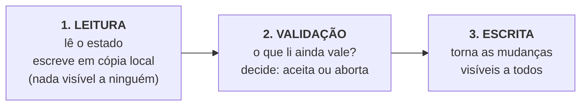

# 10 · Fundamentos

`Nível: intermediário` · `Atualizado em: 14/08/2026`

Este arquivo define, com precisão, todo o vocabulário do assunto. A partir daqui os termos são
usados no sentido exato definido aqui. Tudo o que aparecer também está no
[`GLOSSARIO.md`](GLOSSARIO.md).

---

## 1. O problema, formalmente

### 1.1 Estado compartilhado mutável

Um sistema tem **estado compartilhado mutável** quando existe um dado que:

1. mais de um agente pode **ler**;
2. mais de um agente pode **escrever**;
3. o valor futuro depende do valor atual (as escritas não são independentes).

Remova qualquer uma das três e o problema desaparece. Isso não é curiosidade acadêmica —
é a primeira ferramenta de projeto que você tem:

| Condição removida | Como se remove na prática | Custo |
|---|---|---|
| (1) leitura compartilhada | dar uma cópia por agente | precisa reconciliar depois |
| (2) escrita compartilhada | um único escritor (fila, *sharding* por chave) | acopla latência à fila; um gargalo |
| (3) dependência do valor atual | tornar as escritas comutativas (deltas, CRDT) | nem toda operação é expressável assim |

**Optimistic locking não remove nenhuma das três.** Ele aceita as três e adiciona uma quarta
coisa: **detecção**.

### 1.2 Operação de leitura-modificação-escrita (LMW)

A unidade de análise deste assunto é a tripla:

```
r(x)  →  computar f(x)  →  w(x, f(x))
```

Chame-a de **LMW** (em inglês, *read-modify-write*, RMW). O intervalo entre `r` e `w` é a
**janela de vulnerabilidade**. Tudo neste curso é sobre o que acontece nessa janela.

Ela pode ter:

| Duração | Situação |
|---|---|
| nanossegundos | incremento de variável em CPU (`x++` são 3 instruções) |
| microssegundos | `SELECT` + `UPDATE` na mesma transação |
| milissegundos | duas requisições HTTP do mesmo cliente |
| **minutos ou horas** | usuário abre um formulário, sai para o almoço, e salva |

O último caso é a razão de ser do optimistic locking: **nenhuma transação de banco pode
durar o almoço de alguém.**

### 1.3 Definição de *lost update*

> **Lost update** (atualização perdida): duas operações LMW sobre o mesmo dado se
> entrelaçam de modo que uma delas grava a partir de um valor que já estava obsoleto,
> e o efeito da outra desaparece — **sem que nenhum erro seja gerado**.

Formalmente, o entrelaçamento

```
r₁(x)  r₂(x)  w₁(x)  w₂(x)
```

produz um estado final em que o efeito de `w₁` foi destruído por `w₂`, embora `w₂` tenha sido
calculado sem conhecimento de `w₁`.

O grifo em "sem que nenhum erro seja gerado" é o que torna o problema perigoso. Um sistema com
*lost updates* passa nos testes, não gera log de erro, e apresenta as consequências semanas
depois, sob a forma de "os números não fecham".

---

## 2. A família das anomalias

*Lost update* é uma entre várias anomalias de concorrência. Conhecê-las é o que permite saber
**o que optimistic locking cobre e o que ele não cobre**.

| Anomalia | O que é | OCC por versão resolve? |
|---|---|---|
| **Leitura suja** (*dirty read*) | ler um valor que outra transação ainda não confirmou | não — é papel do nível de isolamento |
| **Escrita suja** (*dirty write*) | sobrescrever um valor não confirmado | não — todo banco sério já impede |
| **Leitura não repetível** (*non-repeatable read*) | ler duas vezes na mesma transação e obter valores diferentes | não |
| **Leitura fantasma** (*phantom read*) | uma consulta por faixa retorna linhas novas na segunda execução | não |
| **Lost update** | o caso da seção 1.3 | **sim, é exatamente o alvo** |
| **Distorção de escrita** (*write skew*) | dois agentes leem o mesmo conjunto, cada um altera uma linha **diferente**, e juntos violam uma regra que valia para o conjunto | **não** — e essa é a limitação mais importante do OCC por linha |

### 2.1 Write skew: o buraco que ninguém vê

O exemplo clássico é escala de plantão médico. A regra: **pelo menos um médico de plantão**.

```
Estado: Ana e Bruno estão de plantão.

Ana  : le "2 médicos de plantão" → posso sair → UPDATE medicos SET plantao=false WHERE id='ana'
Bruno: le "2 médicos de plantão" → posso sair → UPDATE medicos SET plantao=false WHERE id='bruno'

Resultado: zero médicos de plantão. Nenhum lost update aconteceu.
```

Cada um escreveu na **própria** linha. As versões das duas linhas estavam corretas. O OCC não
detecta nada, porque não houve conflito de escrita — houve conflito **entre a leitura de um e
a escrita do outro**.

As saídas honestas:

1. **`SERIALIZABLE`** no banco (no PostgreSQL, SSI detecta e aborta um dos dois com `40001`).
2. **Materializar a regra numa única linha** com versão: uma linha `escala(turno, contagem,
   version)` que os dois precisam atualizar — aí vira lost update, e o OCC pega.
3. **Restrição declarativa**, se a regra couber numa (`CHECK`, `UNIQUE`, `EXCLUDE`).
4. **Lock pessimista** sobre a faixa lida (`SELECT ... FOR UPDATE` no conjunto).

> **Guarde isto:** optimistic locking por versão de linha protege **uma linha**. Se a sua regra
> de negócio fala de um **conjunto** de linhas, ele não protege nada. Ver
> [`15-isolamento-e-mvcc.md`](15-isolamento-e-mvcc.md) e [`75-armadilhas.md`](75-armadilhas.md).

---

## 3. As três fases do OCC

A formulação original (Kung & Robinson, 1981) divide toda transação otimista em três fases.
Ela vale tanto para um banco de dados quanto para o seu `UPDATE ... WHERE version = ?`.



| Fase | O que acontece | No `UPDATE ... WHERE version = ?` |
|---|---|---|
| **Leitura** | a transação lê livremente e acumula alterações num espaço privado | o `SELECT` e o trabalho da aplicação |
| **Validação** | verifica se as leituras feitas continuam válidas | a cláusula `AND version = ?` |
| **Escrita** | aplica as mudanças ao estado global | o `SET` do mesmo comando |

**A propriedade crítica é que validação e escrita sejam atômicas entre si.** Se outra
transação puder se inserir entre elas, a validação não vale nada. No `UPDATE` com `WHERE`,
essa atomicidade vem de graça, porque é um comando só. Em qualquer implementação manual
(ler → comparar em memória → gravar), você precisa criar essa atomicidade — normalmente
com uma transação.

### 3.1 Validação para trás e para a frente

Kung e Robinson descrevem duas maneiras de validar:

- **Validação para trás** (*backward validation*): comparo minhas **leituras** com as
  **escritas de quem já confirmou** depois que eu comecei. Se houver interseção, eu aborto.
  Quem aborta é sempre o mais novo. É o que o seu `WHERE version = ?` faz.
- **Validação para a frente** (*forward validation*): comparo minhas **escritas** com as
  **leituras de quem ainda está em andamento**. Se houver interseção, posso escolher quem
  aborta — inclusive abortar o outro.

Consequência prática: com validação para trás, **a transação longa é sempre a vítima** —
ela acumula mais chance de alguém confirmar no meio. Um relatório de 5 minutos que termina com
uma escrita nunca vai conseguir confirmar num sistema movimentado. A solução não é "aumentar
as tentativas": é **encurtar a transação** ou tirar a escrita dela.

Aprofundamento em [`60-teoria-avancada.md`](60-teoria-avancada.md).

---

## 4. Modelos mentais úteis

### 4.1 O bilhete de guarda-volumes

Você deixa o casaco e recebe um bilhete. Na volta, entrega o bilhete. Se o bilhete não
corresponder ao que está pendurado, você não leva o casaco. **O token de versão é o bilhete.**

Isso explica três coisas de uma vez: por que o token é gerado por quem guarda (não por você),
por que ele precisa ser único por depósito, e por que apresentar um bilhete velho é o próprio
mecanismo de detecção.

### 4.2 Compare-and-swap

No nível do processador existe uma instrução chamada **CAS** (*compare-and-swap*):

```
CAS(endereço, esperado, novo):
    se *endereço == esperado:
        *endereço = novo
        retorna sucesso
    senão:
        retorna falha
```

Compare com:

```sql
UPDATE t SET x = novo WHERE id = ? AND version = esperado;
```

**É a mesma operação**, em escalas diferentes. Optimistic locking é CAS aplicado a uma linha
de banco; CAS é optimistic locking aplicado a uma palavra de memória. Programação lock-free,
`AtomicInteger.compareAndSet` do Java, `std::atomic::compare_exchange` do C++ e o seu `WHERE
version = ?` são a mesma ideia.

Isso também importa porque a CAS tem um defeito famoso — o **problema ABA** — que se
transfere para o OCC quando o token pode **repetir**. Ver [`13`](13-tokens-de-versao.md).

### 4.3 O `git push`

O modelo mental mais completo para quem programa:

| Git | Optimistic locking |
|---|---|
| `git clone` / `pull` | ler o registro e a versão |
| trabalhar no clone local | a fase de leitura, indefinidamente longa |
| commit local | preparar a escrita |
| `git push` | tentar escrever informando de qual commit você partiu |
| *rejected — non-fast-forward* | conflito: alguém escreveu antes |
| `git pull --rebase` + resolver | reler, mesclar, retentar |
| `git push --force` | ignorar o conflito e apagar o trabalho alheio |

Se você entende por que `--force` é perigoso, entende por que ignorar `changes === 0` é
perigoso. É literalmente o mesmo erro.

---

## 5. Os cinco porquês do mecanismo

A regra dos cinco porquês, aplicada à pergunta central.

**Por que o `UPDATE ... WHERE version = ?` protege?**
→ Porque a comparação e a escrita são o mesmo comando, e o banco garante que ninguém se
insere no meio.

**Por que o banco garante isso?**
→ Porque uma linha só pode ser modificada sob um lock de linha exclusivo, que o banco adquire
para executar o `UPDATE`. Enquanto ele avalia o `WHERE` e escreve, ninguém mais escreve
naquela linha.

**Espere — então tem lock?**
→ Tem, e é uma distinção que vale precisão: existe um lock **de curtíssima duração**, interno
ao comando, que dura microssegundos e some sozinho. O que **não** existe é um lock mantido
pela aplicação **entre** a leitura e a escrita — que é o que caracteriza o pessimismo. O nome
"otimista" se refere a essa janela longa, não à execução do comando.

**Por que os bancos fazem locks internos de linha em vez de algo mais esperto?**
→ Porque a alternativa (validação global sem lock nenhum) exige coordenar todas as transações
entre si, o que custa mais que o lock em quase todos os casos reais. Os bancos que optaram
pelo caminho sem locks — Hekaton, FoundationDB, Calvin — pagam esse preço em outra moeda:
mais abortos, ou uma camada de sequenciamento. É um trade-off de engenharia documentado
(Larson et al., 2011), não uma verdade universal.

**Por que a escolha depende do caso, e não existe um vencedor?**
→ Porque o custo relativo depende da **taxa de conflito**, que é uma propriedade da **carga de
trabalho**, não do sistema. Um mecanismo que decidisse sozinho precisaria prever o futuro da
carga. Este é o limite legítimo: **não há resposta independente da carga**, e é por isso que
a escolha continua sendo sua. Ver a análise quantitativa em [`14`](14-otimista-vs-pessimista.md).

---

## 6. Vocabulário essencial

| Termo | Definição |
|---|---|
| **Concorrência** | duas operações cujos intervalos de execução se sobrepõem no tempo |
| **Conflito** | duas operações concorrentes sobre o mesmo dado, ao menos uma delas de escrita |
| **Contenção** | a intensidade do conflito: quantas operações disputam o mesmo dado por unidade de tempo |
| **Taxa de conflito** | conflitos detectados ÷ escritas tentadas. **A métrica que decide tudo neste assunto** |
| **Linha quente** (*hot row*) | uma linha com contenção muito acima da média das outras |
| **Token de versão** | valor que identifica uma versão específica de um dado; muda a cada escrita |
| **Guarda** | a condição que compara o token esperado com o atual |
| **Detecção** | perceber que a guarda falhou (tipicamente: zero linhas afetadas) |
| **Resolução** | o que se faz depois de detectar: retentar, mesclar ou perguntar |
| **Idempotência** | executar duas vezes tem o mesmo efeito de executar uma. Pré-requisito da retentativa segura |
| **Janela de vulnerabilidade** | o intervalo entre a leitura e a escrita |
| **Serializabilidade** | propriedade de uma execução concorrente equivaler a alguma execução sequencial |
| **Efeito manada** (*thundering herd*) | muitos agentes retentando no mesmo instante, recriando o conflito |

---

## 7. Onde o OCC se encaixa no mapa geral

```
                    CONTROLE DE CONCORRÊNCIA
                              │
        ┌─────────────────────┼─────────────────────┐
        │                     │                     │
   PESSIMISTA             OTIMISTA            SEM CONFLITO
   (previne)              (detecta)           (elimina)
        │                     │                     │
   ┌────┴────┐          ┌─────┴─────┐         ┌─────┴─────┐
   │         │          │           │         │           │
  2PL     locks       OCC por      SSI      deltas      CRDT
        explícitos    versão    (Postgres  atômicos   (comutativo
  (o banco     (FOR UPDATE,    SERIALIZABLE)          por construção)
   faz)        advisory)                    partição
                                          (um escritor
                                            por chave)
```

**O que este material chama de "optimistic locking"** é o ramo do meio à esquerda: OCC por
token de versão, aplicado por você, no nível da aplicação. Os vizinhos aparecem em
[`14`](14-otimista-vs-pessimista.md), [`15`](15-isolamento-e-mvcc.md) e
[`18`](18-sistemas-distribuidos.md), porque escolher bem exige conhecer todos.

---

## Autoteste

1. Quais são as três condições que criam o problema, e como se remove cada uma?
2. Defina *lost update* de modo que a definição exclua *dirty write*.
3. Por que *write skew* não é detectado por versão de linha? Dê um exemplo próprio.
4. Quais são as três fases do OCC, e qual par precisa ser atômico entre si?
5. Com validação para trás, quem tende a ser a vítima? Que consequência de projeto isso tem?
6. Em que sentido `UPDATE ... WHERE version = ?` é um CAS?
7. "Optimistic locking não usa lock nenhum." Corrija a frase com precisão.
8. Por que não existe uma resposta universal entre otimista e pessimista?
