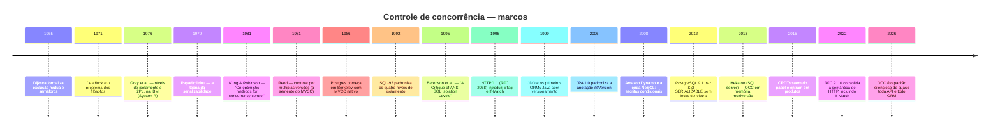

# 11 · História — como o otimismo chegou aqui

`Nível: intermediário` · `Atualizado em: 14/08/2026`

Saber a história deste assunto não é erudição: é o que permite entender **por que as coisas
têm os nomes que têm**, por que certas más ideias voltam a cada dez anos, e por que o
"óbvio" de hoje foi controverso em 1981.

---

## Linha do tempo



---

## 1. Antes de 1981: o mundo era pessimista

Nos anos 1970 a computação de dados corporativos rodava em *mainframe*, com terminais burros
e transações curtas. O modelo dominante era o **bloqueio em duas fases** (*two-phase
locking*, 2PL), formalizado no trabalho de **Jim Gray** e colegas na IBM em torno do
System R (1976) — o mesmo projeto que produziu o SQL.

O 2PL funciona assim: a transação adquire locks numa fase de expansão e só os libera numa
fase de contração, depois do commit. Isso **garante serializabilidade**, e é um resultado
bonito.

Por que era a escolha natural naquele contexto:

- Transações eram **curtas** — não havia formulário web aberto por 20 minutos.
- O sistema era **fechado**: a mesma empresa controlava terminal, rede e banco.
- A contenção era **alta** relativamente ao hardware: pouca memória, poucos discos.
- Abortar e refazer custava caro: refazer significava reprocessar em fita.

Nesse cenário, **prevenir era mais barato que refazer**. O pessimismo não era timidez; era a
resposta certa para aquele custo relativo. Guarde isso — a resposta muda quando o custo muda.

---

## 2. 1981: Kung e Robinson soltam a bomba

**H. T. Kung** e **John T. Robinson** publicam, na *ACM Transactions on Database Systems*
(vol. 6, nº 2, junho de 1981), o artigo **"On optimistic methods for concurrency control"**.

A tese, que na época era heterodoxa:

> Se os conflitos são raros, o custo de **prevenir** todos eles é maior que o custo de
> **detectar e refazer** os poucos que ocorrem.

E, junto, uma observação empírica que continua valendo: **em quase toda carga real, conflitos
são raros**. O acesso a dados obedece a distribuições muito desiguais — a maioria das
transações toca dados diferentes.

O artigo introduz o vocabulário que este curso inteiro usa:

- as **três fases**: leitura, validação, escrita;
- **validação para trás** e **para a frente**;
- a ideia de que a transação trabalha numa **cópia privada** e só publica no fim;
- o **número de transação** atribuído no início da validação — o ancestral direto da sua
  coluna `version`.

O paper está em <https://dl.acm.org/doi/10.1145/319566.319567> (paywall da ACM), com uma
cópia aberta hospedada pela CMU:
<https://www.cs.cmu.edu/~dga/15-712/F07/lectures/12-optimism.pdf>.

### Por que demorou a pegar

A ideia é de 1981, mas o OCC só virou padrão de fato nos anos 2000. Três motivos:

1. **A carga da época não favorecia.** Transações curtas em sistema fechado é exatamente o
   regime em que o 2PL vence.
2. **Faltava o gatilho.** O OCC brilha quando a janela entre leitura e escrita é longa — e
   isso só se tornou comum com o **cliente-servidor** (anos 1990) e depois com a **web**.
3. **O IBM DB2 e os grandes bancos já tinham 2PL implementado e otimizado.** Trocar de modelo
   é caro; a inércia institucional é real.

---

## 3. 1990: a web torna o pessimismo insustentável

O HTTP nasce **sem estado**. Isso não foi um detalhe de implementação — foi a decisão de
projeto que quebrou o modelo pessimista.

Pense no que aconteceria com 2PL numa aplicação web:

```
GET  /cliente/42/editar   -> abre transação? adquire lock?
   ... o usuário sai para almoçar ...
   ... o usuário fecha o navegador ...
POST /cliente/42          -> ninguém nunca chega aqui
```

Um lock adquirido no `GET` teria de ser liberado no `POST`, que **pode nunca acontecer**.
Não existe evento de "o usuário desistiu". Qualquer sistema que tentasse isso acumularia
locks órfãos até travar.

A resposta veio embutida no próprio protocolo. O **HTTP/1.1** (RFC 2068, janeiro de 1997;
depois RFC 2616, RFC 7232 e finalmente a atual **RFC 9110**, de junho de 2022) definiu:

- **`ETag`** — um identificador opaco da versão atual de um recurso;
- **`If-Match`** — "só execute se o recurso ainda estiver nesta versão";
- **`412 Precondition Failed`** — a resposta quando não está.

A RFC 9110 é explícita sobre a finalidade: `If-Match` em métodos que alteram estado serve
para **evitar o problema do lost update**. Ou seja: **optimistic locking é parte do padrão da
web desde 1997**, e a maioria dos desenvolvedores nunca usou.

Uma opinião minha, não consenso: a subutilização do `If-Match` é a maior lacuna prática entre
o que o HTTP oferece e o que as APIs REST realmente fazem. A maioria das APIs de 2026 aceita
`PUT` sem pré-condição nenhuma e chama isso de RESTful.

---

## 4. 2000: os ORMs padronizam o padrão

Com a explosão do Java corporativo, o problema apareceu em escala industrial: milhares de
aplicações com formulários web sobre bancos relacionais.

- **JDO** (Java Data Objects, 2002) e **Hibernate** (2001, Gavin King) trouxeram versionamento
  automático de entidades.
- **JPA 1.0** (2006, dentro do Java EE 5) padronizou a anotação **`@Version`**. A partir daí,
  optimistic locking passou a ser **o padrão** do acesso a dados em Java — e continua sendo.
- **ActiveRecord** (Rails, 2004) adotou a convenção da coluna `lock_version`: basta o nome
  certo e a proteção liga sozinha.
- **Entity Framework** (.NET, 2008) usou o `rowversion` do SQL Server, que já existia como
  `timestamp` desde os anos 1990.

Vale notar a **escolha de projeto oposta** de cada ecossistema:

| Ecossistema | Filosofia | Consequência |
|---|---|---|
| JPA/Hibernate, Rails | **implícito**: anote (ou nomeie) e funciona | protege quem não sabe que precisa; esconde o mecanismo de quem precisa entender |
| Django, Go, Prisma | **explícito**: você escreve o `filter(version=v).update(...)` | ninguém é protegido por acidente; ninguém é surpreendido |

Não tenho um vencedor a apontar. O implícito salvou mais dados; o explícito produziu menos
gente confusa diante de um `OptimisticLockException` às três da manhã.

---

## 5. 2008: o NoSQL redescobre tudo

A onda NoSQL, iniciada com o paper do **Dynamo** (Amazon, 2007) e o **Bigtable** (Google,
2006), abandonou transações multi-linha em nome de escala e disponibilidade. E aí percebeu
que precisava de **alguma** coisa para atomicidade — e reinventou o OCC com outros nomes:

| Sistema | Nome do mecanismo |
|---|---|
| DynamoDB | *conditional write* (`ConditionExpression`) |
| Consul | *check-and-set* (`?cas=<index>`) |
| etcd | comparação de `ModRevision` numa transação |
| Cassandra | *lightweight transaction* (`IF version = ?`, via Paxos) |
| MongoDB | campo `__v` do Mongoose, `findOneAndUpdate` com filtro |
| Elasticsearch | `if_seq_no` + `if_primary_term` |

Todos são a mesma ideia de 1981, com uma diferença que importa: **em sistema distribuído, o
OCC não é uma otimização, é frequentemente a única opção viável**. Manter locks entre nós
exige coordenação, e coordenação em rede é lenta e frágil a partições. Escrita condicional
sobre uma única partição, não.

---

## 6. 2012: o PostgreSQL faz o `SERIALIZABLE` valer a pena

Por décadas, `SERIALIZABLE` foi um nível que ninguém usava, porque nas implementações 2PL
ele significava locks de leitura por toda parte e desempenho miserável.

O **PostgreSQL 9.1** (2011/2012) implementou **SSI** — *Serializable Snapshot Isolation*,
baseado no trabalho de **Michael Cahill, Uwe Röhm e Alan Fekete** (2008). O SSI é
**controle otimista aplicado à serializabilidade inteira**: ele deixa tudo rodar sobre
instantâneos, rastreia dependências de leitura-escrita perigosas e aborta uma transação com
`40001` quando detecta um padrão que não teria equivalente sequencial.

Consequência prática, e é grande: **desde 2012 existe uma alternativa real ao OCC manual para
o problema de write skew**. Você troca a coluna de versão por `SERIALIZABLE` + retentativa em
`40001`, e o banco cuida de anomalias que a coluna nunca cobriria.

O que **não** muda: entre duas requisições HTTP diferentes não há transação nenhuma para
serializar. O `SERIALIZABLE` protege dentro de uma transação; o `If-Match` protege entre
requisições. **Você continua precisando dos dois.** Ver [`15`](15-isolamento-e-mvcc.md).

---

## 7. 2015 em diante: eliminar o conflito em vez de detectá-lo

A fronteira mais recente inverte a pergunta. Em vez de "como detecto o conflito?", pergunta-se
"**como faço para não haver conflito?**".

- **CRDTs** (*Conflict-free Replicated Data Types*, formalizados por Shapiro, Preguiça, Baquero
  e Zawirski em 2011) são estruturas cujas operações são comutativas e idempotentes por
  construção. Duas réplicas que receberam as mesmas operações em qualquer ordem convergem para
  o mesmo estado. Não há conflito a detectar. Automerge e Yjs levaram isso a produtos reais.
- **Bancos determinísticos** como o Calvin (Thomson et al., 2012) e o FaunaDB decidem a ordem
  das transações **antes** de executá-las: se a ordem é conhecida, não há o que validar.
- **Deltas atômicos e partição por chave**, o mais mundano e o mais usado: se cada chave tem
  um único escritor lógico, ou se as operações são somas, não há corrida.

Minha leitura profissional, e é opinião: **a maior parte do ganho disponível hoje não está em
melhorar a detecção, está em reprojetar o dado para não precisar dela.** A pergunta "isso
precisa mesmo ser uma substituição?" resolve mais casos que qualquer refinamento de retentativa.

---

## 8. Por que este assunto continua sendo mal aplicado em 2026

Uma observação de campo, e uma opinião fundamentada. Quarenta e cinco anos depois de Kung e
Robinson, o erro mais comum ainda é o mesmo:

1. **A técnica ficou invisível.** O ORM faz sozinho, o desenvolvedor nunca viu o SQL, e quando
   `OptimisticLockException` aparece o reflexo é aumentar as tentativas — não entender.
2. **O sintoma não dói na hora.** *Lost update* não derruba o serviço; corrói os dados. O
   dano aparece no fechamento contábil, sem rastro de qual escrita sumiu.
3. **A camada HTTP foi esquecida.** A proteção existe no banco e some no `PUT` da API. Como
   quase ninguém emite `ETag`, quase ninguém envia `If-Match`, e a janela mais longa do
   sistema — a que o usuário passa olhando o formulário — fica descoberta.
4. **Não se mede.** Praticamente nenhum sistema tem um painel com "taxa de conflito". Sem
   métrica, não há como saber se a proteção funciona nem se ela está cara demais.

Se você sair deste material fazendo **uma** coisa diferente, que seja **medir a taxa de
conflito** do seu sistema. É a métrica que transforma este assunto de opinião em engenharia.

---

## Autoteste

1. Por que o 2PL era a escolha certa nos anos 1970, e o que exatamente mudou?
2. Que ano e que publicação introduzem formalmente o OCC? Quem são os autores?
3. Qual característica do HTTP tornou o pessimismo inviável na web?
4. Desde quando `If-Match` faz parte do padrão HTTP? Por que quase ninguém usa?
5. Qual a diferença de filosofia entre JPA e Django quanto a optimistic locking?
6. Por que o NoSQL "reinventou" o OCC em vez de adotar locks?
7. O que o SSI do PostgreSQL resolve que a coluna de versão não resolve — e vice-versa?
8. Explique a diferença entre *detectar* e *eliminar* conflitos, com um exemplo de cada.

---

## Fontes consultadas (14/08/2026)

- [Kung, H. T.; Robinson, J. T. — *On optimistic methods for concurrency control*, ACM TODS 6(2), 1981](https://dl.acm.org/doi/10.1145/319566.319567)
- [Cópia aberta do paper (CMU 15-712)](https://www.cs.cmu.edu/~dga/15-712/F07/lectures/12-optimism.pdf)
- [Resumo comentado do paper — Michael Whittaker](https://mwhittaker.github.io/papers/html/kung1981optimistic.html)
- [RFC 9110 — HTTP Semantics (junho de 2022), §13 Conditional Requests](https://datatracker.ietf.org/doc/html/rfc9110)
- [RFC 7232 — Conditional Requests (obsoleta pela 9110)](https://httpwg.org/specs/rfc7232.html)
- [Larson et al. — *High-Performance Concurrency Control Mechanisms for Main-Memory Databases*, 2011](https://arxiv.org/pdf/1201.0228)
- [PostgreSQL — Transaction Isolation (documentação corrente)](https://www.postgresql.org/docs/current/transaction-iso.html)
- [Optimistic concurrency control — Wikipédia (verbete em inglês)](https://en.wikipedia.org/wiki/Optimistic_concurrency_control)
