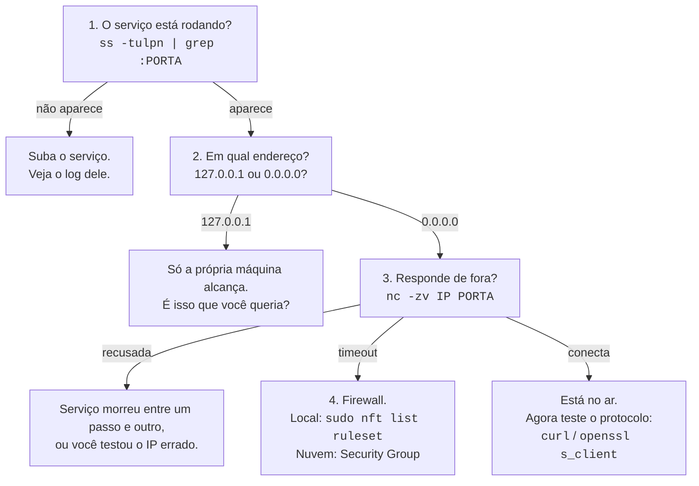

# 04 · Como começar — do ambiente pronto ao primeiro inventário

**Nível:** iniciante · **Última atualização:** 14/08/2026
**Todas as saídas deste arquivo foram executadas** em Ubuntu 22.04.5, kernel 6.8.0-136,
em 14/08/2026. São reais, inclusive as mensagens de erro — que estão em português porque
a máquina está em `pt_BR.UTF-8`.

Este arquivo assume o ambiente do [`03-instalacao.md`](03-instalacao.md). Não repetimos
instalação aqui.

---

## Em 60 segundos: o comando que responde à pergunta

```bash
ss -tulpn
```

Cinco letras, cinco decisões:

| Letra | Significa | Se você tirar |
|---|---|---|
| `-t` | TCP | some o TCP |
| `-u` | UDP | some o UDP — e você não vê DNS, DHCP, QUIC |
| `-l` | só quem está **escutando** (*listening*) | aparecem também suas conexões de saída, e a lista triplica |
| `-p` | mostra o **processo** dono | você vê a porta e não sabe de quem é |
| `-n` | **numérico**: não traduz 22 para "ssh" nem IP para nome | fica lento e mente (ver abaixo) |

**Guarde `-tulpn` como uma palavra só.** É o comando mais digitado do assunto.

### Por que `-n` importa mais do que parece

Sem `-n`, o `ss` troca `22` por `ssh` consultando `/etc/services`. Mas o `/etc/services` é
uma **tabela de convenções**, não uma leitura do que está rodando. Se alguém puser um
servidor web na porta 22, o `ss` sem `-n` vai escrever "ssh" ao lado dele.

Ou seja: **sem `-n`, a ferramenta te mostra o que deveria estar lá, não o que está.**
Use `-n` sempre e traduza você mesmo quando quiser.

---

## Passo 1 — Ler a saída de verdade

Saída real desta máquina, recortada:

```
$ ss -tulpn
Netid State  Recv-Q Send-Q  Local Address:Port  Peer Address:Port Process
udp   UNCONN 0      0       127.0.0.53%lo:53         0.0.0.0:*
udp   UNCONN 0      0             0.0.0.0:5353       0.0.0.0:*
tcp   LISTEN 0      511         127.0.0.1:35633      0.0.0.0:*    users:(("code",pid=55375,fd=92))
tcp   LISTEN 0      50            0.0.0.0:445        0.0.0.0:*
tcp   LISTEN 0      151         127.0.0.1:3306       0.0.0.0:*
tcp   LISTEN 0      128         127.0.0.1:631        0.0.0.0:*
tcp   LISTEN 0      511                 *:80               *:*
tcp   LISTEN 4      511           0.0.0.0:3001       0.0.0.0:*    users:(("MainThread",pid=79049,fd=23))
```

Coluna por coluna:

| Coluna | O que é | O que fazer com ela |
|---|---|---|
| `Netid` | `tcp` ou `udp` | Lembre: 80/tcp e 80/udp são portas **diferentes** |
| `State` | `LISTEN` (TCP) ou `UNCONN` (UDP) | UDP nunca diz LISTEN: não existe conexão em UDP |
| `Recv-Q` | Em `LISTEN`: conexões prontas esperando o `accept()` | **Se for > 0 e crescendo, seu serviço está travado.** Ver abaixo |
| `Send-Q` | Em `LISTEN`: o tamanho do *backlog* | Quantas conexões podem esperar antes de o kernel recusar |
| `Local Address:Port` | **A coluna mais importante do arquivo** | Ver a seção seguinte |
| `Peer Address:Port` | `0.0.0.0:*` = aceita de qualquer um | |
| `Process` | Quem abriu | Vazio = processo de outro usuário. Use `sudo` |

### O detalhe do `Recv-Q` que quase ninguém sabe ler

Naquela saída, a linha da porta 3001 tem `Recv-Q 4`. Em um socket em `LISTEN`, isso não é
"4 bytes esperando" — é **4 conexões já completas que o programa ainda não aceitou**.

Se esse número fica preso em valor alto, o diagnóstico é preciso: o processo está vivo (o
kernel completou o handshake), mas não está chamando `accept()`. Travou, está em GC longo,
ou o laço de eventos empacou. É um sinal de saúde que dashboards raramente coletam e que
está a um `ss` de distância.

---

## Passo 2 — A pergunta que separa problema de normalidade

Olhe **só** a coluna `Local Address`. Ela tem quatro formas, e cada uma quer dizer uma coisa:

| Aparece | Quem alcança | Veredito |
|---|---|---|
| `127.0.0.1:3306` | **Só esta máquina.** | Normal. É higiene. |
| `0.0.0.0:445` | Qualquer um que alcance qualquer IP seu | **Investigue.** |
| `*:80` ou `[::]:445` | Idem, incluindo IPv6 | **Investigue.** |
| `10.209.2.168:8080` | Quem alcança aquela interface específica | Depende da rede |
| `127.0.0.53%lo:53` | Só esta máquina, num IP de loopback **diferente** | Normal (`systemd-resolved`) |

> **A regra de bolso:** `127.0.0.1` é tranquilidade. `0.0.0.0` é uma pergunta a responder.

E preste atenção nesta pegadinha, que aparece na saída acima: o DNS local escuta em
`127.0.0.53`, **não** em `127.0.0.1`. Todo o bloco `127.0.0.0/8` é loopback — são 16 milhões
de endereços que significam "eu mesmo". Um teste contra `127.0.0.1:53` não encontra esse
serviço, e a conclusão "não tem DNS aqui" fica errada.

### O filtro que você vai usar todo dia

```bash
ss -tulpn | grep -v '127.0.0.1\|127.0.0.53\|\[::1\]'
```
> Mostra só o que **não** é loopback — isto é, só o que pode ser alcançado de fora.
> Numa máquina bem cuidada, essa lista é curta e você conhece cada linha.

---

## Passo 3 — Ver acontecer: abra uma porta com as próprias mãos

Teoria basta. Abra uma porta agora.

**Terminal 1:**

```bash
python3 -m http.server 8099 --bind 127.0.0.1
```
> Sobe um servidor web na porta 8099, escutando **só** em loopback. `python3` já está na sua máquina.

**Terminal 2 — confirme que existe:**

```bash
ss -tlnp | grep 8099
```

Saída real:

```
LISTEN 0  5  127.0.0.1:8099  0.0.0.0:*  users:(("python3",pid=221761,fd=3))
```

Leia: TCP, escutando, backlog 5, em loopback, porta 8099, processo `python3` de PID 221761,
usando o descritor de arquivo número 3. **Um socket é um arquivo aberto** — guarde isso, é
o modelo mental do Unix inteiro e volta no [`15-sockets-e-o-kernel.md`](15-sockets-e-o-kernel.md).

**Confirme que responde:**

```bash
curl -s -o /dev/null -w "%{http_code}\n" http://127.0.0.1:8099/
# 200
```

**Agora a lição de verdade** — tente pelo IP externo da máquina:

```bash
curl -sS -m 3 http://10.209.2.168:8099/
```

Saída real:

```
curl: (7) Failed to connect to 10.209.2.168 port 8099 after 0 ms: Conexão recusada
```

A porta está aberta. O serviço está rodando. E mesmo assim, recusa. Porque `--bind 127.0.0.1`
disse ao kernel: *"aceite conexões que chegarem por loopback, e só por ele"*.

**Isto é o mecanismo de segurança mais eficaz e mais barato do assunto.** Nenhum firewall
envolvido, nenhuma regra para manter, nada que possa ser esquecido numa reinstalação.
Volte a essa ideia no [`19-exposicao-e-seguranca.md`](19-exposicao-e-seguranca.md).

---

## Passo 4 — Quem está usando a porta 8099? Três ferramentas, três estilos

```bash
ss -tlnp | grep 8099
```
```bash
lsof -nP -iTCP:8099 -sTCP:LISTEN
```
Saída real:
```
COMMAND    PID      USER   FD   TYPE  DEVICE SIZE/OFF NODE NAME
python3 221761 ronivaldo    3u  IPv4 2050580      0t0  TCP 127.0.0.1:8099 (LISTEN)
```
```bash
fuser -n tcp 8099
```
Saída real:
```
8099/tcp:            221761
```

- `ss` é o mais rápido e o mais informativo. Padrão no Linux.
- `lsof` é o mais portável — **é o único caminho no macOS** — e mostra usuário e descritor.
- `fuser` é o mais curto quando você só quer o PID para matar o processo:
  `fuser -k -n tcp 8099` encerra quem está lá. Use com cuidado.

---

## Passo 5 — Testar de fora: os três desfechos, ao vivo

Com o servidor da etapa 3 ainda rodando:

```bash
nc -zv 127.0.0.1 8095-8100
```
> `-z` só testa (zero I/O, não envia dados), `-v` fala o que achou. Aceita faixa.

Saída real:

```
nc: connect to 127.0.0.1 port 8095 (tcp) failed: Connection refused
nc: connect to 127.0.0.1 port 8096 (tcp) failed: Connection refused
nc: connect to 127.0.0.1 port 8097 (tcp) failed: Connection refused
nc: connect to 127.0.0.1 port 8098 (tcp) failed: Connection refused
Connection to 127.0.0.1 8099 port [tcp/*] succeeded!
nc: connect to 127.0.0.1 port 8100 (tcp) failed: Connection refused
```

Uma aberta, cinco fechadas. **Nenhuma filtrada** — porque não há firewall no meio.
Para ver o terceiro desfecho, aponte para um IP que não existe na sua rede:

```bash
curl -sS -m 5 http://10.255.255.1:80/
```

Saída real:

```
curl: (28) Connection timed out after 5000 milliseconds
```

Compare as duas mensagens:

- **"Conexão recusada"** → chegou lá, e voltou um "não". Rápido: 0 ms.
- **"timed out"** → não voltou nada. Lento: você pagou os 5 segundos inteiros.

Essa diferença de tempo é a assinatura de um firewall. Varredura contra alvo protegido é
lenta **por construção** — cada porta custa o timeout inteiro. É por isso que `nmap` demora
minutos num alvo e milissegundos em outro.

---

## Passo 6 — O inventário completo, com julgamento

```bash
cd 07-projeto-modelo
python3 auditor.py local --apenas-expostas
```

Saída real (recortada):

```
INVENTÁRIO DE PORTAS LOCAIS
faixa efêmera deste host: 32768-60999  (28232 portas de origem disponíveis)

          PROTO  ENDEREÇO LOCAL         ESCOPO            PROCESSO           MOTIVO
CRITICO   tcp    0.0.0.0:445            todas-interfaces  (sem permissão)    microsoft-ds: Compartilhamento de arquivos Windows...
CRITICO   tcp    0.0.0.0:139            todas-interfaces  (sem permissão)    netbios-ssn: SMB sobre NetBIOS. Legado; use 445.
ATENCAO   tcp    :::80                  todas-interfaces  (sem permissão)    http: Web sem criptografia.
ATENCAO   tcp    0.0.0.0:3001           todas-interfaces  MainThread[187918] serviço não catalogado exposto
OK        udp    0.0.0.0:5353           todas-interfaces  (sem permissão)    mdns: exposição usual para este serviço

RESUMO: 35 sockets em escuta · 14 crítico(s) · 19 atenção · 2 ok
```

O `(sem permissão)` não é falha do programa. É a permissão do Unix funcionando: a tabela de
portas é pública, mas os descritores de arquivo de processos de **outros usuários** não são.
Rode com `sudo` e os nomes aparecem. Esse comportamento é idêntico ao do `ss -tulpn`, e
entender **por que** é o assunto do [`15-sockets-e-o-kernel.md`](15-sockets-e-o-kernel.md).

---

## O ciclo de trabalho do dia a dia

Você vai repetir este laço a vida inteira. Ele tem quatro perguntas, nesta ordem:



**A ordem importa.** Metade do tempo perdido em rede vem de gente que começa pelo passo 4
(mexer no firewall) sem ter feito o passo 1 (ver se o serviço sequer subiu).

---

## Os cinco primeiros erros — provocados de propósito

Não leia sobre eles. Reproduza cada um.

### Erro 1 — `Address already in use`

Com o servidor da etapa 3 rodando, abra outro na mesma porta:

```bash
python3 -m http.server 8099 --bind 127.0.0.1
```

Saída real:

```
OSError: [Errno 98] Address already in use
```

**Causa:** o par (IP, porta) já está reservado. Uma porta, um dono.

**Diagnóstico e correção:**

```bash
ss -tulpn | grep :8099          # quem é o dono?
fuser -k -n tcp 8099            # encerra o dono (cuidado)
```

**A variante traiçoeira:** você **matou** o processo, esperou, e o erro continua por até
~60 segundos. Isso é `TIME_WAIT` — o TCP guarda o par por um tempo depois do fechamento
para não confundir pacotes atrasados de uma conexão antiga com a nova. A solução no código
é `SO_REUSEADDR`. A explicação completa está no [`13-tcp-por-dentro.md`](13-tcp-por-dentro.md),
e o projeto-modelo usa `allow_reuse_address = True` exatamente por isso.

### Erro 2 — `Connection refused`

```bash
curl -sS http://127.0.0.1:8098/
```
```
curl: (7) Failed to connect to 127.0.0.1 port 8098 after 0 ms: Conexão recusada
```

**Causa:** chegou até a máquina, e o kernel respondeu "ninguém escuta aqui" (um RST).
**Note o `after 0 ms`** — foi instantâneo. Isso é a assinatura de recusa, não de bloqueio.

**As três causas reais, em ordem de frequência:**
1. O serviço não subiu (olhe o log dele, não a rede).
2. O serviço subiu em **outra porta** (`ss -tulpn | grep <nome do processo>`).
3. O serviço subiu em **outro IP** — o caso do Passo 3.

### Erro 3 — `Connection timed out`

```bash
curl -sS -m 5 http://10.255.255.1:80/
```
```
curl: (28) Connection timed out after 5000 milliseconds
```

**Causa:** ninguém respondeu nada. Firewall descartando em silêncio, rota inexistente, ou
máquina desligada. **Diferente do erro 2**, e a diferença é o tempo.

**Onde procurar, em ordem:** firewall do provedor de nuvem (Security Group) → firewall da
máquina (`nft`/`iptables`/`ufw`) → rota (`ip route get <IP>`) → a máquina está viva?

### Erro 4 — `Permission denied`

```bash
python3 -c "import socket; s=socket.socket(); s.bind(('0.0.0.0', 80))"
```

Saída real:

```
PermissionError: [Errno 13] Permission denied
```

**Causa:** portas abaixo de 1024 são privilegiadas no Unix. É uma decisão de 1980 —
a explicação de **por que** ela existe está no [`11-historia.md`](11-historia.md), e as
quatro soluções corretas estão no [`03-instalacao.md`](03-instalacao.md), seção Permissões.

### Erro 5 — "está aberta mas não responde nada"

```bash
nc -zv 127.0.0.1 3306        # conecta
curl http://127.0.0.1:3306/  # e não é HTTP
```

**Causa:** você acertou a porta e errou o **protocolo**. Porta aberta diz que existe um
programa. Não diz qual língua ele fala.

**Como descobrir a língua:**

```bash
timeout 2 nc 127.0.0.1 3306 | head -c 100 | xxd | head -3
```

Saída real desta máquina (recortada):

```
8.0.46-0ubuntu0.22.04.3 ... caching_sha2_password
```

O MySQL cospe a versão exata **antes de qualquer autenticação**. Você não precisou de senha
para saber que ele é 8.0.46 no Ubuntu 22.04. Guarde isso: é o que um scanner faz, e é o
motivo de "banner" ser informação sensível.

---

## Verificação — você chegou até aqui?

```bash
ss -tulpn | head -3                        # lista sai sem erro
python3 -m http.server 8099 --bind 127.0.0.1 &   # sobe
ss -tlnp | grep 8099                       # aparece
nc -zv 127.0.0.1 8099                      # "succeeded!"
nc -zv 127.0.0.1 8098                      # "Connection refused"
kill %1                                    # derruba
nc -zv 127.0.0.1 8099                      # agora recusa também
```

Se você entendeu **por que** cada linha respondeu o que respondeu, o Bloco A cumpriu a função.

---

## Onde ir agora

| Você quer… | Vá para |
|---|---|
| Receitas prontas para problemas reais | [`06-exemplos.md`](06-exemplos.md) |
| Referência de toda flag de `ss`, `lsof`, `nmap` | [`05-manual-de-uso.md`](05-manual-de-uso.md) |
| Entender **por que** tudo isso funciona assim | [`10-fundamentos.md`](10-fundamentos.md) |
| Saber para que serve cada porta | [`16-catalogo-de-portas.md`](16-catalogo-de-portas.md) |
| Praticar com mão na massa | [`70-pratica.md`](70-pratica.md) |
| Ver o código de um auditor de verdade | [`07-projeto-modelo/`](07-projeto-modelo/README.md) |

---

## Autoteste

1. Por que `-n` no `ss -tulpn` não é só uma questão de velocidade?
2. Você vê `Recv-Q 12` numa linha em estado `LISTEN`. O que isso diz sobre o processo?
3. `ss` mostra `127.0.0.1:8099 LISTEN` e ainda assim `curl` para o IP da máquina dá
   "Conexão recusada". Explique, e diga por que isso é uma **boa** notícia.
4. Qual a diferença observável entre "Conexão recusada" e "timed out"? O que cada uma diz
   sobre onde está o problema?
5. Você matou o processo, mas `Address already in use` continua. O que está acontecendo e
   quanto tempo dura?
6. `nc -zv` diz que a porta 3306 está aberta, mas `curl` não funciona nela. Explique.
7. Um serviço escuta em `127.0.0.53:53`. Por que um teste em `127.0.0.1:53` não o encontra?

---

*Próximo: [`05-manual-de-uso.md`](05-manual-de-uso.md) — a referência para consultar.*
