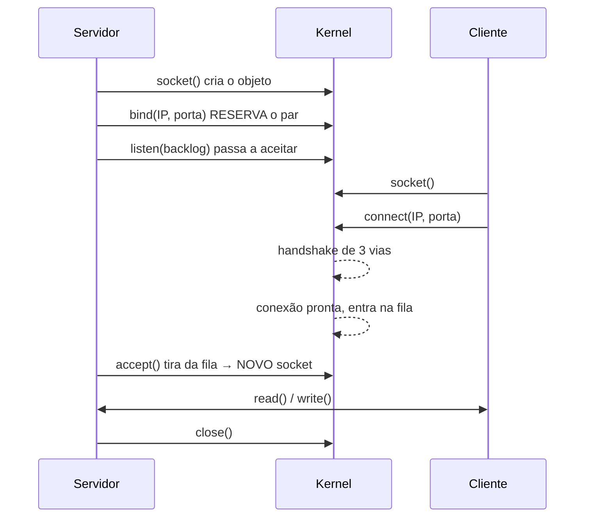

# 10 · Fundamentos — o vocabulário e os modelos mentais

**Nível:** intermediário · **Última atualização:** 14/08/2026

Este é o arquivo que, se você entender bem, torna todo o resto do curso quase óbvio.
Ele define com precisão os termos que o [`01`](01-introducao-leigo.md) usou informalmente.

---

## 1. Definição formal

> Uma **porta** é um inteiro sem sinal de **16 bits** (0 a 65535) presente no cabeçalho de
> certos protocolos de transporte, usado pelo sistema operacional como **chave de
> demultiplexação**: dado um pacote que chegou, decidir a qual socket entregá-lo.

Três palavras dessa definição precisam ser desempacotadas.

### "de transporte"

A porta **não existe** na camada de rede. O IP não sabe o que é uma porta. Ela é um campo do
**TCP**, do **UDP**, do **SCTP** e do **DCCP**. O ICMP — o protocolo do `ping` — **não tem
portas**, e é por isso que você não pode "abrir a porta do ping".

### "demultiplexação"

*Multiplexar* é juntar vários fluxos em um canal. *Demultiplexar* é separá-los de novo.

Sua máquina tem um IP e muitos programas. O IP multiplexa; a porta demultiplexa. É
literalmente a mesma ideia da telefonia (multiplexação por divisão de frequência) e da
transmissão de dados moderna — e não é coincidência: as pessoas que projetaram o TCP vinham
da tradição de engenharia telefônica.

### "socket"

O objeto do sistema operacional que representa um ponto final de comunicação. É o que a
porta aponta.

---

## 2. A quádrupla — o conceito mais importante do assunto

Uma conexão TCP não é identificada pela porta. É identificada por **quatro** números:

```
( IP de origem , porta de origem , IP de destino , porta de destino )
```

Em inglês, *4-tuple* ou *connection tuple*. Com o protocolo incluso, alguns chamam de
**quíntupla** (*5-tuple*).

Isso resolve, sozinho, a pergunta que trava todo iniciante:

> *"Se só um programa pode ocupar a porta 443, como um servidor atende 50 000 clientes
> ao mesmo tempo?"*

Porque **a exclusividade é da quádrupla, não da porta**. Olhe:

| # | IP origem | Porta origem | IP destino | Porta destino |
|---|---|---|---|---|
| 1 | 200.1.2.3 | 51234 | 10.0.0.5 | 443 |
| 2 | 200.1.2.3 | 51235 | 10.0.0.5 | 443 |
| 3 | 187.9.8.7 | 51234 | 10.0.0.5 | 443 |
| 4 | 187.9.8.7 | 62001 | 10.0.0.5 | 443 |

Quatro conexões distintas. Todas para a porta 443 do mesmo servidor. Nenhum conflito,
porque nenhuma quádrupla se repete.

Repare que as linhas 1 e 3 têm a **mesma porta de origem** (51234). Não importa: os IPs de
origem diferem.

### O que é exclusivo, então?

| Nível | Regra |
|---|---|
| Socket em `LISTEN` | O par `(IP local, porta)` é exclusivo. Só um dono. |
| Socket conectado | A **quádrupla** inteira é exclusiva. |

E há uma sutileza que confunde muita gente: `0.0.0.0:8080` e `127.0.0.1:8080` **conflitam**,
porque `0.0.0.0` significa "todos os endereços locais" e inclui `127.0.0.1`. Mas
`192.168.0.5:8080` e `127.0.0.1:8080` **convivem**, porque são endereços distintos.

### Verificado na prática

```python
s = socket.socket(); s.bind(("127.0.0.1", 0)); s.listen(5)
porta = s.getsockname()[1]                    # 54219
c = socket.socket(); c.connect(("127.0.0.1", porta))
conn, addr = s.accept()
print("cliente:", c.getsockname(), "->", c.getpeername())
print("servidor:", conn.getsockname(), "<-", conn.getpeername())
```

**Saída real:**

```
bind em porta 0 -> ('127.0.0.1', 54219)
quadrupla: local ('127.0.0.1', 36228) -> remoto ('127.0.0.1', 54219)
do lado do servidor: ('127.0.0.1', 54219) <- ('127.0.0.1', 36228)
```

A quádrupla é `(127.0.0.1, 36228, 127.0.0.1, 54219)`. Os dois lados a enxergam espelhada.

**Repare também:** o socket de escuta ficou com a porta 54219, e o socket **retornado pelo
`accept()`** tem a mesma porta local. Não são o mesmo socket — são dois objetos distintos,
com a mesma porta local e quádruplas diferentes. Esse é o mecanismo exato pelo qual um
servidor multiplexa milhares de clientes numa porta só.

---

## 3. Socket — o objeto por trás de tudo

Um **socket** é a abstração que o Unix criou em 1983 (BSD 4.2, Berkeley) para representar um
ponto de comunicação. A ideia genial: **fazê-lo parecer um arquivo**.

```
$ lsof -nP -iTCP:8099 -sTCP:LISTEN
COMMAND    PID      USER   FD   TYPE  DEVICE  NODE NAME
python3 221761 ronivaldo    3u  IPv4 2050580  TCP  127.0.0.1:8099 (LISTEN)
```

Aquele `3u` é o **descritor de arquivo** número 3. O mesmo tipo de número que você usa para
ler um arquivo em disco. `read()`, `write()` e `close()` funcionam nos dois.

**Por que isso importa:** é a razão de "vazamento de socket" e "vazamento de arquivo" serem
o mesmo problema, de `ulimit -n` limitar os dois, e de `Too many open files` aparecer quando
o que acabou foram conexões.

### Os cinco tipos de socket que você vai encontrar

| Tipo | Constante | Tem porta? | Uso |
|---|---|---|---|
| Fluxo, internet | `AF_INET, SOCK_STREAM` | Sim (TCP) | HTTP, SSH, bancos |
| Datagrama, internet | `AF_INET, SOCK_DGRAM` | Sim (UDP) | DNS, QUIC, vídeo |
| Bruto | `AF_INET, SOCK_RAW` | **Não** | `ping`, `nmap -sS`. Exige root. |
| UNIX | `AF_UNIX` | **Não** — usa caminho de arquivo | Docker, MySQL, PostgreSQL locais |
| Netlink | `AF_NETLINK` | Não | Conversa com o kernel. É como o `ss` funciona. |

**O socket UNIX merece atenção.** Muitos serviços aceitam conexão por **arquivo** em vez de
porta:

```bash
ss -x | head -3
```

Saída real:

```
Netid State Recv-Q Send-Q  Local Address:Port
u_str ESTAB 0      0       /var/run/mysqld/mysqld.sock 1990372
```

Um socket UNIX é **mais rápido** (não passa pela pilha TCP/IP) e **mais seguro** (permissão
de arquivo controla o acesso; nenhuma rede o alcança). É por isso que o Docker usa
`/var/run/docker.sock` em vez de uma porta, e por que expor esse socket como porta TCP
(o exemplo do [`05`](05-manual-de-uso.md)) é tão perigoso.

---

## 4. O ciclo de vida — as sete chamadas de sistema

Todo servidor TCP do mundo faz exatamente isto:



| Chamada | O que faz | Erro típico |
|---|---|---|
| `socket()` | Cria o objeto e devolve um descritor | `EMFILE` (`Too many open files`) |
| `bind()` | **Reserva** o par (IP, porta) | `EADDRINUSE` (98) · `EACCES` (13) |
| `listen(n)` | Marca como passivo, define o backlog | |
| `accept()` | Retira a próxima conexão pronta da fila e devolve **um socket novo** | `EAGAIN` se não-bloqueante |
| `connect()` | Inicia o handshake (lado cliente) | `ECONNREFUSED` (111) · `ETIMEDOUT` (110) · `EADDRNOTAVAIL` (99) |
| `send`/`recv` | Trafega dados | `EPIPE` se o outro lado sumiu |
| `close()` | Encerra. **Se não chamar, vaza.** | |

**A observação que muda o entendimento:** o `bind()` é quem "abre a porta", não o `listen()`.
E o `accept()` **não** abre porta nenhuma — ele devolve um socket que compartilha a mesma
porta local. Esse é o ponto exato onde a multiplexação acontece.

### O cliente também faz `bind` — só que implícito

Quando você chama `connect()` sem ter feito `bind()`, o kernel faz um `bind()` automático,
escolhendo uma porta livre da faixa efêmera. É por isso que o cliente tem porta de origem
sem você ter pedido.

Você **pode** pedir explicitamente (`bind()` antes de `connect()`), e isso é usado por
protocolos que exigem porta de origem fixa — o que hoje é raro e geralmente é um erro de
projeto.

---

## 5. As três faixas de portas

Definidas pelo **RFC 6335** (2011), que consolidou décadas de prática:

| Faixa | Nome oficial | Nome comum | Quem atribui |
|---|---|---|---|
| **0–1023** | System Ports | *well-known* | IANA, via "IETF Review" ou "IESG Approval" |
| **1024–49151** | User Ports | *registered* | IANA, via "Expert Review" |
| **49152–65535** | Dynamic/Private Ports | *ephemeral* | **Ninguém.** Nunca são atribuídas. |

> Registro oficial: [IANA — Service Name and Transport Protocol Port Number Registry](https://www.iana.org/assignments/service-names-port-numbers),
> atualizado em 11/08/2026.

### Três verdades incômodas sobre essa tabela

**1. O Linux não segue a faixa efêmera do padrão.**

```bash
cat /proc/sys/net/ipv4/ip_local_port_range
```
```
32768	60999
```

O padrão diz 49152–65535 (16 384 portas). O Linux usa 32768–60999 (**28 232** portas).
Por quê? Porque o padrão foi escrito em 2011 e o Linux já usava essa faixa desde muito antes,
por precisar de mais portas. Trocar quebraria sistemas em produção.

**Isso é uma decisão histórica documentada, não um bug** — e é uma das paradas legítimas da
regra dos cinco porquês. E tem consequência prática: um serviço que escolhe a porta 50000
"porque é dinâmica e ninguém usa" pode colidir com uma porta efêmera no Linux. Já causou
incidentes reais.

**2. A restrição das portas < 1024 é do Unix, não do padrão.**

Nenhum RFC diz que é preciso ser root para escutar na porta 80. É uma decisão do Unix,
de cerca de 1980. A lógica: numa máquina compartilhada de universidade, se qualquer aluno
pudesse escutar na porta 25, ele poderia se passar pelo servidor de e-mail da instituição.
A porta baixa passou a ser uma **credencial fraca de autoridade**.

Hoje isso não faz mais sentido — a máquina não é compartilhada e ninguém confia numa porta
como prova de nada — mas mudar quebraria compatibilidade. É a **quinta camada** do porquê:
uma decisão histórica documentada de um mundo que não existe mais.

Windows nunca teve essa restrição. É por isso que um serviço portado do Unix para o Windows
"simplesmente funciona" na porta 80 sem privilégio, e o desenvolvedor não entende por quê.

**3. Estar registrado na IANA não significa nada operacionalmente.**

A porta 3000 é usada por Node, Rails e Grafana, e **não é registrada** para nenhum deles.
A porta 1801 está registrada para o MSMQ da Microsoft, e você provavelmente nunca viu um.
O registro é uma **convenção de boa vizinhança**, sem nenhum mecanismo de imposição.

---

## 6. Portas efêmeras — a metade esquecida

Toda vez que você abre um site, seu computador **abre uma porta**. Não uma porta de servidor
— uma porta de origem, efêmera.

```bash
ss -tan state established | head -5
```

Saída real:

```
Recv-Q Send-Q Local Address:Port   Peer Address:Port
0      0       10.209.2.168:50434  10.210.124.25:6060
0      0       10.209.2.168:44714  10.210.124.21:6060
0      0       10.209.2.168:50862   10.209.1.32:445
```

`50434`, `44714`, `50862` são portas efêmeras desta máquina. Elas existem enquanto a conexão
existe (mais 60 s de `TIME_WAIT`), e depois voltam para o bolo.

### Por que isso importa

1. **Contagem.** Nesta máquina, 28 232 portas efêmeras. Isso limita quantas conexões
   simultâneas **para o mesmo destino** a máquina pode ter — não quantas ela pode ter no
   total. Ver [`60-teoria-avancada.md`](60-teoria-avancada.md).

2. **Segurança.** A porta efêmera precisa ser **imprevisível**. Se um atacante adivinhar sua
   porta de origem, ele pode forjar pacotes que se encaixam na sua conexão. O RFC 6056 (2011)
   define os algoritmos de aleatorização — e o motivo de eles existirem é o ataque de
   *off-path injection* contra sessões BGP dos anos 2000, que derrubou pedaços da internet.

3. **Diagnóstico.** Ao ver uma porta alta no `ss -tulpn` em estado `LISTEN`, desconfie:
   um serviço escutando numa porta da faixa efêmera é quase sempre acidental. Foi o critério
   usado no [projeto-modelo](07-projeto-modelo/README.md) e ele achou dois casos reais.

---

## 7. `bind` — onde, não só qual

O `bind()` recebe **dois** valores: um IP e uma porta. A porta todo mundo repara. **O IP é
onde mora a segurança.**

| Valor | Nome | Quem alcança |
|---|---|---|
| `127.0.0.1` | loopback | Só processos desta máquina |
| `0.0.0.0` | `INADDR_ANY` | Qualquer um que alcance **qualquer** IP desta máquina |
| `192.168.0.5` | IP específico | Só quem chega por aquela interface |
| `::` | IPv6 `ANY` | Todos, IPv6 — e possivelmente IPv4 também (ver abaixo) |
| `::1` | loopback IPv6 | Só esta máquina |

### A pegadinha do IPv4-mapeado

Um socket IPv6 com `::` pode receber conexões IPv4, que aparecem como `::ffff:192.168.0.5`.
Esse é um endereço IPv4 **embrulhado** em notação IPv6 (RFC 4291 §2.5.5.2).

Consequência prática: um script de auditoria que testa `if ip == "127.0.0.1"` classifica
`::ffff:127.0.0.1` como exposto — e gera alarme falso. O projeto-modelo tinha exatamente
esse defeito na primeira versão; ele foi encontrado ao rodar contra esta máquina e há dois
testes cobrindo o caso.

Controle esse comportamento com:

```bash
sysctl net.ipv6.bindv6only        # 0 = socket IPv6 também aceita IPv4 (padrão no Linux)
```

---

## 8. `LISTEN` não é `ESTABLISHED`

Um erro de leitura comum. `ss -tan` mostra os dois, e eles são coisas diferentes:

| | `LISTEN` | `ESTABLISHED` |
|---|---|---|
| O que é | Um socket **passivo**, esperando | Uma conversa em andamento |
| Quantos por porta | **Um** | Milhares |
| `Peer Address` | `0.0.0.0:*` (ninguém específico) | O IP e a porta do outro lado |
| `Recv-Q` significa | Conexões prontas na fila | Bytes não lidos pela aplicação |
| `Send-Q` significa | O backlog configurado | Bytes enviados sem confirmação |

Essa mudança de significado das colunas `Recv-Q`/`Send-Q` conforme o estado é a coisa menos
documentada e mais útil da saída do `ss`.

---

## 9. Os cinco porquês, aplicados

Vamos até o fundo em uma pergunta simples: **por que a porta 80 é HTTP?**

**1º porquê — por que 80?**
Porque o `/etc/services` e o registro da IANA dizem, e todo cliente HTTP assume esse número
quando a URL não especifica outro.

**2º porquê — por que a IANA registrou o 80 para HTTP?**
Porque Tim Berners-Lee pediu esse número no CERN, por volta de 1991, ao publicar o primeiro
servidor web. Antes disso ele usava a 2784 nos protótipos.

**3º porquê — por que ele escolheu o 80, e não outro?**
Porque estava livre na faixa baixa da época e era um número redondo. A documentação
histórica do W3C indica que a escolha foi por conveniência, não por propriedade técnica
nenhuma. **É uma convenção arbitrária** — e é honesto dizer isso em vez de inventar
significado.

**4º porquê — por que a faixa baixa importava?**
Porque abaixo de 1024 exige privilégio no Unix, e naquele contexto isso significava "este
serviço foi autorizado pelo administrador da máquina, não por um aluno qualquer". A porta
baixa funcionava como um sinal fraco de legitimidade.

**5º porquê — por que essa restrição existe no Unix?**
Porque em ~1980 as máquinas Unix eram compartilhadas por dezenas de usuários, e sem essa
restrição qualquer um poderia se passar por um serviço da instituição. **Aqui paramos: é
uma decisão histórica documentada, tomada num modelo de computação que praticamente não
existe mais, e mantida por compatibilidade.**

Note aonde essa cadeia chegou: não a uma lei da natureza nem a uma otimização — a duas
decisões humanas datadas. É assim com quase tudo em redes.

---

## 10. O vocabulário completo

| Termo | Definição |
|---|---|
| **Porta** | Inteiro de 16 bits usado para demultiplexar pacotes entre sockets |
| **Socket** | Ponto final de comunicação; no Unix, um descritor de arquivo |
| **Quádrupla** | `(IP orig, porta orig, IP dest, porta dest)` — identifica uma conexão |
| **Bind** | Reservar o par (IP, porta) para um socket |
| **Listen** | Marcar um socket como passivo, aceitando conexões |
| **Accept** | Retirar uma conexão pronta da fila e obter um socket novo |
| **Backlog** | Tamanho da fila de conexões prontas esperando `accept()` |
| **Efêmera** | Porta de origem atribuída automaticamente pelo kernel |
| **Well-known** | Porta 0–1023, exige privilégio no Unix |
| **Demultiplexação** | Separar fluxos que chegaram por um mesmo canal |
| **Loopback** | `127.0.0.0/8` e `::1` — tráfego que nunca sai da máquina |
| **`INADDR_ANY`** | `0.0.0.0` — escutar em todas as interfaces |
| **Aberta / Fechada / Filtrada** | Os três desfechos de uma sondagem |
| **Banner** | O que um serviço diz ao ser conectado |

O glossário completo, com ~140 termos, está em [`GLOSSARIO.md`](GLOSSARIO.md).

---

## Autoteste

1. Um servidor tem 50 000 conexões na porta 443. Explique, usando a quádrupla, por que não
   há conflito. Quantos sockets existem no total, contando o de escuta?
2. Por que `0.0.0.0:8080` e `127.0.0.1:8080` conflitam, mas `192.168.0.5:8080` e
   `127.0.0.1:8080` não?
3. Qual chamada de sistema "abre" a porta: `socket()`, `bind()`, `listen()` ou `accept()`?
   E qual delas **não** abre porta nenhuma, apesar de parecer que sim?
4. A faixa efêmera padrão do RFC 6335 é 49152–65535. O Linux usa 32768–60999. Por que a
   divergência, e que problema prático ela pode causar?
5. Por que escutar na porta 80 exige privilégio no Unix e não no Windows? A restrição ainda
   protege de alguma coisa hoje?
6. O que é `::ffff:127.0.0.1`, e por que um script de auditoria ingênuo erra ao processá-lo?
7. Num socket em `LISTEN`, o que significam `Recv-Q` e `Send-Q`? E num `ESTABLISHED`?
8. Por que um socket UNIX é mais seguro que uma porta TCP em `127.0.0.1`, se as duas só são
   alcançáveis localmente?

---

*Próximo: [`11-historia.md`](11-historia.md) — de onde tudo isso veio.*
