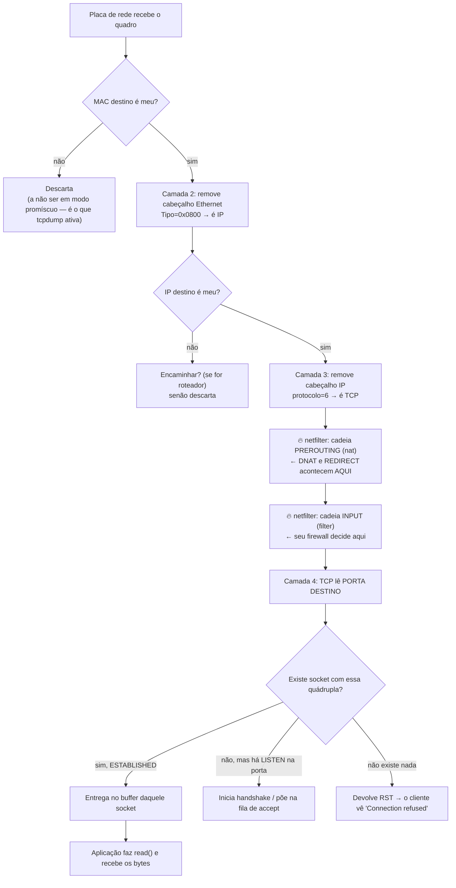

# 12 · Onde a porta vive — a pilha, camada a camada

**Nível:** intermediário · **Última atualização:** 14/08/2026

Este arquivo responde a uma pergunta que parece de prova de faculdade e é, na verdade,
profundamente prática: **em que ponto exato do caminho o número da porta é lido, e quem
não o vê?** Saber isso determina o que você pode filtrar, o que pode observar, e o que é
impossível.

---

## O modelo, sem decoreba

Você vai encontrar dois modelos. Use o segundo.

| Camada OSI (7) | Camada TCP/IP (4) | Exemplo | Sabe o que é porta? |
|---|---|---|---|
| 7 Aplicação · 6 Apresentação · 5 Sessão | **Aplicação** | HTTP, SSH, DNS | Sim (a aplicação escolheu) |
| 4 Transporte | **Transporte** | **TCP, UDP, SCTP, DCCP** | **É AQUI que a porta existe** |
| 3 Rede | **Internet** | IP, ICMP | **NÃO** |
| 2 Enlace · 1 Física | **Enlace** | Ethernet, Wi-Fi | **NÃO** |

> **A frase para gravar:** a porta é um campo do cabeçalho de transporte. Nada abaixo da
> camada 4 sabe que ela existe.

O modelo OSI é útil para conversar (todo mundo diz "camada 7" e "camada 4") e ruim para
entender a internet, que nunca o implementou. O modelo de 4 camadas é o que a pilha
realmente faz.

---

## Um pacote de verdade, byte a byte

Isto é um pacote HTTPS saindo da sua máquina. Cada moldura é um cabeçalho.

```
┌─────────────────────────────────────────────────────────────────────┐
│ QUADRO ETHERNET                                                     │
│ MAC destino (6B) │ MAC origem (6B) │ Tipo 0x0800 (2B)               │
│  ┌────────────────────────────────────────────────────────────────┐ │
│  │ PACOTE IP  (RFC 791)                                           │ │
│  │ ver=4 │ TTL │ protocolo=6 (TCP) │ IP orig │ IP dest            │ │
│  │  ┌───────────────────────────────────────────────────────────┐ │ │
│  │  │ SEGMENTO TCP  (RFC 793)                                   │ │ │
│  │  │ PORTA ORIGEM (2B) │ PORTA DESTINO (2B)   ← AQUI           │ │ │
│  │  │ nº sequência (4B) │ nº ACK (4B)                           │ │ │
│  │  │ flags: SYN ACK FIN RST PSH URG │ janela │ checksum        │ │ │
│  │  │  ┌──────────────────────────────────────────────────────┐ │ │ │
│  │  │  │ REGISTRO TLS  →  DADOS HTTP                          │ │ │ │
│  │  │  └──────────────────────────────────────────────────────┘ │ │ │
│  │  └───────────────────────────────────────────────────────────┘ │ │
│  └────────────────────────────────────────────────────────────────┘ │
└─────────────────────────────────────────────────────────────────────┘
```

**Os dois primeiros campos do cabeçalho TCP são as portas.** Os primeiros quatro bytes.
Isso não é acaso: coloca a informação de demultiplexação onde é mais barato de ler.

O campo `protocolo` do IP é o que diz qual cabeçalho vem a seguir:

| Valor | Protocolo | Tem porta? |
|---|---|---|
| 1 | ICMP | **Não** |
| 6 | TCP | Sim |
| 17 | UDP | Sim |
| 132 | SCTP | Sim |
| 33 | DCCP | Sim |
| 41 | IPv6 encapsulado | (depende do que vem dentro) |
| 47 | GRE (túnel) | **Não** |
| 50 | ESP (IPsec) | **Não** |

Essa tabela explica coisas do dia a dia:

- **Você não pode "liberar a porta do ping".** ICMP não tem porta. Regras de firewall para
  ICMP usam *tipo* e *código*, não porta.
- **Uma VPN IPsec em modo ESP não tem portas visíveis.** É por isso que firewalls simples
  não conseguem filtrar o que passa dentro dela — e por que muitas redes bloqueiam ESP
  inteiro.
- **GRE, usado em túneis, também não tem porta.** Um roteador que só sabe filtrar por porta
  fica cego.

---

## O caminho de um pacote que chega, passo a passo

Você digitou uma URL. O servidor respondeu. O pacote chega à sua placa de rede. O que
acontece, em ordem:



### Os quatro pontos de decisão, e o que cada um permite

| Ponto | Quem decide | O que consegue filtrar |
|---|---|---|
| Placa de rede | Hardware | MAC |
| Camada 3 (IP) | Kernel | IP de origem/destino, TTL, protocolo |
| **netfilter PREROUTING/INPUT** | Suas regras | **IP + porta + estado** ← é aqui que mora o firewall |
| Camada 4 (TCP/UDP) | Kernel | A quádrupla → escolhe o socket |

**A ordem importa muito.** Repare que o netfilter age **antes** de o pacote chegar ao socket.
Isso tem duas consequências que explicam mistérios reais:

1. **Um `REDIRECT` no PREROUTING desvia o pacote antes de ele encontrar qualquer socket.**
   É por isso que uma varredura pode achar uma porta "aberta" onde nenhum processo escuta —
   o caso real documentado no [projeto-modelo](07-projeto-modelo/README.md).

2. **Um `DROP` no INPUT faz o pacote sumir sem que o socket saiba.** O programa nunca fica
   sabendo que alguém tentou. É a diferença entre "filtrada" e "fechada".

---

## Quem enxerga a porta no caminho

Um pacote atravessa muitos equipamentos. Nem todos veem a porta.

| Equipamento | Camada | Vê a porta? | Consequência |
|---|---|---|---|
| Switch comum | 2 | **Não** | Não pode filtrar por porta. Encaminha por MAC. |
| Roteador simples | 3 | **Não** (ou só olha de relance) | Encaminha por IP |
| Roteador com ACL | 3–4 | Sim | Consegue "bloquear a porta 23" |
| Firewall com estado | 3–4 | Sim, **e lembra** da conexão | Sabe distinguir resposta de conexão nova |
| NAT doméstico | 3–4 | Sim, **e reescreve** | Sua porta de origem muda no caminho |
| Balanceador L4 | 4 | Sim | Distribui por porta, não sabe o que passa dentro |
| Balanceador L7 / proxy | 7 | Sim, e lê o conteúdo | Roteia por URL, por `Host:`, por SNI |
| IDS/IPS | 2–7 | Sim | Inspeciona tudo que consegue |

### O ponto que muda a arquitetura moderna

Um **balanceador L4** vê `(IP, porta)` e nada mais. Um **balanceador L7** termina a conexão,
lê a requisição HTTP, e faz uma conexão nova para o destino.

Isso explica por que, em arquitetura moderna, **a porta importa cada vez menos**: dez
serviços diferentes podem estar todos atrás da porta 443, distinguidos por nome de host
(SNI/`Host:`) ou por caminho de URL. O número da porta deixou de ser o mecanismo de
roteamento — virou só a entrada do prédio.

Voltaremos a isso no [`65-estado-da-arte.md`](65-estado-da-arte.md).

---

## O que TLS esconde, e o que não esconde

Confusão frequente: *"está criptografado, então ninguém vê a porta"*.

**Errado.** TLS criptografa **a carga útil**, que fica dentro do TCP. Os cabeçalhos IP e TCP
ficam em claro — precisam ficar, senão nenhum roteador saberia para onde mandar o pacote.

| Informação | Visível a um observador na rede? |
|---|---|
| IP de origem e destino | **Sim, sempre** |
| **Portas de origem e destino** | **Sim, sempre** |
| Flags TCP, números de sequência | Sim (em TCP; não em QUIC) |
| Tamanho e ritmo dos pacotes | Sim — e vaza muito mais do que se imagina |
| Nome do host (SNI) | Sim em TLS 1.2/1.3 comum; **não** com ECH |
| Certificado do servidor | Sim em TLS 1.2; **não** em TLS 1.3 |
| URL, cabeçalhos, corpo | Não |

**ECH** (*Encrypted Client Hello*) é o que fecha a última brecha de metadado no handshake.
Quando ele está em uso, o observador vê apenas: *"alguém no IP X falou com o IP Y na porta
443, trocando N bytes"*.

**E mesmo assim a porta continua visível.** Ela é a última informação que sobra — e é por
isso que continua sendo o dado mais usado em monitoração de rede, mesmo numa internet quase
inteiramente cifrada.

---

## Onde as portas *não* existem

Vale enumerar, porque cada um destes gera um mal-entendido específico.

### ICMP — o `ping` não tem porta

```bash
ping -c 1 8.8.8.8
```

Nenhuma porta envolvida. ICMP tem **tipo** e **código**:

| Tipo | Nome | Quando aparece |
|---|---|---|
| 0 | Echo Reply | resposta do `ping` |
| 3 | Destination Unreachable | com código 3 = **porta inalcançável** ← usado em varredura UDP |
| 8 | Echo Request | o `ping` |
| 11 | Time Exceeded | é como o `traceroute` funciona |

**A ironia:** o ICMP não tem porta, mas é ele quem informa que uma porta UDP está fechada.
Uma mensagem "ICMP tipo 3 código 3" significa "aquela porta UDP não tem ninguém". Todo o
`nmap -sU` depende disso — e é por isso que ele é lento e pouco confiável, já que quase todo
mundo limita a taxa de ICMP. Ver [`14-udp-e-os-outros.md`](14-udp-e-os-outros.md).

### Sockets UNIX — endereço é um caminho de arquivo

```bash
ss -x | head -3
```
```
u_str ESTAB 0 0  /var/run/mysqld/mysqld.sock 1990372
```

Sem IP, sem porta, sem rede. A permissão do **arquivo** controla o acesso. É mais rápido e
mais seguro — e é o motivo de MySQL, PostgreSQL e Docker preferirem esse caminho localmente.

### ARP, Ethernet, Wi-Fi

Camada 2. Trabalham com MAC. Um switch não tem como bloquear "a porta 22" — e quando um
fornecedor diz que o switch dele faz isso, é porque o equipamento tem funcionalidade de
camada 3/4 embutida (um "switch L3").

⚠️ **Cuidado com a palavra "porta".** Em um switch, "porta" significa **o conector físico
onde você enfia o cabo**. Um switch de 24 portas tem 24 buracos, não 24 números TCP. É
homonímia pura, e causa confusão real em conversa entre time de rede e time de software.

### VPN, túneis e encapsulamento

Um túnel GRE ou IPsec/ESP não expõe as portas do tráfego interno. Do lado de fora, é
"protocolo 47" ou "protocolo 50" — sem porta. É por isso que:

- firewalls simples não conseguem inspecionar o conteúdo de uma VPN;
- muitas redes corporativas bloqueiam ESP e GRE por inteiro, já que não conseguem ver dentro;
- e por isso VPNs modernas rodam sobre **UDP** (WireGuard: 51820/UDP; OpenVPN: 1194/UDP) ou
  até sobre **TCP 443**, disfarçadas de HTTPS, para atravessar redes restritivas.

---

## Encapsulamento: a porta pode aparecer duas vezes

Num túnel, existem **duas** camadas de transporte, e portanto dois pares de portas:

```
IP externo (para o servidor VPN)
  └─ UDP 51820  (a porta do WireGuard)  ← esta o provedor vê
       └─ [tudo cifrado]
            └─ IP interno
                 └─ TCP 443  (o HTTPS que você realmente quis)  ← esta ninguém fora vê
```

Quem observa a rede vê **só a porta externa**. Isso é, ao mesmo tempo:

- **a defesa** de quem usa VPN (o provedor vê um fluxo UDP, não seus sites);
- **o problema** de quem administra a rede (você perde toda a visibilidade de porta);
- **o truque** de quem quer burlar filtro (rodar a VPN na 443/TCP faz o tráfego parecer
  HTTPS comum).

Essa corrida — filtrar por porta contra disfarçar-se em porta permitida — é permanente, e é
o motivo de a filtragem por porta ter perdido tanto valor como controle de segurança.

---

## Onde cada ferramenta se encaixa

| Ferramenta | Camada onde opera | O que consegue ver |
|---|---|---|
| `ss`, `netstat`, `lsof` | Dentro do kernel, **acima** da camada 4 | A tabela de sockets. Verdade absoluta local. |
| `tcpdump`, Wireshark | Camada 2 (captura o quadro inteiro) | Tudo que passa — mas não decifra TLS sem a chave |
| `nmap` | Forja pacotes de camada 3/4 | O que a rede responde |
| `iptables`/`nft` | Camada 3/4 (netfilter) | Filtra por IP, porta, estado |
| eBPF/XDP | Camada 2, ainda no driver | Antes de tudo. É o mais rápido possível. |
| Proxy L7 | Camada 7 | O conteúdo, depois de descriptografar |

**Consequência prática:** `tcpdump` vê pacotes que o firewall vai descartar (se você capturar
antes do ponto de filtragem), e `ss` só vê o que chegou ao socket. Quando os dois discordam,
o pacote está morrendo no meio — e isso, sozinho, é o diagnóstico.

---

## Autoteste

1. Em qual camada vive a porta? Cite dois protocolos de camada 3 que **não** a têm.
2. Por que o `ping` não pode ser bloqueado "por porta"? O que se usa no lugar?
3. Um pacote chega e não há socket na porta de destino. O que o kernel faz, e qual mensagem
   o cliente vê?
4. Explique, usando o diagrama de caminho, como uma porta pode aparecer "aberta" no `nmap`
   sem nenhum processo escutando.
5. Um site usa TLS 1.3 com ECH. O que um observador na rede ainda consegue ver?
6. Por que um switch comum não consegue bloquear a porta 22? E por que a palavra "porta"
   nessa frase é ambígua?
7. Você usa WireGuard e acessa um site HTTPS. Quantos pares de porta existem no caminho?
   Quais são visíveis para o seu provedor de internet?
8. `tcpdump` mostra o pacote chegando, mas o serviço não recebe nada e `ss` não muda.
   O que aconteceu, e onde procurar?

---

*Próximo: [`13-tcp-por-dentro.md`](13-tcp-por-dentro.md) — os estados, o handshake, o TIME_WAIT.*
