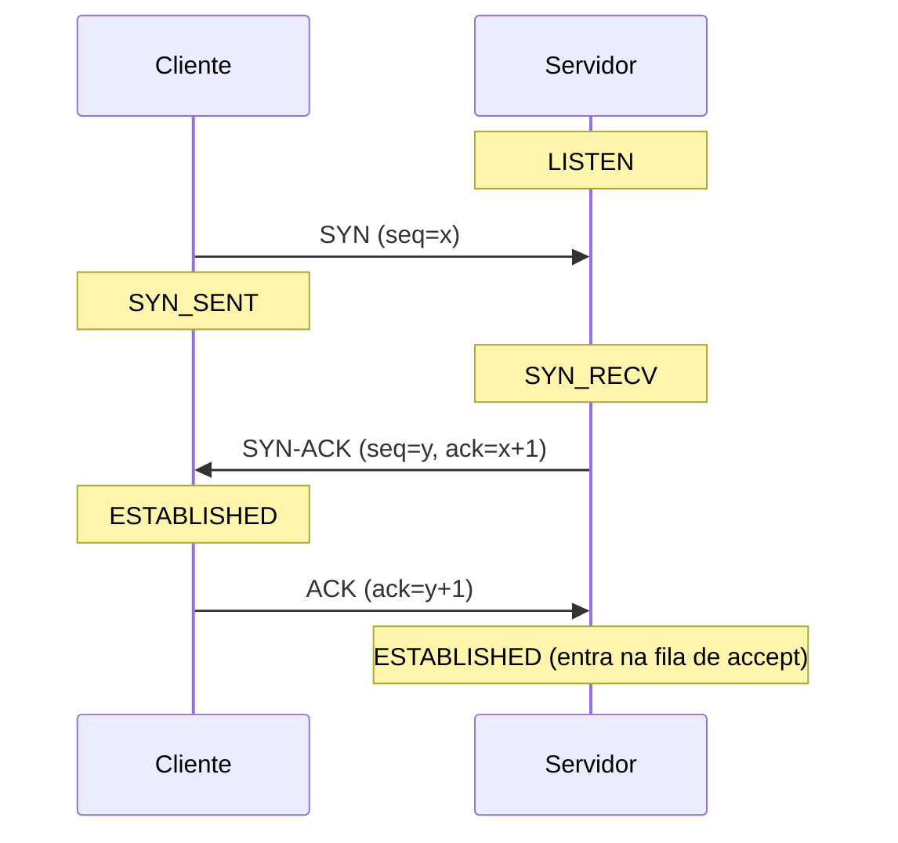

# 13 · TCP por dentro — estados, handshake, TIME_WAIT e backlog

**Nível:** avançado · **Última atualização:** 14/08/2026
Todas as saídas de `ss` e os experimentos deste arquivo foram **executados** em
Ubuntu 22.04.5, kernel 6.8.0-136, em 14/08/2026.

---

## Por que este arquivo existe

Porque 80 % dos problemas reais com portas são problemas de **estado do TCP**, e a maioria
das pessoas conhece só dois estados: `LISTEN` e `ESTABLISHED`. Os outros dez são onde moram
os bugs.

Ao final, você deve conseguir olhar um histograma de `ss -tan` e dizer, sem hesitar, onde
está o defeito.

---

## 1. Os doze estados

O RFC 793 define 11 estados; o Linux tem um décimo segundo (`NEW_SYN_RECV`, interno).
Estes são os valores literais que o kernel grava em `/proc/net/tcp`, em hexadecimal:

| Hex | Nome | Quem está nele | Dura quanto |
|---|---|---|---|
| `01` | `ESTABLISHED` | Conexão ativa, os dois lados | O que a conversa durar |
| `02` | `SYN_SENT` | Cliente que mandou SYN e espera | Até ~1 min (retransmissões) |
| `03` | `SYN_RECV` | Servidor que recebeu SYN e respondeu | Segundos |
| `04` | `FIN_WAIT1` | Quem fechou e espera o ACK do FIN | Segundos |
| `05` | `FIN_WAIT2` | Quem fechou, recebeu ACK, espera o FIN do outro | `tcp_fin_timeout`, 60 s |
| `06` | `TIME_WAIT` | **Quem fechou primeiro**, esperando pacotes atrasados | **60 s no Linux, fixo** |
| `07` | `CLOSE` | Fechado. Você não vê. | — |
| `08` | `CLOSE_WAIT` | **O outro fechou e seu código não chamou `close()`** | **Para sempre** ⚠️ |
| `09` | `LAST_ACK` | Você fechou depois do outro, espera o ACK final | Segundos |
| `0A` | `LISTEN` | Socket passivo esperando conexões | Enquanto o serviço viver |
| `0B` | `CLOSING` | Os dois fecharam ao mesmo tempo (raro) | Segundos |
| `0C` | `NEW_SYN_RECV` | Interno do Linux (SYN cookies) | — |

Esses valores estão implementados no [projeto-modelo](07-projeto-modelo/README.md),
`inventario.py`, e há um teste garantindo que os 12 estão cobertos.

---

## 2. O handshake de três vias



### Por que três vias, e não duas?

Porque cada lado precisa saber que **o seu próprio número de sequência inicial foi
recebido**. Dois pacotes bastariam para o cliente saber que o servidor o ouviu, mas não o
contrário. Três é o mínimo — e o problema geral, provado insolúvel, é o dos **dois generais**
(ver [`60-teoria-avancada.md`](60-teoria-avancada.md)).

### Um detalhe que vale ouro

**O kernel completa o handshake sozinho.** A aplicação não é consultada. Quando ela chama
`accept()`, a conexão já está pronta há algum tempo, na fila.

Isso significa que, do ponto de vista do cliente, a conexão "funcionou" mesmo que o servidor
esteja travado e nunca chame `accept()`. Foi exatamente o que o experimento de backlog
mostrou — ver a seção 5.

---

## 3. Os três desfechos, do ponto de vista dos pacotes

| Você manda | Volta | Estado | Interpretação |
|---|---|---|---|
| SYN | **SYN-ACK** | aberta | Existe socket em LISTEN |
| SYN | **RST** | fechada | A máquina existe; ninguém escuta ali |
| SYN | **nada** | filtrada | Alguém descartou (DROP) |
| SYN | ICMP tipo 3 código 13 | filtrada | Um roteador recusou administrativamente |

**`nmap --reason` mostra exatamente essa coluna:**

```
PORT   STATE    SERVICE  REASON
22/tcp open     ssh      syn-ack ttl 64
23/tcp closed   telnet   reset ttl 64
25/tcp filtered smtp     no-response
```

E é por isso que varrer um alvo com firewall é **lento**: cada porta filtrada custa o
timeout inteiro, porque não há nada para receber.

### O que o `nmap -sS` faz de diferente

O SYN scan manda o SYN, recebe o SYN-ACK, e responde com **RST** em vez de ACK. A conexão
nunca se completa.

Vantagens: mais rápido (um pacote a menos), e não gera log de conexão na aplicação — o
`accept()` nunca acontece. Por isso era chamado de "stealth scan" nos anos 1990.

Hoje **não é discreto**: qualquer IDS moderno reconhece o padrão em segundos. O nome
pegou e ficou.

---

## 4. `TIME_WAIT` — o estado mais incompreendido

### O experimento

```python
srv = socket.socket()
srv.setsockopt(socket.SOL_SOCKET, socket.SO_REUSEADDR, 1)
srv.bind(("127.0.0.1", 0)); srv.listen(1)
porta = srv.getsockname()[1]
cli = socket.socket(); cli.connect(("127.0.0.1", porta))
conn, _ = srv.accept()
conn.close()          # o SERVIDOR fecha primeiro
cli.close(); srv.close()
```

**Saída real:**

```
State     Recv-Q Send-Q Local Address:Port  Peer Address:Port
TIME-WAIT 0      0          127.0.0.1:33527    127.0.0.1:48654

sem SO_REUSEADDR: [Errno 98] Address already in use
com SO_REUSEADDR: bind+listen OK
```

### As três regras do `TIME_WAIT`

**1. Fica com quem fecha primeiro.** Não é do servidor nem do cliente por natureza — é de
quem manda o primeiro FIN. Num servidor HTTP sem keep-alive, o servidor fecha, e o
`TIME_WAIT` acumula **no servidor**. Com keep-alive, o cliente costuma fechar, e o
acúmulo vai para o cliente.

**2. Dura 2×MSL.** *MSL* é *Maximum Segment Lifetime*, o tempo máximo que um segmento pode
vagar pela rede. O RFC 793 sugere 2 minutos, o que daria 4 minutos de `TIME_WAIT`.
**O Linux usa 60 segundos, fixo, não configurável** (`TCP_TIMEWAIT_LEN` em
`include/net/tcp.h`). Para mudar, é preciso recompilar o kernel — e não, o
`tcp_fin_timeout` **não** controla isso, apesar de metade da internet afirmar que sim.

**3. Existe por dois motivos, não um:**

- **Pacotes atrasados.** Se a quádrupla fosse reutilizada imediatamente, um segmento
  perdido da conexão velha poderia chegar e ser aceito pela nova. Dados corrompidos em
  silêncio — o pior tipo de bug.
- **Confirmar o fechamento.** Se o ACK final se perder, o outro lado retransmite o FIN.
  Alguém precisa estar lá para responder. Quem está é o `TIME_WAIT`.

### `SO_REUSEADDR` — o que é e o que não é

Diz ao kernel: *"deixe eu fazer `bind` neste endereço local mesmo havendo um `TIME_WAIT`"*.

- **É seguro** para um servidor reiniciando. As proteções contra pacote atrasado continuam
  valendo pela sequência.
- **Não é** o mesmo que `SO_REUSEPORT`.

| Opção | Faz |
|---|---|
| `SO_REUSEADDR` | Permite `bind` apesar de `TIME_WAIT` |
| `SO_REUSEPORT` (Linux 3.9+, 2013) | Permite **vários processos** escutando no **mesmo** (IP, porta), com o kernel balanceando entre eles |

`SO_REUSEPORT` é o que permite nginx e Envoy rodarem N processos na porta 443 sem um
distribuidor central. É uma das melhorias mais úteis da década em desempenho de servidor —
e uma exceção real à regra "uma porta, um dono".

### Quando `TIME_WAIT` vira problema de verdade

Só quando você faz **muitas conexões de saída para o mesmo destino**. A conta:

```
28.232 portas efêmeras ÷ 60 s de TIME_WAIT ≈ 470 conexões novas/s para o mesmo (IP, porta)
```

Acima disso, `EADDRNOTAVAIL`. A faixa desta máquina foi verificada:

```
$ cat /proc/sys/net/ipv4/ip_local_port_range
32768	60999          → 28232 portas
```

**As correções, em ordem de qualidade:**

1. **Use keep-alive / pool de conexões.** Elimina o problema. As outras apenas o adiam.
2. `net.ipv4.tcp_tw_reuse=1` — reaproveita `TIME_WAIT` para conexões **de saída**. Seguro.
3. Ampliar `ip_local_port_range`. Ganha ~1,3×.
4. Mais IPs de origem.

⚠️ **`tcp_tw_recycle` foi REMOVIDO do kernel na versão 4.12 (2017).** Ele quebrava clientes
atrás de NAT de forma silenciosa e intermitente — o pior modo de falha possível. Qualquer
material que ainda o recomende é anterior a 2017; use isso como teste de frescor.

---

## 5. `CLOSE_WAIT` — o único estado que acusa o seu código

```
$ ss -tan | awk 'NR>1{print $1}' | sort | uniq -c | sort -rn
   1524 TIME-WAIT
     33 LISTEN
     29 ESTAB
     14 CLOSE-WAIT
```

`CLOSE_WAIT` significa: **o outro lado mandou FIN, o seu kernel respondeu com ACK, e o seu
programa não chamou `close()`**.

O kernel não pode resolver sozinho: ele não sabe se a aplicação ainda quer ler os bytes
que sobraram no buffer. Então o socket fica lá. **Para sempre.**

| | `TIME_WAIT` | `CLOSE_WAIT` |
|---|---|---|
| Causa | TCP funcionando corretamente | **Bug no seu código** |
| Duração | 60 s, some sozinho | Indefinida |
| De quem é a culpa | De ninguém | Sua |
| Como resolver | Keep-alive, `tcp_tw_reuse` | **Chamar `close()`** |
| Consequência | Esgotamento de porta efêmera | Vazamento de descritor → `Too many open files` |

**Diagnóstico:**

```bash
ss -tanp state close-wait | head -20        # quem são
ls /proc/<PID>/fd | wc -l                   # quantos descritores o processo tem
cat /proc/<PID>/limits | grep 'open files'  # qual é o limite
```

**Causa quase sempre a mesma:** um caminho de exceção que abandona o socket. A correção
idiomática por linguagem:

```python
with socket.socket() as s:      # Python
    ...
```
```go
defer conn.Close()              // Go
```
```java
try (Socket s = new Socket()) { ... }   // Java
```

---

## 6. `LISTEN` e o backlog — o experimento que explica `Recv-Q`

```python
srv.listen(2)                       # backlog de apenas 2
# ... seis clientes tentam conectar, e ninguém chama accept()
```

**Saída real:**

```
conexão 1: aceita pelo kernel
conexão 2: aceita pelo kernel
conexão 3: aceita pelo kernel
conexão 4: TimeoutError timed out
conexão 5: TimeoutError timed out
conexão 6: TimeoutError timed out

State  Recv-Q Send-Q Local Address:Port
LISTEN 3      2          127.0.0.1:46189
```

Três lições, todas verificáveis acima:

1. **`listen(2)` aceitou 3.** O Linux usa `backlog + 1` como capacidade efetiva. Está no
   `man 2 listen`, e é o tipo de detalhe que só aparece quando você mede.
2. **`Recv-Q` num `LISTEN` é o tamanho da fila (3); `Send-Q` é o backlog configurado (2).**
   Não são bytes. Essas colunas mudam de significado conforme o estado — a coisa menos
   documentada e mais útil do `ss`.
3. **As conexões 4–6 deram timeout, não "recusada".** Com a fila cheia, o Linux **descarta
   o SYN em silêncio**. O cliente retransmite, achando que houve perda. É o comportamento
   certo: recusar seria dizer "não existe serviço", e existe — só está ocupado.

### As duas filas

O kernel mantém **duas** filas por socket em `LISTEN`:

| Fila | Nome | Contém | Limite |
|---|---|---|---|
| SYN queue | *incomplete* | Handshakes em andamento (`SYN_RECV`) | `net.ipv4.tcp_max_syn_backlog` |
| Accept queue | *complete* | Prontas, esperando `accept()` | `min(backlog, net.core.somaxconn)` |

**Isso importa em produção:** se seu servidor pede `listen(4096)` mas `somaxconn` é 128, o
backlog efetivo é 128. Sob rajada, você perde conexões e não entende por quê.

```bash
sysctl net.core.somaxconn net.ipv4.tcp_max_syn_backlog
ss -tln          # a coluna Send-Q mostra o backlog EFETIVO, não o pedido
```

### SYN flood e SYN cookies

Um atacante manda milhares de SYNs e nunca completa. A SYN queue enche, e conexões legítimas
são recusadas — negação de serviço com custo quase zero para o atacante.

A defesa, inventada por Dan Bernstein em 1996: **SYN cookies**. Quando a fila enche, o
servidor **não guarda estado**. Ele codifica as informações necessárias no próprio número
de sequência inicial do SYN-ACK. Se o ACK voltar, o servidor reconstrói o estado a partir do
número. Sem estado, não há fila para encher.

```bash
sysctl net.ipv4.tcp_syncookies      # 1 = ligado. Deixe ligado.
```

Custo: com cookies ativos, algumas opções de TCP negociadas no SYN se perdem (escala de
janela, SACK). Por isso os cookies só entram em ação **quando a fila enche** — é uma defesa
de emergência, não o modo normal.

---

## 7. Ler `ss -ti` — a telemetria escondida

```bash
ss -ti
```

Saída real, uma conexão:

```
cubic wscale:7,7 rto:201 rtt:0.216/0.083 ato:40 mss:1448 cwnd:10
bytes_sent:135 bytes_acked:136 bytes_received:478 segs_out:9 segs_in:8
send 536Mbps lastsnd:68651 lastrcv:68649 pacing_rate 1.07Gbps
delivery_rate 51Mbps rcv_space:14480 minrtt:0.215
```

| Campo | O que é | Como usar |
|---|---|---|
| `cubic` | Algoritmo de controle de congestionamento | `bbr` costuma ser melhor em rede com perda |
| `rtt:0.216/0.083` | Tempo de ida e volta / variação, em ms | Latência real medida, por conexão |
| `minrtt` | O menor RTT já visto | O piso físico do caminho |
| `cwnd:10` | Janela de congestionamento, em segmentos | Se está baixa e não cresce, há perda |
| `retrans:X/Y` | Retransmissões atuais/totais | **> 0 e crescendo = perda de pacote** |
| `rto` | Timeout de retransmissão, ms | Deriva do RTT |
| `delivery_rate` | Vazão realmente entregue | Compare com `send` |
| `bytes_acked` | Bytes confirmados pelo outro lado | |

Isto é telemetria de qualidade de produto pago, disponível de graça, por conexão, num
comando. Quase ninguém usa.

**Aplicação prática:** "a aplicação está lenta". Rode `ss -ti` nas conexões dela. Se
`retrans` está subindo e `cwnd` está travada em valor baixo, o problema é perda na rede, e
nenhuma otimização de código vai resolver.

---

## 8. Diagnóstico por histograma — a tabela de bolso

```bash
ss -tan | awk 'NR>1{print $1}' | sort | uniq -c | sort -rn
```

| Estado dominante | Diagnóstico | Onde olhar |
|---|---|---|
| `TIME-WAIT` alto | Muitas conexões curtas fechadas por você | Ative keep-alive. Se for saída, veja esgotamento de porta. |
| `CLOSE-WAIT` alto e **crescendo** | **Bug: falta `close()` no seu código** | Caminho de exceção, pool de conexões |
| `SYN-SENT` alto | Você tenta conectar e não recebe resposta | Firewall, destino fora do ar, DNS resolvendo errado |
| `SYN-RECV` alto | Muita conexão meio-aberta chegando | SYN flood, ou backlog pequeno demais |
| `FIN-WAIT-2` alto | Você fechou, o outro não responde | Cliente sumindo sem encerrar (móvel, NAT com timeout curto) |
| `ESTAB` alto e constante | Normal — ou conexões que nunca fecham | Cheque se há timeout de ociosidade configurado |
| `LAST-ACK` acumulando | Seu FIN não está sendo confirmado | Perda na rede, ou o outro lado travou |

---

## 9. Ver acontecer

```bash
# Terminal 1
sudo tcpdump -i lo -nn 'port 8099'

# Terminal 2
python3 -m http.server 8099 --bind 127.0.0.1 &
curl -s http://127.0.0.1:8099/ > /dev/null
```

Você verá, em sequência: `[S]`, `[S.]`, `[.]` (o handshake), depois `[P.]` com os dados, e
`[F.]`/`[.]` no fechamento. É este arquivo inteiro em oito linhas de saída.

**Não executado** neste material: `tcpdump` exige root e não havia `sudo` disponível no
ambiente de escrita. O restante deste arquivo foi executado.

---

## Autoteste

1. Quem fica em `TIME_WAIT`: o cliente ou o servidor? De que depende?
2. Quanto tempo dura `TIME_WAIT` no Linux, e qual parâmetro **não** o controla (apesar de
   metade da internet dizer que sim)?
3. `CLOSE_WAIT` acumulando aponta o defeito para onde — rede, outro lado, ou seu código?
   Por que o kernel não pode resolver sozinho?
4. `listen(2)` aceitou três conexões antes de travar. Explique.
5. Numa linha `LISTEN`, o que são `Recv-Q` e `Send-Q`? E numa `ESTABLISHED`?
6. Por que a quarta conexão do experimento deu **timeout** em vez de "recusada"? Por que
   esse é o comportamento certo?
7. Qual a diferença entre `SO_REUSEADDR` e `SO_REUSEPORT`? Qual deles permite dois processos
   na mesma porta?
8. O que são SYN cookies, que problema resolvem, e qual o preço de usá-los?
9. `ss -ti` mostra `retrans:8/143` e `cwnd:2`. O que está acontecendo, e adianta otimizar
   o código da aplicação?
10. Você pediu `listen(4096)` e `ss -tln` mostra `Send-Q 128`. Por quê?

---

*Próximo: [`14-udp-e-os-outros.md`](14-udp-e-os-outros.md) — UDP, ICMP, SCTP e QUIC.*
