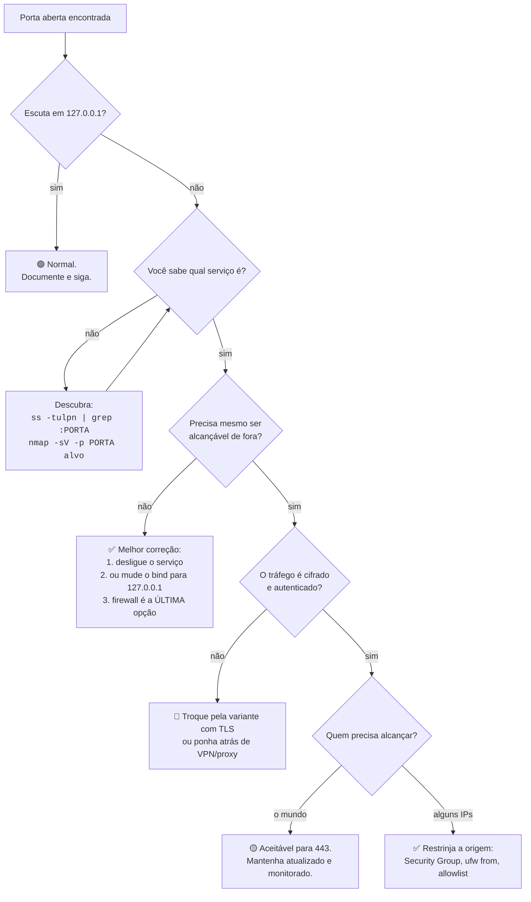

# 16 · Catálogo de portas — quais são, para que servem, qual o protocolo

**Nível:** referência · **Última atualização:** 14/08/2026
Registro oficial: [IANA — Service Name and Transport Protocol Port Number Registry](https://www.iana.org/assignments/service-names-port-numbers),
consultado em 14/08/2026 (atualizado pela IANA em 11/08/2026).

---

## Como ler este catálogo

Cada entrada traz **quatro** informações, e a quarta é a que falta em toda tabela de portas
que você encontra por aí:

| Coluna | O que é |
|---|---|
| **Porta / transporte** | O número e se é TCP, UDP, ou os dois |
| **Protocolo de aplicação** | A língua falada ali dentro |
| **Para que serve** | Em uma frase |
| **Risco se exposta** | 🔴 alto · 🟡 médio · 🟢 baixo — **para rede não confiável** |

**A coluna de risco pressupõe exposição à internet ou a uma rede não confiável.**
Qualquer serviço escutando apenas em `127.0.0.1` é 🟢, sempre. O risco não está no número da
porta: está no par **(número, quem alcança)**. Essa é a tese do
[projeto-modelo](07-projeto-modelo/README.md) e vale para o catálogo inteiro.

**Aviso de honestidade:** os números aqui são os registrados e/ou os de uso consagrado.
Nenhum deles é obrigatório. Um serviço pode rodar em qualquer porta, e o número **nunca**
prova o que está do outro lado — só `-sV` ou uma conversa direta provam.

---

## 1. As 15 que você precisa saber de cor

Se você memorizar só uma tabela deste curso, memorize esta.

| Porta | Transp. | Protocolo | Serve para | Risco |
|---|---|---|---|---|
| **22** | TCP | SSH | Terminal remoto, SFTP, túneis | 🟡 |
| **53** | **UDP e TCP** | DNS | Traduzir nome ↔ IP | 🔴 |
| **80** | TCP | HTTP | Web sem criptografia | 🟡 |
| **443** | TCP | HTTP/1.1 e HTTP/2 sobre TLS | Web cifrada | 🟢 |
| **443** | **UDP** | **HTTP/3 sobre QUIC** | **Web cifrada — outro transporte** | 🟢 |
| **25** | TCP | SMTP | E-mail entre servidores | 🟡 |
| **587** | TCP | SMTP (submission) | E-mail: cliente → servidor | 🟡 |
| **993** | TCP | IMAPS | Ler e-mail, cifrado | 🟡 |
| **445** | TCP | SMB | Compartilhar arquivos (Windows) | 🔴 |
| **3389** | TCP | RDP | Área de trabalho remota Windows | 🔴 |
| **3306** | TCP | MySQL | Banco MySQL/MariaDB | 🔴 |
| **5432** | TCP | PostgreSQL | Banco PostgreSQL | 🔴 |
| **6379** | TCP | RESP | Redis | 🔴 |
| **27017** | TCP | MongoDB Wire | MongoDB | 🔴 |
| **123** | UDP | NTP | Sincronizar relógio | 🟡 |

**O padrão que atravessa a tabela:** tudo 🔴 é banco de dados ou acesso remoto. Nenhum
deles deveria estar acessível pela internet, jamais, em circunstância nenhuma. Quando estão,
é sempre por engano — nunca por decisão.

---

## 2. Web e proxies

| Porta | Transp. | Protocolo | Serve para | Risco |
|---|---|---|---|---|
| 80 | TCP | HTTP | Web em claro. Hoje serve quase só para redirecionar para 443 | 🟡 |
| 443 | TCP | HTTP/TLS | Web cifrada (HTTP/1.1, HTTP/2) | 🟢 |
| 443 | UDP | HTTP/3 (QUIC) | Web cifrada sobre QUIC | 🟢 |
| 8080 | TCP | HTTP | "HTTP alternativo": Tomcat, proxies, app sem privilégio | 🟡 |
| 8443 | TCP | HTTPS | HTTPS alternativo | 🟢 |
| 8000 | TCP | HTTP | `python -m http.server`, Django | 🟡 |
| 3000 | TCP | HTTP | Node/Express, Rails, Grafana | 🟡 |
| 5000 | TCP | HTTP | Flask, .NET dev, registry Docker. **No macOS: AirPlay** | 🟡 |
| 4200 | TCP | HTTP | Angular dev server | 🟡 |
| 5173 | TCP | HTTP | Vite dev server | 🟡 |
| 8081 | TCP | HTTP | Nexus, alternativa comum | 🟡 |
| 3128 | TCP | HTTP proxy | Squid | 🔴 |
| 1080 | TCP | SOCKS5 | Proxy SOCKS | 🔴 |
| 9050 | TCP | SOCKS5 | Tor | 🟡 |
| 8888 | TCP | HTTP | Jupyter Notebook, proxies | 🔴 |

⚠️ **Proxy aberto (3128, 1080, 8080) é 🔴** não porque te ataca, mas porque terceiros o usam
para atacar outros **em seu nome**. Você aparece como origem no log da vítima. É a forma mais
rápida de o seu IP entrar em lista de bloqueio.

---

## 3. Acesso remoto e transferência

| Porta | Transp. | Protocolo | Serve para | Risco |
|---|---|---|---|---|
| **22** | TCP | SSH | Shell, SFTP, SCP, túneis, `git+ssh` | 🟡 |
| 23 | TCP | Telnet | Shell **sem criptografia** | 🔴🔴 |
| 21 | TCP | FTP (controle) | Transferência, senha em claro | 🔴 |
| 20 | TCP | FTP (dados) | Canal de dados, modo ativo | 🔴 |
| 989/990 | TCP | FTPS | FTP sobre TLS | 🟡 |
| 69 | UDP | TFTP | FTP trivial, **sem autenticação**. Boot de rede | 🔴 |
| 3389 | TCP | RDP | Área de trabalho Windows | 🔴 |
| 5900–5905 | TCP | RFB | VNC. Senha de 8 caracteres, sem cifra | 🔴 |
| 5985 | TCP | WinRM/HTTP | Gestão remota Windows | 🔴 |
| 5986 | TCP | WinRM/HTTPS | Idem, com TLS | 🟡 |
| 873 | TCP | rsync | Sincronização de arquivos | 🔴 |
| 1194 | UDP | OpenVPN | VPN | 🟡 |
| 51820 | UDP | WireGuard | VPN moderna | 🟢 |
| 500 / 4500 | UDP | IKE / IPsec NAT-T | VPN IPsec | 🟡 |

🔴🔴 **Telnet na porta 23 merece dois círculos.** Ele transmite login e senha em texto
legível. Foi o vetor da botnet **Mirai** em 2016, que derrubou o Dyn e boa parte da web
americana usando câmeras e roteadores com senha padrão. Se você encontrar a 23 aberta em
2026, o serviço não deve ser protegido — deve ser **desligado**.

---

## 4. E-mail

| Porta | Transp. | Protocolo | Serve para | Risco |
|---|---|---|---|---|
| 25 | TCP | SMTP | Servidor → servidor (MTA a MTA) | 🟡 |
| 587 | TCP | SMTP submission + STARTTLS | **Cliente → servidor.** RFC 6409 | 🟡 |
| 465 | TCP | SMTPS | Cliente → servidor, TLS implícito | 🟡 |
| 110 | TCP | POP3 | Baixar e-mail (em claro) | 🔴 |
| 995 | TCP | POP3S | POP3 com TLS | 🟡 |
| 143 | TCP | IMAP | Ler e-mail no servidor (em claro) | 🔴 |
| 993 | TCP | IMAPS | IMAP com TLS | 🟡 |
| 4190 | TCP | ManageSieve | Regras de filtragem | 🟡 |

**A confusão eterna 25 × 587 × 465**, resolvida:

- **25** é para **servidores** conversarem entre si. Praticamente todo provedor residencial e
  toda nuvem **bloqueia a saída na 25** — é a medida antisspam mais eficaz já implantada.
  Se você não roda um servidor de e-mail, nunca deve usá-la.
- **587** é para **seu cliente** entregar mensagens ao seu servidor, com autenticação e
  STARTTLS. É a porta certa para configurar no Thunderbird.
- **465** foi registrada para SMTPS, depois *desregistrada*, depois **re-registrada** pelo
  RFC 8314 (2018), que passou a recomendar TLS implícito. É um dos poucos números que
  voltaram do mundo dos mortos.

---

## 5. Bancos de dados — todos 🔴, sem exceção

| Porta | Transp. | Sistema | Observação |
|---|---|---|---|
| 3306 | TCP | MySQL / MariaDB | Entrega a versão exata no banner, antes da autenticação |
| 33060 | TCP | MySQL X Protocol | Protocolo novo, baseado em Protobuf |
| 5432 | TCP | PostgreSQL | |
| 6379 | TCP | Redis | **Sem senha por padrão até a versão 6** |
| 27017 | TCP | MongoDB | **Sem autenticação por padrão até a 3.6** |
| 1433 | TCP | Microsoft SQL Server | |
| 1521 | TCP | Oracle TNS Listener | |
| 5984 | TCP | CouchDB | O "Couchpotato" de 2017 expôs milhares |
| 7000/9042 | TCP | Cassandra | |
| 9200/9300 | TCP | Elasticsearch | **Sem autenticação por padrão antes da 8.0** |
| 8086 | TCP | InfluxDB | |
| 11211 | TCP/UDP | memcached | UDP causou o DDoS de 1,35 Tbit/s de 2018 |
| 2379/2380 | TCP | etcd | **Contém os segredos do cluster Kubernetes** |
| 5601 | TCP | Kibana | Sem autenticação em versões antigas |
| 8123 | TCP | ClickHouse | |
| 26257 | TCP | CockroachDB | |

> **Regra sem exceção:** banco de dados escuta em `127.0.0.1` ou numa rede privada isolada.
> Nunca em `0.0.0.0` com IP público. Se a aplicação está em outra máquina, use rede privada,
> túnel ou VPN — não a internet.

O padrão histórico é constante: **as invasões em massa de bancos (MongoDB 2017, Elasticsearch
2019, Redis contínuo) não exploraram falha de código.** Exploraram serviços expostos com a
configuração padrão de uma época em que "padrão sem autenticação" era aceitável. Os
fornecedores mudaram os padrões; as instalações antigas seguem lá.

---

## 6. Infraestrutura de rede

| Porta | Transp. | Protocolo | Serve para | Risco |
|---|---|---|---|---|
| **53** | **UDP** | DNS | Consultas. UDP é o caminho normal | 🔴 |
| **53** | **TCP** | DNS | Respostas grandes, transferência de zona (AXFR) | 🔴 |
| 853 | TCP/UDP | DoT / DoQ | DNS sobre TLS / sobre QUIC | 🟢 |
| 443 | TCP | DoH | DNS sobre HTTPS — indistinguível de web | 🟢 |
| 67/68 | UDP | DHCP | Servidor / cliente | 🟡 |
| 123 | UDP | NTP | Relógio. Amplificação DDoS | 🟡 |
| 161/162 | UDP | SNMP | Monitoração. v1/v2c em claro | 🔴 |
| 514 | UDP | Syslog | Log remoto, sem autenticação | 🟡 |
| 179 | TCP | BGP | Roteamento entre sistemas autônomos | 🔴 |
| 520 | UDP | RIP | Roteamento legado | 🔴 |
| 1900 | UDP | SSDP/UPnP | Descoberta. Amplificação DDoS | 🔴 |
| 5353 | UDP | mDNS | Bonjour/Avahi. Multicast local | 🟢 |
| 5355 | UDP | LLMNR | Resolução Windows. **Alvo de Responder** | 🔴 |
| 137/138/139 | UDP/TCP | NetBIOS | Legado Windows | 🔴 |
| 445 | TCP | SMB | Arquivos Windows. EternalBlue/WannaCry | 🔴 |
| 88 | TCP/UDP | Kerberos | Autenticação em domínio | 🟡 |
| 389 | TCP/UDP | LDAP | Diretório, sem TLS | 🔴 |
| 636 | TCP | LDAPS | Diretório com TLS | 🟡 |
| 3268/3269 | TCP | Global Catalog | Active Directory | 🟡 |
| 4789 | UDP | VXLAN | Rede sobreposta de nuvem/container | 🟡 |
| 6081 | UDP | Geneve | Idem, mais moderno | 🟡 |

⚠️ **LLMNR e NetBIOS (5355, 137) são a base do ataque mais comum em rede corporativa
Windows.** A ferramenta `Responder` finge ser o serviço que resolve nomes, recebe os hashes
NTLM das máquinas que perguntam, e os quebra ou repassa. Desabilitar LLMNR e NBT-NS por
política de grupo é uma das medidas de melhor custo-benefício que existem em segurança de
Active Directory.

---

## 7. Containers, orquestração e nuvem

| Porta | Transp. | Serviço | Observação | Risco |
|---|---|---|---|---|
| **2375** | TCP | Docker API **sem TLS** | **Equivale a root remoto sem senha** | 🔴🔴 |
| 2376 | TCP | Docker API com TLS mútuo | | 🔴 |
| 6443 | TCP | Kubernetes API server | | 🔴 |
| 10250 | TCP | kubelet API | **Executa comandos nos pods** | 🔴🔴 |
| 10255 | TCP | kubelet read-only | Descontinuado, ainda encontrado | 🔴 |
| 2379/2380 | TCP | etcd | Todos os segredos do cluster | 🔴🔴 |
| 5000 | TCP | Docker Registry | | 🟡 |
| 8001 | TCP | kubectl proxy | | 🔴 |
| 9090 | TCP | Prometheus | **Sem autenticação por padrão** | 🔴 |
| 9100 | TCP | node_exporter | Expõe métricas detalhadas do host | 🔴 |
| 3000 | TCP | Grafana | | 🟡 |
| 8006 | TCP | Proxmox | | 🔴 |
| 9000 | TCP | Portainer / MinIO / SonarQube | | 🟡 |
| 4243 | TCP | Docker API (legado) | | 🔴 |

🔴🔴 **A porta 2375 é provavelmente a pior porta aberta que existe.** A API do Docker sem TLS
permite, sem nenhuma credencial: criar um container, montar `/` do host dentro dele, e obter
root. É um comando. Existem campanhas automatizadas que varrem a internet inteira procurando
por ela — e mineradores de criptomoeda implantados em minutos.

O mesmo vale para o **10250** (kubelet) e o **2379** (etcd).

---

## 8. Mensageria e streaming

| Porta | Transp. | Serviço | Risco |
|---|---|---|---|
| 5672 | TCP | AMQP (RabbitMQ) | 🔴 |
| 5671 | TCP | AMQP sobre TLS | 🟡 |
| 15672 | TCP | RabbitMQ Management (web) | 🔴 |
| 4369 | TCP | EPMD (Erlang) | **Revela as portas internas do cluster** | 🔴 |
| 9092 | TCP | Kafka | 🔴 |
| 2181 | TCP | ZooKeeper | 🔴 |
| 1883 | TCP | MQTT | 🔴 |
| 8883 | TCP | MQTT sobre TLS | 🟡 |
| 61616 | TCP | ActiveMQ | 🔴 |
| 4222 | TCP | NATS | 🔴 |

---

## 9. Automação industrial (OT/ICS) — categoria à parte

Estas portas merecem um bloco próprio porque os protocolos foram projetados, nos anos 1970
a 1990, para redes **fisicamente isoladas**. Quase nenhum tem autenticação **por projeto** —
não por descuido.

| Porta | Transp. | Protocolo | Usado por | Risco |
|---|---|---|---|---|
| 502 | TCP | Modbus/TCP | Praticamente toda a indústria | 🔴🔴 |
| 102 | TCP | S7comm (ISO-TSAP) | CLPs Siemens S7. **Alvo do Stuxnet** | 🔴🔴 |
| 20000 | TCP | DNP3 | Energia elétrica, saneamento | 🔴🔴 |
| 44818 | TCP/UDP | EtherNet/IP (CIP) | Rockwell / Allen-Bradley | 🔴🔴 |
| 47808 | UDP | BACnet | Automação predial, HVAC | 🔴 |
| 4840 | TCP | OPC UA | O padrão moderno — **tem** segurança | 🟡 |
| 34962–34964 | UDP | PROFINET | Automação Siemens | 🔴🔴 |
| 1962 | TCP | PCWorx | Phoenix Contact | 🔴🔴 |
| 5450 | TCP | OSIsoft PI | Historiador de processo | 🔴 |

⚠️ **No Modbus/TCP, "escrever no registrador 40001" é uma requisição sem autenticação
nenhuma.** Quem alcança a porta 502 comanda o equipamento. Não há senha para configurar,
porque o protocolo não prevê senha.

A defesa **não é** configurar o protocolo — é **segmentar a rede**: zonas e condutos
(IEC 62443), diodo de dados, nunca expor OT à TI e jamais à internet. O Shodan mantém
categorias específicas para esses protocolos, e o número de dispositivos industriais
diretamente acessíveis pela internet segue na casa das dezenas de milhares.

Se você trabalha com engenharia de processos, esta é a seção mais importante do curso.
Ver também [`sql`](../sql/00-MAPA.md) nesta pasta, no capítulo de engenharia química.

---

## 10. Portas históricas e curiosidades

| Porta | Serviço | Por que vale saber |
|---|---|---|
| **7** | Echo | Proposta na RFC 349, em **1972**. Ainda no `/etc/services`. |
| **9** | Discard | Idem. Descarta tudo o que recebe. Útil para teste de vazão. |
| 13 | Daytime | Devolve a hora em texto |
| 17 | QOTD | *Quote of the Day*. Sim, isso existiu |
| 19 | CHARGEN | Gera caracteres sem parar. **Arma de amplificação DDoS** |
| 37 | Time | Segundos desde 1900 |
| 79 | Finger | Quem está logado. **Vetor do Morris worm, 1988** |
| 111 | portmapper | Revela quais serviços RPC existem |
| 512/513/514 | rexec/rlogin/rsh | Os "r-commands" do BSD. Autenticação por confiança de host |
| 1337 | — | Não é registrada. Convenção de "elite" em CTF e malware |
| 31337 | — | Idem ("eleet"). Back Orifice usava |
| 4444 | — | Porta padrão de payload do Metasploit. **Aparecer é sinal de comprometimento** |

**Curiosidade útil:** as portas 7, 9, 13, 17 e 19 são os *"small services"*. Praticamente
nenhum sistema moderno os habilita, porque todos servem para amplificação de DDoS. Se você
encontrar um deles aberto, achou um sistema muito antigo ou muito mal configurado.

---

## 11. Portas de desenvolvimento — o maior risco cotidiano

| Porta | Ferramenta |
|---|---|
| 3000 | Node/Express, Rails, Grafana |
| 4200 | Angular CLI |
| 5000 | Flask, .NET |
| 5173 | Vite |
| 8000 | Django, `http.server` |
| 8080 | Tomcat, Spring Boot |
| 9229 | **Node.js debugger** ⚠️ |
| 5005 | **JDWP — debugger Java** ⚠️ |
| 5858 | Node inspector (legado) |

⚠️ **Portas de depuração são execução remota de código, por definição.** Um debugger
existe para parar o programa, ler memória e executar expressões arbitrárias. Ele **não tem
autenticação** porque presume que já se está dentro da máquina.

Um `node --inspect=0.0.0.0:9229` ou um JVM com `-agentlib:jdwp=...,address=*:5005` exposto
é comprometimento total, imediato e sem esforço. E isso acontece o tempo todo, porque
ambientes de "staging" copiam a configuração de desenvolvimento.

**Regra:** debugger escuta em `127.0.0.1`. Sempre. Se você precisa depurar remotamente, use
um túnel SSH — nunca abra a porta.

---

## 12. Como usar o `/etc/services`

Sua máquina já tem uma tabela local:

```bash
grep -E '^(ssh|http|https|mysql|postgresql)\b' /etc/services
```

**Saída real:**

```
ssh		22/tcp				# SSH Remote Login Protocol
http		80/tcp		www		# WorldWideWeb HTTP
https		443/tcp				# http protocol over TLS/SSL
https		443/udp				# HTTP/3
mysql		3306/tcp
postgresql	5432/tcp	postgres	# PostgreSQL Database
```

Repare: `https 443/udp # HTTP/3` já está lá. O arquivo acompanhou o QUIC.

Consultar programaticamente:

```python
socket.getservbyname("ssh", "tcp")     # 22
socket.getservbyport(3306, "tcp")      # 'mysql'
```

**Saída real** desta máquina para 22, 80, 443, 3306, 5432, 53, 25: `ssh`, `http`, `https`,
`mysql`, `postgresql`, `domain`, `smtp`.

⚠️ **O `/etc/services` é uma tabela de convenções, não uma leitura do sistema.** Ele diz
"o que costuma estar aí", nunca "o que está aí". Toda ferramenta que mostra nome de serviço
sem sondar (`ss` sem `-n`, `nmap` sem `-sV`, `netstat`) está apenas consultando essa tabela.
Esta máquina tem 361 linhas nele — a IANA tem milhares de registros.

---

## 13. Fluxograma: achei uma porta aberta. E agora?



---

## 14. Cartão de bolso — as 30 portas mais encontradas

```
   7 echo*        21 ftp          22 ssh         23 telnet🔴    25 smtp
  53 dns          67 dhcp         69 tftp🔴      80 http       110 pop3
 111 rpcbind🔴   123 ntp         135 msrpc🔴    137 netbios🔴  139 smb🔴
 143 imap        161 snmp🔴      389 ldap🔴     443 https      445 smb🔴
 465 smtps       514 syslog      587 submission 631 ipp        636 ldaps
 993 imaps       995 pop3s      1433 mssql🔴   1521 oracle🔴  1883 mqtt🔴
2049 nfs🔴      2375 docker🔴🔴 3306 mysql🔴   3389 rdp🔴     5432 postgres🔴
5672 amqp🔴     5900 vnc🔴      6379 redis🔴   6443 k8s🔴     8080 http-alt
9090 prometheus🔴 9200 elastic🔴 11211 memcached🔴 27017 mongo🔴 51820 wireguard
```

---

## Autoteste

1. A porta 443 aparece duas vezes na tabela das 15 essenciais. Por quê, e por que isso
   **não** é um conflito?
2. Um servidor tem 3306 aberta em `0.0.0.0`. Outro tem 3306 em `127.0.0.1`. Mesmo número,
   mesmo serviço. Por que só um é 🔴?
3. Explique a diferença entre as portas 25, 587 e 465. Qual você configura no cliente de
   e-mail, e por que a 25 costuma estar bloqueada na saída?
4. Por que a porta 2375 é considerada pior que a 3306, se as duas são 🔴?
5. Por que os protocolos industriais (502, 102, 20000) não têm autenticação? Qual é a defesa
   correta, já que não é configurar senha?
6. O que são as "small services" (7, 9, 13, 17, 19) e por que sistemas modernos as desligam?
7. Você encontra a porta 9229 aberta em `0.0.0.0` num servidor de staging. Qual é a
   gravidade e por quê?
8. `ss` sem `-n` mostrou "ssh" ao lado da porta 22. Isso prova que há um servidor SSH ali?
   De onde vem esse nome?
9. Cite três portas 🔴 que são bancos de dados e diga o que todas as invasões em massa
   desses bancos tiveram em comum.

---

*Próximo: [`17-descoberta-e-varredura.md`](17-descoberta-e-varredura.md) — como descobrir tudo isso.*
