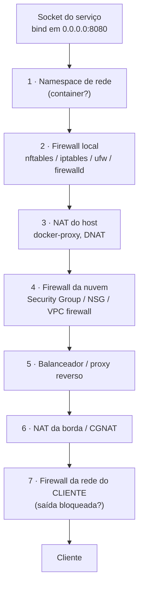
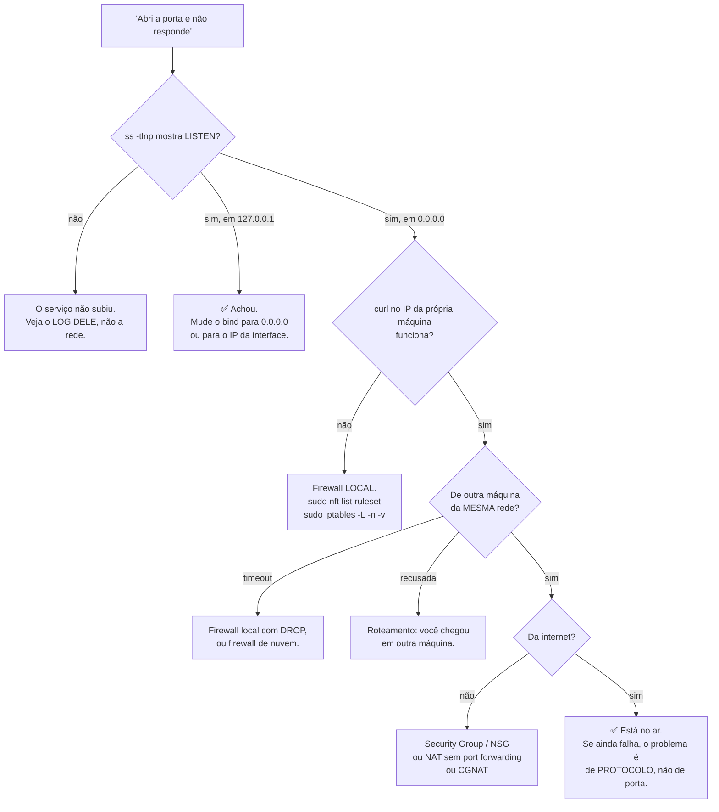

# 18 · Firewall, NAT e o caminho — por que a porta que você abriu não responde

**Nível:** intermediário a avançado · **Última atualização:** 14/08/2026
Os comandos de `iptables`/`nft` deste arquivo **não foram executados** (exigem root, que não
estava disponível no ambiente de escrita). Vêm da documentação oficial citada no
[`95-referencias.md`](95-referencias.md).

---

## O problema que este arquivo resolve

Você abriu o serviço. `ss` confirma `LISTEN 0.0.0.0:8080`. De outra máquina, nada. E agora?

A resposta não é um comando — é um **caminho**. Entre o seu socket e o cliente existem, num
ambiente moderno, entre três e sete pontos onde o pacote pode morrer. Este arquivo enumera
todos, na ordem em que devem ser checados.

---

## 1. O caminho completo, do socket ao cliente



**A ordem de verificação é a inversa da intuição.** Quase todo mundo começa pelo 2 (firewall
local). A ordem que resolve mais rápido:

| Passo | Pergunta | Comando |
|---|---|---|
| **0** | O serviço está mesmo em `0.0.0.0` e não em `127.0.0.1`? | `ss -tlnp \| grep :8080` |
| 1 | Está em outro namespace? | `sudo lsns -t net` · `docker ps` |
| 2 | Firewall local bloqueia? | `sudo nft list ruleset` · `sudo ufw status` |
| 4 | Security Group libera? | Console da nuvem |
| 7 | A rede do cliente deixa **sair** naquela porta? | Teste de outro lugar |

O passo 0 resolve, sozinho, cerca de metade dos casos. Custa três segundos.

---

## 2. Firewall — os quatro estados de um pacote

| Ação | O que o kernel faz | O que o cliente vê | `nmap` diz |
|---|---|---|---|
| **ACCEPT** | Entrega ao socket | Conecta ou "recusada" | aberta/fechada |
| **DROP** | Descarta em silêncio | **Timeout** | filtrada |
| **REJECT** | Descarta e avisa por ICMP ou RST | "Recusada", rápido | fechada |
| (sem socket) | Kernel devolve RST | "Recusada", rápido | fechada |

### DROP ou REJECT? O trade-off real

| | DROP | REJECT |
|---|---|---|
| Revela que a máquina existe | Não | **Sim** |
| Varredura contra você | **Lenta** (paga timeout) | Rápida |
| Sua aplicação, ao errar o alvo | **Trava por 30–120 s** | Falha na hora |
| Diagnóstico | Difícil | Fácil |

**Recomendação profissional, declarada como opinião:**

- **Na borda (internet):** `DROP`. Não dê confirmação de existência de graça, e faça a
  varredura custar tempo.
- **Dentro da rede interna:** `REJECT`. O ganho de "esconder" é nulo entre máquinas suas, e
  o custo em tempo de diagnóstico é enorme. Uma aplicação que trava 60 s esperando um
  timeout em vez de falhar em 1 ms é um incidente que se propaga.

Já vi mais tempo perdido por `DROP` interno mal colocado do que atacante detido por ele.

---

## 3. `nftables` e `iptables` — o mínimo operacional

### Ver o que existe

```bash
sudo nft list ruleset                       # nftables (moderno)
sudo iptables -L -n -v --line-numbers       # filtro
sudo iptables -t nat -S                     # ← o comando que revela REDIRECT/DNAT
sudo ufw status verbose                     # Ubuntu
sudo firewall-cmd --list-all                # RHEL/Fedora
```

**`sudo iptables -t nat -S` é o comando mais importante deste arquivo.** É ele que responde
"por que o `nmap` vê uma porta que o `ss` não vê" — o caso real documentado no
[`17`](17-descoberta-e-varredura.md).

### As cadeias e a ordem

```
Pacote que CHEGA para esta máquina:
   PREROUTING (nat)  →  INPUT (filter)  →  processo
        ↑                     ↑
    DNAT/REDIRECT       ACCEPT/DROP/REJECT

Pacote que ATRAVESSA (roteador/container):
   PREROUTING (nat)  →  FORWARD (filter)  →  POSTROUTING (nat)
                                                  ↑
                                              SNAT/MASQUERADE
```

**Duas consequências que explicam mistérios reais:**

1. O `PREROUTING` age **antes** de o pacote encontrar qualquer socket. Um `REDIRECT` ali
   faz a conexão completar sem que exista processo escutando.
2. Um `DROP` no `INPUT` faz o pacote sumir **sem que a aplicação saiba**. Nenhum log do
   serviço, nenhuma pista.

### Regras que valem decorar

```bash
# Abrir uma porta para TODOS (raramente é o que você quer)
sudo ufw allow 8080/tcp

# ✅ O jeito CERTO: abrir para uma origem específica
sudo ufw allow from 192.168.0.0/24 to any port 5432 proto tcp

# nftables equivalente
sudo nft add rule inet filter input ip saddr 192.168.0.0/24 tcp dport 5432 accept

# Ver contadores — a regra está sendo usada?
sudo iptables -L INPUT -n -v
```

**A coluna de contadores (`pkts`, `bytes`) é subutilizada.** Se uma regra tem 0 pacotes,
ela nunca casou — ou você a colocou depois de outra que já aceitou/negou tudo. Ordem importa:
o netfilter avalia de cima para baixo e para na primeira que casa.

---

## 4. NAT — por que sua porta de origem muda no caminho

**NAT** (*Network Address Translation*) reescreve endereços e **portas** nos pacotes que
atravessam.

### NAT de saída (SNAT / masquerade) — o do seu roteador doméstico

```
Sua máquina:  192.168.0.10:51234  →  142.250.79.14:443
                    ↓ o roteador reescreve
Na internet:  200.1.2.3:62001     →  142.250.79.14:443
```

O roteador mantém uma tabela de tradução e desfaz na volta. **Ele precisa reescrever a porta
de origem** porque várias máquinas internas podem usar o mesmo número — e é daí que vem o
nome alternativo **PAT** (*Port Address Translation*), que descreve melhor o que acontece.

**Consequência #1:** de fora, todas as suas máquinas parecem uma só.
**Consequência #2:** ninguém de fora consegue iniciar conexão para dentro, porque não existe
entrada na tabela. Isso é, acidentalmente, um firewall — e é a razão de a maioria das redes
domésticas ser razoavelmente segura por acidente.

### NAT de entrada (DNAT / port forwarding)

Para permitir conexões de fora, é preciso uma regra explícita:

```bash
sudo iptables -t nat -A PREROUTING -p tcp --dport 8080 -j DNAT --to-destination 192.168.0.10:80
```

É o "abrir porta no roteador". Note que ele traduz **duas** coisas: o IP e, opcionalmente, a
porta. A 8080 externa pode virar a 80 interna.

### CGNAT — por que você não consegue abrir porta no seu provedor

Muitos provedores residenciais (e praticamente toda operadora móvel) usam **CGNAT**
(*Carrier-Grade NAT*, RFC 6598): você não recebe um IP público, mas um da faixa
`100.64.0.0/10`, e centenas de assinantes compartilham um IP público real.

```bash
curl -s ifconfig.me           # o IP que o mundo vê
ip a | grep 'inet '           # o IP que você tem
```

**Se os dois forem diferentes e o seu for `100.64.x.x`, você está em CGNAT.** E isso
significa:

- você **não pode** abrir porta de entrada, ponto. Não há o que configurar no roteador;
- jogos P2P, torrents e servidores caseiros não funcionam sem intermediário;
- a solução é túnel reverso (Cloudflare Tunnel, `ngrok`, `tailscale`) ou pedir IPv4 público
  ao provedor — que costuma ser pago.

**Por que existe:** porque acabaram os endereços IPv4. É um sintoma econômico de escassez.
O IPv6 resolve — e é por isso que o IPv6 importa muito mais para quem hospeda coisa em casa
do que para o usuário comum.

---

## 5. Docker fura o `ufw` — e não é bug de ninguém

O caso mais reportado desta seção, e o mais mal explicado por aí.

```bash
sudo ufw deny 8080/tcp
docker run -d -p 8080:80 nginx
curl http://<ip-externo>:8080/     # ✅ RESPONDE. O ufw não bloqueou.
```

**Por quê:** o `ufw` escreve suas regras na cadeia `INPUT` da tabela `filter`. O Docker
escreve regras de `DNAT` na tabela `nat`, cadeia `PREROUTING`, e regras de aceitação na
cadeia `FORWARD`.

Um pacote destinado ao container **não passa pelo `INPUT`** — ele é traduzido no
`PREROUTING` e roteado pelo `FORWARD`. As regras do `ufw` nunca são consultadas.

```bash
sudo iptables -t nat -S DOCKER          # as regras que o Docker criou
sudo iptables -S DOCKER-USER            # ← a cadeia feita para VOCÊ usar
```

**As soluções, em ordem de qualidade:**

```bash
# 1. ✅ A MELHOR: não publique em 0.0.0.0
docker run -d -p 127.0.0.1:8080:80 nginx

# 2. Use a cadeia DOCKER-USER, que é avaliada ANTES das regras do Docker
sudo iptables -I DOCKER-USER -i eth0 ! -s 192.168.0.0/24 -j DROP

# 3. Desligar a manipulação de iptables pelo Docker (quebra a rede dos containers
#    se você não souber o que está fazendo)
#    /etc/docker/daemon.json: {"iptables": false}
```

A opção 1 é quase sempre a certa, e é uma mudança de uma linha.

---

## 6. Nuvem — a camada que as pessoas esquecem

| Provedor | Nome | Padrão |
|---|---|---|
| AWS | Security Group + NACL | SG: nega tudo na entrada, permite tudo na saída |
| Azure | Network Security Group | Regras padrão permitem tráfego da VNet |
| GCP | VPC firewall rules | Nega entrada, permite saída |
| Oracle | Security List / NSG | Idem |

**Diferenças que causam incidentes reais:**

- **Security Group da AWS tem estado**; **NACL não tem**. Uma NACL que libera a entrada na
  8080 mas não a **saída** nas portas efêmeras bloqueia a resposta. É um erro clássico.
- **Um Security Group não pode ter regra de negação.** Tudo que ele faz é permitir. Se você
  precisa negar algo especificamente, é NACL.
- **A ordem de avaliação é NACL → Security Group.**

```bash
# Diagnóstico de dentro da instância: a rota existe? o socket está lá?
ss -tlnp | grep :8080
curl -sS -m 3 http://169.254.169.254/latest/meta-data/   # metadados AWS
```

⚠️ **`169.254.169.254`** é o serviço de metadados das nuvens. Se um serviço seu aceita URL
do usuário e faz a requisição no servidor (SSRF), o atacante pode ler credenciais dali. Foi
exatamente esse o mecanismo do vazamento da Capital One em 2019. IMDSv2 (com token
obrigatório) existe para mitigar — verifique se está imposto.

---

## 7. Túneis — atravessar quando não se pode abrir

Quando você não controla o firewall, a saída é fazer a conexão **de dentro para fora**.
Todo firewall permite saída; quase nenhum permite entrada.

```bash
# Túnel local: a porta 5432 daqui vira a 5432 do banco lá dentro
ssh -L 5432:localhost:5432 usuario@servidor

# Túnel reverso: expõe a SUA porta 3000 na porta 8080 do servidor
ssh -R 8080:localhost:3000 usuario@servidor

# Proxy SOCKS: o navegador inteiro sai pela rede do servidor
ssh -D 1080 usuario@servidor
```

```bash
# Serviços que fazem isso sem servidor próprio
cloudflared tunnel --url http://localhost:3000
ngrok http 3000
tailscale funnel 3000
```

⚠️ **Túnel reverso é a ferramenta e a ameaça.** É como um desenvolvedor legítimo mostra seu
trabalho local, e é exatamente como um invasor mantém acesso persistente à sua rede
atravessando o firewall de saída. Se você administra uma rede, monitorar conexões de saída
persistentes e de longa duração é tão importante quanto filtrar a entrada — e quase ninguém
faz.

Por padrão, `ssh -R` só escuta em loopback do servidor. Para expor de verdade é preciso
`GatewayPorts yes` no `sshd_config` — uma opção que merece ser auditada.

---

## 8. Roteiro de diagnóstico — a árvore completa



**A pergunta que fecha metade dos casos:** *"o `curl` que funcionou rodou na mesma máquina
que o serviço?"* Se sim, ele não testou rede nenhuma.

---

## 9. Ferramentas de caminho

```bash
# Onde o pacote morre
traceroute -T -p 443 alvo          # traceroute usando TCP na porta 443
mtr -T -P 443 alvo                 # traceroute contínuo, com perda por salto
tracepath alvo                     # mostra também onde o MTU muda

# A rota que ESTE pacote vai tomar
ip route get 8.8.8.8

# Qual IP o mundo vê
curl -s ifconfig.me

# O pacote chega mesmo?
sudo tcpdump -i any -nn 'port 8080'
```

**O truque decisivo:** rode `tcpdump` no **servidor** e tente conectar do cliente.

| `tcpdump` no servidor | Diagnóstico |
|---|---|
| Não vê nada | O pacote morreu **antes** — firewall de nuvem, roteamento, NAT |
| Vê o SYN, sem resposta | O firewall **local** está descartando (DROP no INPUT) |
| Vê SYN e RST | Chegou ao kernel e não há socket — bind errado |
| Vê o handshake completo | A rede está boa. O problema é da aplicação. |

Quatro linhas de saída que substituem uma tarde de suposições.

---

## Autoteste

1. Qual a primeira coisa a verificar quando "a porta não responde"? Por que ela resolve
   metade dos casos?
2. DROP ou REJECT: qual usar na borda da internet e qual na rede interna? Justifique os dois.
3. Por que `ufw deny 8080` não bloqueia um container publicado em 8080? Cite a cadeia e a
   tabela envolvidas, e a correção de uma linha.
4. O que é CGNAT, como descobrir se você está atrás de um, e por que ele impede abrir portas?
5. Uma NACL da AWS libera a entrada na 8080 mas o serviço continua inacessível. Qual é a
   causa mais provável?
6. `tcpdump` no servidor vê o SYN chegando mas nenhuma resposta sai. Onde está o problema?
7. Por que um `REDIRECT` no `PREROUTING` faz uma porta parecer aberta sem nenhum processo
   escutando?
8. Um túnel reverso SSH é ferramenta legítima ou risco de segurança? Explique por que a
   pergunta está mal formulada, e o que monitorar.

---

*Próximo: [`19-exposicao-e-seguranca.md`](19-exposicao-e-seguranca.md) — o que fechar, e por quê.*
