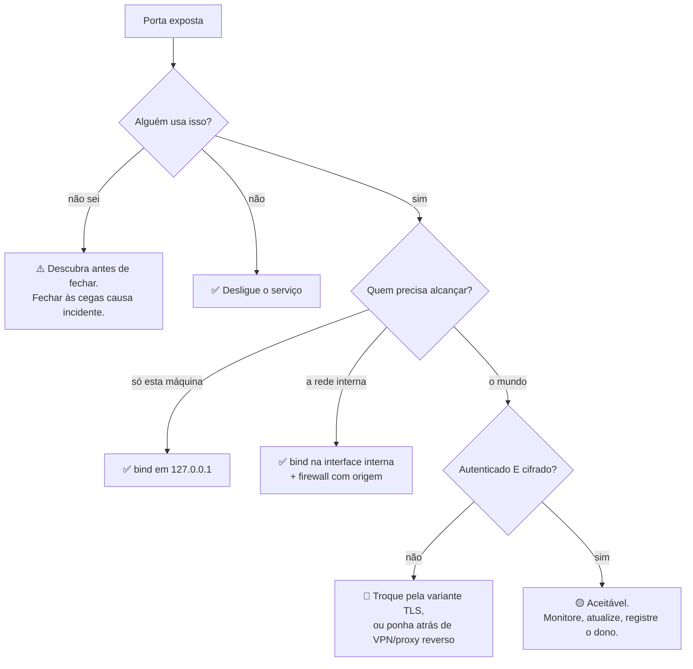

# 19 · Exposição e segurança — o que fechar, e por quê

**Nível:** intermediário a avançado · **Última atualização:** 14/08/2026

---

## A tese

> **Praticamente nenhum incidente grave de segurança dos últimos quinze anos começou com um
> atacante genial. Começou com uma porta acessível de onde não deveria ser.**

Não é retórica. Revise a tabela do [`11-historia.md`](11-historia.md): Slammer (1434/UDP),
Conficker (445), Mirai (23), WannaCry (445), memcached (11211), as invasões em massa de
MongoDB, Elasticsearch e Redis. Em nenhum desses casos o atacante precisou de uma falha
desconhecida. Precisou de **alcance**.

A palavra que descreve a causa-raiz é **exposição**, não vulnerabilidade. E as duas exigem
trabalho completamente diferente.

---

## 1. A hierarquia das correções

Existem quatro formas de impedir que alguém alcance um serviço. Elas **não são
equivalentes**, e a ordem importa mais do que a escolha.

### 1º — Desligue o serviço ✅✅✅

Se ninguém usa, não deve estar rodando.

```bash
systemctl list-units --type=service --state=running
sudo systemctl disable --now cups        # exemplo: impressão numa VM sem impressora
```

Por que é a melhor: elimina a superfície, elimina a manutenção, elimina o consumo de memória,
e **elimina a possibilidade de erro futuro**. Não há regra para alguém remover por engano.

A pergunta de auditoria correspondente: *"quantos dos serviços em execução nesta máquina
alguém usou nos últimos 90 dias?"* Em servidores herdados, a resposta costuma ser
constrangedora.

### 2º — Restrinja o `bind` ✅✅✅

Se o serviço só é usado localmente, faça-o escutar só localmente.

| Serviço | Onde configurar | Valor |
|---|---|---|
| PostgreSQL | `postgresql.conf` | `listen_addresses = 'localhost'` |
| MySQL | `my.cnf` | `bind-address = 127.0.0.1` |
| Redis | `redis.conf` | `bind 127.0.0.1` + `protected-mode yes` |
| MongoDB | `mongod.conf` | `net.bindIp: 127.0.0.1` |
| Elasticsearch | `elasticsearch.yml` | `network.host: 127.0.0.1` |
| Docker | linha de comando | `-p 127.0.0.1:8080:80` |
| Node/Express | código | `app.listen(3000, '127.0.0.1')` |
| Flask | linha de comando | `--host 127.0.0.1` (é o padrão) |
| Prometheus | flag | `--web.listen-address=127.0.0.1:9090` |

**Por que é quase tão boa quanto desligar:**

- não depende de regra externa que possa sumir;
- sobrevive a mudança de firewall, reinstalação, migração de nuvem;
- é uma linha de configuração **versionada junto com o serviço**;
- é aplicada pelo próprio kernel, antes de qualquer filtro.

A verificação, real, do [`04`](04-como-comecar.md):

```
$ curl -sS -m 3 http://10.209.2.168:8099/
curl: (7) Failed to connect to 10.209.2.168 port 8099 after 0 ms: Conexão recusada
```

Serviço rodando, porta aberta, e mesmo assim inalcançável. Nenhum firewall envolvido.

### 3º — Restrinja a origem no firewall ✅✅

Quando o serviço **precisa** ser alcançável, mas não por todo mundo.

```bash
sudo ufw allow from 192.168.0.0/24 to any port 5432 proto tcp
```

⚠️ **Nunca escreva `ufw allow 5432/tcp` sem `from`.** Essa é a regra que abre o banco para a
internet inteira e é a forma mais comum de o erro acontecer — porque é a sintaxe que aparece
primeiro em todo tutorial.

### 4º — Filtre tudo, sem origem ⚠️

`ufw allow 8080/tcp`. É a última opção porque é a mais frágil e a que menos informa.

---

## 2. Os quatro erros de exposição que dominam a estatística

### Erro 1 — o padrão do framework é `0.0.0.0`

Frameworks de desenvolvimento escutam em todas as interfaces por padrão, para funcionarem
dentro de container. Ninguém muda ao rodar direto na máquina.

```bash
# o padrão delator
ss -tlnp | grep -E '0\.0\.0\.0:(3000|4200|5000|5173|8000|8080|9229)'
```

**Encontrado nesta máquina, de verdade:**

```
ATENCAO  tcp  0.0.0.0:3001  todas-interfaces  MainThread[187918]  serviço não catalogado exposto
```

### Erro 2 — "é só temporário"

O servidor de teste que subiu para uma demonstração em 2019 e nunca desceu. Não tem
monitoração, não tem atualização, não tem dono. É o alvo perfeito.

**A defesa:** inventário automático e periódico, com alerta quando uma porta **nova**
aparece. É o exercício 5 do [projeto-modelo](07-projeto-modelo/README.md).

### Erro 3 — "está numa rede privada"

Rede privada não é rede segura. Se um atacante entra por qualquer máquina — phishing,
container comprometido, notebook infectado — ele passa a estar **dentro** dela.

Este é o argumento central da arquitetura **zero trust**: a localização na rede não é
credencial. Cada serviço autentica cada cliente, sempre, esteja ele onde estiver.

### Erro 4 — depuração exposta

```
9229  Node.js --inspect
5005  JDWP (Java)
```

**Um debugger é execução remota de código por definição.** Ele existe para parar o programa,
ler memória e avaliar expressões arbitrárias. Não tem autenticação porque presume que já se
está dentro da máquina. `node --inspect=0.0.0.0:9229` exposto é comprometimento total,
imediato, sem esforço.

---

## 3. Superfície de ataque — como medir de verdade

A conta ingênua é "quantas portas estão abertas". É a métrica errada.

A superfície real de cada porta exposta é o produto de:

```
alcance  ×  autenticação  ×  criptografia  ×  complexidade do código  ×  atualização
```

| Porta | Alcance | Auth | Cripto | Complexidade | Superfície |
|---|---|---|---|---|---|
| 443, nginx, atualizado, TLS | mundo | por app | sim | média | **baixa** |
| 22, SSH, só chave, `fail2ban` | mundo | forte | sim | baixa | **baixa** |
| 22, SSH, com senha | mundo | fraca | sim | baixa | **média** |
| 3306, MySQL, com senha | mundo | média | opcional | **alta** | **alta** |
| 6379, Redis, sem senha | mundo | **nenhuma** | não | alta | **crítica** |
| 2375, Docker API | mundo | **nenhuma** | não | — | **catastrófica** |
| 5432, Postgres em loopback | **local** | forte | sim | alta | **desprezível** |

**Duas leituras dessa tabela:**

1. Um servidor com 443 e 22 abertos e bem configurados tem superfície **menor** que um
   servidor com só a 6379 aberta sem senha. Contar portas não mede risco.
2. **Alcance é o fator que multiplica todos os outros.** Zere o alcance e o resto vira
   irrelevante. É por isso que a hierarquia da seção 1 tem a ordem que tem.

---

## 4. Segurança por obscuridade — a conversa honesta

Este é o ponto onde o assunto costuma degenerar em dogma de ambos os lados. Vamos aos fatos,
e depois à opinião, separadamente.

### Mudar o SSH da porta 22

**Fatos verificáveis:**

- Um `nmap -p-` encontra o SSH em qualquer porta, em segundos.
- Portanto, contra um atacante que dedique atenção a você, o ganho é **zero**.
- Contra bots que só tentam a 22 — que são 99 % das tentativas — o ganho é **enorme**:
  o log de autenticação fica limpo.

**Opinião profissional deste material, declarada como opinião:** faça, mas pelo motivo certo.
O valor é **operacional**, não defensivo: com o ruído removido, uma tentativa de intrusão
real vira visível em vez de estar afogada em dez mil linhas de bot. Isso melhora sua
detecção, que é uma capacidade genuína.

O que **não** se pode fazer é chamar isso de segurança e relaxar no que importa:
chave em vez de senha, `PermitRootLogin no`, `fail2ban`, e atualização.

### Esconder o banner

```apache
ServerTokens Prod
ServerSignature Off
```

**Fato:** não corrige nenhuma falha. O atacante testa o exploit em vez de escolher.
**Fato:** reduz o volume de ataque automatizado que filtra alvos por versão.
**Opinião:** faça, é grátis. Mas se um auditor apresenta isso como *a* correção de um
achado, o relatório está errado.

### Port knocking e SPA

Uma sequência de conexões em portas específicas abre a porta real. `fwknop` (*Single Packet
Authorization*) é a versão criptográfica e séria da ideia.

**Isto funciona de verdade** — a porta fica invisível a qualquer varredura. O custo é
operacional: mais uma coisa para quebrar às 3 da manhã, e um cliente que precisa do
programa certo instalado.

**Opinião:** vale em servidores de administração com poucos usuários técnicos. Não vale para
qualquer coisa com mais de meia dúzia de pessoas.

---

## 5. Os desastres, e o que cada um ensina

| Ano | Incidente | Porta | A lição operacional |
|---|---|---|---|
| 2003 | SQL Slammer | 1434/UDP | Um datagrama. Sem handshake, a propagação só é limitada pela banda. |
| 2016 | Mirai | 23/TCP | Senha padrão + Telnet + IoT. O fabricante não te protege. |
| 2017 | WannaCry / NotPetya | 445/TCP | Havia correção há dois meses. O problema foi **alcance**, não falha. |
| 2017 | MongoDB "ransom" | 27017 | Padrão inseguro numa versão antiga. Padrões são decisões de segurança. |
| 2018 | GitHub, 1,35 Tbit/s | 11211/UDP | Amplificação ~51 000×. Corrigido mudando o **padrão**, não o código. |
| 2019 | Capital One | (SSRF → 169.254.169.254) | A "porta" era interna. SSRF atravessa perímetro. |
| contínuo | Docker API | 2375 | Um comando dá root. Campanhas automatizadas varrem 24 h por dia. |
| contínuo | Ransomware por RDP | 3389 | O vetor inicial nº 1 de ransomware há anos. |

**O fio que costura todos:** em cada caso, **a correção técnica existia e era simples**. O
que faltou foi saber que a porta estava aberta.

Isso tem uma consequência de gestão que raramente se diz: **o inventário vale mais que a
ferramenta cara.** Um `ss -tulpn` semanal, comparado com o da semana anterior, previne mais
incidentes que a maioria dos produtos de segurança vendidos por licença anual.

---

## 6. Uma política de portas que funciona

### Para uma máquina

```
1. Negar por padrão na entrada. Permitir por exceção.
2. Todo serviço escuta em 127.0.0.1, salvo justificativa escrita.
3. Toda porta exposta tem: dono nomeado, motivo documentado, e data de revisão.
4. Nenhum banco de dados, cache ou fila é alcançável fora da rede da aplicação.
5. Nenhum debugger, nenhum painel de administração, nenhuma métrica em 0.0.0.0.
6. Inventário automático semanal, com alerta em porta nova.
```

### Para uma organização

```
7. Varredura externa mensal do espaço de IP próprio, comparada com o inventário interno.
8. Consulta ao Shodan/Censys pelo domínio e pelos IPs — descobre o que ninguém sabia.
9. Segmentação: OT nunca fala com TI; TI nunca fala com a internet diretamente.
10. Toda exceção tem prazo. Exceção sem prazo vira permanente em três semanas.
```

O item 10 é o que separa política que funciona de política que só existe no papel.

### Verificação automatizável

```bash
cd 07-projeto-modelo
python3 auditor.py local --apenas-expostas --sem-cor
echo "código de saída: $?"      # 1 se houver crítico → trava o pipeline
```

Saída real desta máquina: `14 crítico(s)`, código de saída `1`.

---

## 7. O que fazer com o que você encontrar

Para cada porta exposta, três perguntas, nesta ordem:



⚠️ **O caminho "não sei" é o mais importante e o mais ignorado.** Fechar uma porta que
alguém usa é derrubar um sistema. O procedimento certo:

1. registre quem conecta naquela porta por 2–4 semanas (`tcpdump`, log de conexão);
2. avise os donos identificados;
3. **então** feche, com janela e plano de reversão.

Auditoria que produz uma lista de portas para fechar sem esse passo não é auditoria — é
uma lista de futuros incidentes.

---

## Autoteste

1. Enuncie a hierarquia das quatro correções, em ordem, e diga por que a ordem é essa.
2. Por que restringir o `bind` é melhor que uma regra de firewall equivalente? Dê dois
   motivos independentes.
3. Um servidor tem 15 portas abertas; outro tem 1. Qual tem maior superfície de ataque?
   Por que a pergunta está mal formulada?
4. Mudar o SSH da 22 para outra porta: separe o que é fato do que é opinião, e dê sua
   recomendação com o motivo correto.
5. Qual erro de exposição está por trás de: `0.0.0.0:5173`, `0.0.0.0:9229` e
   `0.0.0.0:27017`? Eles têm a mesma causa?
6. Por que "está numa rede privada" não é um controle de segurança? Que arquitetura parte
   dessa premissa?
7. Você encontrou uma porta exposta e não sabe quem a usa. Qual é o procedimento correto —
   e por que fechá-la imediatamente é a resposta errada?
8. O que WannaCry, Mirai e o DDoS por memcached têm em comum quanto à causa-raiz? Que
   conclusão de gestão isso sugere?

---

*Próximo: [`20-containers-nuvem-e-k8s.md`](20-containers-nuvem-e-k8s.md) — portas em ambientes modernos.*
