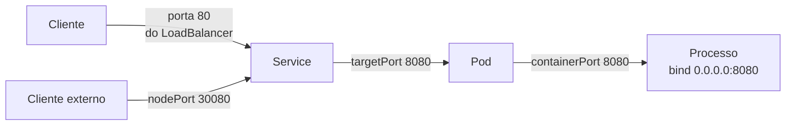

# 20 · Portas em containers, nuvem e Kubernetes

**Nível:** avançado · **Última atualização:** 14/08/2026
Os comandos de Docker e Kubernetes deste arquivo **não foram executados** (não havia Docker
nem cluster no ambiente de escrita). Vêm da documentação oficial citada no
[`95-referencias.md`](95-referencias.md). Ver também [`docker`](../docker/00-MAPA.md) nesta pasta.

---

## Por que containers quebram o modelo mental

Tudo que você aprendeu até aqui pressupõe **uma** pilha de rede por máquina: uma tabela de
sockets, uma tabela de rotas, um conjunto de regras de firewall.

Um container tem a **sua própria pilha inteira**. E é por isso que:

- `ss -tulpn` no host **não mostra** as portas de dentro do container;
- dois containers podem escutar na porta 80 sem conflito nenhum;
- `localhost` dentro do container **não é** o `localhost` do host;
- e a porta "8080" pode existir em quatro lugares diferentes ao mesmo tempo.

---

## 1. Network namespace — o mecanismo

```bash
sudo lsns -t net                          # lista todos os namespaces de rede
ls -l /proc/<PID>/ns/net                  # em qual namespace este processo está
sudo nsenter -t <PID> -n ss -tulpn        # roda ss DENTRO do namespace daquele processo
ip netns list                             # namespaces NOMEADOS (os do Docker não aparecem)
```

⚠️ `ip netns list` costuma vir vazio numa máquina com Docker rodando. Não é bug: o Docker
cria namespaces **anônimos**, sem o link em `/var/run/netns` que o `ip netns` procura. Use
`lsns` ou `nsenter` com o PID do container.

Um *network namespace* isola:

| Isola | Consequência |
|---|---|
| Interfaces de rede | Cada container tem seu `eth0` |
| Tabela de rotas | Rotas próprias |
| **Tabela de sockets** | **`ss` do host não vê** |
| Regras de netfilter | Firewall próprio |
| `/proc/net/*` | Inclusive `ip_local_port_range` |

**Isso é o container inteiro, em termos de rede.** Não há mágica além disso — é uma
funcionalidade do kernel Linux desde 2007, que o Docker apenas orquestrou bem.

---

## 2. `-p 8080:80` — o que realmente acontece

```bash
docker run -d -p 8080:80 nginx
```

Duas coisas, não uma:

```
1. Uma regra de DNAT na tabela nat do netfilter:
   PREROUTING: tcp dport 8080 → DNAT para 172.17.0.2:80

2. Um processo docker-proxy escutando em 0.0.0.0:8080 no host
   (para o caso do tráfego que vem do próprio host, que não passa por PREROUTING)
```

Confirme:

```bash
ss -tlnp | grep 8080
# LISTEN 0 4096 0.0.0.0:8080 users:(("docker-proxy",pid=...))

sudo iptables -t nat -S DOCKER
# -A DOCKER ! -i docker0 -p tcp -m tcp --dport 8080 -j DNAT --to-destination 172.17.0.2:80
```

**São dois sockets em duas tabelas.** O `ss` do host vê o do `docker-proxy`; o socket real
do nginx está no namespace do container e é invisível daqui.

### A sintaxe completa que quase ninguém usa

```
-p [IP_do_host:]porta_host:porta_container[/protocolo]
```

| Comando | Escuta em | Veredito |
|---|---|---|
| `-p 8080:80` | `0.0.0.0:8080` | ⚠️ **acessível da internet** |
| `-p 127.0.0.1:8080:80` | `127.0.0.1:8080` | ✅ **o que você quase sempre quer** |
| `-p 192.168.0.5:8080:80` | só naquela interface | ✅ |
| `-p 8080:80/udp` | UDP | |
| `-p 80` | porta do host **aleatória** | útil em teste |
| `EXPOSE 80` no Dockerfile | **nada** | ⚠️ ver abaixo |

⚠️ **`EXPOSE` no Dockerfile não abre porta nenhuma.** É documentação — metadado que diz
"este container fala na 80". Só `-p` (ou `-P`) publica de verdade. Confundir os dois é um
mal-entendido extremamente comum, e leva à conclusão errada de que o container está exposto
quando não está (ou o contrário).

---

## 3. `localhost` dentro do container não é o seu `localhost`

O erro nº 1 de quem começa:

```bash
docker run -d --name app minha-app     # a app tenta conectar em 127.0.0.1:5432
# → "Connection refused". O Postgres está no HOST, não no container.
```

Dentro do container, `127.0.0.1` é o loopback **do namespace do container**. O Postgres do
host é inalcançável por ali.

**As saídas, em ordem de qualidade:**

```bash
# 1. ✅ Rede de container e nome de serviço (Docker Compose faz isso sozinho)
docker network create app-net
docker run -d --name db --network app-net postgres
docker run -d --name app --network app-net minha-app   # conecta em "db:5432"

# 2. Nome especial que aponta para o host (Docker Desktop; no Linux precisa da flag)
docker run --add-host=host.docker.internal:host-gateway ...

# 3. Compartilhar a pilha do host — perde todo o isolamento
docker run --network=host ...
```

A opção 1 é a certa em quase todos os casos. A resolução por **nome de serviço** é o que
faz uma arquitetura de containers ser portável: nada de IP fixo, nada de porta do host.

⚠️ **`--network=host` elimina o namespace.** O container passa a usar a pilha do host: as
portas dele aparecem no `ss` do host, e `-p` deixa de ter efeito (o Docker até avisa). É
útil para ferramentas de rede — foi como o [`03-instalacao.md`](03-instalacao.md) sugere
rodar o `nmap` em container — e é péssimo para aplicação.

---

## 4. A mesma porta em quatro lugares

Num ambiente Kubernetes, "porta 8080" pode significar quatro coisas distintas:



| Nome | Onde vive | O que é |
|---|---|---|
| `containerPort` | manifesto do Pod | **Documentação.** Como o `EXPOSE`, não abre nada |
| `targetPort` | Service | A porta **real** para onde o tráfego vai no Pod |
| `port` | Service | A porta pela qual o Service é conhecido no cluster |
| `nodePort` | Service tipo NodePort | 30000–32767, aberta em **todos** os nós |

```yaml
apiVersion: v1
kind: Service
metadata:
  name: minha-app
spec:
  type: NodePort
  ports:
    - port: 80          # o cluster chama de "minha-app:80"
      targetPort: 8080  # o processo escuta aqui, DENTRO do pod
      nodePort: 30080   # e isto abre em TODO nó do cluster ⚠️
```

⚠️ **`containerPort` é puramente informativo.** Se o processo escutar na 9090 e o manifesto
disser 8080, o Kubernetes não corrige nem reclama — só o `targetPort` importa. É fonte
constante de "o Service existe mas não responde".

⚠️ **`nodePort` abre a porta em todos os nós, em todas as interfaces.** Se os nós têm IP
público, você acabou de publicar na internet. Em cluster gerenciado o firewall da nuvem
costuma proteger; em cluster próprio, muitas vezes não.

### O jeito certo, na prática

Para publicar HTTP, prefira **Ingress** ou **Gateway API**, não NodePort:

- concentra o tráfego em 80/443;
- roteia por nome de host e caminho de URL, não por número de porta;
- termina TLS num lugar só.

É a materialização de uma ideia que atravessa o curso: **em arquitetura moderna, o número
da porta deixou de ser o mecanismo de roteamento.** Ver
[`65-estado-da-arte.md`](65-estado-da-arte.md).

---

## 5. Diagnóstico dentro de containers

O problema prático: a imagem não tem `ss`, `netstat`, `curl` nem `bash`.

```bash
# 1. Entrar no namespace de rede do container, usando as ferramentas do HOST
PID=$(docker inspect -f '{{.State.Pid}}' meu-container)
sudo nsenter -t $PID -n ss -tulpn
sudo nsenter -t $PID -n ip addr

# 2. Container "sidecar" que compartilha a rede do alvo
docker run --rm -it --network container:meu-container nicolaka/netshoot
kubectl debug -it meu-pod --image=nicolaka/netshoot --target=meu-container

# 3. Sem ferramenta nenhuma: bash puro
docker exec meu-container bash -c 'exec 3<>/dev/tcp/db/5432 && echo aberta'

# 4. Ler /proc à mão — funciona em QUALQUER container Linux
docker exec meu-container cat /proc/net/tcp
```

**A opção 4 é o motivo pedagógico do [projeto-modelo](07-projeto-modelo/README.md).** Numa
imagem `distroless` ou `scratch`, `/proc/net/tcp` pode ser literalmente a única fonte de
informação disponível — e agora você sabe lê-la.

---

## 6. Nuvem — as camadas empilhadas

Numa aplicação em nuvem moderna, um pacote atravessa de cinco a sete pontos de decisão:

```
Cliente
  → DNS  (que IP?)
  → Load Balancer  (porta 443)
  → Security Group / NSG  (a porta está permitida?)
  → NACL  (sem estado — cuidado com a saída!)
  → Nó / VM  (firewall do SO)
  → kube-proxy / iptables  (Service → Pod)
  → Namespace do Pod  (o socket, finalmente)
```

**Cada camada tem sua própria noção de "a porta 8080".** Um problema pode estar em qualquer
uma, e o sintoma é idêntico: timeout.

| Camada | Como checar |
|---|---|
| DNS | `dig +short meuapp.exemplo.com` |
| Load Balancer | Console; health check está verde? |
| Security Group | Console; a regra de **entrada** existe? |
| NACL (AWS) | **Sem estado.** A saída nas portas efêmeras está liberada? |
| Firewall do SO | `ss`, `nft list ruleset` na VM |
| Service (k8s) | `kubectl get endpoints meu-service` ← **se estiver vazio, o seletor está errado** |
| Pod | `kubectl exec ... -- cat /proc/net/tcp` |

**O comando de ouro em Kubernetes:**

```bash
kubectl get endpoints meu-service
```

Se a lista de endpoints vier **vazia**, o Service não achou nenhum Pod — o `selector` não
casa com os `labels`, ou os Pods não estão prontos. Nenhuma quantidade de investigação de
rede resolve isso, e é a causa mais frequente de "o Service não responde".

---

## 7. Service mesh — quando a porta some de vez

Com Istio, Linkerd ou similar, um *sidecar* (Envoy) é injetado em cada Pod e **intercepta
todo o tráfego** por regras de `iptables` dentro do namespace do Pod.

```
Sua app escuta em 8080
   ↓ mas o iptables do Pod redireciona TUDO para o Envoy na 15001
Envoy (15001) → aplica mTLS, política, telemetria → 8080 local
```

**Consequências:**

- `ss` dentro do Pod mostra portas 15000, 15001, 15006, 15020 que você nunca configurou —
  são do Envoy;
- o tráfego entre serviços é mTLS, **independentemente** do que a aplicação faz;
- a autorização passa a ser por **identidade de serviço** (SPIFFE), não por IP nem porta;
- e uma varredura de portas do cluster mostra o mesmo conjunto em todo Pod, dizendo muito
  pouco.

*Nota:* as portas `15000`/`15001` apareceram na saída real de `ss` da máquina de escrita
deste curso — sinal de que há um proxy do tipo Envoy rodando nela. É um bom exemplo de que
esses números são reconhecíveis na prática.

**A leitura conceitual:** o *service mesh* é o ponto em que a porta deixa de ser o mecanismo
de controle de acesso e vira apenas um detalhe de transporte. O controle mudou para
identidade criptográfica. Ver [`65-estado-da-arte.md`](65-estado-da-arte.md).

---

## 8. Erros específicos deste ambiente

| Sintoma | Causa | Correção |
|---|---|---|
| `ss` no host não vê a porta do container | Namespace separado | `nsenter -t <pid> -n ss -tulpn` |
| App no container não acha o banco em `localhost` | Loopback é do container | Rede de container + nome de serviço |
| `ufw deny 8080` não bloqueia o container | Docker escreve em `nat`/`FORWARD`, não em `INPUT` | `-p 127.0.0.1:8080:80` ou cadeia `DOCKER-USER` |
| `EXPOSE 80` no Dockerfile e nada acontece | `EXPOSE` é documentação | Use `-p` |
| Service do k8s sem responder | `selector` não casa com os `labels` | `kubectl get endpoints` |
| `containerPort` diverge do que o app usa | É informativo | Corrija o `targetPort` |
| Porta 15001 aparece sem você ter posto | Sidecar do service mesh | Normal |
| `Address already in use` no Windows sem ninguém no `netstat` | Faixa reservada por Hyper-V/WSL | `netsh interface ipv4 show excludedportrange protocol=tcp` |

---

## Autoteste

1. Por que `ss -tulpn` no host não mostra as portas de dentro de um container? Qual comando
   mostra?
2. `-p 8080:80` cria quantos sockets, e onde? Por que existe um `docker-proxy`?
3. Qual a diferença entre `EXPOSE 80` no Dockerfile e `-p 80:80` na linha de comando?
4. Uma app em container falha ao conectar em `127.0.0.1:5432`. Explique e dê a melhor
   solução, e não a mais rápida.
5. Em Kubernetes, o que são `containerPort`, `port`, `targetPort` e `nodePort`? Qual deles é
   apenas informativo?
6. Um Service não responde. Qual é o primeiro comando a rodar, e o que uma saída vazia
   significa?
7. Por que uma NACL da AWS pode bloquear a resposta mesmo com a entrada liberada?
8. Numa imagem `distroless`, sem `ss` e sem `curl`, como você descobre em que porta o
   processo está escutando?
9. Com service mesh, a política de acesso passa a se basear em quê, em vez de IP e porta?
   Que consequência isso tem para uma varredura de portas do cluster?

---

*Próximo: [`60-teoria-avancada.md`](60-teoria-avancada.md) — os limites teóricos.*
