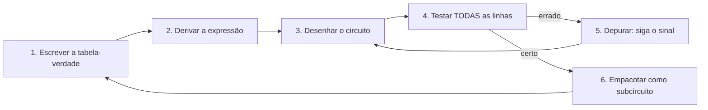

# 04 · Como começar — do ambiente pronto ao primeiro circuito

**Nível:** iniciante · **Data:** 14/08/2026
**Assume:** o ambiente do [`03-instalacao.md`](03-instalacao.md) funcionando — ou nada
instalado e um navegador aberto, que também serve.

Meta deste arquivo: em **15 minutos** você terá um somador de 1 bit construído por você,
funcionando, e entenderá cada fio dele.

---

## Caminho A — sem instalar nada (2 minutos até a primeira porta)

1. Abra https://circuitverse.org/simulator
2. No painel esquerdo, em **Gates**, clique em **AND Gate** e depois clique na tela.
3. Em **Input**, clique em **Input** e coloque dois na tela; ligue-os às entradas do AND
   arrastando de um pino ao outro.
4. Em **Output**, coloque um **Output** ligado à saída do AND.
5. Clique nos quadradinhos de entrada para alternar entre 0 e 1.

**Deu certo se:** a saída só fica verde quando as duas entradas estão em 1.

Está pronto para a seção "O primeiro circuito de verdade", abaixo — os passos são os
mesmos, só mudam os nomes dos menus.

---

## Caminho B — no Logisim-evolution

### Passo 1 · Abra e reconheça a tela

```bash
logisim-evolution
# ou, se você baixou só o .jar:
java -jar logisim-evolution-4.1.0-all.jar
```

```
┌──────────────────────────────────────────────────────────────┐
│  Arquivo  Editar  Projeto  Simular  Janela  Ajuda            │  ← menus
├───────────────┬──────────────────────────────────────────────┤
│ 🖐 ✋ ⌷ 🔤     │                                              │  ← ferramentas
│               │                                              │
│ ▾ Wiring      │                                              │
│    Pin        │              ÁREA DE DESENHO                 │
│    Splitter   │                                              │
│ ▾ Gates       │                                              │
│    NOT        │                                              │
│    AND        │                                              │
│    OR         │                                              │
│    XOR        │                                              │
│    NAND       │                                              │
├───────────────┤                                              │
│  PROPRIEDADES │                                              │
│  do item      │                                              │
│  selecionado  │                                              │
└───────────────┴──────────────────────────────────────────────┘
```

As **três ferramentas** que importam, no canto superior esquerdo:

| Ícone | Nome | Para quê | Atalho |
|---|---|---|---|
| 🖐 (mão) | **Poke** | clicar em entradas para mudar 0/1 e testar | `Ctrl+1` |
| ✋ (seta) | **Select/Edit** | mover, apagar, **desenhar fios** | `Ctrl+0` |
| 🔤 (A) | **Text** | escrever rótulos | `Ctrl+3` |

**O erro nº 1 de todo iniciante:** tentar clicar numa entrada para testar enquanto a
ferramenta *Select* está ativa — e acabar arrastando o componente. Se o circuito "não
responde ao clique", quase sempre é isso: você esqueceu de trocar para a mão (Poke).

### Passo 2 · Um inversor (30 segundos)

1. Clique em **Gates → NOT Gate**, depois clique na tela.
2. Clique em **Wiring → Pin**. Coloque um à esquerda do NOT.
3. Clique em **Wiring → Pin** de novo; no painel **Propriedades** (canto inferior esquerdo),
   mude **Output?** para **Yes**. Coloque à direita do NOT.
4. Pegue a ferramenta **Select** (seta) e arraste de cada pino até o pino correspondente
   da porta, para desenhar os fios.
5. Troque para a **mão (Poke)** e clique no pino de entrada.

**Deu certo se:** a saída mostra 1 quando a entrada é 0, e 0 quando é 1.

**Se o fio ficou vermelho:** vermelho no Logisim significa **erro**, e há três causas:

| Fio vermelho | Causa | Correção |
|---|---|---|
| linha vermelha inteira | dois valores diferentes brigando no mesmo fio (curto lógico) | apague um dos dois acionamentos |
| fio azul/cinza | valor **desconhecido** — a entrada não está ligada em nada | ligue a ponta solta |
| fio laranja | larguras diferentes (1 bit ligado a 4 bits) | ajuste **Data Bits** nas propriedades |

Essa tabela de cores resolve 80% dos travamentos de iniciante no Logisim.

---

## O primeiro circuito de verdade: um meio somador

Este é o "olá, mundo" das portas lógicas — e, ao contrário de um `print`, ele **faz** algo.

### O problema

Some dois bits. Só isso. Mas repare no caso `1 + 1`: dá 2, que em binário é `10` — não cabe
em um bit. Então a soma de dois bits precisa produzir **duas** saídas: o resultado da casa
(`soma`) e o que sobra para a casa seguinte (`vai-um`, em inglês *carry*).

| a | b | soma | vai-um | em decimal |
|---|---|---|---|---|
| 0 | 0 | 0 | 0 | 0 + 0 = 0 |
| 0 | 1 | 1 | 0 | 0 + 1 = 1 |
| 1 | 0 | 1 | 0 | 1 + 0 = 1 |
| 1 | 1 | **0** | **1** | 1 + 1 = 2 = `10` |

### Olhe para as colunas — o circuito aparece sozinho

- A coluna **soma** vale 0,1,1,0. Isso é *"1 quando as entradas são diferentes"* → **XOR**.
- A coluna **vai-um** vale 0,0,0,1. Isso é *"1 só quando as duas são 1"* → **AND**.

Pronto. O circuito é:

```
   a ──┬──────────►┐
       │           │ XOR ├──── soma
   b ──┼──┬───────►┘
       │  │
       └──┼───────►┐
          │        │ AND ├──── vai-um
          └───────►┘
```

Duas portas. Este é o método geral e vale para qualquer circuito combinacional:
**escreva a tabela-verdade, e depois procure qual porta produz cada coluna.**
Quando nenhuma porta produz a coluna diretamente, usa-se a técnica do
[`10-fundamentos.md`](10-fundamentos.md) (soma de produtos).

### Monte no Logisim

1. **Gates → XOR Gate** na tela.
2. **Gates → AND Gate** abaixo dele.
3. Dois **Pin** de entrada à esquerda; rotule-os `a` e `b` (propriedade **Label**).
4. Dois **Pin** de saída à direita (**Output? = Yes**); rotule `soma` e `vai_um`.
5. Ligue `a` às entradas de cima do XOR **e** do AND. Ligue `b` às de baixo.
   *Um fio pode se ramificar: basta desenhar um novo fio saindo do meio de um existente.*
6. Ferramenta **mão** e teste as quatro combinações.

**Deu certo se** a tabela acima se reproduz exatamente. Teste as quatro linhas —
não confie em duas.

### Verificação automática (o jeito profissional)

O Logisim sabe conferir sozinho:

**Janela → Combinational Analysis** (ou *Project → Analyze Circuit*). Ele extrai a
tabela-verdade do circuito que você desenhou. Compare com a tabela de cima.

> Este recurso faz o caminho inverso também: você escreve a tabela-verdade desejada, e o
> Logisim **gera o circuito**. É a forma mais rápida de aprender a relação entre tabela e
> circuito — mas não use isso como muleta antes de saber fazer à mão, ou você vai
> travar quando a tabela tiver 6 entradas e o circuito gerado sair ilegível.

---

## O somador completo — a peça de verdade

O meio somador tem um defeito fatal: **não aceita um vai-um vindo da casa anterior**.
Então serve para somar 1 bit, e só. Para somar números de verdade, é preciso a versão
com três entradas: `a`, `b` e `vem_um`.

| a | b | vem_um | soma | vai_um |
|---|---|---|---|---|
| 0 | 0 | 0 | 0 | 0 |
| 0 | 0 | 1 | 1 | 0 |
| 0 | 1 | 0 | 1 | 0 |
| 0 | 1 | 1 | 0 | 1 |
| 1 | 0 | 0 | 1 | 0 |
| 1 | 0 | 1 | 0 | 1 |
| 1 | 1 | 0 | 0 | 1 |
| 1 | 1 | 1 | 1 | 1 |

Repare: `soma` é 1 quando o número de entradas em 1 é **ímpar** → `a XOR b XOR vem_um`.
E `vai_um` é 1 quando **pelo menos duas** entradas são 1 → é um "voto por maioria".

```
   soma   = (a XOR b) XOR vem_um
   vai_um = (a·b) + ((a XOR b)·vem_um)
```

**Monte-o.** São 5 portas: 2 XOR, 2 AND, 1 OR. Depois abra a *Combinational Analysis*
e confira as 8 linhas.

Feito isso, você construiu a peça mais executada de qualquer computador do planeta. Um
processador de 64 bits tem centenas de somadores completos, e eles são acionados
bilhões de vezes por segundo.

---

## O ciclo de trabalho do dia a dia



**O passo 6 é o que separa quem avança de quem empaca.** No Logisim:
*Project → Add Circuit…*, dê um nome (`somador_completo`), monte o circuito lá dentro, e
ele passa a aparecer na árvore da esquerda como uma peça nova, que você arrasta como
qualquer porta. É assim que se constrói um somador de 4 bits sem enlouquecer: quatro
cópias do subcircuito, ligadas em cadeia.

Hierarquia é a única defesa contra a complexidade. Um chip real tem dezenas de níveis dela.

### Como depurar um circuito

Software se depura com `print`. Hardware se depura **seguindo o sinal**:

1. **Ponha uma saída (Pin) no meio do circuito**, no ponto que você quer inspecionar.
   É o equivalente exato de um `print` — e é o que engenheiros chamam de *probe*.
2. **Fixe as entradas** numa combinação que falha.
3. **Ande da entrada para a saída**, conferindo cada porta contra a tabela dela.
   Onde o valor deixa de bater com o esperado, ali está o defeito.
4. Se tudo bate mas o resultado está errado, o erro está na **fiação**, não na lógica —
   quase sempre um fio ligado no pino errado ou um cruzamento que virou conexão.

---

## Os cinco primeiros erros de uso (não de instalação)

| # | Sintoma | Causa | Correção |
|---|---|---|---|
| 1 | Clicar na entrada não muda nada | ferramenta *Select* ativa em vez de *Poke* | pressione `Ctrl+1` (mão) |
| 2 | Fio vermelho | dois acionadores no mesmo fio, ou larguras diferentes | veja a tabela de cores acima |
| 3 | Fios se cruzam e viram um nó sem querer | no Logisim, cruzamento **conecta** se houver um ponto | desvie o fio, ou verifique o pontinho de junção |
| 4 | "Meu circuito só funciona às vezes" | há realimentação sem flip-flop — o circuito oscila | ver [`30-circuitos-sequenciais.md`](30-circuitos-sequenciais.md); em combinacional, realimentação nunca é intencional |
| 5 | Porta com mais entradas do que se quer | o padrão do Logisim é 5 entradas | propriedade **Number of Inputs** = 2 |

E um sexto, conceitual, que custa horas: **confundir o "ou" do português com o OR lógico**.
Se o seu circuito responde 1 quando você esperava 0 no caso "os dois ligados", você queria
**XOR** e usou **OR**.

---

## Rode o computador do curso agora

Se você instalou Python (§4 do [`03`](03-instalacao.md)):

```bash
cd portas-logicas/07-projeto-modelo
python3 computador.py
```

Você verá um computador de 4 bits — construído inteiramente com portas NAND — multiplicar
3 por 5 e imprimir 15, mostrando cada instrução executada. Depois:

```bash
python3 contagem.py
```

que imprime quantas portas cada peça custou. **829 portas** para o computador inteiro.

Você não precisa entender o código ainda. Ver funcionando primeiro, entender depois, é
uma ordem legítima de aprendizado — e neste assunto costuma funcionar melhor.

---

## Para onde ir agora

| Se você quer… | Vá para |
|---|---|
| Mais circuitos prontos para copiar | [`06-exemplos.md`](06-exemplos.md) — 12 exemplos |
| Entender a matemática por trás | [`10-fundamentos.md`](10-fundamentos.md) |
| Consultar comandos e símbolos | [`05-manual-de-uso.md`](05-manual-de-uso.md) |
| Exercícios com critério de correção | [`70-pratica.md`](70-pratica.md) |
| Construir um computador | [`07-projeto-modelo/`](07-projeto-modelo/README.md) |

---

## Autoteste

1. Qual ferramenta do Logisim se usa para **testar** um circuito, e qual para **montar**?
2. O que significa um fio vermelho? E um azul?
3. Por que a soma de dois bits precisa de duas saídas?
4. Qual porta produz a coluna `soma` de um meio somador? E a coluna `vai-um`?
5. Qual é o defeito do meio somador que obriga a existir o somador completo?
6. Qual é o método geral para transformar uma tabela-verdade em circuito?
7. Como se depura um circuito, já que não existe `print`?
8. Por que empacotar circuitos como subcircuitos é indispensável, e não apenas organizado?

*(Respostas: 1 — Poke (mão) testa, Select (seta) monta; 2 — vermelho é conflito de valores
ou largura errada, azul é valor desconhecido/ponta solta; 3 — porque 1+1 = 2 não cabe em
um bit; 4 — XOR e AND; 5 — não aceita vai-um da casa anterior, então não encadeia;
6 — escrever a tabela e procurar qual porta produz cada coluna de saída; 7 — colocando
saídas de teste (probes) no meio e seguindo o sinal da entrada para a saída; 8 — porque
sem hierarquia um circuito de algumas centenas de portas fica impossível de montar e de
depurar.)*
