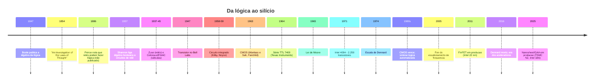

# 11 · História — como chegamos às portas lógicas

**Nível:** iniciante · **Data:** 14/08/2026

A história aqui não é decoração. Cada troca de tecnologia aconteceu por um motivo
econômico ou físico específico, e entender esses motivos ensina a prever a próxima troca.

---

## Linha do tempo em uma tela

---

## 1. Antes da eletricidade: a lógica vira álgebra (1847)

**O problema.** Desde Aristóteles, o raciocínio era estudado com palavras. "Todo homem é
mortal, Sócrates é homem, logo Sócrates é mortal." Isso funciona, mas não se calcula.

**George Boole**, matemático inglês autodidata e filho de sapateiro, publicou em 1847
*The Mathematical Analysis of Logic* e, em 1854, *An Investigation of the Laws of Thought*.
A ideia central: representar proposições por símbolos que valem 0 ou 1, e o raciocínio por
operações algébricas sobre eles.

Boole não estava pensando em máquinas. Estava tentando descrever as leis do pensamento
humano — o título do livro é literal. Morreu em 1864, aos 49 anos, de pneumonia contraída
depois de andar 5 km na chuva para dar aula. Não fazia ideia de que sua álgebra viraria a
base de toda a computação, 80 anos depois.

**Por que demorou 80 anos?** Porque faltava a peça física. A álgebra existia; o dispositivo
que a realizasse, não.

---

## 2. A ponte: Shannon, 1937

**O problema.** Nos anos 1930, centrais telefônicas eram feitas de milhares de **relés** —
chaves eletromecânicas em que uma corrente aciona um eletroímã que fecha um contato.
Projetá-las era artesanato: engenheiros montavam por tentativa e erro, e ninguém sabia se
um circuito de 200 relés podia ser feito com 150.

**Claude Shannon**, então com 21 anos, aluno de mestrado do MIT, tinha estudado álgebra
booleana num curso de filosofia na Universidade de Michigan — uma disciplina que quase
ninguém da engenharia cursava. Trabalhando no analisador diferencial de Vannevar Bush,
ele percebeu a correspondência:

| Circuito de relés | Álgebra booleana |
|---|---|
| dois contatos **em série** | AND |
| dois contatos **em paralelo** | OR |
| contato normalmente fechado | NOT |
| circuito fechado / aberto | 1 / 0 |

A dissertação *A Symbolic Analysis of Relay and Switching Circuits* (1937) é frequentemente
chamada de a dissertação de mestrado mais importante do século XX, e a alcunha é merecida:
ela transformou projeto de circuitos de artesanato em **matemática aplicada**. Passou a ser
possível *simplificar* um circuito antes de construí-lo.

> **Nota histórica honesta:** Charles Sanders Peirce já havia notado a mesma correspondência
> por volta de 1886, em cartas e manuscritos não publicados. E o japonês Akira Nakashima
> publicou resultados equivalentes entre 1935 e 1938, independentemente. Shannon levou o
> crédito porque publicou no lugar certo, na hora certa, e porque foi ele quem conectou a
> ideia ao que viria depois. Prioridade científica raramente é uma questão simples.

---

## 3. Relé → válvula: velocidade (1937–1945)

O relé funciona, mas é **mecânico**: leva ~10 milissegundos para comutar, faz barulho,
desgasta e trava. Os computadores de relés (Zuse Z3 na Alemanha, 1941; Harvard Mark I nos
EUA, 1944) rodavam a poucas operações por segundo.

A **válvula termiônica** (tubo de vácuo) não tem partes móveis: o chaveamento é feito por
um feixe de elétrons no vácuo, em ~1 microssegundo. **Mil vezes mais rápido.**

- **Colossus** (Reino Unido, 1943) — ~1.600 válvulas, para quebrar a cifra alemã Lorenz.
  Mantido em segredo até os anos 1970, o que atrasou o reconhecimento de seus criadores.
- **ENIAC** (EUA, 1945) — 17.468 válvulas, 27 toneladas, 150 kW.

**O preço:** válvulas queimam. Com 17.468 delas, o ENIAC tinha uma falha a cada poucas
horas. Consumia energia de um quarteirão. Aquecia tanto que a sala precisava de refrigeração
industrial.

**A lição, que se repete em toda troca de tecnologia:** o novo dispositivo ganhou por uma
métrica dominante (velocidade) e piorou em várias outras (confiabilidade, consumo, tamanho).
Adota-se assim mesmo, porque a métrica dominante é a que trava o progresso.

---

## 4. Válvula → transistor: confiabilidade e tamanho (1947)

Em 23 de dezembro de 1947, no Bell Labs, **John Bardeen, Walter Brattain e William
Shockley** demonstraram o transistor de contato de ponto. Prêmio Nobel de Física em 1956.

| | Válvula | Transistor |
|---|---|---|
| Tamanho | ~5 cm | milímetros (hoje, nanômetros) |
| Consumo | watts | miliwatts |
| Vida útil | ~1.000 h | praticamente ilimitada |
| Aquecimento | precisa de filamento aquecido | frio |
| Fragilidade | vidro, vácuo | estado sólido |

O transistor não é apenas menor. Ele é **melhor em todas as métricas simultaneamente**, o
que é raríssimo em engenharia. Por isso a substituição foi total em uma década.

---

## 5. Transistor → circuito integrado: a tirania dos números (1958–59)

**O problema, que tinha nome na época: "a tirania dos números".** Um computador
transistorizado com 100.000 componentes precisava de 100.000 transistores comprados,
testados, posicionados e **soldados à mão**, com 300.000 pontos de solda. Cada solda é um
ponto de falha. A confiabilidade despencava com o tamanho, e o custo de montagem crescia
mais rápido que o de componentes.

Não era um limite de física; era de **montagem manual**.

Duas soluções apareceram quase juntas:

- **Jack Kilby** (Texas Instruments, setembro de 1958) — construiu o primeiro circuito
  integrado, em germânio, com fios ligados à mão. Nobel de Física em 2000.
- **Robert Noyce** (Fairchild, 1959) — o IC de **silício com interconexão planar**: as
  ligações são *impressas* junto com os componentes, por fotolitografia.

A versão de Noyce venceu, e o motivo é econômico, não técnico: se as conexões são impressas
junto, **acrescentar transistores não acrescenta trabalho de montagem**. O custo por
transistor passa a cair com a densidade em vez de subir. É essa propriedade — e não a
miniaturização em si — que produz tudo o que veio depois.

**Este é o ponto de virada mais importante desta linha do tempo.** Se você guardar um só
fato deste arquivo, guarde este.

---

## 6. A série 7400 e a democratização (1964)

A Texas Instruments lançou em 1964 a família **7400**: chips baratos, padronizados, com
portas prontas. `7400` = quatro NANDs. `7404` = seis inversores.

O efeito foi cultural: qualquer engenheiro, estudante ou hobbista podia comprar portas
lógicas em loja e montar circuitos numa protoboard. Toda uma geração aprendeu eletrônica
digital assim, e boa parte dos equipamentos de 1965 a 1985 foi construída com esses chips.

Ainda são fabricados, ainda são baratos, ainda são ótimos para aprender
([`05-manual-de-uso.md`](05-manual-de-uso.md), §5).

---

## 7. CMOS: o vencedor por consumo (1963 → 1980s)

**Frank Wanlass e Chih-Tang Sah**, na Fairchild, apresentaram o CMOS em 1963. Ele foi
ignorado por quase 20 anos, e o motivo é instrutivo: **era mais lento** que a lógica
bipolar (TTL, ECL) da época. E velocidade era a métrica que importava.

O que mudou não foi o CMOS; foi a escala. Quando os chips passaram de milhares para
milhões de transistores, o consumo estático da lógica bipolar tornou-se insustentável —
o chip literalmente derretia. O CMOS, que consome corrente praticamente só **durante a
transição**, virou a única opção viável.

> **A lição, que vale para qualquer tecnologia:** uma tecnologia inferior na métrica de
> hoje pode vencer quando a métrica dominante muda. Não foi o CMOS que melhorou — foi o
> problema que mudou de forma. Isso já se repetiu (GPUs para IA, RISC contra CISC, discos
> SSD) e vai se repetir.

---

## 8. Lei de Moore e escala de Dennard — as duas leis, e por que só uma morreu

Duas afirmações diferentes são constantemente confundidas:

| | **Lei de Moore** (1965) | **Escala de Dennard** (1974) |
|---|---|---|
| O que diz | o número de transistores por chip dobra a cada ~2 anos | ao encolher o transistor, a densidade de potência permanece constante |
| Tipo de afirmação | observação econômica/empírica | consequência física do escalonamento |
| Consequência prática | chips cada vez maiores | chips cada vez **mais rápidos** de graça |
| Situação em 2026 | desacelerou, mas continua (com custo por transistor subindo) | **morta desde ~2005** |

**A morte de Dennard é o evento mais importante da computação moderna, e quase ninguém
fora da área o conhece.** Até 2005, encolher o transistor permitia aumentar a frequência
sem aumentar a potência. Depois de 2005, correntes de fuga passaram a dominar, e a
frequência estacionou em torno de 3–5 GHz — onde continua, vinte anos depois.

**Consequências diretas que você vive hoje:**

1. Processadores pararam de ficar mais rápidos e passaram a ficar **mais paralelos**
   (multicore). O primeiro Pentium D é de 2005; não é coincidência.
2. Surgiu o **"silício escuro"**: a partir de certa densidade, não se pode ligar todas as
   partes do chip ao mesmo tempo sem derreter. Boa parte do seu processador está desligada
   neste instante.
3. **Aceleradores especializados** (GPU, NPU, codecs de vídeo) passaram a valer a pena:
   se você não pode ligar tudo, é melhor ter blocos muito eficientes para cada tarefa e
   ligar só o necessário.
4. Software deixou de ficar mais rápido sozinho. A frase "espere 18 meses e seu programa
   dobra de velocidade" morreu em 2005.

---

## 9. Da porta desenhada à porta sintetizada (anos 1980)

Até os anos 1970, projetar era desenhar portas. Com dezenas de milhares delas, isso ficou
impossível — pela mesma "tirania dos números", agora em outro nível.

A resposta foi a **síntese lógica**: descreve-se o comportamento numa linguagem (Verilog,
1984; VHDL, 1987) e uma ferramenta gera a rede de portas, otimizando área, atraso e
consumo. A Synopsys nasceu em 1986 exatamente disso.

**Consequência para quem estuda hoje:** minimizar circuitos à mão com mapas de Karnaugh é
uma habilidade **pedagógica**, não profissional. Nenhum projeto sério de 2026 é minimizado
manualmente. Isso não a torna inútil — ela é o que faz a minimização deixar de ser mágica —
mas convém saber a diferença entre aprender e produzir.

---

## 10. Como as portas mudaram de corpo, e o que nunca mudou

| Época | Dispositivo | Tamanho de 1 porta | Atraso | Energia por operação |
|---|---|---|---|---|
| 1937 | relé | ~5 cm | ~10 ms | ~1 J |
| 1945 | válvula | ~5 cm | ~1 µs | ~1 mJ |
| 1955 | transistor discreto | ~5 mm | ~100 ns | ~1 µJ |
| 1971 | CI (Intel 4004, 10 µm) | ~100 µm | ~10 ns | ~1 nJ |
| 2005 | CMOS 90 nm | ~1 µm | ~50 ps | ~1 fJ |
| 2026 | CMOS nanosheet 2 nm | ~50 nm | ~5 ps | ~0,1 fJ |

*(Ordens de grandeza, para dar noção de escala; os valores exatos dependem da porta, da
carga e da tensão.)*

Da esquerda para a direita: **10 bilhões de vezes menor, 10 bilhões de vezes mais rápida,
e cerca de 10¹⁶ vezes mais eficiente em energia.** É provavelmente a maior melhoria
quantitativa de qualquer tecnologia na história humana.

**E o que não mudou em 90 anos:** a tabela-verdade. O AND de Shannon com dois relés em
série e o AND de um chip de 2 nm calculam exatamente a mesma função. A matemática de Boole
de 1847 descreve os dois sem uma vírgula de diferença.

Essa estabilidade é a razão de este assunto valer o estudo: **a camada lógica sobreviveu a
cinco substituições completas da camada física, e vai sobreviver à próxima.**

---

## 11. O que a história ensina sobre o futuro

Três padrões que se repetiram em todas as transições:

1. **A troca acontece quando uma métrica trava, não quando a tecnologia nova fica boa.**
   O CMOS existia desde 1963 e só venceu quando o calor virou o limite.
2. **A tecnologia vencedora costuma ser pior em alguma coisa.** Válvulas eram menos
   confiáveis que relés; o CMOS era mais lento que o TTL. Ninguém troca sem perder algo.
3. **O gargalo migra, nunca desaparece.** Já foi montagem manual (resolvida pelo CI),
   depois frequência (2005), depois potência, e hoje é **movimentação de dados** — mover
   um bit da memória para o processador custa muito mais energia que a operação lógica em
   si. É por isso que a fronteira de 2026 inclui computação em memória
   ([`65-estado-da-arte.md`](65-estado-da-arte.md)).

---

## Autoteste

1. Por que a álgebra de Boole ficou 80 anos sem aplicação prática?
2. Qual foi exatamente a contribuição de Shannon em 1937?
3. Por que se trocou relé por válvula, sabendo que válvulas queimavam?
4. O que era a "tirania dos números" e o que a resolveu?
5. Por que a versão de Noyce do circuito integrado venceu a de Kilby?
6. Por que o CMOS foi ignorado por quase 20 anos, e o que o fez vencer?
7. Qual é a diferença entre a Lei de Moore e a escala de Dennard? Qual das duas morreu?
8. Cite três consequências práticas, na sua vida, do fim da escala de Dennard.
9. O que não mudou em nada nesses 90 anos de história?
10. Segundo os três padrões da seção 11, o que precisaria acontecer para o silício ser substituído?

*(Respostas: 1 — faltava o dispositivo físico que realizasse a álgebra; 2 — mostrou que
circuitos de chaveamento são descritos por álgebra booleana, tornando o projeto matemático;
3 — mil vezes mais rápidas, e a velocidade era a métrica travada; 4 — montar manualmente
centenas de milhares de componentes; resolvida pelo circuito integrado; 5 — porque a
interconexão planar impressa faz o custo por transistor cair com a densidade; 6 — era mais
lento que o bipolar, e venceu quando o consumo estático virou o limite; 7 — Moore é
observação econômica sobre densidade e continua desacelerada; Dennard é física sobre
potência e morreu por volta de 2005; 8 — multicore, silício escuro, aceleradores, e
software que não fica mais rápido sozinho; 9 — a tabela-verdade e a álgebra que a descreve;
10 — uma métrica dominante travando de vez no CMOS, e um substituto que aceite ser pior em
alguma outra coisa.)*
