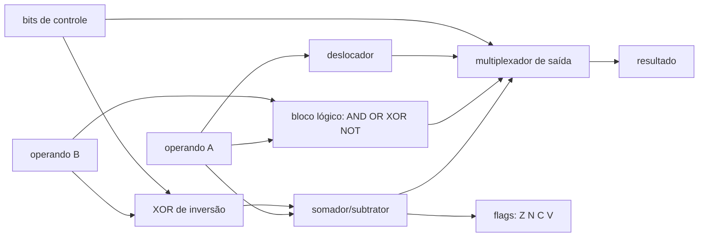

# 20 · Circuitos combinacionais — construindo com portas

**Nível:** intermediário · **Data:** 14/08/2026

**Definição de trabalho.** Um circuito é **combinacional** quando sua saída depende apenas
das entradas atuais — sem memória, sem realimentação, sem relógio. Formalmente: o grafo de
portas é acíclico.

Este arquivo constrói, do zero, todas as peças que um processador usa para calcular.

---

## 1. Aritmética binária: o que o circuito precisa saber

### 1.1 Soma

Igual à soma decimal, com um alfabeto menor:

```
    1 1 1        ← vai-um
    0 1 1 0      (6)
  + 0 1 0 1      (5)
  ─────────
    1 0 1 1      (11)  ✔
```

### 1.2 Números negativos — complemento de dois

**O problema.** Como representar −5 com fios que só sabem 0 e 1?

Três respostas históricas:

| Representação | Como | Defeito |
|---|---|---|
| Sinal e magnitude | 1 bit para o sinal | **dois zeros** (+0 e −0); soma exige comparar sinais |
| Complemento de um | inverta todos os bits | ainda tem dois zeros; soma exige "vai-um circular" |
| **Complemento de dois** | inverta e some 1 | **nenhum defeito relevante** — venceu |

**Como funciona.** Em n bits, o número negativo −x é representado por `2ⁿ − x`.

Exemplo em 4 bits: −5 → 16 − 5 = 11 → `1011`.

Teste: 3 + (−5) deveria dar −2.
```
    0 0 1 1   (3)
  + 1 0 1 1   (−5)
  ─────────
  1 1 1 1 0   → descarte o vai-um extra → 1110
```
E `1110` = 16 − 14 = ... representa −2 ✔.

**O ponto genial, e a razão de ter vencido:** o **mesmo somador** soma positivos e
negativos. Não existe circuito de subtração. Isso economiza silício e simplifica o
controle — o que, em 1960, quando cada porta custava caro, decidia arquiteturas.

**Como o hardware subtrai:** `a − b = a + ¬b + 1`. Inverta b (n portas XOR controladas por
um bit de modo) e entre com vai-um = 1. Uma ULA real usa exatamente esse truque:

```verilog
assign b_efetivo = b ^ {N{subtrai}};      // XOR com 1 inverte (ver 05, §3)
assign {carry, resultado} = a + b_efetivo + subtrai;
```

Uma linha, dois modos. Isso é elegância de engenharia.

### 1.3 Transbordo (overflow) — duas regras diferentes

| Interpretação | Como detectar |
|---|---|
| **Sem sinal** | o vai-um final é 1 |
| **Com sinal** (complemento de dois) | o vai-um **para** o bit de sinal difere do vai-um **do** bit de sinal: `overflow = c_n ⊕ c_{n−1}` |

Os dois casos são detectados por circuitos diferentes, e o processador expõe as duas flags
(`CF` e `OF` no x86). Confundi-las é uma fonte clássica de bug — inclusive em C, onde
overflow com sinal é comportamento indefinido e o compilador pode assumir que nunca ocorre.

---

## 2. Somadores — 70 anos de otimização

### 2.1 Ripple-carry: o simples

Já construído no [`04`](04-como-comecar.md) e no
[projeto-modelo](07-projeto-modelo/README.md).

| Métrica | Valor para n bits |
|---|---|
| Portas | ~5n (ou 9n NANDs) |
| **Profundidade (atraso)** | **~2n** |
| Área | mínima |

**O defeito é fatal em larga escala:** para 64 bits, são ~128 níveis de porta em série.
A 5 GHz, um ciclo dura 200 ps; com ~10 ps por porta, cabem ~20 níveis. Um ripple de 64 bits
levaria 6 ciclos só para somar. Inaceitável.

### 2.2 Carry-lookahead: calcular o vai-um sem esperar

**A ideia.** Para cada posição i, defina dois sinais que dependem só de a_i e b_i:

```
g_i = a_i · b_i        "GERA vai-um" — esta casa produz vai-um sozinha
p_i = a_i ⊕ b_i        "PROPAGA vai-um" — esta casa repassa o vai-um que receber
```

Então o vai-um de cada posição pode ser escrito **diretamente em função das entradas**:

```
c_1 = g_0 + p_0·c_0
c_2 = g_1 + p_1·g_0 + p_1·p_0·c_0
c_3 = g_2 + p_2·g_1 + p_2·p_1·g_0 + p_2·p_1·p_0·c_0
c_4 = g_3 + p_3·g_2 + p_3·p_2·g_1 + p_3·p_2·p_1·g_0 + p_3·p_2·p_1·p_0·c_0
```

Todos os c_i são calculados **em paralelo**, em profundidade 2 (um nível de AND, um de OR).

| Métrica | Ripple | Lookahead (4 bits) |
|---|---|---|
| Profundidade | ~2n | **~3, constante** |
| Portas | ~5n | ~2× mais |
| Fan-in máximo | 2 | **cresce com n** ← o limite |

**Por que não se faz lookahead de 64 bits de uma vez?** Porque `c_64` exigiria um AND de 65
entradas. Portas com fan-in alto são lentas (transistores em série) e não existem em
biblioteca. Na prática, monta-se lookahead em blocos de 4 bits, e blocos hierárquicos por
cima.

### 2.3 Os somadores de prefixo paralelo

Repare que o cálculo do vai-um é uma **soma de prefixos** com o operador associativo
`(g,p) ∘ (g',p') = (g + p·g', p·p')`. Isso permite usar todo o arsenal de algoritmos
paralelos:

| Somador | Profundidade | Portas | Fiação | Onde se usa |
|---|---|---|---|---|
| Ripple-carry | O(n) | O(n) | mínima | circuitos pequenos, baixo consumo |
| Carry-skip | O(√n) | O(n) | simples | meio-termo barato |
| Carry-select | O(√n) | O(n·√n) | média | comum em ASIC |
| **Kogge-Stone** | **O(log n)** | O(n log n) | **densa** | CPUs de alto desempenho |
| Brent-Kung | O(log n) | O(n) | esparsa | quando área importa mais |
| Ladner-Fischer | O(log n) | intermediário | média | compromisso |

**A lição geral, que vale para qualquer circuito:** existe um espectro contínuo entre
*pequeno e lento* e *grande e rápido*. Não há almoço grátis, e escolher o ponto certo do
espectro **é** o trabalho de projeto. O Kogge-Stone é o mais rápido e o mais caro em fios —
e em chips modernos, fios custam mais que portas.

### 2.4 Multiplicação

Multiplicar é somar deslocado, como na escola:

```
      1 0 1 1   (11)
    × 1 1 0 1   (13)
    ─────────
      1 0 1 1        ← ×1
    0 0 0 0          ← ×0, deslocado
  1 0 1 1            ← ×1, deslocado 2
1 0 1 1              ← ×1, deslocado 3
─────────────
1 0 0 0 1 1 1 1  (143) ✔
```

Cada produto parcial é um AND (custo 2 NANDs por bit!). Somar n produtos parciais é o caro.

| Técnica | Ideia | Atraso |
|---|---|---|
| Somas sucessivas (software) | laço de somas | O(n) ciclos — o que o [projeto-modelo](07-projeto-modelo/README.md) faz |
| Matriz de somadores | n² células | O(n) |
| **Árvore de Wallace / Dadda** | reduz 3 números a 2 com somadores *carry-save* | **O(log n)** |
| Booth | codifica o multiplicador, reduz produtos parciais pela metade | menos área |

Um multiplicador de 64×64 bits ocupa da ordem de **dezenas de milhares de portas** — mais
que uma CPU inteira dos anos 1970. É por isso que multiplicadores em hardware demoraram a
aparecer, e por que a chegada deles (anos 1980–90) mudou o que era viável em software.

---

## 3. Seleção e endereçamento

### 3.1 Multiplexador

Já visto no [`06`](06-exemplos.md), exemplo 4. Três fatos adicionais:

**Fato 1 — o mux é universal.** Um mux 2ⁿ→1 implementa qualquer função de n variáveis:
ligue as entradas de seleção às variáveis e as entradas de dados às constantes da
tabela-verdade. Nenhuma porta a mais é necessária.

**Fato 2 — é por isso que FPGAs funcionam.** Uma FPGA não tem portas AND e OR configuráveis;
ela tem **LUTs** (*look-up tables*), que são exatamente muxes com memória nas entradas de
dados. Uma LUT de 6 entradas implementa **qualquer** função de 6 variáveis. Toda a
flexibilidade da FPGA vem desse fato.

**Fato 3 — o mux é a peça mais repetida de um processador.** Cada escolha do caminho de
dados é um mux: qual registrador ler, de onde vem o operando, o que gravar, qual o próximo
endereço de instrução. Um núcleo moderno tem centenas de milhares deles.

### 3.2 Decodificador e a decodificação em dois níveis

Um decodificador k→2ᵏ cresce exponencialmente. Para 32 bits de endereço, seria impossível.

**Como memórias resolvem:** organizam as células numa **matriz** e usam dois decodificadores
pequenos — um para a linha, outro para a coluna.

```
endereço 32 bits = 16 bits de linha + 16 bits de coluna
custo: 2 × decodificador 16→65.536, em vez de 1 × 32→4 bilhões
```

Essa é a razão física dos sinais **RAS** (*row address strobe*) e **CAS** (*column address
strobe*) da DRAM — nomes que você vê nas especificações de módulos de memória e que agora
fazem sentido: o endereço é enviado em duas partes porque a matriz é decodificada em duas
dimensões.

### 3.3 Codificador de prioridade — caso real

**Problema.** Oito periféricos podem pedir interrupção ao mesmo tempo. Qual atender?

O **codificador de prioridade** devolve o índice da entrada ativa de maior prioridade, mais
um sinal de "havia alguém". É o coração de qualquer controlador de interrupções, e também
do escalonador de instruções de uma CPU superescalar (que precisa achar a próxima
instrução pronta entre dezenas de candidatas).

```verilog
module prioridade8(input wire [7:0] pedidos, output reg [2:0] quem, output wire algum);
    assign algum = |pedidos;               // redução OR
    always @(*) begin
        casez (pedidos)                    // casez: 'z' é "não importa"
            8'b1???????: quem = 3'd7;      // o de maior prioridade vence
            8'b01??????: quem = 3'd6;
            8'b001?????: quem = 3'd5;
            8'b0001????: quem = 3'd4;
            8'b00001???: quem = 3'd3;
            8'b000001??: quem = 3'd2;
            8'b0000001?: quem = 3'd1;
            8'b00000001: quem = 3'd0;
            default:     quem = 3'd0;
        endcase
    end
endmodule
```

**Armadilha real que isto ilustra:** prioridade fixa causa **inanição** (*starvation*) — o
periférico de menor prioridade pode nunca ser atendido se os de cima pedirem sempre.
Sistemas reais usam prioridade rotativa (*round-robin*), que é um codificador de prioridade
com um registrador de deslocamento na frente.

---

## 4. Deslocadores

### 4.1 Deslocamento fixo custa zero portas

Deslocar por uma quantidade **constante** é só ligar os fios em outra posição. Zero portas,
zero atraso.

É por isso que `x * 8` (= `x << 3`) é infinitamente mais barato que `x * 7`, e por isso que
compiladores substituem multiplicações por potências de 2 por deslocamentos. Aliás,
`x * 7` costuma virar `(x << 3) - x`: dois deslocamentos e uma subtração, ainda mais
barato que um multiplicador.

### 4.2 Barrel shifter — deslocamento variável em um ciclo

Deslocar por uma quantidade **variável** exige circuito. A construção é elegante:

```
entrada 32 bits
   │
   ├─ mux: desloca 16 ou não   (controlado pelo bit 4 da quantidade)
   ├─ mux: desloca  8 ou não   (bit 3)
   ├─ mux: desloca  4 ou não   (bit 2)
   ├─ mux: desloca  2 ou não   (bit 1)
   └─ mux: desloca  1 ou não   (bit 0)
saída
```

Cada estágio desloca por uma potência de 2 ou não desloca. Cinco estágios cobrem qualquer
deslocamento de 0 a 31 — a decomposição binária da quantidade.

**Custo:** n·log₂(n) muxes, profundidade log₂(n). Para 32 bits: 160 muxes, profundidade 5.

Todo processador moderno tem um barrel shifter, e ele não é barato — é comparável a um
somador em área.

---

## 5. Minimização — de tabela a circuito pequeno

### 5.1 Mapa de Karnaugh

Uma tabela-verdade reorganizada num retângulo onde **células vizinhas diferem em um único
bit** (ordem de Gray). Termos adjacentes que valem 1 podem ser fundidos, eliminando uma
variável.

Exemplo — `f(a,b,c,d) = Σm(0,1,2,3,8,9,10,11)`:

```
         cd=00  01   11   10
   ab=00   1    1    1    1
      01   0    0    0    0
      11   0    0    0    0
      10   1    1    1    1
```

Duas fileiras inteiras de 1s. Um grupo de 8 células elimina 3 variáveis:

```
f = ¬b
```

Oito mintermos de 4 variáveis reduzidos a **uma única entrada negada**. Sem simplificar,
seriam 8 ANDs de 4 entradas + 1 OR de 8. Simplificado: **um inversor**.

**Regras do Karnaugh:**
1. Agrupe apenas potências de 2 (1, 2, 4, 8, 16 células).
2. Grupos podem se sobrepor.
3. As bordas se tocam (o mapa é um toro — a coluna da direita é vizinha da esquerda).
4. Faça os grupos **maiores possíveis** e em **menor número possível**.
5. Condições "não importa" (X) podem ser usadas como 0 ou 1, conforme convier — elas são
   grátis e frequentemente reduzem muito o circuito.

**Limite honesto:** funciona bem até 4 variáveis, com esforço até 5–6, e é inútil acima
disso. Não é ferramenta profissional desde os anos 1980.

### 5.2 Quine–McCluskey

O mesmo resultado por algoritmo tabular, sem depender do olho humano — portanto
programável e correto para qualquer número de variáveis. O custo: complexidade exponencial
no pior caso. **Encontrar o circuito mínimo em soma de produtos é um problema NP-difícil.**

### 5.3 Espresso e a síntese moderna

Ferramentas reais (Espresso, criado em Berkeley nos anos 1980, e o que veio depois) usam
heurísticas: não garantem o mínimo absoluto, mas chegam perto em tempo viável, para
centenas de variáveis. É isso que roda dentro do Yosys, do Vivado e do Design Compiler.

**Como o profissional trabalha em 2026:** descreve o comportamento em Verilog/VHDL e deixa
a ferramenta minimizar. Karnaugh serve para entender o que a ferramenta faz — e para não
tratá-la como oráculo.

---

## 6. A ULA — juntando tudo

Uma **Unidade Lógica e Aritmética** é o bloco que faz as operações do processador. A
estrutura canônica:



**Decisões de projeto que o desenho revela:**

1. **Um único somador** faz soma e subtração, graças ao XOR de inversão (§1.2).
2. **Tudo é calculado em paralelo** e o mux escolhe. Desperdício deliberado, em troca de
   velocidade — ver a Decisão 4 do [projeto-modelo](07-projeto-modelo/README.md).
3. **As flags saem quase de graça** do somador: Z (zero) é um NOR de todos os bits do
   resultado; N (negativo) é o bit mais significativo; C (carry) é o vai-um final;
   V (overflow) é `c_n ⊕ c_{n−1}`.
4. **O caminho crítico passa pelo somador.** Por isso 70 anos de pesquisa em somadores
   rápidos: acelerar o somador acelera a máquina inteira.

O projeto-modelo mede uma ULA de 4 bits com 8 operações em **242 portas NAND**, ou ~60 por
bit. Extrapolando de forma grosseira, uma ULA de 64 bits com o mesmo estilo ficaria na casa
de 4.000 portas — e uma ULA real de alto desempenho, com multiplicador e barrel shifter,
passa de 100.000.

---

## 7. Hazards — os glitches da lógica combinacional

Já introduzidos no [`12`](12-do-transistor-a-porta.md), §8. A taxonomia formal:

| Tipo | O que é | Quando ocorre |
|---|---|---|
| **Hazard estático-1** | a saída deveria ficar em 1, mas dá um pulso para 0 | uma entrada muda e dois caminhos têm atrasos diferentes |
| **Hazard estático-0** | deveria ficar em 0, dá um pulso para 1 | idem, na forma dual |
| **Hazard dinâmico** | a saída muda 0→1 mas oscila algumas vezes | múltiplos caminhos com atrasos diferentes |
| **Hazard funcional** | duas entradas mudam quase juntas | inevitável por redesenho — só a sincronia resolve |

**A cura estrutural:** acrescentar o **termo de consenso** ao mapa de Karnaugh. Se dois
grupos adjacentes não se sobrepõem, o glitch mora na fronteira entre eles; adicionar um
grupo que cubra a fronteira (logicamente redundante) elimina o pulso.

**A cura prática, e a que a indústria usa:** projeto **síncrono**. Deixe os glitches
acontecerem à vontade e só olhe o resultado na borda do relógio, depois que tudo assentou.
É por isso que o projeto síncrono venceu, apesar de desperdiçar tempo esperando o pior
caso — a alternativa exige raciocinar sobre todos os atrasos possíveis, o que não escala.

---

## Autoteste

1. Por que o complemento de dois venceu as outras representações de números negativos?
2. Como um somador subtrai, sem existir circuito de subtração?
3. Qual é a diferença entre detectar overflow com sinal e sem sinal?
4. Qual é o defeito do somador ripple-carry, e por que ele é fatal em 64 bits?
5. O que são os sinais "gera" (g) e "propaga" (p), e por que permitem calcular vai-um em paralelo?
6. Por que não se faz carry-lookahead de 64 bits num só nível?
7. Por que um mux 2ⁿ→1 pode implementar qualquer função de n variáveis? Que tecnologia se baseia nisso?
8. Por que memórias usam decodificação em dois níveis? Que sinais reais isso originou?
9. Quantas portas custa deslocar por uma quantidade fixa? E por uma variável?
10. Até quantas variáveis o mapa de Karnaugh é utilizável, e por que ele ainda é ensinado?
11. Encontrar o circuito mínimo em soma de produtos é um problema fácil? Justifique.
12. Cite quatro decisões de projeto visíveis no diagrama de uma ULA.
13. O que é um hazard estático-1, e quais são as duas curas?

*(Respostas: 1 — um único zero e o mesmo somador serve para soma e subtração; 2 — inverte
b e entra com vai-um 1: a − b = a + ¬b + 1; 3 — sem sinal é o vai-um final, com sinal é
c_n ⊕ c_{n−1}; 4 — atraso O(n), ~128 níveis em 64 bits, muito mais que um ciclo de relógio;
5 — g = a·b, p = a⊕b; permitem escrever cada c_i diretamente em função das entradas;
6 — exigiria portas com fan-in de 65 entradas, que são lentas e não existem em biblioteca;
7 — ligue as variáveis à seleção e as constantes da tabela aos dados; é a base das LUTs de
FPGA; 8 — porque um decodificador de 32 bits teria 4 bilhões de saídas; originou RAS e CAS;
9 — zero e n·log n muxes; 10 — até 4 confortavelmente, e é ensinado porque torna a
minimização compreensível; 11 — não, é NP-difícil, por isso se usam heurísticas como o
Espresso; 12 — somador único para soma e subtração, cálculo paralelo com mux de saída,
flags derivadas do somador, caminho crítico passando pelo somador; 13 — pulso espúrio para
0 numa saída que deveria ficar em 1; curas: termo de consenso ou projeto síncrono.)*
