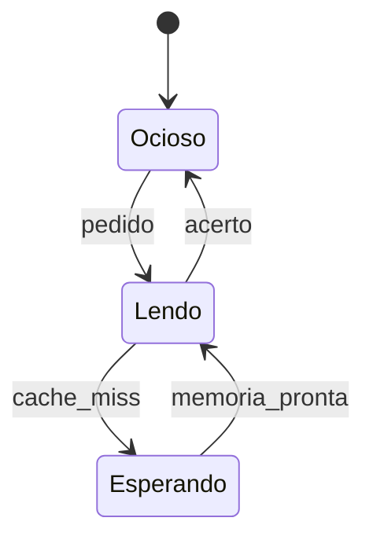

# 30 · Circuitos sequenciais — como um circuito lembra

**Nível:** intermediário → avançado · **Data:** 14/08/2026

Até aqui, todo circuito era uma função: mesmas entradas, mesma saída, sempre. Este arquivo
introduz o **tempo** — e com ele, memória, estado, relógio e a classe inteira de problemas
que faz projeto de hardware ser difícil.

---

## 1. A ideia central: realimentação

**Um circuito combinacional é um grafo acíclico.** Feche um ciclo e tudo muda.

Considere dois inversores em série, com a saída ligada de volta à entrada:

```
       ┌──────────────────┐
       │                  │
       └─►[NOT]──►[NOT]───┘
```

Se o nó vale 1, o primeiro NOT produz 0, o segundo produz 1 — que é o que já estava lá.
**O estado se sustenta.** Se valesse 0, também se sustentaria. Duas configurações estáveis:
o circuito guarda **um bit**.

Esse é o mecanismo inteiro. Toda memória de todos os computadores — registradores, cache,
RAM, os 5,3 trilhões de células de um chip de flash — descende desta ideia.

**Problema deste circuito específico:** não há como escrever nele. Precisamos de entradas.

---

## 2. Latch SR — a menor memória possível

Substitua os inversores por portas NAND, aproveitando a entrada extra para controle:

```
    S̄ ──┐
        │ NAND ├──┬─────────► Q
    ┌───┘         │
    │             │
    │   ┌─────────┘
    └───┼──────┐
        │      │ NAND ├──┬───► Q̄
    R̄ ──┴──────┘         │
        └────────────────┘
```

| S̄ | R̄ | Q | Nome do estado |
|---|---|---|---|
| 1 | 1 | mantém | **memória** |
| 0 | 1 | 1 | *set* (grava 1) |
| 1 | 0 | 0 | *reset* (grava 0) |
| 0 | 0 | **1 e Q̄=1** | **proibido** |

**Duas portas.** É a menor memória em lógica estática, e o projeto-modelo a implementa e a
testa, incluindo o estado proibido.

### 2.1 Por que o estado proibido é proibido

Com S̄ = R̄ = 0, ambas as saídas vão para 1 — o que viola a definição (Q̄ deveria ser o
oposto de Q). Isso por si só é feio, mas tolerável.

O problema real é **sair** desse estado. Se S̄ e R̄ voltarem a 1 **simultaneamente**, as duas
portas tentam mudar ao mesmo tempo, cada uma dependendo da outra. Quem "vence" depende de
diferenças de atraso de picossegundos — variações de fabricação, temperatura, tensão.
O resultado é **imprevisível**, e pode inclusive oscilar.

O [projeto-modelo](07-projeto-modelo/README.md) reproduz isso: o simulador roda até 12
iterações, não converge, e marca `instavel = True`. Não é limitação do simulador — é o
fenômeno físico, discretizado.

---

## 3. Latch D — eliminando o estado proibido

```verilog
// s_bar e r_bar derivados do MESMO d: impossível pedir 0,0
wire a = ~(d & habilita);
wire b = ~(a & habilita);
// a e b alimentam o latch SR
```

| habilita | Comportamento |
|---|---|
| 1 | **transparente**: Q acompanha D como se fosse um fio |
| 0 | **congelado**: Q mantém o último valor |

Custo: **4 NANDs**. Sem estado proibido, porque `s_bar` e `r_bar` nunca ficam ambos em 0.

**O defeito que sobra: a transparência.** Enquanto habilitado, mudanças na entrada
atravessam imediatamente. Se a saída deste latch alimenta lógica que volta à sua entrada,
o sinal pode dar duas voltas num mesmo pulso de habilitação — uma **corrida** (*race*).
Isso é uma classe de bug que só aparece em silício, sob certas temperaturas, em 1 chip
a cada mil.

---

## 4. Flip-flop D — capturar num instante, não num intervalo

**A solução mestre-escravo:** dois latches D em série, com habilitações **opostas**.

```
        ┌──────────┐        ┌──────────┐
  D ───►│ latch D  ├───────►│ latch D  ├──► Q
        │ (mestre) │        │(escravo) │
        └────▲─────┘        └────▲─────┘
             │                   │
           ¬clk                 clk
```

| clk | Mestre | Escravo | Efeito |
|---|---|---|---|
| 0 | **aberto** (olha D) | fechado | a entrada é observada, a saída fica firme |
| 0→1 | fecha | abre | **captura**: o valor congelado no mestre aparece na saída |
| 1 | fechado | aberto | mudanças em D são ignoradas |

**Em nenhum instante existe um caminho aberto de D até Q.** Isso elimina a corrida. Custo:
9 NANDs (4 + 4 + 1 inversor).

Este é **o** elemento de memória do mundo. Praticamente todo hardware digital síncrono
fabricado desde 1980 é feito de flip-flops D e lógica combinacional entre eles.

### 4.1 O modelo mental que resolve tudo

```
  ┌───────────┐   lógica combinacional   ┌───────────┐
  │ flip-flops│ ────────────────────────►│ flip-flops│
  └─────▲─────┘   (glitches à vontade)   └─────▲─────┘
        │                                      │
        └──────────────── clk ─────────────────┘
```

Um circuito síncrono é **exatamente isso**, repetido. Entre duas bordas de relógio, a
lógica combinacional pode oscilar, gerar glitches, fazer o que quiser. Ninguém está olhando.
Na borda, tudo precisa estar assentado.

Toda a disciplina de projeto digital cabe nesta frase: **dê tempo suficiente entre as
bordas para tudo assentar.**

---

## 5. Tempo: setup, hold e a frequência máxima

### 5.1 As três janelas

| Parâmetro | Definição | O que acontece se violado |
|---|---|---|
| **t_setup** | o dado deve estar estável X antes da borda | captura errada ou metaestabilidade |
| **t_hold** | o dado deve continuar estável X depois da borda | captura errada |
| **t_cq** | atraso da borda até a saída mudar | limita a frequência |

```
             ┌── t_setup ──┬── t_hold ──┐
   D  ───────┤   ESTÁVEL   │  ESTÁVEL   ├────────
                           │
   clk ──────────────────┐ │ ┌────────────
                         └─┴─┘  ← a borda
```

### 5.2 A equação do timing

```
T_ciclo  ≥  t_cq + t_pd(máx) + t_setup + skew

f_max = 1 / T_ciclo
```

| Termo | O que é | Como reduzir |
|---|---|---|
| t_cq | atraso do flip-flop | célula mais rápida |
| **t_pd(máx)** | **caminho crítico** da lógica combinacional | **pipeline, ou lógica mais rasa** |
| t_setup | exigência do flip-flop de destino | célula diferente |
| skew | diferença de chegada do relógio entre os dois flip-flops | árvore de relógio balanceada |

**Este é o cálculo que define o clock de um processador.** "Fechar o timing" significa
garantir que **todos** os milhões de caminhos do chip satisfazem essa desigualdade. Não a
média: todos, inclusive o pior.

### 5.3 A violação de hold é pior que a de setup

| | Setup | Hold |
|---|---|---|
| Causa | caminho **muito lento** | caminho **muito rápido** |
| Solução | baixar a frequência | **não existe** — a frequência não ajuda |
| Correção | reduzir lógica, pipelinizar | inserir buffers de atraso, refazer o layout |
| Quando aparece | simulação de timing | frequentemente só no silício |

Violação de hold é a mais temida porque **não se conserta por software nem por frequência**.
Um chip com violação de hold é um chip morto — volta para a fábrica. Já houve *respins* de
milhões de dólares por isso.

---

## 6. Metaestabilidade — o fantasma real

**O fenômeno.** Se um flip-flop capturar um dado que muda exatamente dentro da janela de
setup/hold, ele pode entrar num estado **entre 0 e 1**: uma tensão intermediária que
permanece por um tempo indefinido antes de cair para um dos lados.

**Isso não é bug de projeto nem falha de fabricação.** É consequência matemática: o
flip-flop é um sistema com dois pontos estáveis e um ponto de equilíbrio instável entre
eles, como um lápis em pé na ponta. Existe sempre uma condição de entrada que o deixa
exatamente no equilíbrio.

**A probabilidade de ainda estar metaestável depois de um tempo t decai exponencialmente:**

```
MTBF = e^(t/τ) / (f_clk × f_dados × T_janela)
```

Onde MTBF é o tempo médio entre falhas, τ é uma constante da tecnologia (picossegundos), e
T_janela é a largura da janela de vulnerabilidade.

**A prática:** não se elimina metaestabilidade — **empurra-se a probabilidade para baixo**
até o MTBF ser maior que a idade do universo. Isso se faz com um **sincronizador de dois
flip-flops** em série:

```verilog
// O padrão da indústria para qualquer sinal que cruza domínios de relógio
always @(posedge clk) begin
    sinc1 <= sinal_assincrono;   // pode ficar metaestável
    sinc2 <= sinc1;              // dá um ciclo inteiro para assentar
end
// use sinc2, nunca sinc1, e JAMAIS sinal_assincrono direto
```

**Regra sem exceção:** todo sinal que cruza de um domínio de relógio para outro, ou que vem
do mundo externo (botão, sensor, outro chip), **precisa** passar por um sincronizador.
Ignorar isso produz o pior tipo de bug: raro, não reprodutível, e que aparece só no cliente.

Bancos de FIFO assíncrono, código Gray para contadores que cruzam domínios, e *handshake*
de duas fases são as ferramentas para casos mais complexos.

---

## 7. Registradores, contadores e memória

| Peça | Construção | Custo (projeto-modelo) |
|---|---|---|
| Registrador de n bits | n flip-flops com o mesmo relógio | 4 bits = 52 NANDs |
| Registrador com carga | + um mux por bit | incluso nos 52 |
| Contador | registrador + incrementador | 4 bits = 88 NANDs |
| Registrador de deslocamento | flip-flops em cadeia | n × 9 NANDs |
| Banco de registradores | decodificador + registradores + mux de leitura | 4×4 = 266 NANDs |

### 7.1 O número que muda tudo

266 portas para guardar 16 bits = **~66 portas por bit**.

Compare:

| Tecnologia | Transistores por bit | Portas equivalentes por bit |
|---|---|---|
| Flip-flops (como no projeto-modelo) | ~26 | ~66 (com mux e decodificação) |
| **Célula SRAM (6T)** | **6** | ~1,5 |
| **Célula DRAM (1T1C)** | **1** + capacitor | ~0,25 |
| Flash NAND (célula multinível) | <1 (bits compartilham) | — |

**Um flip-flop é ~40× mais caro por bit que uma célula SRAM, e ~100× mais caro que DRAM.**

Por isso a hierarquia de memória existe, e por isso ela tem exatamente essa forma:

| Nível | Tecnologia | Tamanho típico | Latência |
|---|---|---|---|
| Registradores | flip-flops | 32 × 64 bits | 0 ciclos |
| Cache L1 | SRAM | 32–64 KB | ~4 ciclos |
| Cache L2/L3 | SRAM | 1–64 MB | 12–50 ciclos |
| RAM principal | DRAM | 8–128 GB | ~200 ciclos |
| SSD | Flash | 0,5–8 TB | ~100.000 ciclos |

A hierarquia não é uma escolha de arquitetura — é **a consequência direta do custo por bit
de cada tecnologia**. E a razão dessa cadeia inteira está na tabela acima.

**E é também a razão pela qual não se conta portas dividindo transistores por 4.**
A maior parte do silício de um chip moderno é SRAM, que não é porta lógica. Ver
[`50-quantas-portas-tem-um-computador.md`](50-quantas-portas-tem-um-computador.md).

---

## 8. Máquinas de estados finitos

**Definição.** Uma **FSM** (*finite state machine*) é a formalização de um circuito
sequencial: um conjunto finito de estados, uma função de transição e uma função de saída.



**Duas variedades, e a diferença importa:**

| | **Moore** | **Mealy** |
|---|---|---|
| A saída depende de | só do estado | do estado **e** da entrada |
| Reação | um ciclo depois | no mesmo ciclo |
| Saída tem glitch? | não (vem direto de flip-flops) | **pode** |
| Número de estados | tende a ser maior | tende a ser menor |
| Quando usar | quase sempre | quando um ciclo de latência é inaceitável |

**Recomendação profissional:** use Moore por padrão. As saídas saem limpas dos flip-flops,
o timing é previsível, e a depuração é muito mais simples. Vá para Mealy só quando medir
que o ciclo extra custa caro.

### 8.1 Codificação de estados — uma decisão real

| Codificação | 8 estados usam | Vantagem | Desvantagem |
|---|---|---|---|
| Binária | 3 flip-flops | menos flip-flops | mais lógica de decodificação |
| Gray | 3 flip-flops | um bit muda por transição — menos ruído e consumo | só ajuda em sequências |
| **One-hot** | **8 flip-flops** | decodificação trivial (1 bit = 1 estado), mais rápida | mais flip-flops |

**Em FPGA, one-hot quase sempre vence**, porque flip-flops são abundantes e a lógica
combinacional é o recurso escasso. Em ASIC, depende. Ferramentas modernas escolhem sozinhas
— mas saber por quê é o que permite discordar delas quando estiverem erradas.

---

## 9. Reset — o detalhe que derruba projetos

Um flip-flop sem reset acorda num valor **indefinido**. Numa FPGA há inicialização no
*bitstream*; num ASIC, não há: ao ligar a energia, cada flip-flop cai aleatoriamente em 0
ou 1.

| Tipo de reset | Como funciona | Prós e contras |
|---|---|---|
| **Assíncrono** | age sem relógio | funciona antes do relógio existir; risco na **soltura** do reset |
| **Síncrono** | age na borda | previsível e fácil de analisar; exige relógio funcionando |
| **Assíncrono na aplicação, síncrono na soltura** | o melhor dos dois | **é o padrão da indústria** |

O risco da soltura: se o reset for liberado perto de uma borda de relógio, diferentes
flip-flops podem sair do reset em ciclos diferentes, e a máquina de estados acorda num
estado inconsistente. A solução — soltar o reset de forma sincronizada — é um circuito de
poucas portas que evita uma classe inteira de falhas intermitentes.

**Nem tudo precisa de reset.** Registradores de caminho de dados (o que está sendo somado)
costumam dispensar, porque serão sobrescritos antes de importar. Registradores de
**controle** (máquinas de estado, contadores, flags) **sempre** precisam. Resetar tudo
desnecessariamente engorda a rede de reset, que já é uma das maiores do chip.

---

## 10. Pipeline — trocar latência por vazão

Se o caminho crítico é longo demais, **corte-o ao meio com flip-flops**:

```
Sem pipeline:  [───── lógica de 20 ns ─────] → f_max = 50 MHz
Com pipeline:  [── 10 ns ──][FF][── 10 ns ──] → f_max = 100 MHz
```

| | Sem pipeline | Com pipeline (2 estágios) |
|---|---|---|
| Frequência | 50 MHz | **100 MHz** |
| Latência de um resultado | 20 ns | 20 ns (igual!) |
| **Vazão** | 50 M/s | **100 M/s** |
| Flip-flops | n | 2n |

**Pipeline não acelera uma operação — acelera a linha de produção.** É exatamente a mesma
ideia de Henry Ford: cada estação faz menos, mas o carro sai da linha com o dobro da
frequência.

O custo, que os livros costumam subestimar: mais flip-flops (área e consumo), e a
necessidade de **tratar dependências**. Se uma instrução precisa do resultado da anterior,
que ainda está no meio do pipeline, é preciso *forwarding* ou parada (*stall*). É daí que
vem metade da complexidade de um processador moderno, e é o assunto do
[`40-da-porta-ao-computador.md`](40-da-porta-ao-computador.md).

---

## Autoteste

1. Qual é a única diferença estrutural entre circuito combinacional e sequencial?
2. Por que o estado S̄=R̄=0 é proibido num latch SR, e o que acontece ao sair dele?
3. Qual defeito do latch D o flip-flop mestre-escravo resolve, e como?
4. Escreva a equação da frequência máxima e explique cada termo.
5. Por que uma violação de hold é pior que uma de setup?
6. O que é metaestabilidade? Ela pode ser eliminada?
7. Qual é o padrão da indústria para sinais que cruzam domínios de relógio?
8. Quantos transistores por bit tem um flip-flop, uma SRAM e uma DRAM? Que consequência isso tem?
9. Por que a hierarquia de memória existe, em uma frase?
10. Qual a diferença entre FSM de Moore e de Mealy, e qual usar por padrão?
11. Por que one-hot costuma vencer em FPGA?
12. Por que o reset assíncrono precisa de soltura síncrona?
13. O pipeline reduz a latência de uma operação? O que ele melhora?

*(Respostas: 1 — a existência de um ciclo de realimentação no grafo; 2 — porque as duas
saídas vão a 1 e, ao soltar as entradas juntas, o resultado depende de atrasos de
picossegundos e pode oscilar; 3 — a transparência, que permite corridas; resolve porque
nunca há caminho aberto de D a Q; 4 — f_max = 1/(t_cq + t_pd + t_setup + skew); 5 — não se
corrige baixando a frequência, exige refazer o layout, e costuma aparecer só no silício;
6 — estado intermediário de duração indefinida ao violar setup/hold; não se elimina, só se
reduz a probabilidade; 7 — sincronizador de dois flip-flops em série; 8 — ~26, 6 e 1+capacitor,
o que gera a hierarquia de memória; 9 — porque o custo por bit varia ~100× entre as
tecnologias; 10 — Moore depende só do estado e não tem glitch na saída; use Moore por
padrão; 11 — flip-flops são abundantes e a lógica combinacional é o recurso escasso;
12 — para que todos os flip-flops saiam do reset no mesmo ciclo; 13 — não, mantém a
latência e dobra a vazão.)*
