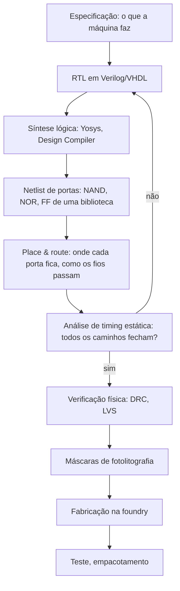

# 40 · Da porta ao computador — onde as portas são gastas

**Nível:** avançado · **Data:** 14/08/2026

Você já tem todas as peças: somador, mux, decodificador, registrador, flip-flop, FSM.
Este arquivo as monta num processador e mostra, bloco por bloco, **onde as portas vão parar**.

---

## 1. A ideia de von Neumann, e o que ela custa em portas

Um processador de programa armazenado faz cinco coisas em laço:


Cada caixa vira hardware específico:

| Etapa | Peça de hardware | Peças que a compõem |
|---|---|---|
| Buscar | contador de programa + interface de memória | registrador + somador |
| Decodificar | decodificador + lógica de controle | decodificador + PLA/lógica aleatória |
| Ler | banco de registradores | decodificador + array de flip-flops/SRAM + muxes |
| Executar | ULA, deslocador, multiplicador | somadores, muxes, lógica |
| Escrever | muxes de escrita + habilitações | muxes |

O [projeto-modelo](07-projeto-modelo/README.md) implementa exatamente isso, em 4 bits, com
**829 portas**. Um RISC-V de 32 bits faz o mesmo com dezenas de milhares.

---

## 2. Caminho de dados de um RISC-V de ciclo único

O RISC-V é a arquitetura de referência aqui porque é aberta, moderna e projetada para ser
implementável — o oposto do x86, cuja decodificação sozinha consome mais portas que um
núcleo RISC-V inteiro.

```
        ┌────┐        ┌──────────┐         ┌──────────────┐
    ┌──►│ PC ├───────►│ Memória  │────────►│ Decodificador│
    │   └────┘        │ de instr.│  instr. │   + controle │
    │      │          └──────────┘         └──────┬───────┘
    │   ┌──┴───┐                                  │ sinais de controle
    │   │ PC+4 │                                  ▼
    │   └──┬───┘      ┌───────────────┐    ┌──────────────┐
    │      │          │  Banco de     │───►│              │
    │   ┌──▼───┐      │  registradores│    │     ULA      │──┐
    └───┤ mux  │◄─────┤  (32 × 32)    │───►│              │  │
        └──▲───┘      └───────▲───────┘    └──────┬───────┘  │
           │                  │                   │          │
           │            ┌─────┴──────┐     ┌──────▼───────┐  │
           └────────────┤ resultado  │◄────┤ Memória de   │◄─┘
              desvio    │  (mux)     │     │ dados        │
                        └────────────┘     └──────────────┘
```

### 2.1 Orçamento de portas, bloco a bloco

Estimativas para um núcleo RISC-V RV32I simples, de ciclo único. **São ordens de grandeza,
não números de fabricante** — as fontes públicas variam bastante conforme a implementação,
a biblioteca de células e o que se conta como "o núcleo".

| Bloco | Portas equivalentes (estimativa) | % | Por que custa isso |
|---|---|---|---|
| **Banco de registradores** (32×32 bits) | ~15.000–25.000 | ~40% | 1.024 bits de armazenamento + 2 portas de leitura + 1 de escrita, cada porta um mux 32→1 de 32 bits |
| **ULA** (soma, sub, lógicas, shift, comparações) | ~5.000–8.000 | ~20% | somador de 32 bits + barrel shifter + muxes |
| **Decodificador e controle** | ~1.000–3.000 | ~8% | RISC-V é fácil de decodificar, por projeto |
| **Extensor de imediatos** | ~500 | ~2% | muxes e refiação |
| **Cálculo de desvio e PC** | ~1.500 | ~5% | somador de 32 bits + comparador + muxes |
| **Muxes do caminho de dados** | ~3.000 | ~10% | dezenas de muxes de 32 bits |
| **Registradores de pipeline** (se pipelinizado) | ~5.000 | ~15% | centenas de flip-flops |
| **Total do núcleo** | **~30.000–50.000** | 100% | |

**A surpresa que quase todo iniciante tem:** a ULA — a parte que "faz a conta", a que dá
nome ao processador — é **minoria**. O banco de registradores, que só guarda e entrega
números, custa mais que o dobro dela.

**A razão, e vale internalizar:** armazenar e **mover** dados custa mais que operar sobre
eles. Isso não é uma peculiaridade do RISC-V; é uma verdade geral da computação, que
reaparece em todas as escalas:

| Escala | Manifestação |
|---|---|
| Portas | banco de registradores > ULA |
| Chip | cache ocupa mais área que a lógica |
| Energia | ler da DRAM custa ~100× mais energia que uma soma |
| Sistema | rede e disco são o gargalo, não a CPU |
| Data center | movimentação de dados domina a conta de energia |

---

## 3. Onde as portas vão num chip de verdade

Suba um nível: do núcleo para o SoC (*system on chip*) inteiro.

| Bloco | Fração típica da área de um SoC de celular/notebook |
|---|---|
| **Caches (SRAM)** | **30–50%** |
| Núcleos de CPU (lógica) | 10–20% |
| GPU | 15–30% |
| NPU / acelerador de IA | 5–15% |
| Controlador de memória e PHYs | 5–10% |
| E/S (USB, PCIe, display, câmera) | 5–15% |
| Gerenciamento de energia e relógio | 3–8% |

*(Faixas típicas de fontes públicas de análise de die shots; a composição exata varia muito
por produto. Não são números oficiais de fabricante.)*

**A metade do seu chip é memória, não lógica.** E a maior parte da lógica não é "o
processador" no sentido ingênuo — é infraestrutura para alimentar o processador com dados
rápido o bastante.

---

## 4. Pipeline: onde as portas viram velocidade

Um processador de ciclo único é limitado pelo caminho mais longo: buscar + decodificar +
ler + executar + escrever, tudo num ciclo. Pipelinizar corta esse caminho em pedaços.

O pipeline clássico de 5 estágios (do MIPS, e adotado por praticamente todo livro-texto):

```
     IF        ID        EX       MEM       WB
   busca → decodifica → executa → memória → escreve
     │        │          │         │         │
    [FF]     [FF]       [FF]      [FF]      [FF]   ← registradores de pipeline
```

| Métrica | Ciclo único | Pipeline de 5 estágios |
|---|---|---|
| Frequência | 1× | ~4× |
| Instruções por ciclo (ideal) | 1 | 1 |
| **Vazão** | 1× | **~4×** |
| Latência de uma instrução | 1 ciclo longo | 5 ciclos curtos |
| Portas extras | — | +15–25% (registradores de pipeline + lógica de perigos) |

### 4.1 O preço: perigos (hazards)

| Perigo | Situação | Solução em hardware | Custo em portas |
|---|---|---|---|
| **De dados** | uma instrução precisa do resultado da anterior, ainda no pipeline | **forwarding**: muxes que pegam o valor de estágios adiante | comparadores + muxes largos |
| **De controle** | desvio: não se sabe qual a próxima instrução | previsão de desvio + descarte | tabelas de histórico, caro |
| **Estrutural** | dois estágios querem o mesmo recurso | duplicar o recurso | área |

**A previsão de desvio é onde a economia do hardware fica estranha.** Um preditor moderno
(TAGE, perceptron) pode usar **dezenas de kilobytes de tabelas** e centenas de milhares de
portas — mais que a ULA inteira — para adivinhar uma coisa só: se um `if` vai ser tomado.

Vale a pena? Vale, e muito. Com um pipeline de 15–20 estágios, cada erro de previsão custa
15–20 ciclos jogados fora. Passar de 90% para 97% de acerto pode valer 30% de desempenho.
**É racional gastar mais silício adivinhando do que calculando.**

Essa é, na minha opinião, a estatística que melhor explica por que processadores modernos
são tão maiores que os antigos sem serem proporcionalmente mais rápidos: a maior parte do
silício extra foi gasta lutando contra a latência, não aumentando a capacidade de cálculo.

---

## 5. Superescalar e execução fora de ordem

Um processador moderno de alto desempenho (Apple M-series, AMD Zen, Intel Core) executa 4 a
10 instruções por ciclo, fora de ordem. Isso exige:

| Estrutura | O que faz | Custo relativo |
|---|---|---|
| Decodificadores múltiplos | decodificar 4–8 instruções por ciclo | alto em x86, baixo em ARM/RISC-V |
| **Renomeação de registradores** | eliminar dependências falsas | tabelas + comparadores, muito caro |
| **Janela de instruções / scheduler** | achar instruções prontas entre ~200–600 candidatas | **O(n²) em comparadores** — o bloco mais caro |
| Buffer de reordenação (ROB) | garantir que os efeitos aconteçam na ordem certa | centenas de entradas |
| Múltiplas unidades de execução | 4–8 ULAs, 2–4 unidades de memória | várias ULAs completas |

**O escalonador é O(n²).** Cada instrução da janela precisa comparar seus operandos com
todos os resultados que estão sendo produzidos. Dobrar a janela quadruplica os
comparadores. É por isso que as janelas cresceram muito mais devagar que a contagem de
transistores — há um limite prático que não é de fabricação, mas de escalabilidade do
próprio algoritmo em hardware.

**Comparação de escala honesta:**

| Processador | Portas do núcleo (estimativa) | Fator vs. o projeto-modelo (829) |
|---|---|---|
| Projeto-modelo (4 bits) | 829 | 1× |
| Intel 4004 (1971) | ~1.000 | ~1,2× |
| RISC-V RV32I simples | ~30.000 | ~36× |
| ARM Cortex-M0 | ~12.000 (dado publicado pela ARM como "~12k portas") | ~14× |
| Núcleo de alto desempenho de 2026 | ~50–200 milhões (só a lógica, sem cache) | ~10⁵× |

---

## 6. O caminho completo: da porta ao produto



**Onde as portas aparecem nesse fluxo:** no passo D. O projetista escreve comportamento; a
ferramenta de síntese escolhe as portas de uma **biblioteca de células padrão** — um
catálogo, fornecido pela foundry, com centenas de variantes (NAND de 2, 3, 4 entradas, cada
uma em 5 tamanhos de acionamento, mais flip-flops com e sem reset, e assim por diante).

**É por isso que "quantas portas tem este chip" é uma pergunta que só o projetista pode
responder** — o número está no relatório de síntese, é informação interna, e muda a cada
recompilação. O que se publica é a contagem de transistores e a área em mm².

### 6.1 Ordens de grandeza do processo (2026)

| Etapa | Tempo típico | Custo |
|---|---|---|
| Síntese de um núcleo médio | minutos a horas | licença de software |
| Place & route de um SoC | **dias** | licenças caras |
| Análise de timing de assinatura | horas a dias | idem |
| Conjunto de máscaras em nó avançado | semanas | **US$ 10–50 milhões** (nós de 3 a 2 nm) |
| Volta de fabricação (*tapeout* a silício) | 3–4 meses | — |

Esses números explicam a cultura da área: com um erro custando meses e dezenas de milhões,
verificação consome **60–70% do esforço de um projeto de chip**. Em software, corrige-se e
reimplanta-se; em silício, não existe correção depois da máscara.

---

## 7. Por que RISC-V e ARM ganharam espaço do x86, em termos de portas

| Aspecto | x86 | ARM / RISC-V |
|---|---|---|
| Instruções de tamanho | variável (1 a 15 bytes) | fixo (4 bytes, ou 2 com compressão) |
| Decodificação | **muito cara**: é preciso descobrir onde a instrução termina antes de decodificá-la | trivial e paralelizável |
| Portas só no decodificador | centenas de milhares | dezenas de milhares |
| Consequência | pior em desempenho por watt; decodificadores múltiplos são difíceis | mais fácil decodificar 8 por ciclo |

O x86 compensa com micro-operações e cache de µops (uma memória que guarda instruções já
decodificadas, para não pagar a decodificação de novo em laços). Mas isso é **mais portas
gastas para contornar uma decisão de projeto de 1978**.

**A lição de arquitetura, e ela é geral:** decisões de formato de instrução tomadas há
décadas continuam custando portas hoje. Compatibilidade retroativa tem preço em silício,
e esse preço é pago em cada chip fabricado, para sempre.

---

## Autoteste

1. Quais são os cinco passos do laço de um processador de programa armazenado?
2. Num RISC-V simples, qual bloco consome mais portas: a ULA ou o banco de registradores? Por quê?
3. Qual princípio geral da computação isso ilustra?
4. Que fração da área de um SoC moderno é memória?
5. O que o pipeline melhora, e o que ele **não** melhora?
6. Por que é racional gastar mais silício em previsão de desvio do que na ULA?
7. Por que a janela de instruções de processadores fora de ordem cresceu tão devagar?
8. Quantas vezes mais portas tem um RISC-V RV32I que o projeto-modelo deste curso?
9. Em que etapa do fluxo de projeto as portas efetivamente aparecem?
10. Por que fabricantes publicam contagem de transistores, mas não de portas?
11. Por que a decodificação do x86 custa tantas portas a mais que a do ARM?
12. Por que verificação consome 60–70% do esforço de um projeto de chip?

*(Respostas: 1 — buscar, decodificar, ler registradores, executar, escrever; 2 — o banco de
registradores, por causa do armazenamento e dos muxes de leitura de 32→1 em 32 bits;
3 — armazenar e mover dados custa mais que computá-los; 4 — 30–50%; 5 — melhora a vazão,
não a latência de uma operação; 6 — porque cada erro de previsão custa 15–20 ciclos num
pipeline profundo; 7 — o escalonador é O(n²) em comparadores; 8 — cerca de 36 vezes;
9 — na síntese lógica, que gera a netlist a partir de uma biblioteca de células;
10 — porque a contagem de portas é interna, muda a cada síntese, e depende da biblioteca;
11 — porque instruções de tamanho variável exigem descobrir onde cada uma termina antes de
decodificar; 12 — porque um erro descoberto depois da máscara custa meses e dezenas de
milhões, sem possibilidade de correção.)*
