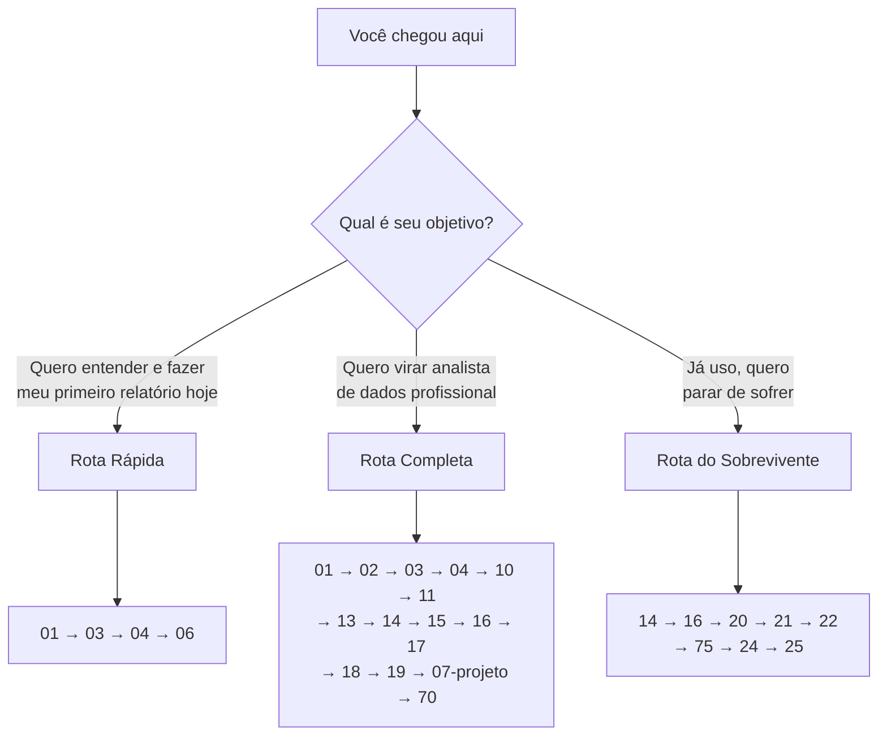

# Power BI — Mapa do curso

**Nível geral:** do leigo absoluto ao nível de pesquisa
**Última atualização:** 14/08/2026
**Base técnica:** Power BI Desktop versão de julho/2026 · Power BI Service (nuvem, atualização contínua) · Microsoft Fabric · DAX com funções definidas pelo usuário (UDF) e cálculos visuais

---

## A pergunta que originou este material

> *O que é Power BI? Como funciona? Como trabalhar com ele? O que ele pode fazer?*

As quatro perguntas têm respostas em camadas diferentes de profundidade, e é por isso
que este material tem 30 documentos em vez de um. A resposta curta está em
[`01-introducao-leigo.md`](01-introducao-leigo.md). A resposta honesta ocupa o resto.

**Resumo em quatro frases, para você saber onde está pisando:**

1. **O que é** — Power BI é uma **plataforma de business intelligence (BI)** da Microsoft: um
   conjunto de programas que lê dados de onde eles estiverem, junta tudo num modelo, calcula
   indicadores e mostra o resultado em relatórios interativos que outras pessoas consultam.
2. **Como funciona** — por dentro há um **banco de dados colunar em memória** (VertiPaq),
   um **motor de transformação de dados** (Power Query / linguagem M) e uma **linguagem de
   cálculo** (DAX) que recalcula tudo a cada clique do usuário.
3. **Como trabalhar** — o ciclo é: *conectar → transformar → modelar em estrela → medir em DAX
   → visualizar → publicar → governar*. Quem pula a modelagem sofre para sempre.
4. **O que pode fazer** — de um gráfico de vendas por mês até uma camada semântica corporativa
   sobre bilhões de linhas, com segurança por linha, versionamento em Git e CI/CD. E há coisas
   que ele **não** faz bem: [`27-alternativas.md`](27-alternativas.md) é franco sobre isso.

---

## Como ler este material

Há três rotas. Escolha a sua.

**Rota Rápida (um fim de semana).** Você quer ver algo funcionando.
[`01`](01-introducao-leigo.md) → [`03`](03-instalacao.md) → [`04`](04-como-comecar.md) →
[`06`](06-exemplos.md). Ao final você tem um relatório publicado.

**Rota Completa (3 a 6 meses).** Você quer trabalhar com isso. Siga a numeração,
sem pular o Bloco B. O ponto de virada é o [`16-dax-contexto-de-avaliacao.md`](16-dax-contexto-de-avaliacao.md):
antes dele você copia DAX da internet, depois dele você escreve DAX.

**Rota do Sobrevivente (uma semana).** Você já usa Power BI e ele está lento, errado ou
ingovernável. Vá direto para [`14`](14-modelagem-dimensional.md),
[`16`](16-dax-contexto-de-avaliacao.md), [`21`](21-vertipaq-por-dentro.md),
[`22`](22-desempenho.md) e [`75`](75-armadilhas.md). Quase todo problema de Power BI
em produção é um problema de modelagem disfarçado de problema de DAX.

---

## Índice completo

### Bloco A · Porta de entrada (01–09)

| Arquivo | Nível | O que traz |
|---|---|---|
| [`01-introducao-leigo.md`](01-introducao-leigo.md) | iniciante | O que é BI, o que é Power BI, por que existe — sem uma linha de jargão não explicado |
| [`02-pre-requisitos.md`](02-pre-requisitos.md) | iniciante | O que saber e ter antes; tempo realista até cada nível; rota de resgate |
| [`03-instalacao.md`](03-instalacao.md) | iniciante | **Manual de campo**: Desktop, Store, winget, WSL2, macOS, Linux, gateway, ferramentas externas, PATH, proxy, desinstalação, 12 erros literais |
| [`04-como-comecar.md`](04-como-comecar.md) | iniciante | Do ambiente pronto ao primeiro relatório publicado, com verificação a cada passo |
| [`05-manual-de-uso.md`](05-manual-de-uso.md) | intermediário | Referência consultável: interface, atalhos, funções DAX e M por tarefa, o que está obsoleto |
| [`06-exemplos.md`](06-exemplos.md) | iniciante → avançado | 15 exemplos completos, do "somar vendas" ao ABC dinâmico e ao *what-if* |
| [`07-projeto-modelo/`](07-projeto-modelo/README.md) | intermediário | Projeto completo executável: gerador de dados, modelo em TMDL, 40+ medidas, RLS, validador |

### Bloco B · Núcleo (10–69)

| Arquivo | Nível | O que traz |
|---|---|---|
| [`10-fundamentos.md`](10-fundamentos.md) | iniciante | Vocabulário e modelos mentais: fato, dimensão, granularidade, medida, contexto |
| [`11-historia.md`](11-historia.md) | iniciante | De 1958 ao Fabric: por que o Power BI nasceu dentro do Excel |
| [`12-arquitetura.md`](12-arquitetura.md) | intermediário | As peças (Desktop, Service, Mobile, Report Server, Embedded) e o que roda onde |
| [`13-power-query-e-m.md`](13-power-query-e-m.md) | intermediário | Conexão, transformação, *query folding*, a linguagem M |
| [`14-modelagem-dimensional.md`](14-modelagem-dimensional.md) | intermediário | **O capítulo mais importante do curso**: esquema estrela, relacionamentos, cardinalidade |
| [`15-dax-fundamentos.md`](15-dax-fundamentos.md) | intermediário | Sintaxe, tipos, medidas × colunas calculadas, as 40 funções que resolvem 90% |
| [`16-dax-contexto-de-avaliacao.md`](16-dax-contexto-de-avaliacao.md) | avançado | Contexto de linha, contexto de filtro, transição, `CALCULATE` desmontado |
| [`17-dax-inteligencia-de-tempo.md`](17-dax-inteligencia-de-tempo.md) | avançado | Tabela de datas, YTD, MAT, comparações, calendários fiscais e 4-4-5 |
| [`18-visualizacao.md`](18-visualizacao.md) | intermediário | Escolha de gráfico, percepção visual, o que a ciência diz e o que a moda diz |
| [`19-interatividade-e-relatorios.md`](19-interatividade-e-relatorios.md) | intermediário | Filtros, segmentações, indicadores, *drillthrough*, tooltips, campos dinâmicos |
| [`20-modos-de-armazenamento.md`](20-modos-de-armazenamento.md) | avançado | Import × DirectQuery × Direct Lake × Dual × composto: a decisão de arquitetura |
| [`21-vertipaq-por-dentro.md`](21-vertipaq-por-dentro.md) | avançado | Compressão colunar, dicionário, RLE, *hash* × *value encoding*, cardinalidade |
| [`22-desempenho.md`](22-desempenho.md) | avançado | Fórmula × armazenamento, `CallbackDataID`, DAX Studio, VertiPaq Analyzer, medições reais |
| [`23-servico-colaboracao-e-atualizacao.md`](23-servico-colaboracao-e-atualizacao.md) | intermediário | Workspaces, apps, gateways, atualização agendada, incremental |
| [`24-seguranca-e-governanca.md`](24-seguranca-e-governanca.md) | avançado | RLS, OLS, rótulos de confidencialidade, configurações de locatário, adoção |
| [`25-ciclo-de-vida-e-devops.md`](25-ciclo-de-vida-e-devops.md) | avançado | PBIP, TMDL, Git, pipelines de implantação, XMLA, APIs REST, testes de modelo |
| [`26-fabric-e-ecossistema.md`](26-fabric-e-ecossistema.md) | avançado | OneLake, Direct Lake, lakehouse, Copilot, agentes, e onde o Power BI acabou |
| [`27-alternativas.md`](27-alternativas.md) | intermediário | Tableau, Looker, Qlik, Metabase, Superset, Excel: comparação honesta e quando não usar Power BI |
| [`60-teoria-avancada.md`](60-teoria-avancada.md) | pesquisa | Álgebra do contexto de filtro, complexidade de consulta, limites do modelo tabular |
| [`65-estado-da-arte.md`](65-estado-da-arte.md) | pesquisa | Fronteira em agosto/2026: BI generativo, camada semântica como produto, debates abertos |

### Bloco C · Prática e erros (70–79)

| Arquivo | Nível | O que traz |
|---|---|---|
| [`70-pratica.md`](70-pratica.md) | todos | 14 laboratórios progressivos com critério de aceite |
| [`75-armadilhas.md`](75-armadilhas.md) | todos | 32 armadilhas clássicas e 10 mitos, com o porquê de cada uma |

### Bloco D · Economia e ecossistema (80–89)

| Arquivo | Nível | O que traz |
|---|---|---|
| [`80-custos-e-licencas.md`](80-custos-e-licencas.md) | todos | Preços com data (14/08/2026), licenças, custo oculto, armadilha do F64 |
| [`85-cursos-e-certificacoes.md`](85-cursos-e-certificacoes.md) | todos | Cursos gratuitos em PT, EN e FR; PL-300 e DP-600 sem romance |

### Bloco E · Fontes (90–99)

| Arquivo | Nível | O que traz |
|---|---|---|
| [`90-bibliografia.md`](90-bibliografia.md) | todos | Livros com edição e ano; o que é legalmente gratuito |
| [`95-referencias.md`](95-referencias.md) | todos | Documentação oficial, specs, papers, blogs e pessoas que valem seguir |
| [`GLOSSARIO.md`](GLOSSARIO.md) | todos | ~160 termos definidos |

---

## O que você saberá ao final

Ao terminar a Rota Completa, você consegue:

- [ ] Explicar para um leigo o que é Power BI e o que ele resolve, sem jargão.
- [ ] Instalar o ambiente inteiro em qualquer máquina, inclusive em Mac e Linux (onde
      o Desktop **não** roda nativamente) e numa rede corporativa com proxy.
- [ ] Conectar a bancos, arquivos, APIs e pastas, e transformar dados no Power Query
      preservando *query folding*.
- [ ] Projetar um **esquema estrela** a partir de tabelas bagunçadas, e saber justificar
      cada relacionamento.
- [ ] Escrever DAX que você entende — inclusive `CALCULATE` com múltiplos modificadores —
      e depurar uma medida que devolve o número errado.
- [ ] Diagnosticar lentidão com DAX Studio, separando tempo de fórmula de tempo de
      armazenamento, e reduzir o modelo em ordens de grandeza pelo VertiPaq Analyzer.
- [ ] Implementar segurança por linha e explicar por que ela não protege o arquivo `.pbix`.
- [ ] Versionar um relatório em Git com PBIP/TMDL e implantar por pipeline.
- [ ] Estimar o custo real de uma implantação, e defender (ou recusar) o F64.
- [ ] Dizer, com argumentos, quando Power BI é a ferramenta errada.

---

## Convenções deste material

- `código` para comandos, funções, nomes de arquivo e colunas.
- **Fato** / *consenso do campo* / **opinião do autor** são marcados explicitamente quando
  houver risco de confusão. Onde você ler "**Opinião**", é opinião.
- Toda data é absoluta (`14/08/2026`), nunca "recentemente".
- Preços, versões e cursos trazem a **data da consulta** no rodapé do arquivo.
- Termos técnicos ficam em inglês quando é assim que o campo os usa, com a tradução
  na primeira ocorrência: *measure* (medida), *slicer* (segmentação de dados).
- Cada arquivo termina com **autoteste**. Se você não responde, releia — não avance.

---

## Status de produção

| Bloco | Status | Observação |
|---|---|---|
| A · Porta de entrada | ✅ completo | 7 documentos + projeto-modelo |
| B · Núcleo | ✅ completo | 20 documentos, do 10 ao 65 |
| C · Prática e erros | ✅ completo | 14 laboratórios, 32 armadilhas, 10 mitos |
| D · Economia | ✅ completo | Preços consultados em 14/08/2026 |
| E · Fontes | ✅ completo | Bibliografia, referências, glossário |

### Limitação declarada com honestidade

O material foi escrito num ambiente **Linux (Ubuntu 22.04)**. O Power BI Desktop **não roda
em Linux** — não existe versão nativa (confirmado na documentação oficial em 14/08/2026).
Portanto:

- **Foi executado e verificado aqui:** o gerador de dados do projeto-modelo (Python 3.10.12),
  o validador de modelo, e a consistência entre os arquivos TMDL e os CSVs.
- **Não foi executado aqui:** a abertura do projeto no Power BI Desktop, a publicação no
  Service, os passos de instalação em Windows e macOS, e as telas descritas no `04`.
  Onde há uma tela ou saída que eu não vi com meus próprios olhos, o texto diz
  *"esperado"*, e não *"você verá"*.

Isso está repetido no [`07-projeto-modelo/README.md`](07-projeto-modelo/README.md) e no
[`04-como-comecar.md`](04-como-comecar.md). Prefiro um material que declara o que não
verificou a um que finge ter verificado tudo.

---

## Autoteste do mapa

1. Qual é a diferença entre "Power BI Desktop" e "Power BI Service"? (Se não sabe, comece pelo `01`.)
2. Por que a Rota do Sobrevivente começa em modelagem e não em DAX?
3. Em que arquivo você procuraria o preço da licença Pro, e por que ele precisa ter data?
4. Qual documento este curso indica como ponto de virada entre copiar DAX e escrever DAX?
5. O Power BI Desktop roda em Linux? Onde o material trata disso?

---

*Fontes consultadas em 14/08/2026: [Microsoft Learn — Download Power BI Desktop](https://learn.microsoft.com/en-us/power-bi/fundamentals/desktop-get-the-desktop), [Microsoft Learn — What's new (julho/2026)](https://learn.microsoft.com/en-us/power-bi/fundamentals/whats-new), [Power BI — preços](https://www.microsoft.com/en-us/power-platform/products/power-bi/pricing).*
