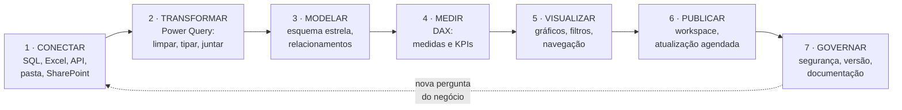

# 01 · O que é Power BI, para um leigo total

**Nível:** iniciante
**Pré-requisito:** nenhum. Nem Excel.
**Data:** 14/08/2026

---

## 1. Comece pela dor, não pela ferramenta

Imagine uma distribuidora de tintas industriais com 40 vendedores em seis estados.
Toda segunda-feira acontece o seguinte ritual:

1. O sistema de vendas exporta uma planilha com as notas fiscais da semana.
2. O sistema de estoque exporta outra, com formato diferente e nomes de produto diferentes.
3. O financeiro manda um e-mail com os recebimentos, em PDF.
4. Uma pessoa — chamemos de Marta — passa **seis horas** juntando isso no Excel:
   procura-se `PROCV`, corrige nome de cliente escrito de três jeitos, refaz as tabelas
   dinâmicas, cola os gráficos num PowerPoint.
5. Na terça, o diretor pergunta: *"e se a gente olhar só o Sudeste, só tinta epóxi,
   comparando com o mesmo mês do ano passado?"*
6. Marta refaz tudo. Mais quatro horas.
7. Na quarta, alguém descobre que a coluna de desconto estava somando errado desde março.

**Esse é o problema.** Não é falta de dado — é dado espalhado, retrabalho manual, demora
entre a pergunta e a resposta, e nenhuma garantia de que o número está certo.

O nome desse problema, no mundo corporativo, é **falta de BI**.

---

## 2. O que é BI (Business Intelligence)

> **Business Intelligence (BI)**, em português "inteligência de negócios", é o conjunto de
> práticas e ferramentas para transformar dados brutos, espalhados por vários sistemas, em
> informação confiável que sustenta decisões.

A palavra "inteligência" aqui não tem nada a ver com inteligência artificial. É o sentido
antigo, de *espionagem*: "serviço de inteligência" = serviço que coleta informação para
quem decide. O termo foi usado assim por Hans Peter Luhn, da IBM, em **1958** — décadas
antes de existir qualquer coisa parecida com Power BI ([ver história](11-historia.md)).

BI responde a três tipos de pergunta:

| Tipo | Pergunta típica | Nome técnico |
|---|---|---|
| O que aconteceu? | "Quanto vendemos em julho?" | análise **descritiva** |
| Por que aconteceu? | "Por que o Sudeste caiu 12%?" | análise **diagnóstica** |
| O que vai acontecer? | "Vamos bater a meta do trimestre?" | análise **preditiva** |

Power BI é excelente na primeira, bom na segunda e apenas razoável na terceira. Quem
promete previsão mágica está vendendo, não ensinando.

---

## 3. Agora sim: o que é Power BI

> **Power BI** é uma plataforma de BI da Microsoft. Na prática, é um conjunto de programas
> que (a) **lê** dados de onde eles estiverem, (b) **limpa e junta** esses dados, (c) guarda
> tudo num **modelo** interno otimizado, (d) **calcula** indicadores sob demanda e
> (e) **mostra** o resultado em relatórios interativos que outras pessoas consultam pelo
> navegador ou pelo celular.

Nome completo do primeiro programa: **Power BI Desktop**. É gratuito, roda no Windows,
e é onde o trabalho de construção acontece.

### A analogia da cozinha

É a analogia que uso há anos porque ela aguenta pressão — dá para esticá-la até conceitos
avançados sem quebrar.

| Na cozinha | No Power BI | Termo técnico |
|---|---|---|
| Fornecedores (açougue, feira, mercado) | Bancos de dados, planilhas, APIs, sistemas | **fontes de dados** |
| Receber, lavar, descascar, picar | Power Query: limpar, renomear, filtrar, juntar | **ETL / transformação** |
| A despensa organizada, tudo em potes rotulados | O modelo de dados carregado na memória | **modelo semântico** |
| As receitas ("como se faz o molho") | As medidas em DAX | **medidas** |
| O prato montado que vai à mesa | O relatório com gráficos | **relatório** |
| O restaurante onde os clientes comem | O Power BI Service (nuvem) | **serviço / workspace** |
| O garçom perguntando "sem cebola?" | O usuário clicando num filtro | **interatividade** |

Duas consequências importantes dessa analogia, que valem mais que qualquer tutorial:

**(a) A despensa importa mais que o prato.** Um restaurante com despensa bagunçada faz
pratos lentos e errados, por mais bonito que seja o empratamento. No Power BI, um **modelo
mal organizado** produz relatórios lentos e números errados, por mais bonito que seja o
gráfico. É por isso que [`14-modelagem-dimensional.md`](14-modelagem-dimensional.md) é o
capítulo mais importante deste curso, e não o de gráficos.

**(b) A receita não é o prato.** Uma medida em DAX (`Total de Vendas = SUM(...)`) não é um
número — é uma *instrução de cálculo*. O número só existe quando alguém a coloca num
contexto: "vendas **de julho**, **do Sudeste**, **de tinta epóxi**". Isso se chama
**contexto de avaliação** e é o conceito que separa quem sabe DAX de quem copia DAX.

---

## 4. As peças que se chamam "Power BI"

Confusão comum de iniciante: "Power BI" é o nome de pelo menos cinco coisas diferentes.

```
┌──────────────────────────────────────────────────────────────────┐
│                        POWER BI (a plataforma)                   │
│                                                                  │
│  ┌────────────────────┐   publica    ┌────────────────────────┐  │
│  │  POWER BI DESKTOP  │ ───────────▶ │   POWER BI SERVICE     │  │
│  │  (Windows, grátis) │              │   (nuvem, navegador)   │  │
│  │                    │              │                        │  │
│  │  onde você CRIA:   │              │  onde os outros VEEM:  │  │
│  │  · conecta dados   │              │  · workspaces          │  │
│  │  · transforma      │              │  · atualização agendada│  │
│  │  · modela          │              │  · compartilhamento    │  │
│  │  · escreve DAX     │              │  · segurança           │  │
│  │  · desenha visuais │              │  · apps                │  │
│  └────────────────────┘              └───────────┬────────────┘  │
│                                                  │               │
│                              ┌───────────────────┼─────────────┐ │
│                              ▼                   ▼             ▼ │
│                     ┌─────────────┐    ┌──────────────┐  ┌──────┴──┐
│                     │ POWER BI    │    │  POWER BI    │  │ POWER BI│
│                     │ MOBILE      │    │  EMBEDDED    │  │ REPORT  │
│                     │ (iOS/Android)│   │(dentro do seu│  │ SERVER  │
│                     │             │    │ próprio app) │  │(on-prem)│
│                     └─────────────┘    └──────────────┘  └─────────┘
└──────────────────────────────────────────────────────────────────┘
```

| Peça | O que é | Custa? |
|---|---|---|
| **Power BI Desktop** | Aplicativo Windows onde você constrói tudo | Grátis |
| **Power BI Service** | Site (`app.powerbi.com`) onde se publica e consome | Grátis limitado; compartilhar exige licença |
| **Power BI Mobile** | App iOS/Android para consumir relatórios | Grátis (precisa de licença no Service) |
| **Power BI Report Server** | Servidor instalado na sua empresa, sem nuvem | Exige licença cara |
| **Power BI Embedded** | Relatórios embutidos no software da sua empresa | Pago por capacidade |

Neste curso, "Power BI" sem qualificador significa **Desktop + Service**, que é o que 95%
das pessoas usam. Detalhes das peças em [`12-arquitetura.md`](12-arquitetura.md).

---

## 5. Como se trabalha com ele: o ciclo em sete passos

Este é o fluxo real, o mesmo há dez anos, e ele não mudou com o Fabric.



**1 · Conectar.** Você aponta o Power BI para as fontes. Ele tem mais de 170 conectores
prontos: SQL Server, Oracle, PostgreSQL, Excel, CSV, SharePoint, Salesforce, Google
Analytics, APIs REST, pastas inteiras de arquivos, e o PI System de plantas industriais.
Você não copia os dados à mão nunca mais.

**2 · Transformar.** No **Power Query**, uma interface de "receita de passos", você remove
colunas, corrige tipos, separa texto, junta tabelas, e cada clique vira um passo gravado.
Semana que vem, com dados novos, os mesmos passos rodam sozinhos. É aqui que morrem as
seis horas de Marta. Ver [`13-power-query-e-m.md`](13-power-query-e-m.md).

**3 · Modelar.** Você organiza as tabelas num formato chamado **esquema estrela**: uma
tabela central com os eventos (as vendas) cercada por tabelas de contexto (produto,
cliente, data, vendedor). Não é preciosismo acadêmico: é o formato que o motor do Power BI
foi construído para consultar rápido. Ver [`14-modelagem-dimensional.md`](14-modelagem-dimensional.md).

**4 · Medir.** Você escreve as regras de cálculo em **DAX** (*Data Analysis Expressions*):
`Faturamento = SUM(Vendas[Valor])`, `Margem % = DIVIDE([Lucro], [Faturamento])`. Uma vez
definida, a medida funciona em qualquer recorte. Ver [`15-dax-fundamentos.md`](15-dax-fundamentos.md).

**5 · Visualizar.** Você arrasta campos para gráficos. Clicar num gráfico filtra os outros —
essa é a diferença entre um relatório do Power BI e um PDF. Ver [`18-visualizacao.md`](18-visualizacao.md).

**6 · Publicar.** Um botão manda tudo para a nuvem. Você agenda a atualização (por exemplo,
todo dia às 6h) e o relatório se atualiza sozinho para sempre. Ver
[`23-servico-colaboracao-e-atualizacao.md`](23-servico-colaboracao-e-atualizacao.md).

**7 · Governar.** Quem vê o quê, quem pode editar, como o relatório é versionado, e como
alguém descobre em 2029 por que a medida de margem exclui frete. É a parte que ninguém
ensina e que decide se o projeto sobrevive. Ver
[`24-seguranca-e-governanca.md`](24-seguranca-e-governanca.md).

---

## 6. O que Power BI **pode** fazer

Uma lista honesta, do trivial ao surpreendente.

### Coisas que ele faz muito bem

- **Consolidar fontes heterogêneas.** Excel + SQL + API + PDF num só modelo.
- **Recalcular sob demanda.** Você clica em "Sudeste" e 40 gráficos recalculam em
  milissegundos sobre milhões de linhas.
- **Comprimir dados de forma agressiva.** Uma tabela de 100 milhões de linhas com poucas
  colunas distintas pode caber em 1 GB de RAM. O mecanismo está em
  [`21-vertipaq-por-dentro.md`](21-vertipaq-por-dentro.md).
- **Inteligência de tempo.** "Mesmo período do ano anterior", "acumulado no ano",
  "média móvel 12 meses" são uma linha de DAX cada.
- **Segurança por linha (RLS).** O mesmo relatório mostra só o Sudeste para o gerente do
  Sudeste, sem cópia nem duplicação.
- **Atualização automática e alertas.** Inclusive incremental, atualizando só o que mudou.
- **Distribuição.** Navegador, celular, Teams, PowerPoint com dados ao vivo, e-mail
  com PDF agendado.
- **Camada semântica corporativa.** Um único modelo com as definições oficiais de
  "faturamento líquido" que centenas de relatórios e o Excel consomem.

### Coisas que ele faz, mas com ressalvas

- **Grandes volumes.** Bilhões de linhas exigem DirectQuery ou Direct Lake, e aí você
  troca conforto por complexidade. Ver [`20-modos-de-armazenamento.md`](20-modos-de-armazenamento.md).
- **Escrita de dados.** Historicamente o Power BI só lia. Desde 2025 há *translytical
  task flows* (botões que escrevem de volta na origem), mas é recurso novo e limitado.
- **Estatística e machine learning.** Dá para chamar R e Python, e há
  Detecção de Anomalias e "Principais Influenciadores" nativos. Mas se o seu problema é
  modelagem estatística séria, a ferramenta certa é outra.
- **Relatórios "de papel" pixel-perfect.** Existe *paginated report* (Report Builder) para
  boletos e faturas, mas é outro produto, com outra linguagem.

### Coisas que ele **não** faz

- **Não é um banco de dados.** Não é lugar para guardar seu dado mestre.
- **Não é um sistema transacional.** Não substitui o ERP.
- **Não conserta dado ruim.** Se a origem tem cadastro duplicado, o Power BI vai mostrar
  o duplicado, mais rápido e em cores.
- **Não roda em Linux, e o Desktop não roda em macOS.** Ver
  [`03-instalacao.md`](03-instalacao.md) para os contornos reais.
- **Não substitui pensar.** A frase mais cara do BI é "o dashboard mostra que...".

---

## 7. Por que ele existe — e por que venceu

Duas perguntas diferentes.

**Por que existe:** porque o Excel bateu no teto. O Excel resolve o problema de uma pessoa
com alguns milhares de linhas. Não resolve o problema de vinte pessoas com dezenas de
milhões de linhas, precisando do mesmo número. Todo o BI moderno é uma resposta ao limite
do Excel — e, ironicamente, o Power BI nasceu **dentro do Excel**, como suplemento
PowerPivot em 2009. Ver [`11-historia.md`](11-historia.md).

**Por que venceu** (é o líder de mercado desde meados da década de 2010, segundo o
Quadrante Mágico do Gartner para plataformas de análise e BI, e continua líder na edição
de 2025) — três motivos, em ordem de importância, e nenhum deles é "é o melhor tecnicamente":

1. **Preço.** US$ 14 por usuário/mês contra os US$ 75+/usuário/mês históricos do Tableau.
   Para uma empresa de 500 pessoas, a diferença anual paga um analista. E o Desktop é
   gratuito, o que colocou a ferramenta nas mãos de todo mundo antes de qualquer decisão
   de compra.
2. **Distribuição.** Já estava no contrato Microsoft 365 da empresa. Não precisou de
   processo de compra; precisou de um clique do administrador.
3. **Excel.** A linguagem DAX é deliberadamente parecida com fórmulas de Excel, e o
   público-alvo era o exército de analistas que já vivia em tabelas dinâmicas.

**Opinião do autor:** essa é a história completa. Tecnicamente, o motor VertiPaq é de fato
excelente — mas ferramenta superior perde para ferramenta que já está instalada e custa
um quinto. Quem entende isso entende por que discussões de "qual BI é melhor" quase nunca
são decididas por mérito técnico. Ver [`27-alternativas.md`](27-alternativas.md).

---

## 8. Quem usa Power BI, na prática

| Papel | O que faz no Power BI | Onde este curso atende |
|---|---|---|
| **Consumidor** | Abre relatório, filtra, exporta | `01`, `04` (parte final) |
| **Analista de negócio** | Constrói relatórios sobre modelos prontos | Bloco A + `15`–`19` |
| **Analista de dados / BI** | Conecta, transforma, modela, escreve DAX | Rota Completa inteira |
| **Engenheiro de análise** | Camada semântica corporativa, Fabric, DevOps | `20`–`26`, `60`, `65` |
| **Administrador de locatário** | Governança, licenças, capacidade, segurança | `23`, `24`, `80` |

A progressão de carreira típica no Brasil vai de "analista que faz relatório" para
"analista de BI" em 1 a 2 anos, e para "engenheiro de análise" em mais 2 a 3. Números
de mercado e certificações em [`85-cursos-e-certificacoes.md`](85-cursos-e-certificacoes.md).

---

## 9. As cinco confusões que atrapalham o iniciante

Vale desarmá-las agora, antes de qualquer instalação.

**1. "Power BI é um gerador de gráficos."**
Não. Gráfico é a última etapa, e a mais fácil. O valor está no modelo. Se você aprender
só a parte de gráficos, você produzirá dashboards bonitos e errados.

**2. "Vou usar meu Excel como fonte para sempre."**
Você pode. Mas Excel como fonte é a maior causa de relatório quebrado no mundo: alguém
renomeia uma aba, insere uma coluna, digita "N/A" numa coluna numérica. Ver
[`75-armadilhas.md`](75-armadilhas.md).

**3. "DAX é igual a fórmula de Excel."**
A sintaxe é parecida — de propósito. A semântica é radicalmente diferente. No Excel,
`A1` aponta para uma célula específica. No DAX, não existe célula: existe uma tabela e um
**contexto** que muda a cada visual e a cada clique. Confundir os dois é a origem de 80%
do sofrimento com DAX. Ver [`16-dax-contexto-de-avaliacao.md`](16-dax-contexto-de-avaliacao.md).

**4. "Power BI é gratuito."**
O **Desktop** é gratuito, de verdade e para sempre. **Compartilhar** com outra pessoa não é.
A conta chega quando o projeto dá certo — que é exatamente o pior momento para descobrir.
Ver [`80-custos-e-licencas.md`](80-custos-e-licencas.md).

**5. "Microsoft Fabric substituiu o Power BI."**
Não. Em 2023 a Microsoft embalou o Power BI dentro de uma plataforma maior chamada
**Microsoft Fabric** (lakehouse, engenharia de dados, ciência de dados, tempo real).
O Power BI continua existindo, com o mesmo nome, como a camada de BI do Fabric. O que
mudou de verdade foi o modelo de licenciamento das capacidades. Ver
[`26-fabric-e-ecossistema.md`](26-fabric-e-ecossistema.md).

---

## 10. O caminho "por quês" — parando onde é legítimo parar

Aplicando a regra dos cinco porquês ao conceito central deste arquivo.

> **Por que o Power BI guarda os dados numa cópia em memória em vez de consultar o banco
> a cada clique?**

1. **Porque consultar o banco a cada clique seria lento.** Uma tabela dinâmica com 12 meses
   e 8 categorias dispara dezenas de consultas; contra um banco transacional isso leva
   segundos e ainda derruba o desempenho do sistema de produção.
2. **Por que consultar o banco transacional é lento para isso?** Porque bancos
   transacionais (OLTP) guardam os dados **por linha**, otimizados para ler ou gravar um
   pedido inteiro. Análise faz o contrário: lê **uma coluna** (valor) de milhões de linhas.
   Ler por linha para agregar uma coluna significa arrastar do disco todas as outras
   colunas junto.
3. **Por que ler por coluna é melhor então?** Porque valores de uma mesma coluna são
   semelhantes entre si (mesmo tipo, poucos valores distintos, muitas repetições), e isso
   permite **compressão** brutal — dicionário e *run-length encoding*. Menos bytes lidos =
   menos tempo. E a leitura sequencial de bytes contíguos aproveita o cache da CPU.
4. **Por que a compressão é tão melhor em colunas do que em linhas?** Porque compressão
   funciona explorando **redundância local**. Numa linha, valores vizinhos são heterogêneos
   (data, texto, número, booleano); numa coluna, são homogêneos. É uma propriedade
   estatística dos dados, não uma escolha de engenharia.
5. **Parada legítima — limite físico.** No fundo, isso encosta na hierarquia de memória:
   RAM é ~100× mais rápida que SSD, e o cache L1 é ~100× mais rápido que a RAM. O objetivo
   de todo o desenho do VertiPaq é **caber num nível mais rápido da hierarquia**. Isso não
   é convenção nem decisão da Microsoft; é consequência da velocidade da luz e do custo
   de fabricação de memória rápida.

O mecanismo completo está em [`21-vertipaq-por-dentro.md`](21-vertipaq-por-dentro.md).

---

## 11. Voltando à Marta

Com Power BI, a segunda-feira dela fica assim:

- **Uma vez**, ela constrói o modelo: conecta às três fontes, grava os passos de limpeza,
  monta o esquema estrela, escreve 15 medidas, desenha 4 páginas de relatório. Isso leva
  de dois dias a duas semanas, dependendo da bagunça das fontes. **É trabalho real, não é mágica.**
- **Toda segunda**, ela não faz nada: às 6h o relatório se atualizou sozinho.
- **Na terça**, quando o diretor pergunta do Sudeste com tinta epóxi comparado ao ano
  passado, **ele mesmo clica** — em 3 segundos, sem a Marta.
- **Quando alguém questiona o desconto**, existe um único lugar onde a regra está escrita,
  com nome, comentário e histórico em Git.

O ganho não é "fazer gráficos mais bonitos". É **eliminar o trabalho repetitivo, encurtar
o tempo entre pergunta e resposta, e ter uma única definição do número**.

E o custo, que ninguém coloca no slide de vendas: alguém precisa manter isso. Fonte que
muda, coluna que some, regra de negócio nova, licença que vence. BI não é projeto, é
produto — e produto tem dono.

---

## 12. Autoteste

1. Explique, sem usar a palavra "gráfico", o que o Power BI faz.
2. Qual a diferença entre Power BI Desktop e Power BI Service? Qual dos dois é gratuito?
3. Na analogia da cozinha, o que corresponde a uma medida em DAX? E ao modelo de dados?
4. Por que uma medida em DAX não é "um número"?
5. Cite dois motivos não técnicos que explicam a liderança do Power BI no mercado.
6. Diga três coisas que o Power BI **não** faz.
7. Por que o formato colunar comprime melhor que o formato por linha? (Responda em uma frase,
   falando de redundância.)
8. Verdadeiro ou falso: "O Microsoft Fabric substituiu o Power BI". Justifique.

---

**Próximo:** [`02-pre-requisitos.md`](02-pre-requisitos.md) — o que você precisa saber e ter
antes de instalar qualquer coisa.

---

*Fontes consultadas em 14/08/2026: [Microsoft Learn — What is Power BI](https://learn.microsoft.com/en-us/power-bi/fundamentals/power-bi-overview), [Microsoft — preços do Power BI](https://www.microsoft.com/en-us/power-platform/products/power-bi/pricing). A referência a Hans Peter Luhn é do artigo "A Business Intelligence System", IBM Journal of Research and Development, 1958.*
