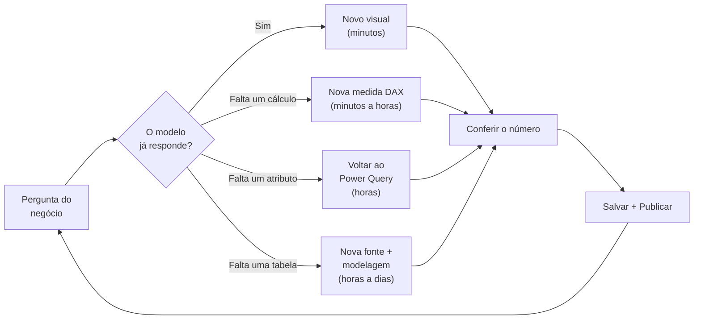

# 04 · Como começar — do ambiente pronto ao primeiro relatório

**Nível:** iniciante
**Pré-requisito:** [`03-instalacao.md`](03-instalacao.md) concluído (checklist §17 verde).
**Tempo:** 45 a 90 minutos na primeira vez.
**Data:** 14/08/2026

> **Aviso.** As telas descritas abaixo vêm da versão de julho/2026 do Power BI Desktop.
> Elas **não foram capturadas nesta máquina** (ambiente Linux — ver
> [`00-MAPA.md`](00-MAPA.md) §Limitação). Onde eu escrevo "esperado", é o comportamento
> documentado e o que vejo na prática, não uma captura de tela desta sessão. Os menus da
> Microsoft mudam de lugar entre versões; se um nome não bater, procure pelo conceito.

---

## 0. O que vamos construir

Um relatório de uma página com:

- um cartão de faturamento total;
- um gráfico de barras de faturamento por categoria de produto;
- um gráfico de linhas de faturamento por mês;
- uma segmentação de dados (*slicer*) por estado;
- uma medida de comparação com o ano anterior.

E vamos publicar. Cerca de **1 hora**, incluindo os erros que você vai cometer (eu listei
os cinco mais comuns na §8).

**Regra de ouro deste capítulo:** não pule a §3 (Power Query) nem a §4 (modelo). É
tentador ir direto aos gráficos. Quem faz isso constrói uma casa sem fundação e refaz tudo
em duas semanas.

---

## 1. Preparar os dados de exemplo

Você precisa de dois arquivos CSV. Crie uma pasta `C:\PowerBI\primeiro-relatorio\`
e salve os dois conteúdos abaixo, **em UTF-8**.

### `vendas.csv`

```csv
IDVenda,Data,IDProduto,Estado,Quantidade,PrecoUnitario,Desconto
1,2025-01-15,P001,SP,10,45.90,0.05
2,2025-01-18,P002,MG,4,120.00,0
3,2025-02-03,P001,SP,25,45.90,0.10
4,2025-02-20,P003,RJ,2,890.00,0
5,2025-03-11,P002,SP,15,120.00,0.05
6,2025-04-02,P004,PR,50,12.50,0
7,2025-05-19,P003,MG,1,890.00,0.02
8,2025-06-30,P001,RJ,30,45.90,0.08
9,2025-07-14,P004,SP,120,12.50,0.15
10,2025-08-22,P002,PR,8,120.00,0
11,2025-09-09,P003,SP,3,890.00,0
12,2025-10-27,P001,MG,18,45.90,0.05
13,2025-11-13,P004,RJ,75,12.50,0.10
14,2025-12-05,P002,SP,22,120.00,0.07
15,2026-01-16,P001,SP,14,45.90,0.05
16,2026-02-09,P003,PR,4,890.00,0.03
17,2026-03-24,P004,MG,90,12.50,0.12
18,2026-04-08,P002,RJ,11,120.00,0
19,2026-05-21,P001,SP,40,45.90,0.09
20,2026-06-17,P003,SP,6,890.00,0.05
21,2026-07-02,P004,PR,110,12.50,0.14
22,2026-07-29,P002,MG,19,120.00,0.06
```

### `produtos.csv`

```csv
IDProduto,Produto,Categoria,Custo
P001,Tinta Epóxi 3.6L,Tintas,28.40
P002,Verniz Poliuretano 5L,Vernizes,71.00
P003,Resina Alquídica 200L,Resinas,540.00
P004,Solvente Xilol 1L,Solventes,7.10
```

**Verificação antes de continuar:** abra `vendas.csv` no Bloco de Notas. Você deve ver
texto com vírgulas, e a primeira linha deve ser o cabeçalho. Se você abriu no Excel e
salvou por cima, ele pode ter trocado o separador para ponto e vírgula e o decimal para
vírgula — **isso vai quebrar a importação** (é o erro nº 1 da §8).

---

## 2. Conectar

**Passo 1** — Abra o Power BI Desktop. A tela de boas-vindas aparece; feche-a.

**Passo 2** — Faixa de opções **Página Inicial** → **Obter dados** → **Texto/CSV**.

**Passo 3** — Selecione `vendas.csv`. Abre-se a janela de pré-visualização.

**Passo 4 — pare e olhe.** A janela mostra três controles no topo:

| Controle | O que você deve ver | Se estiver errado |
|---|---|---|
| **Origem do Arquivo** | `65001: Unicode (UTF-8)` | Acentos aparecem como `é`. Troque para UTF-8 |
| **Delimitador** | `Vírgula` | Todas as colunas viraram uma só. Troque |
| **Detecção de Tipo de Dados** | `Com base nas primeiras 200 linhas` | — |

**Passo 5** — Clique em **Transformar Dados** (*Transform Data*), **não** em Carregar.

> **Por que não "Carregar"?** Porque carregar sem olhar é como assinar contrato sem ler.
> O Power Query é onde você garante que os tipos estão certos. Errar o tipo agora custa
> horas depois. **Sempre** entre pelo Transformar Dados nas primeiras vezes.

Repita os passos 2 a 5 para `produtos.csv`. Uma vez dentro do Power Query, use
**Página Inicial → Nova Fonte → Texto/CSV**.

---

## 3. Transformar (Power Query)

Você está no **Editor do Power Query** — uma janela separada. A anatomia:

```
┌──────────────┬───────────────────────────────────┬──────────────────────┐
│  CONSULTAS   │        PRÉ-VISUALIZAÇÃO DOS       │  CONFIGURAÇÕES       │
│              │             DADOS                 │  DA CONSULTA         │
│  ▸ vendas    │  ┌────┬──────────┬─────┬────────┐ │                      │
│  ▸ produtos  │  │ ID │ Data     │ ... │        │ │  Nome: vendas        │
│              │  ├────┼──────────┼─────┼────────┤ │                      │
│              │  │ 1  │15/01/2025│ ... │        │ │  ETAPAS APLICADAS    │
│              │  │ 2  │18/01/2025│ ... │        │ │   Fonte              │
│              │  └────┴──────────┴─────┴────────┘ │   Cabeçalhos Promov. │
│              │                                   │   Tipo Alterado   ✕  │
└──────────────┴───────────────────────────────────┴──────────────────────┘
      ▲                        ▲                              ▲
   as tabelas          amostra dos dados            a RECEITA gravada
```

O painel **Etapas Aplicadas** é o coração do Power Query: cada clique seu vira uma etapa
gravada, que será reexecutada com dados novos. Isso é o que elimina o retrabalho manual.

### 3.1 Confira os tipos de dados

Clique na consulta `vendas`. Olhe o ícone à esquerda de cada nome de coluna:

| Ícone | Tipo | Coluna que deve ter |
|---|---|---|
| `123` | Número Inteiro | `IDVenda`, `Quantidade` |
| `1.2` | Número Decimal | `PrecoUnitario`, `Desconto` |
| 📅 | Data | `Data` |
| `ABC` | Texto | `IDProduto`, `Estado` |

**Se `Data` estiver como Texto:** clique no ícone → **Data**. Se der erro, use
**Usando Localidade...** → Tipo `Data`, Localidade `Inglês (Estados Unidos)`, porque o CSV
está no formato `AAAA-MM-DD`.

> **A armadilha de localidade.** Este é o problema nº 1 de brasileiros com Power BI.
> `01/02/2025` é 1º de fevereiro (pt-BR) ou 2 de janeiro (en-US)? O Power Query decide pela
> localidade do arquivo, não pela sua intuição. Use **Alterar Tipo → Usando Localidade** e
> declare explicitamente. Detalhes em [`13-power-query-e-m.md`](13-power-query-e-m.md).

### 3.2 Crie a coluna de faturamento

Ainda em `vendas`: **Adicionar Coluna** → **Coluna Personalizada**.

- Nome: `Faturamento`
- Fórmula:

```powerquery
= [Quantidade] * [PrecoUnitario] * (1 - [Desconto])
```

Clique em OK, e então **defina o tipo** da nova coluna como **Número Decimal** (o Power
Query cria colunas personalizadas com tipo `any`, e tipo `any` no modelo é fonte de erro).

> **Decisão de projeto, e ela tem lados.** Calcular `Faturamento` como **coluna** no Power
> Query gasta memória (uma coluna a mais no modelo) mas é rápido de consultar. Calcular
> como **medida** em DAX (`SUMX(vendas, ...)`) não gasta memória mas recalcula sempre.
> Para este primeiro relatório, coluna é mais simples. A discussão completa —
> e a regra que uso — está em [`15-dax-fundamentos.md`](15-dax-fundamentos.md) §7.

### 3.3 Renomeie a consulta

No painel direito, campo **Nome**: mude `vendas` para `Vendas` e `produtos` para `Produtos`.
Nomes de tabela ficam visíveis para o usuário final — trate-os como parte da interface.

### 3.4 Aplique

**Página Inicial** → **Fechar e Aplicar**.

**Verificação esperada:** a janela do Power Query fecha, uma barra de progresso mostra
"Carregando…", e no painel **Dados** (direita) aparecem duas tabelas: `Vendas` e `Produtos`.
Expandindo `Vendas`, você vê a coluna `Faturamento`, com o ícone de somatório (Σ) ao lado —
sinal de que o Power BI a reconheceu como numérica.

**Se aparecer erro:** clique em "Ver erros". Os dois mais comuns são tipo de dado
incompatível e caminho de arquivo errado. Ambos se corrigem no Power Query
(**Página Inicial → Transformar Dados**).

---

## 4. Modelar

Este é o passo que iniciantes pulam e que decide tudo.

### 4.1 Crie o relacionamento

**Passo 1** — Ícone **Exibição de Modelo** (o terceiro, à esquerda: parece um diagrama).

**Passo 2** — Você vê duas caixas: `Vendas` e `Produtos`, sem linha entre elas.

**Passo 3** — Arraste `Produtos[IDProduto]` sobre `Vendas[IDProduto]`.

**Verificação esperada:** surge uma linha ligando as tabelas, com **`1`** do lado
`Produtos` e **`*`** do lado `Vendas`, e uma **seta apontando de `Produtos` para `Vendas`**.

Isso se lê: *"um produto tem muitas vendas, e o filtro flui do produto para as vendas"*.
Se você filtrar por categoria "Tintas", o Power BI seleciona os produtos daquela categoria
e, pela seta, filtra as vendas correspondentes. **Esse é o mecanismo central do
Power BI inteiro.** Ver [`14-modelagem-dimensional.md`](14-modelagem-dimensional.md).

**Se a seta apontar para o lado errado ou a cardinalidade for `*:*`:** dê duplo clique na
linha e corrija. Cardinalidade muitos-para-muitos por acidente é sinal de chave duplicada —
e é a causa nº 1 de número inflado ([`75-armadilhas.md`](75-armadilhas.md) nº 8).

### 4.2 Crie uma tabela de datas

Sem uma tabela de datas própria, quase toda análise temporal fica errada ou impossível.

**Passo 1** — **Modelagem** → **Nova Tabela**.

**Passo 2** — Cole:

```dax
dCalendario =
VAR DataMin = MIN( Vendas[Data] )
VAR DataMax = MAX( Vendas[Data] )
VAR Base =
    CALENDAR(
        DATE( YEAR( DataMin ), 1, 1 ),
        DATE( YEAR( DataMax ), 12, 31 )
    )
RETURN
    ADDCOLUMNS(
        Base,
        "Ano",          YEAR( [Date] ),
        "NumMes",       MONTH( [Date] ),
        "Mes",          FORMAT( [Date], "MMM", "pt-BR" ),
        "AnoMes",       FORMAT( [Date], "yyyy-MM" ),
        "Trimestre",    "T" & FORMAT( [Date], "Q" ),
        "DiaSemana",    FORMAT( [Date], "ddd", "pt-BR" )
    )
```

*O que faz: gera uma linha por dia, do 1º de janeiro do primeiro ano de vendas ao 31 de
dezembro do último, e acrescenta colunas de ano, mês, trimestre e dia da semana.*

**Passo 3** — **Relacione**: na Exibição de Modelo, arraste `dCalendario[Date]` sobre
`Vendas[Data]`. Deve ficar 1:* com a seta de `dCalendario` para `Vendas`.

**Passo 4 — o passo que todo mundo esquece.** Selecione a tabela `dCalendario` no painel
Dados → guia **Ferramentas de Tabela** → **Marcar como tabela de data** → coluna `Date`.

> **Por que isso importa?** As funções de inteligência de tempo (`TOTALYTD`,
> `SAMEPERIODLASTYEAR` etc.) exigem uma tabela marcada como tabela de datas, contínua e
> sem lacunas. Sem a marcação, elas funcionam "às vezes" — e "às vezes" é pior que
> "nunca", porque você só descobre em produção. Ver
> [`17-dax-inteligencia-de-tempo.md`](17-dax-inteligencia-de-tempo.md).

**Passo 5** — Ordene o mês corretamente: selecione a coluna `Mes` → **Ferramentas de
Coluna** → **Classificar por Coluna** → `NumMes`.
Sem isso, seu gráfico mostra "abr, ago, dez, fev…" em ordem alfabética. É um clássico.

**Passo 6** — Desligue a tabela de datas automática:
**Arquivo → Opções e configurações → Opções → Arquivo Atual → Carregamento de Dados** →
desmarque **Data/hora automática**.

> **Por quê?** Porque o Power BI cria, silenciosamente, **uma tabela de datas oculta para
> cada coluna de data do modelo**. Em modelos reais isso infla o arquivo em dezenas de
> por cento e gera hierarquias duplicadas. Já que você tem uma `dCalendario` própria,
> a automática só atrapalha.

### 4.3 Esconda o que não deve ser usado

Na Exibição de Modelo, clique com o botão direito e escolha **Ocultar na exibição de
relatório** para: `Vendas[IDProduto]`, `Produtos[IDProduto]`, `dCalendario[Date]`.

> **Por quê?** Chaves técnicas não são para o usuário final analisar. Se `IDProduto`
> ficar visível, alguém vai arrastá-lo para um gráfico e obter um resultado sem sentido.
> Um modelo bem-feito **só expõe o que faz sentido de negócio**.

---

## 5. Medir (DAX)

Agora as regras de cálculo. Crie cada medida assim: clique com o botão direito na tabela
`Vendas` → **Nova medida** → cole → Enter.

```dax
Faturamento Total = SUM( Vendas[Faturamento] )
```

```dax
Quantidade Vendida = SUM( Vendas[Quantidade] )
```

```dax
Ticket Médio = DIVIDE( [Faturamento Total], DISTINCTCOUNT( Vendas[IDVenda] ) )
```

*Repare em `DIVIDE` e não em `/`. `DIVIDE` trata divisão por zero devolvendo em branco em
vez de erro. Use sempre.*

```dax
Faturamento Ano Anterior =
CALCULATE(
    [Faturamento Total],
    SAMEPERIODLASTYEAR( dCalendario[Date] )
)
```

```dax
Variação % vs Ano Anterior =
VAR Atual = [Faturamento Total]
VAR Anterior = [Faturamento Anterior]
RETURN
    DIVIDE( Atual - Anterior, Anterior )
```

> **Cuidado:** a última medida referencia `[Faturamento Anterior]`, que **não existe** —
> o nome correto é `[Faturamento Ano Anterior]`. Isso é de propósito: você acabou de ver o
> erro `The measure 'Faturamento Anterior' could not be found`. Corrija o nome e observe
> como o Power BI valida referências na hora. **Nunca renomeie uma medida sem verificar
> quem a usa.**

Versão correta:

```dax
Variação % vs Ano Anterior =
VAR Atual = [Faturamento Total]
VAR Anterior = [Faturamento Ano Anterior]
RETURN
    DIVIDE( Atual - Anterior, Anterior )
```

### Formate as medidas

Selecione `Faturamento Total` → **Ferramentas de Medida** → **Formato**: Moeda,
2 casas decimais, símbolo `R$`.
Selecione `Variação % vs Ano Anterior` → Formato: Porcentagem, 1 casa decimal.

> Formatação é responsabilidade da **medida**, não do visual. Formatando na medida, todos
> os visuais herdam. Formatando no visual, você repete o trabalho 40 vezes e esquece um.

---

## 6. Visualizar

Vá para a **Exibição de Relatório** (primeiro ícone à esquerda).

### 6.1 Cartão de faturamento

1. No painel **Visualizações**, clique no ícone **Cartão** (*Card*).
2. Arraste `Faturamento Total` para o campo do cartão.
3. Redimensione e posicione no canto superior esquerdo.

**Esperado:** um número grande, formatado como `R$ 213.442,52` (o valor exato depende de
você ter copiado os CSVs sem alteração).

### 6.2 Barras por categoria

1. Clique numa área vazia → visual **Gráfico de barras clusterizado**.
2. **Eixo Y**: `Produtos[Categoria]`.
3. **Eixo X**: `Faturamento Total`.

**Esperado:** quatro barras. `Resinas` deve dominar (produto caro).

### 6.3 Linha por mês

1. Área vazia → **Gráfico de linhas**.
2. **Eixo X**: `dCalendario[AnoMes]`.
3. **Eixo Y**: `Faturamento Total`.

### 6.4 Segmentação por estado

1. Área vazia → visual **Segmentação de dados** (*Slicer*).
2. **Campo**: `Vendas[Estado]`.

### 6.5 Teste a interatividade — o momento "ahá"

Clique em **SP** na segmentação.

**Esperado:** os três visuais recalculam ao mesmo tempo. Clique numa barra do gráfico de
categorias: o gráfico de linhas se destaca (*cross-highlight*) mostrando a parcela daquela
categoria.

**Isso é a diferença entre um relatório do Power BI e um PDF.** Cada clique é um filtro
que entra no **contexto de avaliação** das medidas, e elas recalculam. Guarde essa frase;
ela é o assunto de [`16-dax-contexto-de-avaliacao.md`](16-dax-contexto-de-avaliacao.md).

### 6.6 Salve

**Arquivo → Salvar como** → `C:\PowerBI\primeiro-relatorio\primeiro-relatorio.pbix`.

---

## 7. Publicar

Só funciona com conta corporativa/escolar ([`03-instalacao.md`](03-instalacao.md) §9).
Sem conta, pule para a §9 — você não perde nada essencial.

**Passo 1** — **Página Inicial → Publicar**.

**Passo 2** — Se ainda não estiver conectado, faça login.

**Passo 3** — Escolha o destino: **Meu workspace**.

**Passo 4** — Aguarde. **Esperado:** "Sucesso!" com um link
`Abrir 'primeiro-relatorio.pbix' no Power BI`.

**Passo 5** — Clique no link. O relatório abre em `app.powerbi.com`, idêntico ao Desktop,
e continua interativo.

**Passo 6 — verificação de que publicar não é copiar um arquivo:** no workspace você verá
**dois itens** com o mesmo nome:

| Item | Ícone | O que é |
|---|---|---|
| `primeiro-relatorio` | gráfico | O **relatório**: as páginas e visuais |
| `primeiro-relatorio` | cilindro | O **modelo semântico**: dados, relacionamentos, medidas |

Essa separação é fundamental: **vários relatórios podem consumir um único modelo
semântico**. É assim que se constrói uma camada semântica corporativa —
ver [`23-servico-colaboracao-e-atualizacao.md`](23-servico-colaboracao-e-atualizacao.md).

**Passo 7 — a atualização não vai funcionar, e isso é esperado.** No modelo semântico →
**Atualizar agora**. Você deve receber erro, porque a fonte é `C:\PowerBI\...` — um caminho
que só existe na sua máquina, e a nuvem não o alcança. É exatamente para isso que existe o
**gateway** ([`03`](03-instalacao.md) §7). Ver o erro agora vale mais que ler sobre ele.

---

## 8. Os cinco erros que todo iniciante comete (no uso, não na instalação)

### Erro 1 — CSV com separador e decimal trocados

**Sintoma:** todas as colunas viram uma; ou `PrecoUnitario` vira texto; ou `45,90` vira
`4590`.
**Causa:** o Excel em máquina pt-BR salva CSV com `;` e decimal `,`.
**Correção:** no diálogo de importação, ajuste o **Delimitador**; e em
**Alterar Tipo → Usando Localidade**, escolha a localidade certa.
**Prevenção:** não edite CSV no Excel. Se precisar, use "Salvar como → CSV UTF-8" e confira.

### Erro 2 — Esquecer de marcar a tabela de datas

**Sintoma:** `SAMEPERIODLASTYEAR` devolve vazio ou resultados esquisitos.
**Causa:** a tabela não foi marcada, ou tem lacunas, ou não cobre anos inteiros.
**Correção:** §4.2, passo 4. E garanta que a tabela vai de 1º de janeiro a 31 de dezembro.

### Erro 3 — Usar a data da tabela de fatos nos eixos

**Sintoma:** meses sem venda **somem** do gráfico; comparações com ano anterior falham.
**Causa:** você arrastou `Vendas[Data]` em vez de `dCalendario[Date]`/`dCalendario[AnoMes]`.
**Correção:** eixos temporais **sempre** vêm da tabela de datas. Por isso escondemos
`Vendas[Data]` no §4.3 — o modelo deve tornar o erro impossível, não apenas desaconselhado.

### Erro 4 — Criar coluna calculada quando se queria medida

**Sintoma:** "Margem %" mostra um número que não muda quando você filtra, ou que soma
percentuais (`350%`).
**Causa:** coluna calculada é avaliada **linha a linha, na hora do carregamento**; medida
é avaliada **no contexto do visual, na hora do clique**.
**Correção:** regra prática — **se o resultado depende do que está filtrado, é medida.**
Percentuais, razões e rankings são quase sempre medidas.
**Aprofundamento:** [`15-dax-fundamentos.md`](15-dax-fundamentos.md) §7.

### Erro 5 — Mês em ordem alfabética

**Sintoma:** eixo mostra "abr, ago, dez, fev, jan…".
**Causa:** `Mes` é texto e o Power BI ordena texto alfabeticamente.
**Correção:** §4.2, passo 5 — **Classificar por Coluna** → `NumMes`.

### Bônus — o erro que custa mais caro

**Confiar no número sem conferir.** Antes de mostrar qualquer relatório a alguém, pegue
**um** valor conhecido (o faturamento de janeiro, por exemplo) e confira contra a fonte
original — no Excel, no ERP, com quem opera. Cinco minutos de conferência valem mais que
cinco horas de gráfico. Ver [`75-armadilhas.md`](75-armadilhas.md).

---

## 9. O ciclo de trabalho do dia a dia

Depois do primeiro relatório, sua rotina passa a ser este laço:



**O custo cresce dez vezes a cada degrau.** É por isso que um modelo bem projetado no
começo economiza meses depois: ele mantém a maioria das perguntas nos dois degraus baratos.

### Atalhos que valem aprender no primeiro dia

| Atalho | Ação |
|---|---|
| `Ctrl+S` | Salvar |
| `Ctrl+Z` | Desfazer (funciona também no Power Query) |
| `Ctrl+C` / `Ctrl+V` num visual | Duplicar visual (inclusive entre arquivos!) |
| `Ctrl+Shift+F` | Abrir painel de Filtros |
| `Alt+Shift+F10` | Menu do visual |
| `Ctrl+clique` numa segmentação | Seleção múltipla |
| `F11` | Modo tela cheia |
| `Ctrl+Alt+D` (Ferramentas Externas) | Depende da ferramenta registrada |
| `Ctrl+Shift+M` no editor DAX | Formatar a expressão |

Lista completa em [`05-manual-de-uso.md`](05-manual-de-uso.md).

### Como depurar uma medida que devolve o número errado

Sequência que uso, nesta ordem:

1. **Ponha o resultado numa matriz** com a granularidade em questão (por mês, por
   categoria). Números errados quase sempre revelam o padrão quando desagregados.
2. **Substitua a medida por partes**: crie medidas intermediárias para cada pedaço da
   fórmula e coloque todas na matriz lado a lado.
3. **Verifique o total.** Se as linhas batem e o total não, o problema é de **contexto**,
   não de aritmética — o total é calculado do zero, não é a soma das linhas.
4. **Verifique o relacionamento.** Filtro que não chega é problema de direção de filtro.
5. **Se nada resolver**, use o DAX Studio para ver a consulta gerada
   ([`22-desempenho.md`](22-desempenho.md)).

---

## 10. Para onde ir agora

| Se você quer… | Vá para |
|---|---|
| Ver mais receitas prontas | [`06-exemplos.md`](06-exemplos.md) — 15 exemplos completos |
| Um projeto de verdade, com dados sujos | [`07-projeto-modelo/`](07-projeto-modelo/README.md) |
| Entender o vocabulário direito | [`10-fundamentos.md`](10-fundamentos.md) |
| **Fazer o modelo do jeito certo** | [`14-modelagem-dimensional.md`](14-modelagem-dimensional.md) ← **recomendado** |
| Dominar DAX | [`15`](15-dax-fundamentos.md) → [`16`](16-dax-contexto-de-avaliacao.md) → [`17`](17-dax-inteligencia-de-tempo.md) |
| Praticar com exercícios | [`70-pratica.md`](70-pratica.md) |

**Opinião do autor:** depois deste capítulo, o melhor investimento não é aprender mais
visuais — é ler [`14-modelagem-dimensional.md`](14-modelagem-dimensional.md). A diferença
entre quem sofre com Power BI e quem não sofre é modelagem, não DAX e muito menos design.

---

## 11. Autoteste

1. Por que se deve clicar em "Transformar Dados" em vez de "Carregar"?
2. O que o painel "Etapas Aplicadas" resolve, em termos do problema da Marta do `01`?
3. Numa relação `Produtos` 1—* `Vendas`, para que lado aponta a seta e o que isso significa?
4. Cite duas razões para criar uma `dCalendario` própria em vez de usar a data da tabela de fatos.
5. O que a opção "Data/hora automática" faz por baixo dos panos e por que desligá-la?
6. Qual a diferença entre `DIVIDE(a, b)` e `a / b`?
7. Você publicou e o relatório aparece como **dois** itens no workspace. Quais são, e por
   que essa separação importa?
8. A atualização na nuvem falhou. Por quê, e qual componente resolveria?
9. Seu gráfico mostra os meses em ordem alfabética. Qual é a correção, em dois cliques?
10. "Margem %" está somando e dando 350%. O que provavelmente foi feito de errado?

---

**Próximo:** [`05-manual-de-uso.md`](05-manual-de-uso.md) — a referência consultável.
