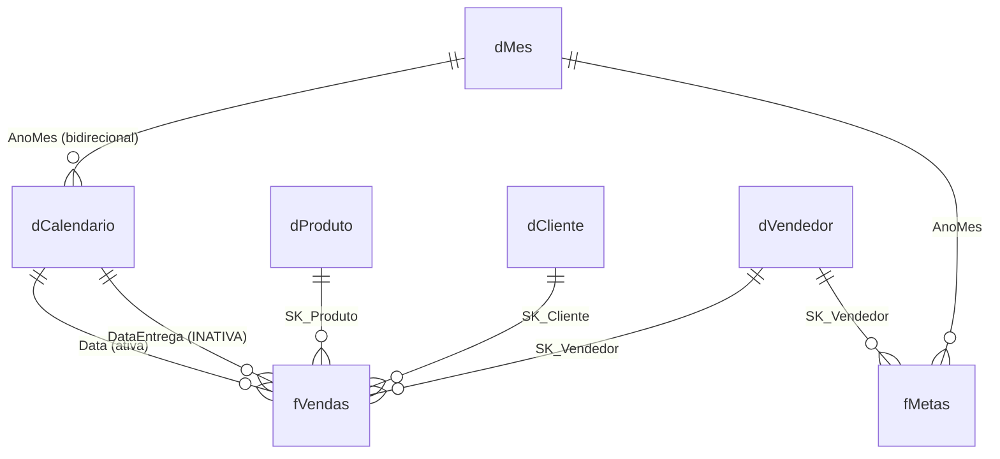

# Projeto-modelo — "Tintas Aurora"

**Nível:** intermediário
**Data:** 14/08/2026
**O que é:** um projeto de Power BI pequeno, mas **inteiro** — dados, modelo, medidas,
segurança e auditoria — construído sobre uma base com **oito defeitos plantados
de propósito**.

---

## 1. Por que existe

Tutoriais usam dados limpos. Dados limpos ensinam a parte fácil e escondem a difícil.

Na prática, 70% do trabalho de um analista de BI é descobrir que o número está errado e
achar por quê. Este projeto reproduz isso: a base tem CNPJ duplicado, devolução com sinal
trocado, desconto digitado em escala errada, produto sem cadastro, data com o século
errado, preço zero, meta faltando e UF suja — **exatamente** o tipo de coisa que chega
de um ERP de verdade.

Cada defeito tem: (a) uma causa realista, (b) um efeito mensurável no número final,
(c) um tratamento no modelo e (d) um teste que o detecta.

**O que este projeto ensina que um tutorial não ensina:**

| Tema | Onde aparece |
|---|---|
| Auditar antes de visualizar | `validar.py`, pasta de medidas `99 Auditoria` |
| Esquema estrela com **duas** tabelas de fato em granularidades diferentes | `fVendas` (dia+item) × `fMetas` (mês+vendedor), ponte `dMes` |
| Membro desconhecido em dimensão | `dProduto` linha `999 (sem cadastro)` |
| Chave técnica × chave de negócio | `SK_Cliente` × `CNPJ` |
| Dimensão que faz dois papéis | `Data` e `DataEntrega` com relação inativa |
| Segurança por linha que **falha fechada** | `roles/VendasRestritas.tmdl` |
| Quando bidirecional é aceitável — e por quê | `relationships.tmdl`, relação `dMes_dCalendario` |
| Modelo como **texto versionável** | tudo em `.tmdl` e `.dax` |

---

## 2. O cenário

**Tintas Aurora S.A.** — distribuidora de tintas, resinas, solventes e aditivos
industriais. 12 vendedores em 4 equipes regionais, 420 clientes, 25 SKUs,
de 01/01/2024 a 31/07/2026.

Volumes gerados (semente padrão `20260814`):

| Tabela | Linhas | Papel |
|---|---:|---|
| `fVendas` | 60.621 | fato — item de nota fiscal |
| `fMetas` | 365 | fato — meta mensal por vendedor |
| `dCalendario` | 1.096 | dimensão de datas (anos civis inteiros) |
| `dCliente` | 426 | dimensão (420 CNPJs — 6 duplicados) |
| `dProduto` | 25 | dimensão (+1 membro desconhecido criado no Power Query) |
| `dVendedor` | 12 | dimensão |
| `dSeguranca` | 17 | tabela técnica de RLS |
| **Total** | | **4,12 MB** de CSV |

---

## 3. Pré-requisitos

| Item | Versão testada | Obrigatório? |
|---|---|---|
| Python | 3.10.12 | Sim (gera e valida os dados) |
| Power BI Desktop | julho/2026 | Para a parte visual |
| Tabular Editor 2 | qualquer | Opcional, acelera muito a carga das medidas |
| DAX Studio | qualquer | Opcional, para a etapa de desempenho |

Nenhuma biblioteca externa de Python é usada — só a biblioteca padrão.
Nenhuma conta, nenhuma licença, nenhum acesso à internet.

---

## 4. Como rodar

```bash
cd 07-projeto-modelo
```

**Passo 1 — gerar os dados:**

```bash
python3 gerar_dados.py
```

Saída esperada (últimas linhas):

```
==================================================================
DEFEITOS PLANTADOS (de propósito — veja README.md)
==================================================================
  1. Vendas com produto órfão (SK 999) ........     39
  2. Clientes duplicados (mesmo CNPJ) .........      6
  3. Devoluções com quantidade positiva .......    379
  4. Datas com século errado (ano +100) .......     14
  5. Desconto em escala errada (>1) ...........     36
  6. Linhas com preço unitário zero ...........     68
  7. Metas faltando (mês/vendedor) ............      7
  8. UF com caixa/espaço inconsistente ........      8
```

Tempo de execução medido: **1,4 s**.

**Passo 2 — auditar e obter o gabarito:**

```bash
python3 validar.py
```

Saída esperada (resumo):

```
  verificações estruturais ok ....... 25
  defeitos plantados encontrados .... 8
  falhas ........................... 0
```

Código de saída `0`. **Executado e verificado nesta máquina** (Python 3.10.12,
Ubuntu 22.04.5, em 14/08/2026).

**Passo 3 — abrir no Power BI Desktop:** ver §7, "Roteiro".

---

## 5. Estrutura de pastas

```
07-projeto-modelo/
│
├── README.md                  ← você está aqui
├── .gitignore                 dados/ e *.pbix não são versionados
│
├── gerar_dados.py             gera os 7 CSVs. Determinístico (semente fixa).
├── validar.py                 auditoria + gabarito + checagem CSV × TMDL
│
├── dados/                     ← GERADO. Não versionado.
│   ├── dCalendario.csv
│   ├── dProduto.csv
│   ├── dCliente.csv
│   ├── dVendedor.csv
│   ├── dSeguranca.csv
│   ├── fVendas.csv
│   └── fMetas.csv
│
└── modelo/                    O MODELO COMO TEXTO — este é o produto de verdade
    ├── medidas.dax            43 medidas comentadas, em 7 pastas de exibição
    └── definition/
        ├── model.tmdl         cultura, opções, referências
        ├── expressions.tmdl   parâmetro PastaDados + função LerCsv
        ├── relationships.tmdl 8 relacionamentos, cada um justificado
        ├── roles/
        │   └── VendasRestritas.tmdl    RLS com três escopos
        └── tables/
            ├── _Medidas.tmdl      tabela vazia só para hospedar medidas
            ├── dCalendario.tmdl   marcada como tabela de data
            ├── dMes.tmdl          tabela CALCULADA — a ponte de granularidade
            ├── dProduto.tmdl      + membro desconhecido
            ├── dCliente.tmdl      + normalização de UF
            ├── dVendedor.tmdl     onde a RLS é aplicada
            ├── dSeguranca.tmdl    oculta E filtrada pela própria RLS
            ├── fVendas.tmdl       fato diário, com colunas ajustadas e de auditoria
            └── fMetas.tmdl        fato mensal
```

---

## 6. O modelo



Em forma de estrela dupla:

```
                        ┌──────────────┐
                        │    dMes      │  ponte de granularidade
                        └──┬────────┬──┘
                  AnoMes   │        │   AnoMes
                  (bidir.) │        │
              ┌────────────▼──┐  ┌──▼──────────┐
   ┌──────────┤  dCalendario  │  │   fMetas    ├────────┐
   │          └───────┬───────┘  └──────┬──────┘        │
   │      Data (ativa)│                 │ SK_Vendedor   │
   │  DataEntrega ····│····             │               │
   │                  │   :             │               │
┌──▼──────┐    ┌──────▼───▼──┐   ┌──────▼─────┐   ┌─────▼──────┐
│dProduto ├───►│   fVendas   │◄──┤ dVendedor  │   │ dSeguranca │
└─────────┘    └──────▲──────┘   └────────────┘   │  (oculta,  │
                      │                            │  sem rel.) │
               ┌──────┴──────┐                     └────────────┘
               │  dCliente   │
               └─────────────┘
```

### Por que exatamente assim

**Uma tabela de datas própria, marcada.** `dCalendario` cobre anos civis inteiros
(01/01/2024 a 31/12/2026), é contínua e tem `isKey` + `dataCategory: Time`. Sem os três,
`SAMEPERIODLASTYEAR` e `DATESYTD` mentem em silêncio.

**`dMes` como ponte.** `fMetas` é mensal, `fVendas` é diária. Relacionar `fMetas` a
`dCalendario[AnoMes]` seria impossível — `AnoMes` tem ~30 linhas por mês em `dCalendario`
e o lado "1" exige unicidade. A dimensão compartilhada na granularidade mais grossa é a
solução canônica de Kimball para *fatos de granularidade mista*.

**Uma única relação bidirecional, e ela vem com justificativa escrita.** Sem
bidirecional em `dMes ↔ dCalendario`, filtrar "2026" não chegaria a `fMetas`. Como é uma
ponte dimensão-dimensão com caminho único, não há ambiguidade — que é o risco real do
bidirecional. Está documentado no próprio `relationships.tmdl`, e não num wiki que
ninguém lê.

**Todas as demais relações são 1:* com direção única.** Se você precisou de
muitos-para-muitos, quase sempre faltou uma dimensão.

**Medidas numa tabela vazia (`_Medidas`).** Separa o *que se calcula* de *onde o dado
mora*. O painel Dados fica navegável, e renomear uma tabela de fato não move as medidas.

**Colunas técnicas ocultas.** `SK_*`, `ItemNF`, `Desconto` cru, `NumMes`. Um modelo bem
feito **torna o erro impossível**, não apenas desaconselhado: se `Vendas[Data]` está
oculta, ninguém a arrasta para um eixo por engano.

---

## 7. Roteiro — construindo no Power BI Desktop

Três caminhos, do mais rápido ao mais didático.

### Caminho A — importar o modelo pronto (Tabular Editor 2)

1. Rode `gerar_dados.py`.
2. Abra o Power BI Desktop, crie um arquivo vazio, salve como `TintasAurora.pbix`.
3. Ferramentas Externas → **Tabular Editor**.
4. `File → Open → From Folder…` → aponte para `modelo/definition/`.
5. Ajuste o parâmetro `PastaDados` para o caminho real dos CSVs na sua máquina.
6. `Model → Save to connected database` (Ctrl+S).
7. Volte ao Desktop e clique em **Atualizar**.

### Caminho B — reconstruir à mão (é onde se aprende)

**Etapa 1 — conectar.** Obter dados → Pasta → aponte para `dados/`.
Ou sete conexões Texto/CSV, uma por arquivo. Sempre **Transformar Dados**, nunca Carregar.

**Etapa 2 — parâmetro.** Gerenciar Parâmetros → `PastaDados`, texto, com o caminho.
Depois, em cada consulta, troque o caminho fixo pelo parâmetro. *Isto é o que separa um
arquivo que só funciona na sua máquina de um que funciona no time.*

**Etapa 3 — tipos, com localidade declarada.** Todas as datas estão em ISO
(`aaaa-mm-dd`): use **Alterar Tipo → Usando Localidade → Inglês (Estados Unidos)**.
Não confie na detecção automática.

**Etapa 4 — tratar os defeitos.** Reproduza o que está em `fVendas.tmdl` e `dCliente.tmdl`:
`QuantidadeAjustada`, `DescontoAjustado`, `MotivoSuspeita`, `LinhaConfiavel`,
`UF_Normalizada`, e a linha `999` em `dProduto`.

**Etapa 5 — modelar.** Crie os 8 relacionamentos. Marque `dCalendario` como tabela de
data. Oculte as colunas técnicas. Ordene `Mes` por `NumMes`.

**Etapa 6 — medidas.** Cole de `modelo/medidas.dax`, pasta por pasta.
Comece por `01 Base` e confira contra o gabarito do `validar.py` **antes** de seguir.

**Etapa 7 — RLS.** Modelagem → Gerenciar funções → cole a expressão de
`roles/VendasRestritas.tmdl`. Teste com **Exibir como**.

**Etapa 8 — relatório.** Quatro páginas (§8).

### Caminho C — só a auditoria

Se o seu objetivo é aprender qualidade de dados e não interface, rode `validar.py`,
leia o código-fonte dele e reproduza cada verificação como uma **medida DAX** da pasta
`99 Auditoria`. É o exercício mais subestimado deste projeto.

---

## 8. As quatro páginas do relatório

| Página | Visuais | O que ensina |
|---|---|---|
| **1 · Visão geral** | Cartões (Faturamento, Margem %, Ticket, Clientes), linha mensal com `Faturamento` e `Faturamento AA`, barras por Categoria, mapa por UF, segmentações de Ano e Equipe | O básico bem-feito: formatação na medida, eixo vindo da `dCalendario`, cores consistentes |
| **2 · Metas** | Matriz Vendedor × Mês com `Atingimento %`, medidor com `Meta Proporcional`, cascata de `Gap para Meta` | Granularidade mista; por que `Atingimento %` fica em branco em alguns pares; a diferença entre meta cheia e proporcional |
| **3 · Concentração** | Tabela com `Ranking`, `% do Total Visível`, `% Acumulado Pareto`, `Classe ABC`; gráfico de Pareto (colunas + linha) | Que "% do total" tem três respostas; que o Pareto respeita filtro; e o custo de desempenho disso |
| **4 · Auditoria** ★ | Cartões `Linhas Suspeitas`, `% Linhas Suspeitas`, `Impacto dos Defeitos`, `Erro na Contagem de Clientes`; tabela de `fVendas` filtrada por `MotivoSuspeita <> ""` com NF, data e vendedor | **A página mais importante.** Mostra os dois números lado a lado — o ingênuo e o tratado — e transforma "os dados estão sujos" em um valor em reais |

> **Opinião do autor:** a página 4 é a que faz o projeto ser adotado. Um relatório que
> mostra o próprio erro ganha confiança; um que finge perfeição a perde na primeira
> divergência.

---

## 9. Os oito defeitos, em detalhe

| # | Defeito | Causa realista | Efeito no número | Tratamento neste modelo | Detecção |
|---|---|---|---|---|---|
| 1 | 39 vendas com `SK_Produto = 999` | Produto vendido antes de ser cadastrado | Some do gráfico por categoria; ~R$ 93 mil "invisíveis" | Linha "(sem cadastro)" criada no Power Query — **membro desconhecido** | `validar.py` §3/§4; medida `Faturamento sem Cadastro de Produto` |
| 2 | 6 CNPJs com duas `SK_Cliente` | Recadastro por mudança de razão social | `DISTINCTCOUNT` de clientes infla em 6 | Contar `CNPJ`, não `SK_Cliente`; coluna `Duplicado por CNPJ` | Medidas `CNPJs Duplicados` e `Erro na Contagem de Clientes` |
| 3 | 379 devoluções com quantidade **positiva** | Lançamento manual sem sinal | Devolução **soma** em vez de subtrair | `QuantidadeAjustada` corrige o sinal por `Tipo` | `validar.py` §4 |
| 4 | 14 vendas em **2124** | Dedo no ano ao digitar | Distorce o eixo de tempo e o cálculo de acumulado | `LinhaConfiavel = "Não"`; excluídas do número oficial, listadas na auditoria | Órfã do relacionamento com `dCalendario` |
| 5 | 36 linhas com desconto **> 1** | "15" digitado em vez de "0,15" | Faturamento **negativo** naquela linha | `DescontoAjustado` divide por 100 quando > 1 | Medida `Linhas Suspeitas` |
| 6 | 68 linhas com preço zero | Bonificação lançada como venda | Derruba o ticket médio | Marcadas, não removidas — o valor zero **é** o fato | `MotivoSuspeita` |
| 7 | 7 pares mês/vendedor sem meta | Meta não cadastrada a tempo | `Atingimento %` vira infinito ou some | `DIVIDE` devolve em branco; medida `Meses sem Meta` conta os buracos | `validar.py` §4 |
| 8 | 8 UFs com caixa/espaço (`sp`, `" SP"`) | Digitação livre no cadastro | 19 valores distintos onde deveria haver 11 → mapa e segmentação quebram | `Text.Upper(Text.Trim(...))` no Power Query; coluna crua preservada | `validar.py` §4 |

**Impacto agregado, medido:** o faturamento "ingênuo" fica **R$ 1.660.598,94 acima** do
correto — **+0,99%**. Parece pouco. Não é: é o suficiente para uma comissão errada, um
bônus indevido e uma reunião inteira discutindo qual dos dois relatórios está certo.

---

## 10. Gabarito

Números que o seu modelo DAX **precisa** reproduzir (semente `20260814`):

| Medida | Valor esperado |
|---|---|
| `Faturamento Líquido` (todo o período) | R$ 167.700.759,11 |
| `Custo Total` | R$ 117.824.185,26 |
| `Margem Bruta` | R$ 49.876.573,85 |
| `Margem %` | 29,74% |
| `Quantidade Vendida` | 518.713 |
| `Notas Fiscais` | 24.784 |
| `Ticket Médio` | R$ 6.766,49 |
| `Faturamento Líquido` em 2024 | R$ 58.747.805,39 |
| `Faturamento Líquido` em 2025 | R$ 68.179.435,59 (+16,1%) |
| `Faturamento Líquido` em 2026 (parcial, até 31/07) | R$ 40.773.518,14 |
| `Faturamento Ingênuo (sem tratamento)` | R$ 169.361.358,06 |
| `Impacto dos Defeitos` | R$ 1.660.598,94 |
| Participação de `Tintas` | 63,9% |

Se o seu número não bate, o roteiro de depuração está em
[`../04-como-comecar.md`](../04-como-comecar.md) §9.

**Aviso sobre precisão:** `validar.py` calcula em ponto flutuante de 64 bits, como o DAX.
Diferenças de centavos na última casa são esperadas e não indicam erro. Diferenças de
reais indicam.

---

## 11. Exercícios sobre este projeto

1. **Fácil.** Mude a semente (`--semente 42`) e regenere. Os defeitos mudam de quantidade,
   mas todos continuam presentes. Rode `validar.py` e confirme.
2. **Fácil.** Crie a medida `Margem % por Categoria` e descubra qual categoria tem a
   melhor margem. A resposta contraria a intuição de quem olha só o faturamento.
3. **Médio.** Construa a página 4 (Auditoria) inteira e calcule quanto o defeito nº 5
   sozinho custa em reais.
4. **Médio.** Crie `Faturamento por Entrega` e compare, mês a mês, com
   `Faturamento Líquido`. Explique a defasagem.
5. **Médio.** A medida `Meta Proporcional` está certa quando o contexto é um trimestre?
   Teste. Corrija se necessário.
6. **Difícil.** Implemente a segmentação dinâmica de clientes por RFM
   ([`../06-exemplos.md`](../06-exemplos.md) §8) e meça o tempo de resposta com o
   Analisador de Desempenho antes e depois.
7. **Difícil.** Aumente `--clientes` para 20.000 e o período para 8 anos. Descubra qual
   medida quebra primeiro e por quê (dica: as de `05 Ranking`).
8. **Difícil.** Converta o projeto para PBIP, coloque em Git, faça uma alteração numa
   medida e leia o `git diff`. É o argumento definitivo a favor do TMDL.

---

## 12. O que foi e o que não foi executado

**Executado e verificado nesta máquina** (Ubuntu 22.04.5, Python 3.10.12, 14/08/2026):

- `gerar_dados.py` — 1,4 s, 7 CSVs, 4,12 MB, 60.621 linhas de fato.
- `validar.py` — 25 verificações estruturais ok, 8 defeitos localizados, 0 falhas,
  código de saída 0. **Todos os números do §10 são a saída real do programa**, copiada,
  não estimada.
- A checagem cruzada entre os arquivos `.tmdl` e os cabeçalhos dos CSVs
  (`validar.py` §6): 8 tabelas conferidas, 8 relacionamentos com colunas existentes.

**Não executado nesta máquina** — e o motivo é honesto: o Power BI Desktop **não roda em
Linux** (ver [`../03-instalacao.md`](../03-instalacao.md) §5):

- abrir o modelo TMDL no Tabular Editor ou no Desktop;
- a atualização dos dados dentro do Power BI;
- os visuais das quatro páginas;
- o teste de RLS com "Exibir como";
- a publicação no Service.

O TMDL foi escrito segundo a especificação da linguagem e revisado contra a estrutura de
um PBIP. **Se algo não abrir de primeira, o mais provável é uma diferença de versão do
formato** — abra uma tabela de cada vez para isolar. Relate a divergência; ela vale mais
que uma correção silenciosa.

---

## 13. Onde ir depois

| Assunto | Arquivo |
|---|---|
| Por que o esquema estrela é assim | [`../14-modelagem-dimensional.md`](../14-modelagem-dimensional.md) |
| Entender de verdade o `CALCULATE` das medidas | [`../16-dax-contexto-de-avaliacao.md`](../16-dax-contexto-de-avaliacao.md) |
| Medir e otimizar o desempenho deste modelo | [`../22-desempenho.md`](../22-desempenho.md) |
| Levar o modelo para Git e CI/CD | [`../25-ciclo-de-vida-e-devops.md`](../25-ciclo-de-vida-e-devops.md) |
| Os erros que este projeto planta, catalogados | [`../75-armadilhas.md`](../75-armadilhas.md) |
