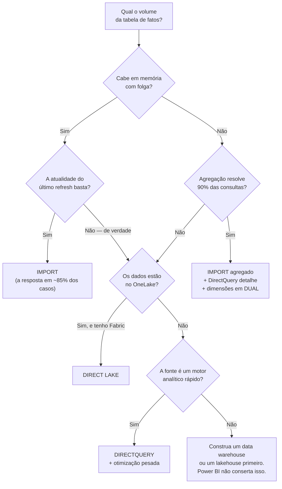

# 20 · Modos de armazenamento

**Nível:** avançado
**Data:** 14/08/2026

Esta é a decisão de arquitetura que define o teto do seu projeto. Ela é difícil de reverter
e é tomada, na maioria das vezes, por acidente — clicando em "Importar" sem pensar.

---

## 1. Os modos

| Modo | Onde ficam os dados | Quando são lidos |
|---|---|---|
| **Import** | Copiados e comprimidos na memória do modelo | No refresh |
| **DirectQuery** | Permanecem na fonte | A cada consulta de cada visual |
| **Direct Lake** | Em Delta Parquet no OneLake | Sob demanda, carregados em memória por coluna |
| **Dual** | Ambos (Import + DirectQuery) | O motor escolhe por consulta |
| **Composto** | Tabelas em modos diferentes no mesmo modelo | Depende da tabela |

---

## 2. Import — o padrão, e quase sempre a resposta certa

```
Fonte ──(refresh)──► VertiPaq (memória) ──(consulta)──► visual
        1×/dia                              milissegundos
```

**Vantagens:**

- **Velocidade.** Consultas em milissegundos sobre dezenas de milhões de linhas.
- **DAX completo.** Todas as funções disponíveis.
- **Independência da fonte.** Se o ERP cair às 10h, o relatório continua funcionando.
- **Simplicidade.** Menos coisas para dar errado.
- **Compressão.** 5× a 20× de redução típica ([`21`](21-vertipaq-por-dentro.md)).

**Limitações:**

- **Cabe na memória?** 1 GB no Pro, 100 GB no PPU, até 400 GB nos F-SKU maiores.
- **Dado envelhecido.** Entre refreshes, o número está congelado.
- **Janela de refresh.** 8×/dia no Pro; 2 h de duração máxima.

**Quando usar:** por padrão. **Opinião do autor, e é forte:** cerca de 85% dos projetos de
Power BI deveriam ser Import puro, e boa parte dos que não são estão em DirectQuery por
um requisito de "tempo real" que ninguém verificou.

---

## 3. DirectQuery

```
Fonte ◄──(SQL a cada visual, a cada clique)── modelo ──► visual
       centenas de ms a segundos
```

**Vantagens:**

- Dado sempre atual.
- Volume ilimitado (a fonte que aguente).
- Não consome memória da capacidade com dados.
- Respeita a segurança da fonte, se configurado com SSO.

**Custos, e eles são altos:**

| Custo | Detalhe |
|---|---|
| **Latência** | Cada visual = ao menos uma consulta SQL. Página com 8 visuais = 8+ consultas por clique |
| **Carga na fonte** | 50 usuários navegando = centenas de consultas por minuto no seu banco de produção |
| **DAX limitado** | Muitas funções não são suportadas ou forçam materialização |
| **Sem relação entre fontes diferentes** | (exceto em modelo composto) |
| **Limite de 1 milhão de linhas** por resultado intermediário |
| **Gateway no caminho crítico** | Se on-premises, o gateway participa de **toda** consulta |
| **Complexidade de otimização** | Você precisa otimizar o banco, os índices, o modelo e o DAX |

### 3.1 Quando DirectQuery é a resposta certa

- O dado **não cabe** em memória e agregações não resolvem.
- **Requisito real** de latência menor que o intervalo de refresh possível — e "real"
  significa: alguém toma uma decisão diferente por causa de dados de 5 minutos atrás.
- Requisito **legal/regulatório** de que os dados não sejam copiados.
- A fonte é um motor analítico rápido e dimensionado para isso: **Synapse, Databricks,
  Snowflake, BigQuery, Fabric Warehouse**. DirectQuery contra um OLTP transacional é
  quase sempre um erro.

### 3.2 Quando é um erro (e é o caso mais comum)

> *"O diretor pediu tempo real."*

Pergunte: **que decisão ele toma às 10h05 que seria diferente com dados das 10h00?**
Em análise de vendas, financeira ou de RH, a resposta honesta é "nenhuma". Em monitoramento
de processo industrial ou detecção de fraude, pode ser legítima — mas aí talvez a
ferramenta certa nem seja Power BI, e sim um painel de tempo real
(Fabric Real-Time Intelligence) ou o próprio sistema supervisório.

### 3.3 Otimizações essenciais em DirectQuery

1. **Índices e estatísticas na fonte.** É o banco que faz o trabalho.
2. **Views otimizadas** em vez de tabelas cruas; ou tabelas já modeladas em estrela.
3. **`ASSUMEREFERENTIALINTEGRITY`** nas relações — gera `INNER JOIN` em vez de
   `OUTER JOIN`, o que muda o plano do banco drasticamente. **Só ative se a integridade
   for garantida de fato**; se houver órfãos, linhas somem silenciosamente.
4. **Reduzir visuais por página.**
5. **Aplicar filtros por padrão** — nunca abra a página "sem filtro" sobre 400 milhões de
   linhas.
6. **Botão "Aplicar" nas segmentações** (Formato → Aplicar todos os filtros): o usuário
   escolhe tudo e dispara uma vez, em vez de uma consulta por clique.
7. **Evitar colunas calculadas** (viram subconsultas) e medidas com muitas funções não
   dobráveis.
8. **Máximo de conexões por fonte** (Opções → Arquivo Atual → DirectQuery): aumentar
   melhora o paralelismo, mas sobrecarrega a fonte.

---

## 4. Direct Lake

> **Direct Lake** — modo em que o modelo lê arquivos **Delta Parquet** diretamente do
> **OneLake**, carregando colunas em memória sob demanda, sem cópia prévia nem consulta SQL.

```
OneLake (Delta Parquet)  ──(carga por coluna, sob demanda)──► memória ──► visual
                            transcodificação preguiçosa
```

**É a tentativa de ter os dois mundos:** velocidade próxima do Import com atualidade
próxima do DirectQuery.

### 4.1 Como funciona

Parquet já é colunar e comprimido — a mesma família de ideias do VertiPaq. Quando um visual
pede uma coluna, o motor a **transcodifica** do Parquet para o formato interno e a mantém
em memória (*paging*). Colunas nunca consultadas nunca são carregadas.

Se o dado mudou no lakehouse, o motor invalida o que está em memória e recarrega. Isso é o
*framing*: o modelo aponta para uma versão específica dos arquivos Delta e é reapontado
quando há atualização.

### 4.2 Requisitos e limites

| Requisito | Detalhe |
|---|---|
| **Fabric** | Capacidade F-SKU (ou avaliação) |
| **Dados no OneLake** | Em tabelas Delta, num Lakehouse ou Warehouse |
| **Limites por SKU** | Número de linhas e tamanho de memória variam por SKU |
| ***Fallback*** | Se algo não for suportado, o motor **cai para DirectQuery** automaticamente — com a queda de desempenho correspondente |

**O *fallback* é o ponto que exige atenção.** Um modelo Direct Lake que silenciosamente
opera em DirectQuery tem o pior dos dois mundos. Monitore isso; é possível configurar o
comportamento de fallback.

### 4.3 O que 2026 trouxe

- **Direct Lake no Power BI Desktop** — editar modelos Direct Lake localmente.
- **Modelos compostos com Direct Lake + tabelas Import** (preview em 2026): você combina
  o volume do lakehouse com tabelas importadas de qualquer um dos ~200 conectores. Isso
  remove a maior restrição prática do Direct Lake (tudo tinha de estar no OneLake).
- **Agentes que criam modelos Direct Lake** a partir de um Lakehouse
  (*semantic model authoring skill*).

### 4.4 Quando usar

- Você já está no Fabric e os dados já estão no OneLake.
- Volumes que não caberiam em Import, mas para os quais DirectQuery seria lento demais.
- Cadência de atualização muito frequente.

**Quando não usar:** se seus dados estão num SQL Server on-premises e você não tem
Fabric, Direct Lake não é uma opção — e forçar uma arquitetura para chegar lá pode custar
muito mais que o problema que resolve.

---

## 5. Dual

Uma tabela em modo **Dual** é armazenada em Import **e** pode ser consultada em
DirectQuery. O motor escolhe por consulta.

**Uso principal: dimensões em modelos compostos.** Se `dProduto` é Import e `fVendas` é
DirectQuery, toda consulta precisaria juntar memória com banco — caro. Com `dProduto` em
**Dual**, o motor a usa em memória quando o resultado é local e a envia como parte da
consulta SQL quando precisa juntar com o fato remoto.

**Regra prática:** em modelo composto, **dimensões compartilhadas em Dual**, fatos grandes
em DirectQuery, fatos agregados em Import.

---

## 6. Modelo composto

Tabelas em modos diferentes no mesmo modelo. Dois cenários distintos:

### 6.1 Composto por modo (Import + DirectQuery)

```
   dProduto  (Dual)        dCalendario (Dual)
        │                        │
        ├────────────────────────┤
        ▼                        ▼
   fVendasAgregada (Import)   fVendasDetalhe (DirectQuery)
   últimos 5 anos, por mês     10 anos, por item de NF
```

### 6.2 Composto sobre modelo semântico publicado

Você conecta a um modelo corporativo publicado e **acrescenta** suas próprias tabelas.

Isso resolve o eterno conflito entre governança e agilidade: o time central mantém o modelo
oficial; o analista acrescenta seu Excel de metas sem pedir autorização e sem duplicar o
modelo.

**Cuidados sérios:**

- Mudanças no modelo central podem quebrar o seu (a Microsoft chama isso de *breaking
  change* e há avisos, mas eles são fáceis de ignorar).
- **RLS do modelo central continua valendo** — e a interação com as suas tabelas locais
  precisa ser testada.
- Prolifera modelos derivados que ninguém governa. É a mesma tensão de 2009, em versão
  nova.

---

## 7. Agregações — a técnica que muda o jogo

> **Tabela de agregação** — uma tabela pequena, pré-agregada, em Import, que o motor usa
> **automaticamente** quando a consulta não precisa do detalhe.

```
fVendasAgg (Import)          fVendas (DirectQuery)
1 milhão de linhas           400 milhões de linhas
por dia × produto × UF       por item de NF

Consulta "vendas por mês e categoria"  → usa fVendasAgg  (milissegundos)
Consulta "detalhe da NF 100234"        → usa fVendas     (segundos)
```

Configuração: botão direito na tabela agregada → **Gerenciar agregações** → mapeie cada
coluna (`Contagem`, `Soma`, `Mín`, `Máx`, `GroupBy`) para a coluna correspondente no
detalhe.

**O usuário não percebe nada.** É o mesmo mecanismo dos *aggregate tables* de data
warehouse, e existe desde os cubos multidimensionais.

**Quando vale:** modelos grandes com padrão de uso 90/10 — quase toda consulta é agregada,
poucas descem ao detalhe. Que é o padrão real de quase todo relatório corporativo.

**Como saber se está funcionando:** DAX Studio → *Server Timings* → procure o evento
`Aggregate table match` (ou a ausência dele) — ver [`22`](22-desempenho.md).

---

## 8. Como decidir



O ramo `K` é o mais honesto do diagrama e o menos seguido: **DirectQuery contra um banco
transacional mal modelado não é uma solução de BI, é um problema de arquitetura de dados
adiado**.

---

## 9. Tabela comparativa

| | Import | DirectQuery | Direct Lake | Dual |
|---|---|---|---|---|
| Velocidade de consulta | ★★★★★ | ★★ | ★★★★ | ★★★★ |
| Atualidade | do refresh | tempo real | quase real | mista |
| Volume | limitado pela RAM | ilimitado | muito grande | limitado |
| Funções DAX | todas | limitadas | quase todas | todas |
| Carga na fonte | só no refresh | **contínua** | leitura de arquivos | mista |
| Complexidade | baixa | **alta** | média | alta |
| Custo de licença | qualquer | qualquer | **exige Fabric** | qualquer |
| Depende do gateway em consulta | não | **sim** (se on-prem) | não | parcial |
| Resiliente à queda da fonte | **sim** | não | parcial | parcial |

---

## 10. Os cinco porquês: por que Import é tão mais rápido que DirectQuery?

1. **Por que a mesma consulta é 100× mais rápida em Import?**
   Porque em Import os dados estão em RAM, comprimidos em formato colunar, num motor
   desenhado exatamente para a consulta que o DAX gera. Em DirectQuery, há tradução para
   SQL, rede, otimizador de outro motor, execução, rede de volta.

2. **Por que a tradução para SQL custa tanto?**
   Porque o DAX gera SQL genérico e conservador, que não pode assumir índices,
   particionamento ou estatísticas específicas. Uma consulta que o VertiPaq resolve com
   uma varredura vetorizada vira um `SELECT ... GROUP BY ... JOIN` que o banco precisa
   planejar do zero — a cada visual, a cada clique.

3. **Por que não gerar SQL melhor?**
   Porque o gerador precisa funcionar para dezenas de dialetos diferentes (SQL Server,
   Oracle, Snowflake, Databricks, SAP HANA…), cada um com capacidades e sintaxes
   distintas. Otimizar para todos é impossível; o denominador comum é conservador.

4. **Por que o VertiPaq não tem esse problema?**
   Porque ele é **um motor só**, sem tradução, sem rede e sem negociação de dialeto. O
   plano de consulta do DAX mapeia quase diretamente em operações de varredura sobre
   segmentos de coluna comprimidos.

5. **Parada legítima — hierarquia de memória e ausência de fronteira de processo.**
   No limite, é física: RAM é ordens de grandeza mais rápida que rede + disco, e não
   atravessar fronteira de processo elimina serialização, cópia e latência. Nenhuma
   engenharia de software fecha essa lacuna. É exatamente o mesmo argumento do
   [`01-introducao-leigo.md`](01-introducao-leigo.md) §10, agora aplicado à decisão de
   arquitetura.

---

## 11. Autoteste

1. Cite os cinco modos e diga onde os dados ficam em cada um.
2. Por que Import é a resposta certa na maioria dos casos?
3. Que pergunta você faz quando alguém pede "tempo real"?
4. Cite quatro custos reais de DirectQuery.
5. O que faz `ASSUMEREFERENTIALINTEGRITY` e qual o risco de ativá-la indevidamente?
6. Explique Direct Lake em duas frases, e diga o que é o *fallback*.
7. Para que serve o modo Dual, e onde ele é usado tipicamente?
8. O que uma tabela de agregação faz, e qual padrão de uso a justifica?
9. Qual é o ramo mais honesto da árvore de decisão, e por quê?
10. Explique, em termos de hierarquia de memória, por que Import é mais rápido.

---

**Próximo:** [`21-vertipaq-por-dentro.md`](21-vertipaq-por-dentro.md) — abrindo a caixa-preta.

---

*Fontes consultadas em 14/08/2026: [Microsoft Learn — Direct Lake overview](https://learn.microsoft.com/en-us/fabric/fundamentals/direct-lake-overview); [Microsoft Learn — Direct Lake no Power BI Desktop](https://learn.microsoft.com/en-us/fabric/fundamentals/direct-lake-power-bi-desktop); [Fabric Community — Deep dive into composite semantic models with Direct Lake and import tables](https://community.fabric.microsoft.com/t5/Power-BI-Updates-Blog/Deep-dive-into-composite-semantic-models-with-Direct-Lake-and/ba-p/5173943).*
