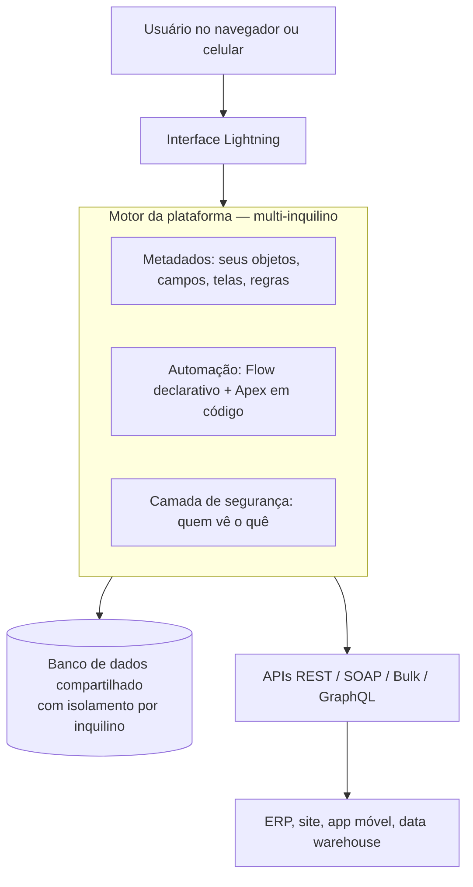

# 01 · O que é Salesforce, explicado do zero

`Nível: iniciante` · `Atualizado: 11/08/2026` · Pré-requisito: nenhum.

Este arquivo não tem jargão. Todo termo técnico que aparece é definido na frase seguinte.

---

## 1. A analogia do caderno da padaria

Imagine uma padaria de bairro. O dono conhece os clientes pelo nome. Ele sabe que a
dona Alzira compra pão de forma toda terça, que o seu Osmar deve R$ 40 desde o mês
passado, e que o restaurante da esquina encomenda 200 pãezinhos toda sexta às 6h.

Tudo isso está na cabeça dele e num caderno atrás do balcão.

Agora a padaria vira uma rede com 40 lojas, 300 funcionários e 12 mil clientes.

O caderno não escala. Não porque falta espaço — mas porque:

- **duas pessoas não podem escrever no mesmo caderno ao mesmo tempo;**
- ninguém sabe qual é a versão certa quando existem 40 cadernos;
- quando o funcionário que "conhecia os clientes" sai, o conhecimento vai embora com ele;
- ninguém consegue responder "quanto vendemos para restaurantes no trimestre?" sem virar 40 cadernos;
- não dá para saber quem prometeu o quê a quem, nem cobrar promessa não cumprida.

**Salesforce é o caderno compartilhado da empresa inteira** — um só, na internet, onde
todo mundo escreve ao mesmo tempo, com regras sobre quem pode ver e mudar o quê, e com
a capacidade de responder perguntas sobre tudo que está escrito nele.

E, o mais importante para entender o preço: **é um caderno programável**. Você pode dizer
a ele "toda vez que alguém escrever X, faça Y automaticamente". É aí que ele deixa de ser
um caderno e vira um sistema.

---

## 2. O que a sigla CRM quer dizer

**CRM** = *Customer Relationship Management*, em português "gestão do relacionamento com o cliente".

É a categoria de software que guarda **tudo que a empresa sabe sobre cada cliente e cada
negócio em andamento**: quem é, o que comprou, o que reclamou, quem falou com ele por último,
quanto ele deve, qual a chance de fechar a próxima venda.

Salesforce é o CRM mais usado do mundo. Segundo a IDC (consultoria de mercado de tecnologia),
em 2025 a empresa detinha **20,0% do mercado mundial de CRM** — a maior fatia, pelo 13º ano
consecutivo. A receita da empresa no ano fiscal de 2026 foi de **US$ 41,5 bilhões**.

> **Fato vs. opinião.** Os números acima são fato publicado. A opinião a seguir é minha:
> a liderança de Salesforce hoje se sustenta menos pela qualidade do CRM em si — que tem
> concorrentes muito bons — e mais pelo **custo de sair**. Depois de cinco anos de
> customização, migrar é um projeto de anos. Isso é uma vantagem competitiva real, mas
> é bom você saber que ela existe antes de entrar.

---

## 3. Os quatro substantivos que resolvem 80% da confusão

Salesforce organiza o mundo em "objetos" — que são simplesmente **tipos de ficha**.
Quatro deles aparecem em toda conversa:

| Ficha | Nome em inglês | O que é, em uma frase |
|---|---|---|
| **Conta** | Account | A empresa (ou pessoa) com quem você faz negócio. |
| **Contato** | Contact | A pessoa dentro daquela empresa com quem você fala. |
| **Oportunidade** | Opportunity | Um negócio específico em andamento, com valor e data prevista. |
| **Caso** | Case | Um problema, dúvida ou pedido do cliente que precisa de resposta. |

Exemplo concreto, ligando os quatro:

> A **Conta** é o *Restaurante Sabor da Esquina*.
> O **Contato** é *Maria Rosa*, gerente de compras do restaurante.
> A **Oportunidade** é *"Contrato anual de fornecimento de pães — R$ 84.000 — fecha em 30/09/2026"*.
> O **Caso** é *"Entrega de 12/08 chegou com 2 horas de atraso"*.

Isso é o núcleo. Tudo mais na plataforma é variação, extensão ou automação em cima disso.

---

## 4. Por que isso existe — o problema de 1999

Em 1999, comprar um sistema de CRM significava:

1. comprar **licenças** de software (dezenas ou centenas de milhares de dólares, adiantado);
2. comprar **servidores** para rodar o software;
3. contratar uma consultoria para **instalar** (6 a 18 meses);
4. contratar gente para **manter** os servidores;
5. pagar de novo, daqui a três anos, para **atualizar** de versão — outro projeto de meses.

O líder de mercado era o Siebel Systems. Um projeto Siebel típico levava mais de um ano
para o primeiro usuário logar, e uma parcela grande dos projetos simplesmente falhava.

**Marc Benioff**, que trabalhava na Oracle, fundou a Salesforce em **março de 1999** com
Parker Harris, Dave Moellenhoff e Frank Dominguez, num apartamento em San Francisco, com
uma tese de uma frase:

> *E se o software de empresa funcionasse como um site — você entra pelo navegador,
> paga por mês, e alguém cuida do resto?*

O slogan da empresa era um "não software" riscado. Era agressivo de propósito: a proposta
não era um software melhor, era **não ter software para instalar**.

Isso hoje parece óbvio. Em 1999 era heresia. As objeções eram sérias e algumas se
provaram parcialmente certas (ver [11-historia.md](11-historia.md)): dados sensíveis na
máquina de outra empresa, dependência de conexão, perda de controle sobre quando atualizar,
e a suspeita — correta — de que o barato do começo ficaria caro com o tempo.

Essa é a **primeira das cinco camadas de "por quê"** deste assunto. Continuamos:

### Por que "pagar por mês" mudou tudo?

Porque muda quem carrega o risco. No modelo antigo, você pagava tudo adiantado e o risco
do projeto falhar era **seu**. No modelo por assinatura, o fornecedor só continua recebendo
se você continuar usando — então o incentivo dele muda de "vender" para "fazer funcionar".

### E por que ninguém tinha feito isso antes de 1999?

Porque faltavam três coisas simultaneamente: banda larga corporativa suficiente para uma
aplicação inteira rodar no navegador; navegadores capazes o bastante (o JavaScript de 1996
não dava conta); e um modelo de negócio de cartão de crédito recorrente aceito por empresas.
1999 é aproximadamente o primeiro ano em que os três existiam juntos.

### E por que Salesforce venceu, e não os outros que tentaram o mesmo?

Aqui a resposta é menos técnica. Salesforce foi, de longe, a que mais investiu em
**tornar-se plataforma** — deixar o cliente customizar sem sair do produto (2006, Apex)
e deixar terceiros venderem extensões (2005, AppExchange). Isso criou um efeito de rede:
existir gente que sabe Salesforce faz mais empresas escolherem Salesforce, o que faz mais
gente aprender Salesforce. Ver [11-historia.md](11-historia.md).

### E por que esse efeito de rede não foi quebrado?

Porque o ativo mais escasso não é o software, é a **mão de obra que sabe operá-lo** — e ela
foi construída de graça pela própria Salesforce com o Trailhead (2014), a plataforma de
ensino gratuita. Formar o mercado de trabalho do seu próprio produto é, na minha opinião
profissional, a jogada estratégica mais subestimada da história do software corporativo.

*(Chegamos a uma parada legítima: uma decisão empresarial documentada, não uma lei da natureza.)*

---

## 5. Salesforce é um produto ou uma plataforma? As duas coisas, e isso confunde todo mundo

Esta é a fonte número um de mal-entendido. Existem **duas Salesforce**:

### 5.1 Salesforce, o aplicativo pronto

Você assina, entra, e já existe uma tela de vendas funcionando: cadastro de clientes,
funil de vendas, relatórios, e-mail integrado. Um vendedor usa isso sem escrever
uma linha de código. É o que chamam de **Sales Cloud**.

Existem vários desses aplicativos prontos, chamados de "clouds":

| Cloud | Para quem | Resolve |
|---|---|---|
| **Sales Cloud** | Time comercial | Funil de vendas, previsão, cotações |
| **Service Cloud** | Suporte / SAC | Chamados, filas, base de conhecimento, canais |
| **Marketing Cloud** | Marketing | Campanhas, e-mail em massa, jornadas |
| **Commerce Cloud** | E-commerce | Loja online, catálogo, checkout |
| **Data Cloud / Data 360** | Dados | Unifica dados de várias fontes num perfil de cliente |
| **Agentforce** | Todos | Agentes de IA que executam tarefas dentro do CRM |

### 5.2 Salesforce, a plataforma de construir aplicativos

Por baixo dos aplicativos prontos existe uma máquina genérica: você cria seus próprios
tipos de ficha, suas próprias telas, suas próprias regras, sua própria lógica em código.
Empresas usam isso para construir sistemas que **não têm nada a ver com vendas** —
gestão de processos jurídicos, controle de manutenção de frota, matrícula de alunos.

Isso já se chamou *Force.com*, hoje se chama **Salesforce Platform**.

**A implicação prática:** quando alguém diz "trabalho com Salesforce", pode significar
coisas muito diferentes — desde configurar telas sem código até escrever sistemas
distribuídos em Apex. Ver [20-clouds-e-produtos.md](20-clouds-e-produtos.md) para o mapa
completo, e [10-fundamentos.md](10-fundamentos.md) para o vocabulário.

---

## 6. Como isso se parece na prática

O ponto importante do desenho: **você nunca fala com o banco de dados diretamente**.
Toda operação passa pelo motor da plataforma, que aplica segurança, aplica automação e
impõe limites de consumo. Isso é o que permite milhares de empresas dividirem a mesma
infraestrutura sem uma atrapalhar a outra — e é também a origem de quase toda frustração
técnica com a plataforma. A explicação completa está em
[19-multitenancy-arquitetura.md](19-multitenancy-arquitetura.md).

---

## 7. Um dia na vida de quem usa

**Vendedor, 9h:** abre a lista de oportunidades que fecham este mês. Vê que a do
*Restaurante Sabor da Esquina* está parada há 12 dias. Registra uma ligação, muda o
estágio para "Proposta enviada", anexa o PDF.

**No mesmo instante, sem ninguém fazer nada:** a plataforma recalcula a previsão de vendas
do time, notifica o gerente porque o valor passou de R$ 50 mil, cria uma tarefa de
follow-up para daqui a 3 dias e envia os dados para o ERP.

**Gerente, 10h:** abre um painel que mostra o funil do time inteiro, sem pedir relatório
para ninguém.

**Atendente, 14h:** cliente liga reclamando de atraso. Ele abre a ficha da conta e vê,
na mesma tela, todo o histórico: compras, contratos, chamados anteriores, quem falou com
o cliente por último e o quê. Abre um **Caso**, e o sistema roteia automaticamente para a
fila de logística.

**Administrador, 16h:** o diretor pediu um campo novo, "Risco de crédito", visível só
para gerentes. Ele cria o campo, define a permissão e publica — **em 4 minutos, sem código
e sem parar o sistema.**

Esse último parágrafo é o que vende Salesforce. Guarde-o: a promessa central da plataforma
é **velocidade de mudança**, não elegância técnica.

---

## 8. Quando Salesforce é a escolha errada

Um material honesto precisa dizer isto no primeiro arquivo, não no último.

| Situação | Por que Salesforce é ruim aqui | O que usar |
|---|---|---|
| Você tem 3 clientes e 2 funcionários | Custo e complexidade absurdos para o problema | Planilha, ou um CRM leve |
| Volume altíssimo de transações (milhões/dia, baixa latência) | Governor limits e arquitetura compartilhada não foram feitos para isso | Sistema próprio, banco dedicado |
| Cálculo numérico pesado, ciência de dados, processamento de imagem | Apex é limitado por CPU e memória por transação, por projeto | Python fora da plataforma; traga só o resultado |
| Você precisa controlar exatamente quando atualiza | A plataforma atualiza 3× ao ano e você não escolhe | Software auto-hospedado |
| Produto que você vai vender a consumidor final em escala | Modelo de licença por usuário não fecha a conta | Stack própria |
| Requisito legal de dados nunca saírem da sua infraestrutura | É SaaS; existem opções de residência mas não de "na minha sala" | On-premise |

**Regra prática que uso há muito tempo:** Salesforce compensa quando o valor está em
*processo de negócio compartilhado por muita gente com regras que mudam toda hora*.
Não compensa quando o valor está em *volume, latência ou computação*.

---

## 9. Quanto custa, em uma linha

O suficiente para você não se assustar depois: as edições de Sales Cloud, em preço de
tabela nos EUA em **11/08/2026**, vão de **US$ 25/usuário/mês** (Starter Suite) a
**US$ 550/usuário/mês** (Agentforce 1 Sales), com a edição mais comum em empresas médias,
a Enterprise, em **US$ 175/usuário/mês**, cobrada anualmente.

Para 50 usuários na Enterprise: **US$ 105.000/ano** ≈ **R$ 537 mil/ano** — e isso é
**antes** de add-ons, Data Cloud, créditos de IA e consultoria. O detalhamento honesto,
com os custos que ninguém mostra na proposta comercial, está em
[80-custos-e-licencas.md](80-custos-e-licencas.md).

**Para aprender, porém, o custo é zero.** Existe uma org gratuita e permanente para
desenvolvedores (Developer Edition) e uma plataforma de ensino oficial gratuita (Trailhead).
Você não precisa de cartão de crédito. Ver [03-instalacao.md](03-instalacao.md).

---

## 10. O que fazer agora

1. Leia [02-pre-requisitos.md](02-pre-requisitos.md) — 10 minutos, e evita frustração.
2. Siga [03-instalacao.md](03-instalacao.md) — crie sua org gratuita hoje.
3. Faça [04-como-comecar.md](04-como-comecar.md) — você terá código rodando na nuvem em ~40 minutos.

Se você quer entender antes de mexer, vá direto para
[10-fundamentos.md](10-fundamentos.md) e [11-historia.md](11-historia.md).

---

## Autoteste

1. Explique para alguém de fora da tecnologia o que Salesforce faz, sem usar a palavra "CRM".
2. Qual a diferença entre uma **Conta** e um **Contato**? Dê um exemplo do seu contexto.
3. Que problema concreto de 1999 a empresa atacou? Cite duas dores do modelo anterior.
4. Salesforce é produto pronto ou plataforma de desenvolvimento? Justifique com um exemplo de cada.
5. Cite três situações em que você **não** usaria Salesforce, e diga o que usaria no lugar.
6. Por que "atualiza três vezes por ano sem você escolher" pode ser um problema real?
7. Qual foi, na leitura, o motivo mais profundo apontado para a liderança de mercado da empresa?

---

### Fontes consultadas (11/08/2026)

- Salesforce Newsroom — *Salesforce Named #1 CRM Provider by IDC Market Share* — https://www.salesforce.com/news/stories/idc-crm-market-share-ranking-2025/
- Salesforce (EU) — página oficial de preços de Sales Cloud — https://www.salesforce.com/eu/sales/pricing/
- Wikipedia — *Salesforce* (fundação, cronologia, aquisições) — https://en.wikipedia.org/wiki/Salesforce
