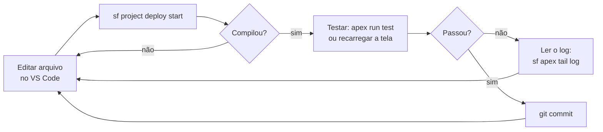

# 04 · Como começar — do ambiente pronto ao primeiro resultado

`Nível: iniciante` · `Atualizado: 11/08/2026` · `API 67.0`

Assume o ambiente instalado por [03-instalacao.md](03-instalacao.md).
**Não repetimos a instalação aqui.** Se `sf org list` não mostra sua org como `Connected`,
volte para o `03` §9.

Tempo estimado: **40 a 60 minutos**. Ao final você terá um objeto customizado, um registro,
uma classe Apex com teste, e um componente LWC — todos rodando na nuvem.

---

## Trilha 0 · Sem código, 5 minutos (faça mesmo se você for dev)

Antes de qualquer terminal, entenda o que a plataforma entrega sem programar.

1. Entre na sua org. Clique na **engrenagem** (canto superior direito) → **Setup**.
2. Na *Quick Find*, digite `Object Manager` e clique.
3. Clique em **Account** → **Fields & Relationships** → **New**.
4. Escolha **Picklist**, *Next*.
5. Field Label: `Nível de Risco`. Values: `Baixo`, `Médio`, `Alto` (um por linha). *Next*.
6. Deixe visível para todos os perfis. *Next*. Deixe no layout. *Save*.

**Verificação:** volte para o app (ícone de grade → *Sales*), abra a aba **Accounts**,
abra qualquer conta e edite. O campo *Nível de Risco* está lá, com as três opções.

**Você acabou de alterar o esquema de um banco de dados em produção, sem downtime, em 90
segundos.** Guarde essa sensação — é o valor central desta plataforma, e é também a razão
de tantas orgs virarem um pântano de 400 campos inúteis em cinco anos. Ver
[75-armadilhas.md](75-armadilhas.md) §2.

---

## Trilha 1 · O primeiro código: Apex no navegador (10 minutos)

Não precisa de terminal.

1. Engrenagem → **Developer Console** (abre uma janela nova).
2. Menu **Debug → Open Execute Anonymous Window** (`Ctrl+E`).
3. Cole:

```apex
// Consulta as 5 primeiras contas e escreve o nome de cada uma no log.
List<Account> contas = [SELECT Id, Name FROM Account ORDER BY Name LIMIT 5];
System.debug('Encontradas ' + contas.size() + ' contas:');
for (Account a : contas) {
    System.debug('  → ' + a.Name);
}
```

4. Marque **Open Log** e clique **Execute**.

**Verificação:** abre uma aba de log. Marque a caixa **Debug Only** no rodapé.
Você deve ver:

```text
USER_DEBUG|[2]|DEBUG|Encontradas 5 contas:
USER_DEBUG|[4]|DEBUG|  → Burlington Textiles Corp of America
USER_DEBUG|[4]|DEBUG|  → Dickenson plc
...
```

**Se disser `List has no rows for assignment`** — não vai dizer aqui, mas guarde: é o erro
mais comum de Apex e acontece quando você atribui uma query a um objeto único
(`Account a = [SELECT...]`) e ela não retorna nada. Sempre prefira `List<>`.

**O que você aprendeu em 6 linhas:**
- `[SELECT ... FROM ...]` é **SOQL embutido na linguagem** — não é string, é sintaxe.
  O compilador valida os nomes de campo. Isso é raro e é uma das melhores ideias de Apex.
- Apex é fortemente tipado, com sintaxe de Java.
- `System.debug` escreve no log, que é a sua principal ferramenta de depuração.

---

## Trilha 2 · O ciclo de trabalho real, no terminal (20 minutos)

Aqui começa o que você vai fazer todo dia.

### 2.1 Criar o projeto

```bash
sf project generate --name primeiros-passos --template standard
cd primeiros-passos
```
*Gera a estrutura padrão do projeto Salesforce DX.*

**Verificação:**
```bash
ls -1
# esperado:
# README.md
# config
# force-app
# package.json
# scripts
# sfdx-project.json
```

Entenda a estrutura antes de seguir:

```text
primeiros-passos/
├── sfdx-project.json          # manifesto: onde está o código, qual versão da API
├── config/
│   └── project-scratch-def.json   # receita da scratch org (edição, features)
├── force-app/main/default/    # ← TODO o seu código e metadados vivem aqui
│   ├── classes/               #   Apex
│   ├── lwc/                   #   Lightning Web Components
│   ├── objects/               #   objetos e campos customizados
│   ├── triggers/              #   triggers Apex
│   └── ...                    #   ~200 outros tipos de metadado possíveis
├── .forceignore               # o que ignorar em deploy/retrieve
└── package.json               # dependências de dev (ESLint, Jest, Prettier)
```

> **Modelo mental essencial:** no Salesforce, **quase tudo é metadado, e metadado é
> arquivo**. Um campo customizado é um XML. Um layout de tela é um XML. Uma regra de
> validação é um XML. Isso é o que torna possível versionar a *configuração* da empresa
> no Git — algo que a maioria dos SaaS não permite. Ver [10-fundamentos.md](10-fundamentos.md) §4.

### 2.2 Definir a org-alvo do projeto

```bash
sf config set target-org devorg
```
*Fixa `devorg` como alvo padrão deste projeto. A partir daqui, você pode omitir `-o`.*

**Verificação:**
```bash
sf config list
# esperado: uma linha  target-org   devorg   Local
```

### 2.3 Trazer o que já existe na org (retrieve)

Você criou o campo *Nível de Risco* pela interface na Trilha 0. Vamos trazê-lo para o disco.

```bash
sf project retrieve start --metadata "CustomField:Account.N_vel_de_Risco__c"
```
*Baixa a definição daquele campo da org para dentro de `force-app/`.*

> O nome de API do campo é gerado a partir do rótulo: acentos viram `_`, espaços viram `_`,
> e o sufixo `__c` marca "customizado". Se não souber o nome exato, descubra com:
> ```bash
> sf sobject describe --sobject Account | grep -i risco
> ```

**Verificação:**
```bash
find force-app -name "*Risco*"
# esperado: force-app/main/default/objects/Account/fields/N_vel_de_Risco__c.field-meta.xml
```

Abra o arquivo. É um XML de ~12 linhas descrevendo o campo. **Esse arquivo é a verdade
que você versiona.** Faça `git init && git add . && git commit -m "campo de risco"` agora,
se quiser — é o hábito certo.

### 2.4 Criar código local e enviar (deploy)

Crie uma classe Apex:

```bash
sf apex generate class --name ContaService --output-dir force-app/main/default/classes
```
*Gera `ContaService.cls` e seu arquivo de metadados `.cls-meta.xml`.*

Abra `force-app/main/default/classes/ContaService.cls` e substitua por:

```apex
/**
 * Serviço de consultas sobre contas.
 * Ilustra: SOQL, agregação, e por que `with sharing` importa.
 */
public with sharing class ContaService {

    /**
     * Retorna as N contas com maior receita anual.
     * @param limite quantas contas retornar (1 a 200)
     */
    public static List<Account> maioresContas(Integer limite) {
        // Guarda de entrada: nunca confie no chamador.
        if (limite == null || limite <= 0) {
            limite = 5;
        }
        limite = Math.min(limite, 200);

        return [
            SELECT Id, Name, AnnualRevenue, Industry
            FROM Account
            WHERE AnnualRevenue != NULL
            ORDER BY AnnualRevenue DESC
            LIMIT :limite            // ← o `:` injeta a variável Apex na consulta, com escape
        ];
    }

    /**
     * Conta quantas contas existem por setor.
     * @return mapa setor → quantidade
     */
    public static Map<String, Integer> contagemPorSetor() {
        Map<String, Integer> resultado = new Map<String, Integer>();
        // AggregateResult é o retorno de qualquer SOQL com função de agregação.
        for (AggregateResult ar : [
            SELECT Industry setor, COUNT(Id) total
            FROM Account
            WHERE Industry != NULL
            GROUP BY Industry
        ]) {
            resultado.put((String) ar.get('setor'), (Integer) ar.get('total'));
        }
        return resultado;
    }
}
```

Envie para a org:

```bash
sf project deploy start --source-dir force-app
```
*Compila e publica o conteúdo de `force-app/` na org-alvo.*

**Verificação:**
```text
esperado, ao final:
Deploy Succeeded.
 Status    Name             Type
 ─────────────────────────────────────
 Created   ContaService     ApexClass
```

**Se falhar com erro de compilação**, a CLI mostra arquivo, linha e mensagem. Corrija e
rode de novo — o ciclo é esse.

### 2.5 Executar

```bash
sf apex run --file /dev/stdin <<'EOF'
Map<String, Integer> porSetor = ContaService.contagemPorSetor();
System.debug('Setores: ' + porSetor);
for (Account a : ContaService.maioresContas(3)) {
    System.debug(a.Name + ' — ' + a.AnnualRevenue);
}
EOF
```
*Executa Apex anônimo lido da entrada padrão. No Windows PowerShell, salve o trecho num
arquivo `teste.apex` e rode `sf apex run --file teste.apex`.*

**Verificação:** a saída contém linhas `USER_DEBUG` com o mapa e os nomes.

### 2.6 Escrever o teste (obrigatório, não opcional)

**Regra da plataforma:** para publicar Apex em produção, você precisa de **75% de cobertura
de testes** na org e **todos os testes precisam passar**. Isso não é convenção de time —
é imposto pelo servidor. É, na minha opinião, a melhor decisão de governança que a
Salesforce já tomou, e a mais odiada por quem chega.

```bash
sf apex generate class --name ContaServiceTest --output-dir force-app/main/default/classes
```

Conteúdo:

```apex
@isTest
private class ContaServiceTest {

    /**
     * Cria dados de teste. Por padrão, testes Apex NÃO enxergam os dados da org
     * (isolamento) — você precisa criar tudo que vai usar.
     */
    @TestSetup
    static void criarDados() {
        List<Account> contas = new List<Account>();
        for (Integer i = 0; i < 10; i++) {
            contas.add(new Account(
                Name          = 'Conta Teste ' + i,
                AnnualRevenue = 1000 * (i + 1),
                Industry      = Math.mod(i, 2) == 0 ? 'Technology' : 'Banking'
            ));
        }
        insert contas;   // 1 DML para 10 registros — nunca insira dentro de laço
    }

    @isTest
    static void maioresContas_retornaOrdenadoDesc() {
        Test.startTest();
        List<Account> resultado = ContaService.maioresContas(3);
        Test.stopTest();

        Assert.areEqual(3, resultado.size(), 'Deveria respeitar o limite');
        Assert.isTrue(
            resultado[0].AnnualRevenue >= resultado[1].AnnualRevenue,
            'Deveria vir em ordem decrescente de receita'
        );
    }

    @isTest
    static void maioresContas_limiteInvalidoUsaPadrao() {
        Assert.areEqual(5, ContaService.maioresContas(0).size(), 'Zero deve virar 5');
        Assert.areEqual(5, ContaService.maioresContas(null).size(), 'Null deve virar 5');
    }

    @isTest
    static void contagemPorSetor_agrupaCorretamente() {
        Map<String, Integer> mapa = ContaService.contagemPorSetor();
        Assert.areEqual(5, mapa.get('Technology'), 'Cinco contas de tecnologia');
        Assert.areEqual(5, mapa.get('Banking'),    'Cinco contas de banco');
    }
}
```

```bash
sf project deploy start --source-dir force-app
sf apex run test --class-names ContaServiceTest --result-format human --code-coverage --wait 10
```
*Publica e roda apenas os testes dessa classe, esperando o resultado e mostrando cobertura.*

**Verificação:**
```text
esperado:
=== Test Results
TEST NAME                                             OUTCOME
────────────────────────────────────────────────────  ───────
ContaServiceTest.maioresContas_retornaOrdenadoDesc    Pass
ContaServiceTest.maioresContas_limiteInvalidoUsaPadrao Pass
ContaServiceTest.contagemPorSetor_agrupaCorretamente  Pass

Outcome: Passed
Tests Ran: 3
Pass Rate: 100%
```

**Se `contagemPorSetor_agrupaCorretamente` falhar** dizendo que encontrou mais que 5:
sua org tem contas de exemplo com Industry preenchida e sua classe não está isolada.
Esse é justamente o motivo de `@isTest(SeeAllData=false)` ser o padrão — e a lição é que
`contagemPorSetor` consulta a org inteira. Em código real, você filtraria. Ver
[15-apex.md](15-apex.md) §6.

---

## Trilha 3 · O primeiro LWC — algo na tela (15 minutos)

```bash
sf lightning generate component --name topContas --type lwc \
  --output-dir force-app/main/default/lwc
```
*Cria os três arquivos de um Lightning Web Component: `.js`, `.html`, `.js-meta.xml`.*

### 3.1 Expor o Apex ao componente

Adicione este método à classe `ContaService`:

```apex
    /**
     * Versão exposta ao front-end.
     * @AuraEnabled(cacheable=true) permite que o LWC use @wire e que a plataforma
     * guarde o resultado em cache no cliente. Métodos cacheable NÃO podem fazer DML.
     */
    @AuraEnabled(cacheable=true)
    public static List<Account> topContasParaUI() {
        return maioresContas(5);
    }
```

### 3.2 `topContas.js`

```javascript
import { LightningElement, wire } from 'lwc';
// Importa o método Apex como se fosse um módulo. O caminho é @salesforce/apex/<Classe>.<metodo>
import topContasParaUI from '@salesforce/apex/ContaService.topContasParaUI';

const COLUNAS = [
    { label: 'Conta',   fieldName: 'Name',          type: 'text' },
    { label: 'Setor',   fieldName: 'Industry',      type: 'text' },
    {
        label: 'Receita anual',
        fieldName: 'AnnualRevenue',
        type: 'currency',
        typeAttributes: { currencyCode: 'BRL' }
    }
];

export default class TopContas extends LightningElement {
    colunas = COLUNAS;

    // @wire chama o Apex assim que o componente é criado e reage a mudanças de cache.
    @wire(topContasParaUI)
    contas;

    get temErro() {
        return this.contas?.error !== undefined;
    }

    get mensagemErro() {
        return this.contas?.error?.body?.message ?? 'Erro desconhecido';
    }
}
```

### 3.3 `topContas.html`

```html
<template>
    <lightning-card title="Maiores contas" icon-name="standard:account">
        <div class="slds-var-m-around_medium">

            <template lwc:if={contas.data}>
                <lightning-datatable
                    key-field="Id"
                    data={contas.data}
                    columns={colunas}
                    hide-checkbox-column>
                </lightning-datatable>
            </template>

            <template lwc:if={temErro}>
                <p class="slds-text-color_error">{mensagemErro}</p>
            </template>
        </div>
    </lightning-card>
</template>
```

### 3.4 `topContas.js-meta.xml` — onde o componente pode ser usado

```xml
<?xml version="1.0" encoding="UTF-8"?>
<LightningComponentBundle xmlns="http://soap.sforce.com/2006/04/metadata">
    <apiVersion>67.0</apiVersion>
    <isExposed>true</isExposed>
    <targets>
        <target>lightning__AppPage</target>
        <target>lightning__HomePage</target>
        <target>lightning__RecordPage</target>
    </targets>
</LightningComponentBundle>
```

> **`isExposed` é o interruptor que todo iniciante esquece.** Com `false` (o padrão do
> gerador), o componente não aparece no editor de páginas e você fica achando que o
> deploy falhou.

### 3.5 Publicar e ver na tela

```bash
sf project deploy start --source-dir force-app
```

Depois:
1. Na org, vá para a **Home** do app Sales.
2. Engrenagem → **Edit Page** (abre o Lightning App Builder).
3. Na lista de componentes à esquerda, procure **topContas** em *Custom*.
4. Arraste para a página. **Save** → **Activate** → *Assign as Org Default* → **Save**.
5. Volte (botão *Back*).

**Verificação:** um card "Maiores contas" com uma tabela de 5 linhas e valores formatados
como moeda.

Se a tabela vier vazia, é porque nenhuma conta da sua org tem `AnnualRevenue`.
Preencha em duas contas pela interface e recarregue.

---

## O ciclo de trabalho do dia a dia



Comandos que compõem o ciclo:

| Quero | Comando |
|---|---|
| Enviar meu código | `sf project deploy start -d force-app` |
| Enviar só um arquivo | `sf project deploy start -d force-app/main/default/classes/X.cls` |
| Trazer o que mudou na org | `sf project retrieve start -m "ApexClass:X"` |
| Ver o que está diferente | `sf project deploy preview -d force-app` |
| Rodar testes | `sf apex run test -l RunLocalTests -w 20 -r human` |
| Ver o log ao vivo | `sf apex tail log --color` |
| Consultar dados | `sf data query -q "SELECT ... "` |
| Abrir a org no navegador | `sf org open` |

**Atalho que economiza horas:** `sf org open --path lightning/setup/SetupOneHome/home`
abre direto no Setup. E no VS Code, `Ctrl+Shift+P` → *SFDX: Deploy This Source to Org*
faz o deploy do arquivo aberto sem sair do editor.

---

## Os cinco primeiros erros de uso (não de instalação)

### 1. Editar na org e perder no deploy seguinte

Você mexe pela interface, e depois o `deploy` sobrescreve com a versão do disco.
**Regra:** decida onde está a verdade. Se você mexeu na org, **faça `retrieve` antes** de
qualquer deploy. `sf project retrieve start --metadata ApexClass:MinhaClasse`.

### 2. `List has no rows for assignment to SObject`

```apex
Account a = [SELECT Id FROM Account WHERE Name = 'Não existe'];  // ← estoura
```
Atribuir uma SOQL diretamente a um SObject **lança exceção** se retornar 0 registros
(e também se retornar mais de 1). Sempre:
```apex
List<Account> lista = [SELECT Id FROM Account WHERE Name = 'Não existe'];
if (!lista.isEmpty()) { /* ... */ }
```

### 3. SOQL ou DML dentro de um laço

```apex
for (Account a : contas) {
    insert new Contact(LastName = a.Name, AccountId = a.Id);  // ← morre com 150+ contas
}
```
Você tem **100 consultas SOQL** e **150 operações DML** por transação. Um laço com 200
registros estoura. O certo é acumular numa lista e fazer **um** DML no fim. Isso se chama
*bulkification* e é o conceito nº 1 de Apex — [15-apex.md](15-apex.md) §5.

### 4. Achar que o teste enxerga os dados da org

Testes Apex rodam isolados: nenhum registro da org é visível (exceto alguns objetos de
configuração). Se seu teste "funciona na sua org e falha na do colega", é porque ele
depende de dado que só existe na sua. Crie tudo no `@TestSetup`.

### 5. Esquecer a permissão do campo (FLS)

Você cria um campo, o código funciona no seu usuário (System Administrator) e "some" para
os outros. Campos novos **não** são visíveis por padrão a todos os perfis, e a partir da
**API 67.0** o Apex roda em **user mode** por padrão — ou seja, o próprio código deixa de
enxergar o campo. Ver [13-seguranca-e-compartilhamento.md](13-seguranca-e-compartilhamento.md).

---

## Onde ir agora

| Você quer | Vá para |
|---|---|
| Mais receitas prontas | [06-exemplos.md](06-exemplos.md) — 14 exemplos completos |
| Um app inteiro para estudar | [07-projeto-modelo/](07-projeto-modelo/README.md) |
| Referência de comandos | [05-manual-de-uso.md](05-manual-de-uso.md) |
| Entender o que está acontecendo | [10-fundamentos.md](10-fundamentos.md) |
| Exercícios com critério de aprovação | [70-pratica.md](70-pratica.md) |

---

## Autoteste

1. Qual é a diferença prática entre `sf project deploy start` e `sf project retrieve start`?
2. Por que `Account a = [SELECT ...]` é perigoso e o que usar no lugar?
3. O que `@AuraEnabled(cacheable=true)` habilita, e o que ele proíbe?
4. Para que serve o `isExposed` no `.js-meta.xml` de um LWC?
5. Quantos por cento de cobertura de teste a plataforma exige para publicar em produção, e quem impõe isso?
6. Por que um teste Apex não vê os dados que existem na sua org?
7. Escreva o comando que roda apenas os testes da classe `ContaServiceTest` mostrando cobertura.
8. Você mexeu num campo pela interface e tem código no disco. Qual é o próximo comando, e por quê?
