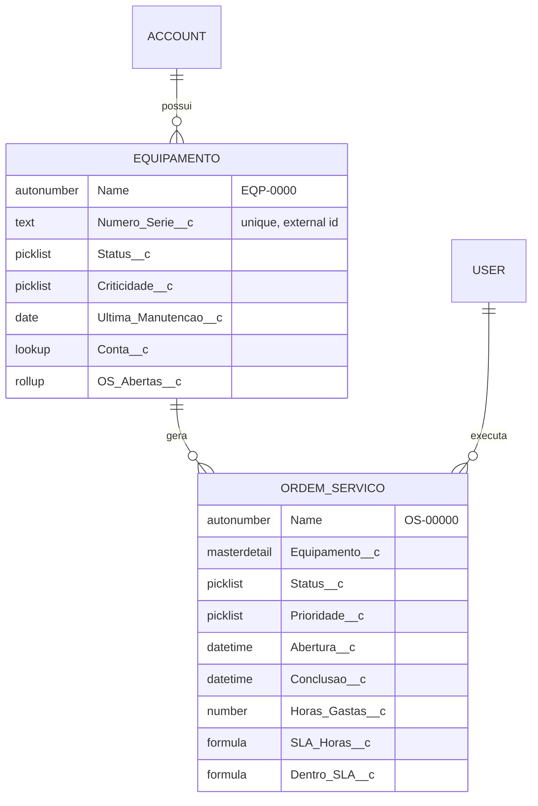

# Projeto-modelo — Gestão de Ordens de Serviço de Manutenção

`Nível: intermediário` · `Atualizado: 11/08/2026` · `API 67.0`

Uma aplicação **pequena, mas inteira**, que roda de verdade numa org Salesforce.
Não é um trecho de código: tem modelo de dados, segurança, automação, serviço com regra de
negócio, interface, testes, dados de exemplo e tratamento de erro.

---

## 1. O que a aplicação faz

Uma empresa presta manutenção em equipamentos instalados nos clientes.

- Cada **Equipamento** pertence a uma **Conta** (cliente) e tem número de série, status e criticidade.
- Quando algo quebra, abre-se uma **Ordem de Serviço (OS)** para aquele equipamento.
- A OS tem prioridade, que determina um **SLA em horas**.
- Enquanto houver OS aberta, o equipamento fica automaticamente **Em manutenção**.
- Ao concluir a última OS, o equipamento volta a **Operacional** e a data de última
  manutenção é atualizada.
- Um painel na página do equipamento mostra as OS, o cumprimento de SLA e permite concluir
  uma OS registrando as horas gastas.



---

## 2. Pré-requisitos

Tudo já coberto em [../03-instalacao.md](../03-instalacao.md):

| Item | Versão mínima | Verificar com |
|---|---|---|
| Salesforce CLI | 2.100+ (testado em 2.146.3) | `sf --version` |
| Node.js | 20+ (testado em 22.17) | `node --version` |
| Java JDK | 17+ (testado em 21) | `java -version` |
| Org Salesforce | Developer Edition, Trial ou scratch org | `sf org list` |
| Git | 2.30+ | `git --version` |

---

## 3. Como rodar — comandos exatos

### Opção A — numa org Developer Edition (mais simples)

```bash
cd 07-projeto-modelo
```

```bash
sf org login web --alias manutencao --set-default
```
*Autoriza sua org e a define como alvo padrão.*

```bash
sf project deploy start --source-dir force-app --wait 20
```
*Publica objetos, campos, classes, trigger, LWC e permission set.*

Saída esperada, ao final:
```text
Deploy Succeeded.
 Status    Name                             Type
 ─────────────────────────────────────────────────────────────
 Created   Equipamento__c                   CustomObject
 Created   Ordem_Servico__c                 CustomObject
 Created   OrdemServicoService              ApexClass
 Created   OrdemServicoTrigger              ApexTrigger
 Created   painelOrdens                     LightningComponentBundle
 Created   Gestao_Manutencao                PermissionSet
 ...
```

```bash
sf org assign permset --name Gestao_Manutencao
```
*Dá ao seu usuário acesso aos objetos e ao método Apex do painel. **Sem isto o painel
aparece vazio ou dá erro de permissão.***

```bash
sf apex run --file scripts/apex/seed.apex
```
*Cria dados de exemplo: 3 contas, 9 equipamentos e 6 ordens de serviço.*

Saída esperada:
```text
Compiled successfully.
Executed successfully.
...
USER_DEBUG|[..]|DEBUG|Seed concluído: 3 contas, 9 equipamentos, 6 ordens de serviço.
```

```bash
sf apex run test --test-level RunLocalTests --result-format human --code-coverage --wait 20
```
*Roda a suíte de testes com relatório de cobertura.*

Saída esperada:
```text
Outcome: Passed
Tests Ran: 25
Pass Rate: 100%
Org Wide Coverage: 9x%
```

```bash
sf org open --path lightning/o/Equipamento__c/list
```
*Abre a lista de equipamentos no navegador.*

### Opção B — numa scratch org (isolada e descartável)

```bash
sf org login web --alias devhub --set-default-dev-hub
sf org create scratch --definition-file config/project-scratch-def.json \
   --alias manutencao --duration-days 7 --set-default
sf project deploy start --source-dir force-app --wait 20
sf org assign permset --name Gestao_Manutencao
sf apex run --file scripts/apex/seed.apex
sf apex run test -l RunLocalTests -r human -c -w 20
sf org open
```

Ao terminar o estudo: `sf org delete scratch --target-org manutencao --no-prompt`.

### Último passo (nas duas opções): colocar o painel na tela

O componente precisa ser posicionado na página — isso não é deployável sem substituir o
layout padrão do objeto, e sobrescrever layout de outra pessoa é má prática.

1. Abra qualquer equipamento (`sf org open --path lightning/o/Equipamento__c/list` → clique num registro).
2. Engrenagem → **Edit Page**.
3. Arraste **painelOrdens** (seção *Custom*) para a coluna principal.
4. **Save** → **Activation** → *Assign as Org Default* → **Save** → **Back**.

**Verificação final:** a página do equipamento mostra o card "Ordens de serviço" com a
tabela preenchida e um botão *Concluir* em cada OS aberta.

---

## 4. Estrutura de pastas — comentada

```text
07-projeto-modelo/
├── README.md                      ← este arquivo
├── sfdx-project.json              ← manifesto do projeto: onde está o código, qual API
├── package.json                   ← deps de dev: ESLint, Prettier, Jest para LWC
├── .forceignore                   ← o que nunca sobe nem desce
├── config/
│   └── project-scratch-def.json   ← receita da scratch org (edição, features, settings)
├── scripts/
│   ├── apex/seed.apex             ← dados de exemplo, idempotente
│   └── soql/diagnostico.soql      ← consultas úteis de verificação
└── force-app/main/default/
    ├── objects/
    │   ├── Equipamento__c/
    │   │   ├── Equipamento__c.object-meta.xml
    │   │   ├── fields/*.field-meta.xml
    │   │   ├── listViews/Todos.listView-meta.xml
    │   │   └── validationRules/*.validationRule-meta.xml
    │   └── Ordem_Servico__c/
    │       ├── Ordem_Servico__c.object-meta.xml
    │       ├── fields/*.field-meta.xml
    │       └── validationRules/*.validationRule-meta.xml
    ├── classes/
    │   ├── OrdemServicoService.cls          ← regra de negócio (camada de serviço)
    │   ├── OrdemServicoSelector.cls         ← todas as SOQL ficam aqui
    │   ├── OrdemServicoTriggerHandler.cls   ← lógica do trigger
    │   ├── TestDataFactory.cls              ← criação de dados de teste reutilizável
    │   └── *Test.cls                        ← testes (25 métodos, 3 classes)
    ├── triggers/
    │   └── OrdemServicoTrigger.trigger      ← um por objeto, sem lógica
    ├── lwc/painelOrdens/                    ← componente da tela
    └── permissionsets/
        └── Gestao_Manutencao.permissionset-meta.xml
```

---

## 5. O que cada decisão de projeto ensina

### 5.1 Master-detail entre OS e Equipamento — e o preço disso

`Ordem_Servico__c.Equipamento__c` é **master-detail**, não lookup. Isso dá:

- **rollup summary** `OS_Abertas__c` no equipamento, sem escrever código;
- segurança herdada — quem vê o equipamento vê as OS;
- exclusão em cascata — apagar o equipamento apaga o histórico.

**O preço, que você precisa saber:** toda gravação de OS bloqueia o registro do
equipamento por um instante. Se 300 OS do mesmo equipamento forem gravadas em paralelo,
aparece `UNABLE_TO_LOCK_ROW`. Aqui isso não acontece (poucas OS por equipamento), mas se
o pai fosse `Account` com 500 mil filhos, seria o problema principal do sistema.
Ver [../12-modelo-de-dados.md](../12-modelo-de-dados.md) §7.

**A lição:** master-detail é uma decisão de arquitetura, não uma preferência de modelagem.

### 5.2 Separação em camadas: Selector, Service, Handler

```text
Trigger  →  Handler  →  Service  →  Selector  →  banco
(evento)    (contexto)  (regra)     (SOQL)
```

| Camada | Responsabilidade | Por que separar |
|---|---|---|
| **Trigger** | só delegar | não é testável nem instanciável |
| **Handler** | traduzir contexto de trigger em chamadas de serviço | isola `Trigger.new` do resto |
| **Service** | regra de negócio, sem saber de onde veio | reutilizável por LWC, API, batch e trigger |
| **Selector** | toda SOQL do domínio | um lugar para auditar segurança e otimizar |

Isso é o padrão *Enterprise Patterns* popularizado por Andrew Fawcett. Você pode achar
excessivo para 400 linhas — e para 400 linhas é mesmo. **Mas ele existe aqui de propósito,
porque é assim que a org de verdade fica em 3 anos**, e aprender o padrão numa base pequena
é muito mais barato que refatorar 40 mil linhas depois.

### 5.3 A regra de negócio está no Service, não no trigger

`OrdemServicoService.concluir()` é chamada pelo LWC **e** poderia ser chamada por API,
Flow ou batch. Se a regra estivesse dentro do trigger, só existiria via DML.

**Teste do desenho:** *"consigo executar essa regra a partir de três origens diferentes sem
copiar código?"* Se não, a regra está no lugar errado.

### 5.4 Toda SOQL no Selector, com `WITH USER_MODE`

A partir da API 67.0 o modo de usuário é o padrão, mas o Selector explicita. Isso ensina
duas coisas: (1) segurança é decisão consciente; (2) quando alguém precisar de
`SYSTEM_MODE` para um caso legítimo, a exceção fica visível num arquivo só.

### 5.5 Permission Set, não Profile

O acesso é concedido por `Gestao_Manutencao.permissionset-meta.xml`. Perfis são arquivos
enormes que geram conflito de merge insolúvel e sobrescrevem permissões de outros times.
**Regra que eu sigo há anos:** o perfil dá o mínimo; tudo o mais vem por permission set.
Ver [../13-seguranca-e-compartilhamento.md](../13-seguranca-e-compartilhamento.md) §4.

### 5.6 O que tutoriais omitem e este projeto tem

| Item | Onde está | Por que importa |
|---|---|---|
| **Tratamento de erro tipado** | `OrdemServicoService.OrdemServicoException` | o chamador sabe o que deu errado |
| **Falha parcial** | `Database.update(lista, false)` no handler | um registro ruim não derruba 199 bons |
| **Bulkification** | todos os laços do handler | funciona com 1 ou 10.000 registros |
| **Configuração externalizada** | `SLA_Horas__c` como fórmula, não constante | muda sem deploy |
| **Máquina de estados validada** | `Transicao_Valida` (validation rule) | impede OS concluída voltar a aberta |
| **Interruptor de bypass** | `OrdemServicoTriggerHandler.bypass` | migração de dados em massa |
| **Guarda contra duplo clique** | `carregando` no LWC | evita OS concluída duas vezes |
| **Dados de exemplo idempotentes** | `seed.apex` usa `upsert` por chave externa | rodar de novo não duplica |
| **Testes com `System.runAs`** | `OrdemServicoServiceTest` | testa segurança de verdade |
| **Teste de bulk (200 registros)** | `OrdemServicoTriggerHandlerTest` | o teste que pega o bug real |

### 5.7 O que este projeto **não** faz — e por quê

Deliberadamente fora de escopo, para o projeto caber na cabeça:

- **Integração externa** — ver [../06-exemplos.md](../06-exemplos.md) §9 e §13.
- **Processamento assíncrono** — ver [../06-exemplos.md](../06-exemplos.md) §7 e §8.
- **Experience Cloud / portal do cliente** — outro produto, outro modelo de licença.
- **Internacionalização** — os rótulos estão em português fixo. Em produção você usaria
  *Custom Labels* e *Translation Workbench*.
- **Log estruturado** — em produção, um objeto `Log__c` ou uma plataforma externa.

---

## 6. Roteiro de exploração sugerido

Leia os arquivos nesta ordem — é a ordem em que o dado flui:

1. `objects/Equipamento__c/` e `objects/Ordem_Servico__c/` — o modelo.
2. `permissionsets/Gestao_Manutencao.permissionset-meta.xml` — quem pode o quê.
3. `triggers/OrdemServicoTrigger.trigger` — 3 linhas.
4. `classes/OrdemServicoTriggerHandler.cls` — a orquestração por contexto.
5. `classes/OrdemServicoService.cls` — a regra de negócio.
6. `classes/OrdemServicoSelector.cls` — as consultas.
7. `lwc/painelOrdens/` — a tela.
8. `classes/*Test.cls` — o contrato, escrito em forma de teste.

---

## 7. Exercícios sobre este projeto

1. **Fácil.** Adicione o campo `Custo_Estimado__c` (Currency) na OS e exiba-o no painel.
2. **Fácil.** Crie uma regra de validação que exija `Horas_Gastas__c` preenchido ao concluir.
3. **Médio.** Faça o SLA vir de *Custom Metadata Type* em vez de fórmula, para o gestor
   alterar sem deploy. Compare os dois desenhos — o que se ganha e o que se perde?
4. **Médio.** Adicione um Platform Event publicado ao estourar o SLA e um LWC que o escute
   (modelo em [../06-exemplos.md](../06-exemplos.md) §12).
5. **Difícil.** Escreva um Batch que feche automaticamente OS abertas há mais de 90 dias,
   com log em objeto próprio e teste que cubra o caso de falha parcial.
6. **Difícil.** Troque o master-detail por lookup e implemente o rollup `OS_Abertas__c` em
   Apex, bulk-safe. Meça a diferença de SOQL/DML. Qual desenho você defenderia, e por quê?

---

## 8. Solução de problemas deste projeto

| Sintoma | Causa | Correção |
|---|---|---|
| Deploy falha em `Ordem_Servico__c` com "master-detail field is required" | Ordem de deploy dos objetos | Deploy a pasta `objects` inteira de uma vez (é o que o comando faz) |
| Painel aparece vazio | Permission set não atribuído | `sf org assign permset --name Gestao_Manutencao` |
| `Method does not exist or incorrect signature` no LWC | Deploy parcial do Apex | Redeploy: `sf project deploy start -d force-app/main/default/classes` |
| `seed.apex` reclama de campo obrigatório | Alguma validation rule ativa que não é deste projeto | Rode o seed com `OrdemServicoTriggerHandler.bypass = true;` na primeira linha |
| Testes falham com `INSUFFICIENT_ACCESS` | O usuário do teste não tem o permission set | Já tratado no `TestDataFactory` — confira se o deploy incluiu o permission set |
| Componente não aparece no App Builder | `isExposed` false ou alvo errado | Confira `painelOrdens.js-meta.xml` |

---

## 9. Desfazer tudo

```bash
sf project delete source --source-dir force-app --no-prompt --wait 20
```
*Remove da org tudo que este projeto criou. **Apaga os dados junto** — objeto excluído
leva seus registros.*

Numa scratch org, mais simples: `sf org delete scratch -o manutencao -p`.

---

## Autoteste

1. Por que a relação OS → Equipamento é master-detail, e qual risco isso introduz?
2. Qual a responsabilidade de cada camada (Trigger, Handler, Service, Selector)?
3. Onde você colocaria uma regra que precisa rodar tanto por DML quanto por API? Por quê?
4. Por que o acesso é dado por permission set e não por perfil?
5. O painel aparece vazio depois do deploy. Qual é a primeira coisa a verificar?
6. Que teste deste projeto pegaria um bug de bulkification, e por quê?
7. Cite três coisas que este projeto tem e que um tutorial típico omitiria.
