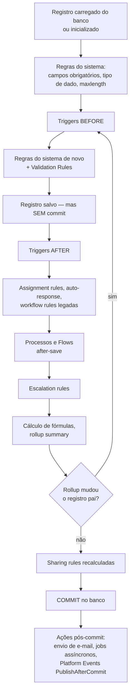

# 10 · Fundamentos

`Nível: iniciante → intermediário` · `Atualizado: 11/08/2026`

Os modelos mentais sem os quais nada mais faz sentido. Se você só ler um arquivo do
Bloco B, leia este.

---

## 1. O que é uma "org"

**Org** (de *organization*) é a sua instância de Salesforce. Ela contém:

- seus **dados** (registros de clientes, vendas, chamados);
- seus **metadados** (a definição dos objetos, campos, telas, regras, código);
- seus **usuários** e a configuração de segurança deles;
- um **Org Id** de 15 ou 18 caracteres, começando com `00D`.

A org é a **unidade de tudo**: de licenciamento, de dados, de segurança, de deploy e de
limites. Duas orgs não conversam entre si a não ser por integração explícita, como se
fossem empresas diferentes.

**Tipos de org:**

| Tipo | Para quê | Dados | Vida |
|---|---|---|---|
| **Produção** | operação real | reais | permanente |
| **Developer Edition (DE)** | aprender, prototipar | seus, ~5 MB | permanente, grátis |
| **Sandbox Developer** | desenvolver | só metadados | permanente, atualizável 1×/dia |
| **Sandbox Developer Pro** | desenvolver com mais dados | metadados + 1 GB | 1×/dia |
| **Sandbox Partial Copy** | testes com amostra | amostra de dados | 1× a cada 5 dias |
| **Sandbox Full Copy** | homologação, teste de carga | **cópia completa** | 1× a cada 29 dias |
| **Scratch org** | desenvolvimento efêmero, CI | vazia, você semeia | 1–30 dias |
| **Trial** | avaliar o produto | vazia | 30 dias |

> **O gargalo que dói na vida real:** sandbox Full Copy só pode ser atualizada a cada
> 29 dias e a atualização de uma org grande leva **dias**. Isso condiciona todo o
> calendário de release de uma empresa Salesforce. Ver [18-devops-e-alm.md](18-devops-e-alm.md) §3.

---

## 2. Objeto, registro, campo — o vocabulário mínimo

Se você conhece banco de dados relacional, o mapeamento é direto:

| Salesforce | Banco relacional | Planilha |
|---|---|---|
| **Objeto** (sObject) | tabela | aba |
| **Registro** | linha | linha |
| **Campo** | coluna | coluna |
| **Id** | chave primária | — |
| **Relacionamento** | chave estrangeira | — |
| **Lista de seleção** (picklist) | enum / tabela de domínio | validação de dados |

**Objetos padrão** (*standard*) vêm prontos: `Account`, `Contact`, `Opportunity`, `Case`,
`Lead`, `User`, `Task`, `Event`, `Campaign`, `Product2`, `Order`, `Contract`…

**Objetos customizados** você cria. O nome de API sempre termina em `__c`
(dois underscores + c): `Equipamento__c`.

### 2.1 O Id do Salesforce — 15 ou 18 caracteres

```text
001D000000IqhSLIAZ
│││└──────────────── restante: identificador do registro
││└───────────────── identificador da instância/pod
└┴────────────────── prefixo de 3 caracteres: o TIPO do objeto
```

| Prefixo | Objeto |
|---|---|
| `001` | Account |
| `003` | Contact |
| `006` | Opportunity |
| `500` | Case |
| `00Q` | Lead |
| `005` | User |
| `00D` | Organization |
| `a00`–`zzz` | objetos customizados (atribuído na criação) |

**A pegadinha dos 15 vs. 18 caracteres.** O Id "verdadeiro" tem 15 caracteres e é
**sensível a maiúsculas**. Como muitos sistemas (Excel, alguns bancos) não são, a Salesforce
criou uma versão de 18 caracteres: os mesmos 15 mais 3 de checksum, que a torna
**insensível a maiúsculas**. As duas formas identificam o mesmo registro e a API aceita
ambas — mas **comparar um Id de 15 com um de 18 como strings dá `false`**.

Em Apex, o tipo `Id` normaliza isso automaticamente:
```apex
Id a = '001D000000IqhSL';    // 15
Id b = '001D000000IqhSLIAZ'; // 18
System.assert(a == b);       // true — porque são do tipo Id, não String
String s1 = '001D000000IqhSL';
String s2 = '001D000000IqhSLIAZ';
System.assert(s1 != s2);     // true — comparação de String
```
**Regra:** nunca guarde Id em `String`. Isso resolve a classe inteira de bugs.

---

## 3. Nomes de API vs. rótulos — a distinção que evita anos de dor

Todo objeto e campo tem **duas identidades**:

| | Rótulo (*label*) | Nome de API |
|---|---|---|
| Quem vê | o usuário final, na tela | o código, a API, os relatórios técnicos |
| Pode mudar? | **sim, a qualquer momento** | tecnicamente sim, **na prática nunca** |
| Exemplo | "Nível de Risco" | `Nivel_de_Risco__c` |
| Traduzível | sim | não |

Mudar o nome de API de um campo em uso quebra: todo Apex que o referencia, toda fórmula,
toda integração externa, todo relatório salvo, todo LWC. **Nomeie pensando em cinco anos.**

**Convenções que eu recomendo, sem hesitar:**

- Nome de API em **inglês ou português sem acento**, sem abreviação obscura.
- Nada de `Campo1__c`, `Temp__c`, `Novo_Campo__c`, `Data2__c`.
- Prefixe por domínio quando a org for grande: `Fin_Valor_Liquido__c`, `Log_Peso_Kg__c`.
- O rótulo pode ser em português com acento, bonito e traduzível. É ele que o usuário vê.

---

## 4. Metadados são dados — e essa é a ideia central da plataforma

Esta é a frase mais importante deste arquivo.

Num sistema tradicional, quando você adiciona uma coluna a uma tabela, o banco executa
`ALTER TABLE` — muda a estrutura física. No Salesforce, **isso não acontece**.

Quando você cria o campo `Nivel_de_Risco__c`, a plataforma **insere uma linha numa tabela
de metadados** que diz "existe um campo chamado assim, do tipo picklist, no objeto Account,
da org 00Dxxx". A estrutura física do banco não muda.

Consequências diretas, todas visíveis no dia a dia:

| Consequência | Por que |
|---|---|
| Criar campo leva segundos, sem downtime | é um `INSERT`, não um `ALTER TABLE` |
| Milhares de empresas dividem as mesmas tabelas físicas | os dados de todas estão nas mesmas colunas genéricas |
| A configuração é versionável em Git | metadado é XML, e XML é arquivo |
| Existem limites rígidos de consumo | uma query mal feita afetaria as outras empresas |
| Não existe índice sob seu controle direto | os índices são da plataforma, não seus |
| Você não tem acesso ao banco | não existe "o seu banco"; existe o banco de todos |

O mecanismo completo — UDD, pivot tables, query optimizer — está em
[19-multitenancy-arquitetura.md](19-multitenancy-arquitetura.md). Por ora, guarde:
**metadados são dados, e é por isso que a plataforma é rápida de mudar e rígida de usar.**

---

## 5. Declarativo vs. programático — a escolha permanente

A plataforma oferece, para quase todo problema, um caminho **sem código** (declarativo,
"clicks") e um **com código** (programático, "code").

| Necessidade | Declarativo | Programático |
|---|---|---|
| Validar dado | Validation Rule | Apex trigger |
| Automatizar processo | Flow | Apex |
| Cálculo em campo | Formula / Rollup | Apex |
| Tela | Lightning App Builder / Screen Flow | LWC |
| Integração | External Services, Flow HTTP Callout, MuleSoft | Apex callout |
| Processar volume | Flow em lote (limitado) | Batch Apex |

**A regra de ouro do ecossistema:** *clicks, not code* — prefira o declarativo quando ele
resolve. Motivos legítimos: menos código para manter, admins podem alterar sem deploy, a
plataforma otimiza e atualiza sozinha.

**Quando o declarativo perde, na minha experiência:**

1. **Volume.** Flow tem limites piores que Apex e consome mais CPU por operação.
2. **Lógica complexa.** Um Flow com 40 elementos e ramificações aninhadas é *pior* de
   manter que 100 linhas de Apex — sem diff legível, sem teste unitário, sem busca textual.
3. **Reuso.** Difícil compartilhar lógica entre Flows sem duplicar.
4. **Testabilidade.** Flow tem teste, mas rudimentar comparado a Apex.
5. **Depuração.** O debug de Flow melhorou muito, mas ainda é inferior.

> **Minha recomendação, formada em campo:** use Flow para o que ele faz bem — orquestração
> de processo simples, telas guiadas, automação que o admin vai manter. Use Apex quando a
> lógica for um algoritmo, quando houver volume, ou quando você precisar de testes
> automatizados sérios. **E nunca implemente a mesma regra nos dois lugares** — é assim que
> se cria o bug que ninguém acha.

---

## 6. A ordem de execução — o mapa que salva vidas

Quando um registro é gravado, **muita coisa acontece, numa ordem fixa**. Não conhecer essa
ordem é a causa de metade dos bugs "impossíveis" da plataforma.



**As cinco consequências práticas que você precisa internalizar:**

1. **Validation rules rodam DEPOIS dos triggers `before`.** Se seu trigger `before` preenche
   um campo, a regra de validação vê o valor já preenchido.
2. **Fórmulas e rollups são calculados DEPOIS dos triggers.** Um trigger `after` **não**
   enxerga o valor novo de um campo fórmula. Esse é o "bug" mais reportado da plataforma.
3. **A gravação do pai por rollup reinicia o ciclo** para o pai — inclusive os triggers dele.
   É por isso que uma cadeia de rollups pode estourar o limite de CPU sem código seu.
4. **Nada foi commitado até o fim.** Uma exceção não capturada em qualquer ponto desfaz tudo.
5. **Callouts e e-mails só acontecem depois do commit** — por isso não se pode fazer callout
   após DML na mesma transação.

Referência oficial completa (vale marcar):
https://developer.salesforce.com/docs/atlas.en-us.apexcode.meta/apexcode/apex_triggers_order_of_execution.htm

---

## 7. Transação e governor limits

Uma **transação** é uma unidade atômica de trabalho: tudo dá certo, ou nada acontece.
Ela começa quando algo dispara a plataforma (um clique, uma chamada de API, um job) e
termina no commit ou no rollback.

**Todo limite de consumo é por transação.** Ver a tabela completa em
[05-manual-de-uso.md](05-manual-de-uso.md) §11. Os que mais importam:

- 100 consultas SOQL (síncrono), 200 (assíncrono)
- 150 instruções DML
- 50.000 registros retornados no total
- **10 segundos de CPU** (síncrono), 60 s (assíncrono)
- 6 MB de heap (síncrono), 12 MB (assíncrono)

**Por que os limites existem** — e esta é a pergunta que separa quem reclama de quem entende:

Numa arquitetura multi-inquilino, milhares de empresas compartilham os mesmos servidores e
o mesmo banco. Se uma delas puder rodar uma consulta que varre 40 milhões de linhas ou um
laço que consome 3 minutos de CPU, **as outras sofrem**. Os limites não são para te
irritar — são o mecanismo pelo qual a plataforma garante que o vizinho não estrague o seu
dia. A alternativa seria dar um servidor dedicado a cada cliente, que é exatamente o
modelo que a Salesforce existiu para eliminar.

**O cinco-porquês completo desse mecanismo está em
[19-multitenancy-arquitetura.md](19-multitenancy-arquitetura.md) §5.**

---

## 8. O ciclo de release: três vezes por ano

| Release | Sai por volta de | Nome da versão de API |
|---|---|---|
| **Spring** | fevereiro | ímpar/par conforme o ano |
| **Summer** | junho | Summer '26 = **API 67.0** |
| **Winter** | outubro | Winter '27 = API 68.0 (esperado) |

**O que isso significa na prática:**

- Sua org é atualizada **automaticamente**, numa janela de manutenção de algumas horas.
- Você **não pode recusar**. Pode escolher, dentro de uma faixa, a janela de fim de semana.
- Sandboxes recebem o preview **semanas antes** — é a sua chance de testar.
- Sua **versão de API** (`sourceApiVersion`) é separada: código escrito em API 45 continua
  se comportando como API 45, mesmo depois da org ir para 67. Isso é o que impede a
  plataforma de quebrar aplicações antigas a cada quatro meses.

**A implicação de arquitetura:** o número de versão de API no seu `.cls-meta.xml` é um
**contrato**. Subir esse número muda o comportamento do seu código — na API 67.0, por
exemplo, Apex passou a rodar em user mode por padrão. Ver [15-apex.md](15-apex.md) §9.

> Versões de API 31.0 a 40.0 foram anunciadas para **deprecação em Summer '27** e
> **retirada em Summer '28**. Se você tem integrações antigas, esse é o prazo real.

---

## 9. As camadas da plataforma, de baixo para cima

```text
┌───────────────────────────────────────────────────────────┐
│  APLICAÇÕES        Sales Cloud · Service Cloud · seu app  │
├───────────────────────────────────────────────────────────┤
│  INTERFACE         Lightning Experience · LWC · Aura · VF  │
├───────────────────────────────────────────────────────────┤
│  LÓGICA            Flow · Apex · Validation · Approval     │
├───────────────────────────────────────────────────────────┤
│  DADOS             Objetos · Campos · SOQL/SOSL · Sharing  │
├───────────────────────────────────────────────────────────┤
│  METADADOS         UDD · definições · Metadata API         │
├───────────────────────────────────────────────────────────┤
│  KERNEL            Motor multi-inquilino · query optimizer │
├───────────────────────────────────────────────────────────┤
│  INFRAESTRUTURA    Hyperforce (AWS) e datacenters próprios │
└───────────────────────────────────────────────────────────┘
```

Você trabalha nas quatro camadas de cima. As três de baixo são operadas pela Salesforce e
**você não tem acesso** — nem para otimizar, nem para depurar. Aceitar isso cedo poupa
frustração; entender como funcionam ([19](19-multitenancy-arquitetura.md)) faz você
escrever código melhor.

---

## 10. Os cinco porquês aplicados a "por que Apex existe?"

**1. Por que a Salesforce criou uma linguagem própria (2006) em vez de suportar Java?**
Porque num ambiente multi-inquilino ela precisa **controlar o que o seu código faz**:
contar consultas, medir CPU, impedir acesso ao sistema de arquivos e à rede sem mediação.

**2. Por que não bastava rodar Java numa sandbox com restrições?**
Porque uma JVM por cliente não escala — são centenas de milhares de orgs. E restringir Java
o suficiente exigiria mutilar tanto a linguagem que ela deixaria de ser Java, com o custo
adicional de ter que perseguir cada nova forma de escapar da sandbox a cada release da JVM.

**3. Por que Apex parece tanto com Java, então?**
Decisão deliberada de adoção: em 2006, Java era a linguagem corporativa dominante.
Sintaxe familiar reduz o custo de treinar mão de obra, que é o gargalo real de adoção de
qualquer plataforma. Não é acidente — é estratégia de mercado.

**4. Por que Apex quase não evoluiu desde então?**
Aqui há um trade-off explícito. Cada recurso novo de linguagem precisa ser seguro para
multi-inquilino, e a Salesforce garante compatibilidade retroativa **para sempre** — código
de 2008 ainda roda. Evoluir a linguagem é caro e arriscado; congelá-la é barato e seguro.
O resultado é uma linguagem que parece Java 5 em 2026.

**5. E por que a Salesforce aceita esse custo?**
Porque o valor da plataforma nunca esteve na linguagem, e sim no que vem de graça em volta
dela: banco, segurança, interface, API, mobile, relatórios, escala. Apex é o **preço de
admissão**, não o produto. Esta é minha leitura profissional, não uma declaração da empresa.

*(Parada legítima: chegamos a um trade-off econômico e a uma decisão histórica documentada.)*

---

## 11. Erros de modelo mental que custam caro

| Você pensa | A realidade |
|---|---|
| "É um banco de dados na nuvem" | É um motor de aplicação com um banco embutido que você não acessa |
| "Vou fazer um JOIN" | Só existem relacionamentos declarados. Modelagem vem antes da consulta |
| "Isso é lento, vou otimizar o índice" | Você não controla índices. Pode pedir um customizado ao Suporte |
| "Vou processar 1 milhão de registros" | Não numa transação síncrona. Use Batch |
| "Vou rodar isso a cada segundo" | O agendador tem granularidade de minutos, na prática |
| "Vou guardar arquivos grandes" | Storage é caro por GB. Use armazenamento externo + link |
| "Vou testar em produção" | Nada de deploy sem 75% de cobertura, e a plataforma impõe |
| "Deploy é rápido" | Numa org grande, um deploy com `RunLocalTests` leva 40–90 minutos |

---

## Autoteste

1. O que é uma org, e por que ela é a unidade de tudo?
2. Explique a diferença entre Id de 15 e de 18 caracteres. Por que nunca guardar Id em `String`?
3. Qual a diferença entre rótulo e nome de API, e por que nomear mal custa caro?
4. "Metadados são dados." Explique o que isso significa e cite três consequências práticas.
5. Um trigger `after update` consegue ler o valor novo de um campo fórmula? Justifique pela ordem de execução.
6. Por que os governor limits existem? Dê a razão arquitetural, não a superficial.
7. Quantos releases por ano a plataforma tem, e por que o `sourceApiVersion` do seu código é um contrato?
8. Quando você escolheria Flow, e quando escolheria Apex? Dê dois critérios objetivos.
9. Por que a Salesforce criou uma linguagem própria em vez de suportar Java? Vá até o terceiro "porquê".
