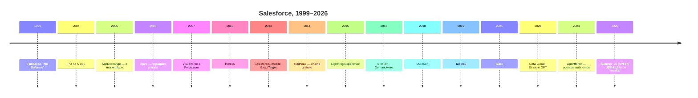

# 11 · História

`Nível: iniciante → intermediário` · `Atualizado: 11/08/2026`

História aqui não é curiosidade. Quase toda decisão estranha da plataforma tem uma data e
um motivo, e conhecê-los é o que separa quem xinga de quem prevê.

---

## 1. O mundo antes: 1990–1999

O software corporativo era **licenciado, instalado e mantido pelo cliente**. Comprar um
CRM significava:

| Etapa | Custo típico | Duração |
|---|---|---|
| Licenças | US$ 100 mil a milhões, adiantado | — |
| Hardware | servidores, storage, sala | semanas |
| Implantação (consultoria) | frequentemente maior que a licença | 6 a 18 meses |
| Manutenção anual | ~20% da licença/ano | perpétuo |
| Upgrade de versão | novo projeto | 3 a 9 meses |

O líder era a **Siebel Systems**, fundada em 1993 por Tom Siebel — que, como Marc Benioff,
vinha da Oracle. A Siebel dominava o mercado corporativo de CRM. E a taxa de fracasso de
projetos de CRM na época era notoriamente alta — estimativas de mercado do período falavam
em mais da metade dos projetos não atingindo os objetivos declarados.

**O problema real não era o software.** Era o *ciclo*: entre "precisamos de um campo novo"
e "o campo existe em produção" passavam-se meses. O negócio muda mais rápido que isso.

---

## 2. 1999–2004: "The End of Software"

**Março de 1999.** Marc Benioff, então executivo da Oracle, funda a Salesforce.com com
**Parker Harris**, **Dave Moellenhoff** e **Frank Dominguez**, num apartamento alugado em
San Francisco, ao lado da casa de Benioff.

A tese: entregar CRM **pelo navegador, por assinatura mensal, sem instalação**.

O marketing era deliberadamente beligerante — o logo do "software" dentro de um círculo
vermelho com uma barra diagonal, o slogan **"No Software"**, e ações de guerrilha em frente
a eventos da concorrência. Benioff entendeu que precisava de uma **narrativa**, não de uma
lista de recursos: o inimigo não era a Siebel, era o *modelo* de comprar software.

**Por que funcionou em 1999 e não antes?** Três condições se encontraram:

1. **Banda larga corporativa** suficiente para uma aplicação inteira rodar remotamente.
2. **Navegadores** capazes o bastante (Internet Explorer 5, Netscape 4) para formulários
   complexos com JavaScript.
3. **Aceitação empresarial de pagamento recorrente por cartão**, algo que a bolha
   pontocom normalizou.

**2004:** IPO na NYSE. A empresa provou que o modelo de assinatura — que ainda não se
chamava SaaS de forma consolidada — funcionava em escala.

> **O que isso deixou na plataforma até hoje:** a obsessão com "o cliente não instala nada"
> é a razão de você não ter acesso ao banco, ao sistema de arquivos, ao servidor. Não é
> mesquinhez — é a promessa fundacional do produto.

---

## 3. 2005–2008: de produto a plataforma — a virada decisiva

Este é o período mais importante para entender por que Salesforce venceu.

**2005 — AppExchange.** Um marketplace onde terceiros vendem aplicações que rodam *dentro*
da sua org. Foi chamado de "o iTunes do software empresarial" — dois anos antes da App Store
da Apple existir.

**2006 — Apex.** Uma linguagem de programação **executada nos servidores da Salesforce**.
Pela primeira vez, o cliente podia escrever lógica arbitrária dentro de um SaaS.

**2007 — Visualforce e Force.com.** Um framework de páginas customizadas e o rebatismo da
plataforma como produto próprio, vendável separadamente do CRM.

**Por que isso foi decisivo — o argumento em três passos:**

1. Um SaaS puro tem um teto: quando o cliente precisa de algo que o produto não faz, ele
   vai embora ou constrói fora. Ambos os casos reduzem a receita e o lock-in.
2. Ao virar plataforma, a Salesforce transformou "o produto não faz isso" em "então
   construa aqui dentro". A limitação virou oportunidade de expansão.
3. Cada customização feita dentro da plataforma **aumenta o custo de sair**. Cinco anos de
   Apex, Flows e integrações não migram para lugar nenhum sem um projeto de anos.

> **Opinião profissional:** essa é a jogada mais bem executada da história do software
> corporativo. Ela transformou uma empresa de aplicativo numa de infraestrutura, sem que
> os clientes percebessem que estavam sendo trancados.

---

## 4. 2009–2015: nuvem, mobile e o começo das aquisições

| Ano | Evento | Por que importa |
|---|---|---|
| 2010 | Aquisição do Heroku (~US$ 212 mi) | plataforma para código que **não** cabe em Apex |
| 2011 | "Social Enterprise", Chatter | rede social corporativa; hoje quase morta |
| 2013 | **Salesforce1** | primeiro app móvel unificado |
| 2013 | Aquisição do ExactTarget (~US$ 2,5 bi) | vira o Marketing Cloud |
| 2014 | **Trailhead** | ensino gratuito e gamificado |
| 2014 | **Lightning** anunciado | reescrita da interface |
| 2015 | **Lightning Experience** lançado | a UI atual |

**Trailhead merece um parágrafo próprio.** Em 2014 a Salesforce tinha um problema: a
demanda por profissionais superava muito a oferta, e a escassez de mão de obra freava a
venda de licenças. A resposta foi **ensinar de graça, para qualquer pessoa, sem
pré-requisito**, com trilhas gamificadas e uma org descartável embutida.

O efeito foi criar um mercado de trabalho inteiro — com centenas de milhares de pessoas
certificadas — que hoje é a barreira de entrada mais alta contra concorrentes. Um CRM
tecnicamente superior não vence se não houver ninguém no mercado que saiba implantá-lo.

**Lightning merece o parágrafo seguinte, pelo motivo oposto.** A migração de Salesforce
Classic para Lightning Experience foi **dolorosa e longa**: performance ruim nos primeiros
anos, paridade de funcionalidades incompleta por muito tempo, e customizações Visualforce
que precisaram ser refeitas. Muitas empresas levaram cinco anos ou mais para migrar. É o
contra-exemplo honesto: nem tudo que a Salesforce fez deu certo de primeira.

---

## 5. 2016–2021: a era das grandes aquisições

| Ano | Aquisição | Valor aproximado | O que trouxe |
|---|---|---|---|
| 2016 | Demandware | US$ 2,8 bi | Commerce Cloud |
| 2016 | **Einstein** (produto próprio) | — | IA embutida no CRM |
| 2018 | **MuleSoft** | US$ 6,5 bi | integração corporativa (ESB/API) |
| 2019 | **Tableau** | US$ 15,7 bi | analytics e visualização |
| 2020 | Vlocity | US$ 1,33 bi | soluções verticais (Industries) |
| 2021 | **Slack** | US$ 27,7 bi | camada de colaboração |

**Como ler essa lista.** Não são compras aleatórias. Cada uma preenche uma lacuna que
impedia a Salesforce de ser a **plataforma única** da empresa cliente:

- MuleSoft resolve "meus dados estão em 30 sistemas".
- Tableau resolve "quero analisar dados que não estão no Salesforce".
- Slack resolve "meu time trabalha no chat, não no CRM".
- Vlocity resolve "meu setor tem regras específicas" (telecom, saúde, seguros, governo).

**O custo dessa estratégia, que ninguém coloca no slide:** integração real entre produtos
adquiridos é lenta e imperfeita. Marketing Cloud, por exemplo, viveu **anos** com modelo de
dados, interface e vocabulário próprios, sem integração profunda com o core. Comprar
tecnologia é rápido; unificar é uma década de trabalho.

> **Se você for avaliar Salesforce hoje, esta é a pergunta certa a fazer ao vendedor:**
> *"esse produto que você está me mostrando nasceu aqui dentro ou foi comprado, e quão
> integrado ele está de verdade com o core?"* A resposta muda o custo do projeto.

---

## 6. 2022–2024: Data Cloud e a virada para IA

**2022–2023.** A Salesforce lança o que hoje se chama **Data Cloud** (rebatizado
**Data 360**): uma camada que ingere dados de qualquer fonte, resolve identidade
("esse José da tabela A é o mesmo José da tabela B?") e monta um perfil unificado de cliente.

**Por que isso foi estratégico, e não apenas mais um produto:** IA generativa útil precisa
de contexto sobre o cliente. Quem tiver o **perfil unificado** tem a vantagem. A Salesforce
percebeu que o CRM sozinho só enxerga uma fatia dos dados — e que sem os outros, os agentes
de IA respondem mal.

**2023.** Einstein GPT / Einstein Copilot: primeiras integrações de LLM ao CRM, com o
**Einstein Trust Layer** — camada de mascaramento de dados sensíveis, aterramento
(*grounding*) nos dados da org, e retenção zero pelos provedores de modelo.

**Setembro de 2024 — Agentforce.** A aposta muda de "IA que sugere" para "IA que **age**":
agentes autônomos que executam tarefas dentro do CRM — atender um chamado inteiro, qualificar
um lead, agendar uma visita — usando as ações e os dados da plataforma.

---

## 7. 2025–2026: o estado atual

| Marco | Data | O quê |
|---|---|---|
| Aumento de preço de ~6% em Enterprise e Unlimited | agosto/2025 | primeiro reajuste relevante em anos |
| Salesforce Foundations | 2025 | camada gratuita com créditos de IA para clientes EE+ |
| Data Cloud → **Data 360** | 2025–2026 | rebranding e unificação |
| **Summer '26 / API 67.0** | junho/2026 | mudança estrutural na segurança do Apex |
| Receita FY2026 | fev/2026 | **US$ 41,5 bilhões**, +10% a/a |
| Participação de mercado CRM (IDC, dado de 2025) | abr/2026 | **20,0%** — 1º lugar pelo 13º ano |

**A mudança do Summer '26 merece destaque técnico.** A partir da **API 67.0**:

- operações de banco em Apex rodam em **user mode por padrão** (antes: system mode);
- classes sem declaração explícita passam a ser **`with sharing`** por padrão;
- `WITH SECURITY_ENFORCED` foi **removida** — classes em v67.0+ que a usem **não compilam**.

Isso inverte um padrão de 18 anos. Historicamente, Apex ignorava a segurança do usuário
por padrão, e cabia ao desenvolvedor lembrar de aplicá-la — o que, previsivelmente,
produziu uma quantidade enorme de código que vaza dados. A plataforma finalmente trocou o
padrão inseguro por um seguro, aceitando quebrar compatibilidade **apenas para quem subir
a versão de API**. Ver [15-apex.md](15-apex.md) §9.

> **Minha leitura:** é a mudança de segurança mais importante da história da plataforma, e
> a estratégia de aplicá-la só na versão nova de API é a única forma sensata de fazê-la sem
> derrubar meio ecossistema.

---

## 8. Linha do tempo compacta

---

## 9. O que a história explica sobre o produto de hoje

| Estranheza atual | Origem histórica |
|---|---|
| Governor limits rígidos | multi-inquilino desde 1999: ninguém pode derrubar o vizinho |
| Apex parece Java de 2006 | porque é de 2006, e compatibilidade retroativa é sagrada |
| Três releases por ano, sem opção | "você não instala nada" ⇒ "você não escolhe a versão" |
| 75% de cobertura de teste obrigatória | resposta a uma década de clientes derrubando a própria org |
| Marketing Cloud parece outro produto | porque **é** outro produto (ExactTarget, 2013) |
| Workflow, Process Builder **e** Flow | três gerações de automação convivendo por retrocompatibilidade |
| Aura **e** LWC | Aura (2014) precedeu os Web Components padronizados |
| Certificações caras e onipresentes | Trailhead criou o mercado de trabalho e monetiza a validação |
| Consultoria domina a implantação | plataforma configurável demais para ser autoexplicativa |
| Preço alto e crescente | lock-in maduro + liderança de mercado + custo de saída |

---

## 10. Os cinco porquês: por que Salesforce ainda lidera em 2026?

**1. Por que continua líder com 20% do mercado?**
Porque o custo de trocar é altíssimo depois de anos de customização e integração.

**2. Por que o custo de trocar é tão alto?**
Porque o cliente não comprou um CRM — comprou uma plataforma onde construiu processos,
integrações e automações que existem **só ali**, expressas em linguagens e metadados
proprietários.

**3. Por que os clientes aceitaram construir em algo proprietário?**
Porque o ganho de velocidade é real e imediato: mudar um processo leva dias, não meses.
Foi uma troca consciente de portabilidade por agilidade. E, em muitos casos, valeu a pena.

**4. Por que os concorrentes não replicam isso?**
Alguns replicaram tecnicamente — Microsoft Dynamics 365, ServiceNow, HubSpot. O que não se
replica com dinheiro é o **ecossistema humano**: consultorias, parceiros, AppExchange e
centenas de milhares de profissionais certificados. Isso levou 20 anos e foi construído
em boa parte de graça, via Trailhead.

**5. E por que isso pode mudar?**
Duas frentes reais. (a) **IA reduz o custo de migração**: se um agente consegue traduzir
regras de negócio entre plataformas, o lock-in enfraquece. (b) **Preço**: com Enterprise a
US$ 175/usuário/mês e Agentforce empurrando a conta para cima, a diferença de custo
com alternativas ficou grande o suficiente para justificar o projeto de migração em algumas
empresas. Isso é minha avaliação de risco, não previsão — mas é o eixo a observar.

*(Parada legítima: chegamos a trade-offs econômicos explícitos e a decisões empresariais
documentadas.)*

---

## Autoteste

1. Que problema concreto do modelo de software dos anos 1990 a Salesforce atacou?
2. Por que 1999 e não 1995? Cite as três condições que se encontraram.
3. Qual foi a virada de 2005–2007 e por que ela foi mais importante que o produto original?
4. Por que o Trailhead (2014) é considerado aqui uma jogada estratégica, e não filantropia?
5. Cite três aquisições e a lacuna que cada uma preencheu.
6. O que muda na API 67.0 em relação à segurança do Apex, e por que isso é histórico?
7. Explique, pela história, por que existem três sistemas de automação convivendo na plataforma.
8. Quais são os dois fatores que poderiam corroer a liderança da Salesforce, segundo este arquivo?

---

### Fontes consultadas (11/08/2026)

- Wikipedia — *Salesforce* (fundação, cronologia, aquisições e valores) — https://en.wikipedia.org/wiki/Salesforce
- Salesforce Newsroom — *Salesforce Named #1 CRM Provider by IDC Market Share* — https://www.salesforce.com/news/stories/idc-crm-market-share-ranking-2025/
- Salesforce Developers Blog — *The Salesforce Developer's Guide to the Summer '26 Release* — https://developer.salesforce.com/blogs/2026/06/the-salesforce-developers-guide-to-the-summer-26-release
- Salesforce Blog — *Summer '26 Release Architect Highlights: Sharing, Security, and Agentic Integration* — https://www.salesforce.com/blog/summer-26-release-architect-highlights/
