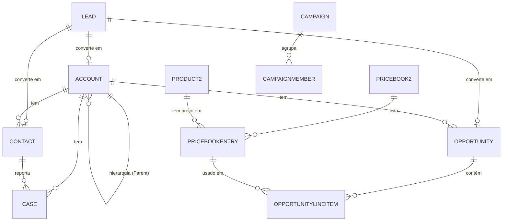
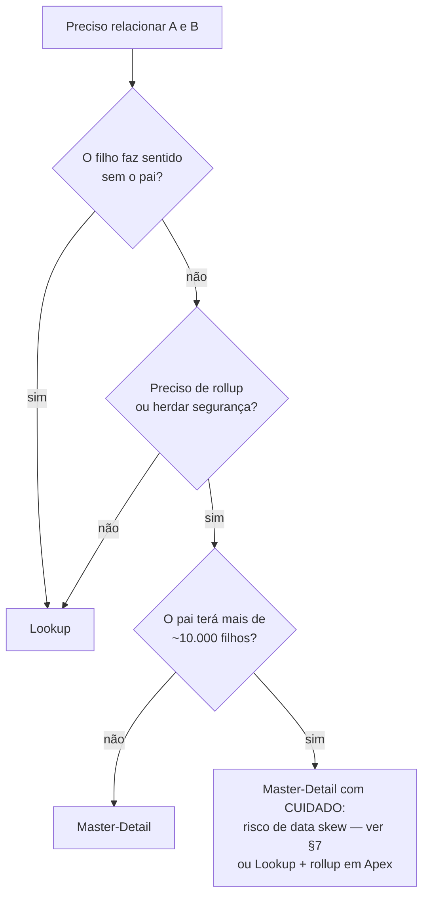
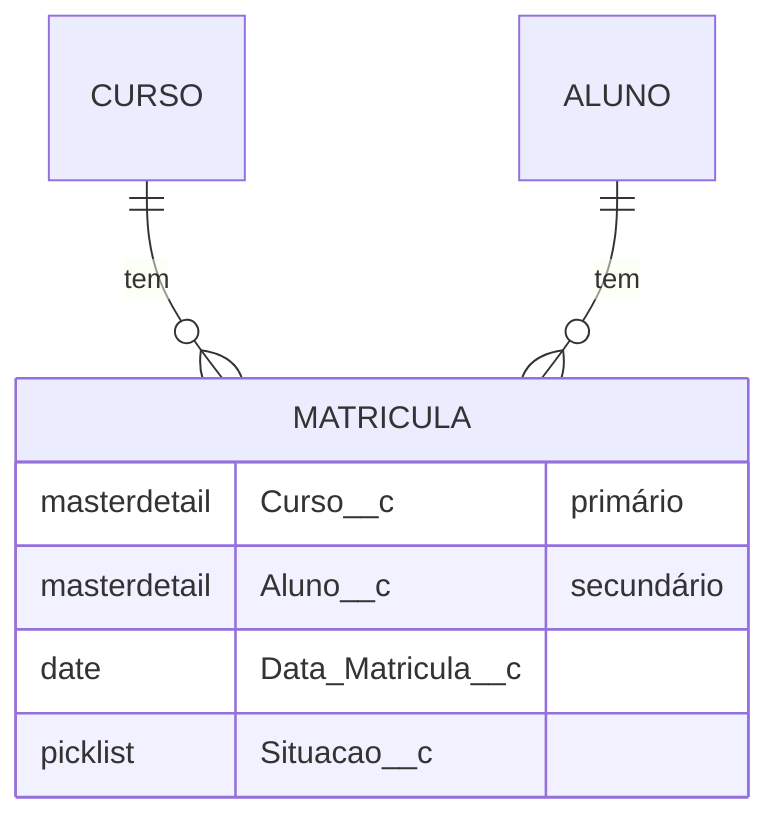

# 12 · Modelo de dados

`Nível: intermediário` · `Atualizado: 11/08/2026` · `API 67.0`

Modelagem é onde se ganha ou se perde um projeto Salesforce. Código ruim se refatora;
**modelo de dados ruim vira dívida permanente**, porque ele carrega dados reais e milhares
de referências.

---

## 1. Objetos padrão: o modelo que já vem pronto



| Objeto | Prefixo do Id | Papel |
|---|---|---|
| `Lead` | `00Q` | contato ainda não qualificado. **Converte** em Account+Contact+Opportunity |
| `Account` | `001` | empresa (B2B) ou pessoa (Person Account, B2C) |
| `Contact` | `003` | pessoa dentro de uma conta |
| `Opportunity` | `006` | negócio em andamento: valor, estágio, data de fechamento |
| `Case` | `500` | chamado de suporte |
| `Product2` / `PricebookEntry` | `01t` / `01u` | catálogo e preço |
| `Order`, `Contract`, `Quote` | vários | pós-venda |
| `Task`, `Event` | `00T`, `00U` | atividades (o objeto físico é `Activity`) |
| `User` | `005` | usuário da plataforma |

**Duas armadilhas dos objetos padrão:**

1. **`Lead` não é um "cliente potencial genérico".** Ele existe para o *funil de topo* e
   tem um comportamento único: a **conversão**, que cria três registros de uma vez e marca
   o lead como convertido. Se você usar Lead como se fosse um Contact, vai brigar com a
   plataforma para sempre.
2. **`Activity` é um objeto físico com dois "filhos" lógicos** (`Task` e `Event`). Ele tem
   limitações de consulta e relacionamento que nenhum outro objeto tem — não pode ser pai
   de nada, tem restrições em SOQL. Não tente modelar em cima dele.

### 1.1 Person Accounts — a decisão irreversível

Se o seu negócio é B2C (vende para pessoas físicas), você tem duas opções:

| Opção | Como | Consequência |
|---|---|---|
| **Person Accounts** | ativa um recurso que funde Account+Contact num registro só | **Não pode ser desativado**. Requer chamado ao Suporte para ligar |
| **Account "guarda-chuva"** | uma Account genérica ("Consumidores") com muitos Contacts | Cria *account data skew* (§7) — sério |

> **Recomendação:** se for de fato B2C, ative Person Accounts **antes** de carregar dados.
> Ativar depois é um projeto. A opção do guarda-chuva parece esperta e é uma bomba-relógio.

---

## 2. Tipos de campo — o catálogo e as pegadinhas

| Tipo | Guarda | Cuidado |
|---|---|---|
| `Text` (255) | texto curto | indexável, filtrável |
| `TextArea` (255) / `LongTextArea` (até 131.072) / `RichTextArea` | texto longo | **não filtrável em `WHERE`**, não indexado |
| `Number` (precision, scale) | numérico | `precision` inclui as casas decimais |
| `Currency` | monetário | com multimoeda, guarda também a taxa de conversão |
| `Percent` | percentual | 50% é guardado como 50, não 0,5 |
| `Date` / `DateTime` | data / data-hora | **DateTime é sempre UTC no banco**; a exibição converte |
| `Checkbox` | booleano | **nunca é null** — é `false` ou `true` |
| `Picklist` / `MultiSelectPicklist` | lista | multi-select é péssimo para consultar; evite |
| `Email`, `Phone`, `URL` | texto validado | validação leve, formatação na UI |
| `Lookup` / `MasterDetail` | relacionamento | ver §3 |
| `Formula` | calculado em tempo de leitura | **não armazenado**, não indexado (com exceções) |
| `Roll-Up Summary` | agregação dos filhos | **só com master-detail** |
| `AutoNumber` | sequência | não reutiliza, pode ter buracos, é **texto** |
| `External Id` | flag em Text/Number/Email | habilita `upsert`, cria índice |
| `Geolocation` | lat/long | conta como **3 campos** na cota |
| `Encrypted Text` | texto cifrado (Classic Encryption) | limitado; para sério, use Shield Platform Encryption |

**As cinco pegadinhas que mais custam:**

1. **`Checkbox` nunca é null.** `WHERE Ativo__c = null` não retorna nada, nunca. Se você
   precisa de "sim/não/não sei", use picklist de três valores.
2. **`LongTextArea` não é filtrável.** Você não pode fazer `WHERE Descricao__c LIKE '%x%'`
   de forma eficiente. Se precisa buscar em texto, use **SOSL** ou um campo `Text` auxiliar.
3. **Fórmulas não são armazenadas.** São calculadas a cada leitura. Um relatório sobre
   1 milhão de registros com 10 campos fórmula faz 10 milhões de cálculos. Fórmulas
   também são a maior fonte de "por que meu relatório está lento".
4. **`MultiSelectPicklist` é uma string com `;` separando valores.** Filtrar é
   `INCLUDES('A')`, agrupar em relatório é sofrível, e integrar é um pesadelo. Na quase
   totalidade dos casos, o certo é um objeto filho — o custo de modelar direito é menor.
5. **`Number(18,0)` não é o mesmo que `Integer`.** `precision` é o total de dígitos,
   incluindo os decimais. `Number(5,2)` guarda até `999,99`, não `99999,99`.

**Limites de campos por objeto** (Enterprise Edition):

| Recurso | Limite |
|---|---|
| Campos customizados por objeto | 800 (500 em algumas edições) |
| Relacionamentos por objeto | 40 lookups + 2 master-details |
| Roll-up summaries por objeto | 25 |
| Regras de validação por objeto | 100 |
| Objetos customizados por org | 2.000 (EE) / 400 (DE) |

---

## 3. Relacionamentos — a decisão que você não desfaz fácil

| | **Lookup** | **Master-Detail** | **Hierárquico** | **Muitos-para-muitos** |
|---|---|---|---|---|
| Filho existe sem pai | sim | **não** | — | — |
| Apagar o pai | `SetNull`, `Restrict` ou `Cascade` | **cascade obrigatório** | — | — |
| Segurança do filho | própria | **herdada do pai** | — | — |
| Roll-up summary | ❌ | ✅ | ❌ | via objeto de junção |
| Reparentear | livre | só se `reparentable` | — | — |
| Campo obrigatório | opcional | **sempre obrigatório** | — | — |
| Limite por objeto | 40 | 2 | 1 (só em User) | 2 master-details |
| Contenção de bloqueio | não | **sim** | — | sim |

### 3.1 Como escolher



### 3.2 Muitos-para-muitos: o objeto de junção

Salesforce não tem relacionamento N:N nativo. Cria-se um **objeto de junção** (*junction
object*) com **dois master-details**:



**Detalhe que morde:** o **primeiro** master-detail criado é o **primário**. Ele define:
o dono do registro de junção, o layout de detalhe padrão, e o que acontece na exclusão.
Trocar a ordem depois é possível, mas trabalhoso. Escolha o primário como sendo o "lado
que manda" no negócio.

---

## 4. SOQL — pensar em relacionamentos, não em joins

```sql
-- Filho → pai (até 5 níveis de ponto)
SELECT Id, Name, Account.Name, Account.Owner.Manager.Email FROM Contact

-- Pai → filhos (subquery; até 20 relacionamentos filhos por query)
SELECT Id, Name, (SELECT LastName, Email FROM Contacts WHERE Email != NULL)
FROM Account

-- Customizado: __r no relacionamento, __c no campo
SELECT Id, Equipamento__r.Numero_Serie__c,
       (SELECT Name FROM Ordens_de_Servico__r)
FROM Contrato__c
```

**Limites de travessia que você vai encontrar:**

| Limite | Valor |
|---|---|
| Níveis de relacionamento filho→pai numa query | 5 |
| Relacionamentos pai→filho numa query | 20 |
| Níveis de subquery aninhada | 1 (não há subquery dentro de subquery) |
| Semi-joins/anti-joins por query | 2 |
| Registros retornados por query | 50.000 |
| Campos por query | 100 (por objeto raiz) |

### 4.1 Seletividade — a razão de queries lentas

Uma consulta é **seletiva** quando o filtro usa um campo indexado e retorna uma fração
pequena da tabela. O *query optimizer* da Salesforce decide se usa o índice comparando o
número estimado de linhas com limiares:

| Situação | Limiar aproximado |
|---|---|
| Índice padrão (Id, Name, OwnerId, CreatedDate, campos de relacionamento, External Id) | filtro deve retornar < 30% dos primeiros 1 M de linhas, e < 15% do excedente, até 1 M de linhas |
| Índice customizado (criado pelo Suporte) | < 10% das linhas, até 333.000 |

Quando a consulta **não é seletiva**, a plataforma faz *full table scan* e, em tabelas
grandes, você recebe:

```text
System.QueryException: Non-selective query against large object type
(more than 200000 rows). Consider an indexed filter or contact Salesforce
about custom indexing.
```

**O que torna uma consulta não seletiva** — decore esta lista:

- `!=`, `NOT IN`, `NOT LIKE`
- `LIKE '%texto%'` (curinga no início)
- comparação com `null` em campo sem índice
- funções sobre o campo filtrado
- filtro em campo **fórmula** (não indexado, salvo fórmula determinística indexada pelo Suporte)
- `OR` misturando campo indexado com não indexado

**O que fazer:**
1. filtre por campo indexado (`Id`, `Name`, `CreatedDate`, `LastModifiedDate`, External Id,
   campos de relacionamento, campos marcados `unique`);
2. adicione um campo booleano/picklist auxiliar mantido por automação, e filtre por ele;
3. peça um **índice customizado** ao Suporte Salesforce (é gratuito, leva dias);
4. use **Skinny Table** (também via Suporte) para relatórios pesados;
5. arquive o que não é usado — o melhor índice é a tabela menor.

---

## 5. Big Objects, External Objects e o resto do armazenamento

| Recurso | Volume | Consulta | Quando usar |
|---|---|---|---|
| **Objeto customizado** | milhões | SOQL completa | operação do dia a dia |
| **Big Object** | **bilhões** | só por índice composto (SOQL restrita) ou Async SOQL | histórico, auditoria, logs |
| **External Object** (Salesforce Connect) | ilimitado, fica **fora** | SOQL via OData/adaptador, em tempo real | dado que vive no ERP/data lake |
| **Data 360 / Data Cloud** | ilimitado | SQL próprio, DMO | perfil unificado, IA, segmentação |
| **Heroku Postgres / externo** | ilimitado | SQL | processamento pesado fora da plataforma |

**Big Object na prática:** você define um **índice composto imutável** no momento da criação
e só consegue consultar seguindo a ordem desse índice, da esquerda para a direita. Não há
`WHERE` livre. É rápido e barato para o que foi feito (append + leitura por chave) e
completamente inadequado para qualquer outra coisa. Não dá para mudar o índice depois.

---

## 6. Boas práticas de modelagem — o que eu faria hoje

1. **Use o objeto padrão sempre que couber.** Não crie `Cliente__c` porque `Account` "não
   tem tudo". Você perde relatórios prontos, integrações, mobile, IA e a compreensão de
   qualquer profissional que entrar no projeto.
2. **Normalize até doer, depois desnormalize com propósito.** Campo repetido em dois objetos
   sempre diverge. Se desnormalizar por performance, documente e mantenha por automação.
3. **Nomeie pensando em cinco anos** (ver [10-fundamentos.md](10-fundamentos.md) §3).
4. **Toda picklist de integração deve ser `restricted`.** Sem isso, a API insere lixo.
5. **Marque External Id em toda chave de sistema externo.** É o que permite `upsert` e
   integração idempotente.
6. **Descrição em todo campo.** O campo `description` do metadado é gratuito e é a única
   documentação que sobrevive à saída das pessoas.
7. **Evite mais de ~3 níveis de master-detail.** Cada nível multiplica bloqueios e recálculos.
8. **Cuidado com Record Types.** Eles são poderosos (layouts e picklists diferentes por
   processo) e viram um pesadelo se você criar um por unidade de negócio.
9. **Planeje o arquivamento antes de precisar dele.** Storage custa caro e tabela grande
   quebra consulta. Ver §8.

---

## 7. Data skew — as três formas de matar a performance

**Skew** = distribuição desigual. É o problema de performance número um em orgs grandes,
e é sempre causado por decisão de modelagem.

### 7.1 Account data skew

**Mais de ~10.000 registros filhos ligados à mesma Account.**

*Por que dói:* quando um registro filho é atualizado, a plataforma bloqueia o pai por um
instante para manter integridade e recalcular sharing. Com muitos filhos e concorrência,
aparece `UNABLE_TO_LOCK_ROW`. Pior: mudar o **dono** de uma Account com 200 mil filhos
dispara um recálculo de sharing que pode travar a org por horas.

*Origem típica:* a Account "guarda-chuva" para consumidores, ou um cliente enorme legítimo.

*Como evitar:* distribua os filhos por várias contas; para B2C, use Person Accounts; evite
master-detail para pais com muitos filhos; nunca troque o dono de uma conta gigante em
horário comercial.

### 7.2 Ownership skew

**Mais de ~10.000 registros do mesmo objeto pertencendo ao mesmo usuário.**

*Por que dói:* o dono do registro é a base do modelo de sharing. Um usuário com 500 mil
registros gera uma estrutura de compartilhamento gigantesca. Movê-lo na hierarquia de
papéis dispara um recálculo massivo.

*Origem típica:* o "usuário de integração" que insere tudo e vira dono de tudo.

*Como evitar:* dê ao usuário de integração um papel **fora** da hierarquia de papéis
(sem role, ou no topo isolado), para que não haja recálculo em cascata. Essa é a
recomendação clássica e ela funciona.

### 7.3 Lookup skew

**Muitos registros apontando para o mesmo registro via lookup.**

*Por que dói:* contenção de bloqueio no registro alvo em inserções concorrentes.

*Origem típica:* um valor "padrão" ou "Não informado" num lookup.

*Como evitar:* distribua os valores padrão; ou use picklist em vez de lookup quando o
conjunto de valores for pequeno e estável.

---

## 8. Volume: quando a org fica grande

| Sinal | Limiar aproximado | O que fazer |
|---|---|---|
| Tabela com muitas linhas | > 1 milhão | atenção à seletividade das queries |
| Erro de query não seletiva | ~200 mil linhas | índice customizado / filtro indexado |
| Relatório lento | — | Skinny Table, filtro por data indexada |
| Storage de dados caro | — | arquivar em Big Object ou fora da plataforma |
| Deploy lento | — | reduzir escopo, quick deploy |
| Sharing recalculando por horas | ownership skew | reorganizar donos e papéis |

**Estratégias de arquivamento, em ordem de preferência:**

1. **Big Object** — fica dentro da plataforma, barato, consultável por índice.
2. **External Object via Salesforce Connect** — o dado vive no data warehouse e aparece na
   interface como se fosse local. Custa licença de Connect.
3. **Exportar e apagar** — mais barato, menos acessível. Requer processo confiável.
4. **Data 360** — se você já paga por ele, é o lugar natural do histórico analítico.

---

## 9. Os cinco porquês: por que não existe `JOIN` livre em SOQL?

**1. Por que SOQL não tem JOIN arbitrário?**
Porque as consultas precisam ser previsíveis em custo. Um join arbitrário entre duas tabelas
grandes pode gerar um plano de execução catastrófico.

**2. Por que isso é pior aqui do que num banco comum?**
Porque as tabelas são **compartilhadas entre inquilinos**. Uma query ruim não degrada só a
sua org — ela consome I/O e CPU do pool que atende todo mundo naquele pod.

**3. Por que não isolar cada cliente num banco próprio, então?**
Porque isso destrói a economia do modelo. Centenas de milhares de bancos separados
significam custo de infraestrutura e de operação por cliente, o que reintroduz exatamente
o que a Salesforce existiu para eliminar em 1999.

**4. Por que não deixar o cliente criar índices?**
Porque índice não é gratuito: ocupa espaço, custa em toda escrita, e um cliente indexando
mal degrada a tabela física compartilhada por outros. Por isso índices customizados existem,
mas passam por avaliação do Suporte.

**5. Então o que substitui o JOIN?**
Relacionamentos **declarados no metadado**. Ao declarar, você diz à plataforma quais
caminhos de travessia existem, e ela pode indexá-los e otimizá-los antecipadamente. É um
trade-off explícito: **menos expressividade em troca de custo previsível**.

*(Parada legítima: trade-off econômico e de arquitetura, explicitado.)*

---

## Autoteste

1. Qual é a diferença entre `Lookup` e `Master-Detail`? Cite quatro consequências práticas.
2. Por que `WHERE Ativo__c = null` num campo Checkbox nunca retorna nada?
3. O que torna uma consulta "não seletiva"? Cite quatro causas.
4. O que é *account data skew*, por que ele causa `UNABLE_TO_LOCK_ROW`, e como evitá-lo?
5. Por que o usuário de integração deve ficar fora da hierarquia de papéis?
6. Como se modela uma relação muitos-para-muitos? O que define o master-detail primário?
7. Quando você usaria um Big Object, e qual é a limitação que o desqualifica na maioria dos casos?
8. Por que SOQL não tem `JOIN` livre? Dê a razão econômica, não só a técnica.
9. Uma fórmula é armazenada no banco? Que consequência isso tem em relatórios grandes?
