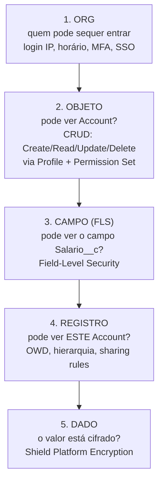
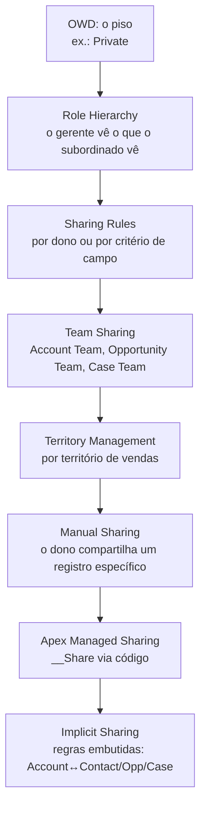

# 13 · Segurança e compartilhamento

`Nível: intermediário → avançado` · `Atualizado: 11/08/2026` · `API 67.0`

O modelo de segurança do Salesforce é a parte mais sofisticada da plataforma e a que mais
gera incidentes. Ele funciona em **camadas independentes**, e o acesso final é a
**interseção** de todas elas.

---

## 1. As camadas, de fora para dentro



**Regra de ouro:** a camada mais restritiva vence. Ter acesso ao registro não adianta se
você não tem acesso ao objeto. Ter acesso ao objeto não adianta se o campo está oculto.

---

## 2. Camada 1 — acesso à org

| Controle | O que faz |
|---|---|
| **Login IP Ranges** (no perfil) | bloqueia login fora da faixa. Bloqueio duro |
| **Trusted IP Ranges** (org-wide) | dentro da faixa, dispensa verificação de identidade |
| **Login Hours** (no perfil) | restringe horário de acesso |
| **MFA** | obrigatório para acesso direto desde 2022 |
| **SSO / SAML / OpenID Connect** | delega autenticação ao provedor da empresa |
| **Session Settings** | timeout, força de sessão, bloqueio de sessão por IP |
| **Connected Apps** | políticas por aplicação integrada (escopo OAuth, IP, refresh) |

> **Ordem de operações que confunde:** *Login IP Ranges* do perfil bloqueia o login.
> *Trusted IP Ranges* da org apenas dispensa o desafio de identidade. São coisas diferentes
> com nomes parecidos, e trocá-las causa incidentes reais.

---

## 3. Camada 2 — permissões de objeto (CRUD)

Concedidas por **Profile** (um por usuário) e **Permission Sets** (vários).

| Permissão | Efeito |
|---|---|
| **Read** | ver os registros aos quais tem acesso |
| **Create** | criar |
| **Edit** | editar os que pode acessar |
| **Delete** | apagar |
| **View All** | ver **todos** os registros do objeto, ignorando o modelo de sharing |
| **Modify All** | ver e editar **todos**, ignorando sharing e propriedade |

**Permissões administrativas que também furam tudo:**

| Permissão | Poder |
|---|---|
| `View All Data` | lê **tudo** na org |
| `Modify All Data` | lê e escreve **tudo** na org |
| `Author Apex` | escreve código — e código pode rodar em system mode |
| `Manage Users` | cria usuários e concede permissões, inclusive as acima |
| `Customize Application` | altera metadados |

> **Auditoria de 5 minutos que todo mundo deveria fazer:**
> *Setup → Permission Sets*, e depois consultar quem tem `Modify All Data`.
> Em quase toda org que auditei, a resposta era "mais gente do que deveria" — e muitas
> vezes um perfil clonado anos atrás que ninguém revisou.

### 3.1 Profile vs. Permission Set — a regra prática

| | Profile | Permission Set | Permission Set Group |
|---|---|---|---|
| Por usuário | exatamente **1** | vários | vários |
| Concede | permissões e **defaults** (layout, record type padrão, app padrão) | só permissões adicionais | agrupa permission sets |
| Tira permissão | sim (é a base) | **não** — só soma | pode ter *muting* |
| Versionável em Git | tecnicamente sim, **na prática não** | sim, bem | sim |

**A prática consolidada do mercado, que eu endosso sem ressalva:**
**perfil mínimo + tudo por permission set.**

Motivos concretos:
- perfis são arquivos XML enormes que a org reescreve, gerando conflitos de merge insolúveis;
- fazer deploy de um perfil **sobrescreve permissões que outro time concedeu**;
- permission sets são compostos: um usuário pode receber e perder acesso sem trocar de perfil;
- Permission Set Groups permitem modelar "cargos" combinando conjuntos reutilizáveis.

```text
Perfil "Usuário Mínimo"           ← login, nada mais
   + PSG "Vendedor"
        ├── PS "Ler Contas"
        ├── PS "Gerenciar Oportunidades"
        └── PS "Ver Relatórios de Vendas"
   + PS "Aprovador de Desconto"   ← temporário, com data de expiração
```

Permission Set Assignments podem ter **data de expiração** — o mecanismo correto para
acesso temporário (substituição de férias, acesso emergencial).

---

## 4. Camada 3 — Field-Level Security (FLS)

Controla, **por campo**, se o usuário pode ler e/ou editar.

**Onde o FLS é aplicado automaticamente:**
- interface Lightning e Classic;
- relatórios e list views;
- APIs REST/SOAP/Bulk;
- Lightning Data Service e `lightning-record-form` / `lightning-record-edit-form`;
- **Apex em user mode** (padrão a partir da API 67.0).

**Onde o FLS *não* era aplicado automaticamente até a API 66.0:**
- SOQL e DML em Apex — a menos que você escrevesse `WITH SECURITY_ENFORCED` ou verificasse
  na mão com `Schema.sObjectType.X.fields.Y.isAccessible()`.

**A mudança da API 67.0:** operações de banco em Apex passaram a rodar em **user mode por
padrão**, o que aplica FLS e permissões de objeto automaticamente. E `WITH SECURITY_ENFORCED`
foi **removida**: classes em v67.0+ que a usem **não compilam**. Use `WITH USER_MODE`.

```apex
// API 67.0+
List<Account> a = [SELECT Id, Salario__c FROM Account WITH USER_MODE];  // FLS aplicado
Database.insert(registros, AccessLevel.USER_MODE);                       // FLS aplicado

// Exceção consciente e documentada:
List<Account> todos = [SELECT Id FROM Account WITH SYSTEM_MODE];         // ignora FLS
```

> **Consequência prática de migração:** subir uma classe antiga de v58 para v67 pode
> **quebrá-la**, porque ela passa a não enxergar campos que o usuário não tem. Isso não é
> bug — é o comportamento correto sendo aplicado tarde demais. Migre classe a classe,
> com testes sob `System.runAs`. Ver [15-apex.md](15-apex.md) §9.

---

## 5. Camada 4 — acesso a registros (a parte difícil)

### 5.1 OWD — Organization-Wide Defaults

O piso: o que um usuário vê nos registros que **não são dele**.

| OWD | Significado |
|---|---|
| **Private** | só o dono (e quem está acima dele na hierarquia) |
| **Public Read Only** | todos leem, só o dono edita |
| **Public Read/Write** | todos leem e editam |
| **Public Read/Write/Transfer** | + pode transferir a propriedade (só Case e Lead) |
| **Controlled by Parent** | herda do pai (obrigatório em master-detail) |

**Princípio:** comece **restritivo** e abra com regras. Abrir é fácil; fechar depois que a
empresa se acostumou é um projeto político.

### 5.2 Os mecanismos que abrem o acesso, em ordem



| Mecanismo | Concede | Quando usar |
|---|---|---|
| **Role Hierarchy** | acesso vertical: gerente vê o do subordinado | estrutura organizacional |
| **Sharing Rules — owner-based** | registros de um grupo/papel para outro | "vendas SP vê vendas RJ" |
| **Sharing Rules — criteria-based** | registros que atendem a um filtro de campo | "todos veem contas do tipo Parceiro" |
| **Manual Sharing** | um registro, para um usuário | exceção pontual |
| **Teams** | acesso por participação | conta estratégica com vários envolvidos |
| **Territory Management** | por território | força de vendas geográfica/segmentada |
| **Apex Managed Sharing** | por código, na tabela `X__Share` | regra complexa demais para o declarativo |
| **Implicit Sharing** | automático e **não configurável** | Account ↔ seus Contacts/Opps/Cases |

### 5.3 Implicit Sharing — o que ninguém explica e todo mundo tropeça

A plataforma tem regras de compartilhamento **embutidas** que você não vê no Setup:

- quem tem acesso a um **Contact/Opportunity/Case** ganha acesso de **leitura** à `Account` pai;
- o dono de uma `Account` pode ganhar acesso aos filhos, conforme a configuração de
  *Contact/Opportunity/Case Access* no OWD;
- em Experience Cloud (portais), há um conjunto adicional de regras implícitas.

**Consequência:** dar acesso a uma oportunidade dá, de quebra, leitura na conta. Isso
frequentemente surpreende auditorias, e não há como desligar.

### 5.4 Apex Managed Sharing

Quando a regra é dinâmica demais ("o técnico vê a OS enquanto ela estiver atribuída a ele"),
você escreve na tabela de compartilhamento:

```apex
public with sharing class CompartilharOS {
    public static void compartilhar(Map<Id, Id> ordemParaUsuario) {
        List<Ordem_Servico__Share> shares = new List<Ordem_Servico__Share>();
        for (Id ordemId : ordemParaUsuario.keySet()) {
            shares.add(new Ordem_Servico__Share(
                ParentId              = ordemId,
                UserOrGroupId         = ordemParaUsuario.get(ordemId),
                AccessLevel           = 'Edit',
                // RowCause customizado: preserva o share quando o dono muda,
                // e permite apagar só os que VOCÊ criou.
                RowCause              = Schema.Ordem_Servico__Share.RowCause.Tecnico_Atribuido__c
            ));
        }
        Database.insert(shares, false, AccessLevel.SYSTEM_MODE);
    }
}
```

**Três detalhes que só se aprende apanhando:**
1. A tabela `__Share` **só existe** se o OWD do objeto **não** for Public Read/Write.
   Se for público, não há o que compartilhar e a classe nem compila.
2. Em objeto **master-detail**, não existe `__Share` — a segurança é do pai.
3. Um **RowCause customizado** (*Apex Sharing Reason*, criado no Setup) é o que impede a
   plataforma de apagar seus shares no recálculo, e é o que permite você apagá-los
   seletivamente. Sem ele, seus shares se misturam aos manuais e você não distingue.

---

## 6. `with sharing`, `without sharing`, `inherited sharing`

| Declaração | Efeito |
|---|---|
| `with sharing` | respeita as regras de compartilhamento de registro do usuário |
| `without sharing` | **ignora** as regras de compartilhamento |
| `inherited sharing` | herda do chamador; se for ponto de entrada (LWC, REST), age como `with sharing` |
| *(sem declaração)* | **a partir da API 67.0: `with sharing`.** Antes: `without sharing` na maioria dos contextos |

**Importante e sutil:** `with sharing` controla **acesso a registros** (camada 4). Ele
**nunca** controlou FLS nem CRUD de objeto — isso é o que o *user mode* faz.
Confundir os dois é o mal-entendido de segurança mais comum entre desenvolvedores Apex.

```apex
// Escolha explícita e correta em 2026:
public with sharing class ServicoDeNegocio {
    public static List<Conta__c> minhasContas() {
        return [SELECT Id, Name FROM Conta__c WITH USER_MODE];
        //     ↑ with sharing: filtra registros    ↑ USER_MODE: filtra campos e objetos
    }
}

// inherited sharing: para utilitários que devem seguir quem chamou
public inherited sharing class Utilitario { }
```

---

## 7. Shield: criptografia, monitoramento e auditoria

**Salesforce Shield** é um add-on pago com três componentes:

| Componente | O que faz | Limitação honesta |
|---|---|---|
| **Platform Encryption** | cifra dados em repouso, com chave gerenciável pelo cliente | campos cifrados perdem: filtro em `WHERE`, ordenação, indexação, uso em fórmula, agrupamento em relatório |
| **Event Monitoring** | log detalhado de todo evento (login, exportação, API, relatório) | volume grande; precisa de ferramenta para analisar |
| **Field Audit Trail** | histórico de campo retido por até 10 anos | armazenado em Big Object; consulta restrita |

> **A limitação do Platform Encryption é a decisão real.** Cifrar `CPF__c` significa não
> conseguir mais buscar por CPF. Muitos projetos ligam a criptografia sem entender isso e
> descobrem quando a operação para. Se você precisa buscar por um campo sensível, o caminho
> é **tokenização** ou **hash determinístico em campo separado**, não criptografia do campo
> original.

**Alternativa gratuita ao Field Audit Trail:** *Field History Tracking* nativo — até 20
campos por objeto, retenção de 18 a 24 meses. Resolve a maioria dos casos.

---

## 8. Os erros de segurança mais comuns (e como evitá-los)

| Erro | Consequência | Correção |
|---|---|---|
| `without sharing` "para funcionar" | qualquer usuário lê tudo | use `with sharing`; se precisar furar, isole num método pequeno e documentado |
| Apex REST `global` sem `with sharing` | qualquer token lê a org inteira | sempre `with sharing` em ponto de entrada |
| SOQL dinâmica com concatenação | **SOQL injection** | `:bind` ou `Database.queryWithBinds(..., USER_MODE)` |
| `Modify All Data` distribuído a torto e a direito | qualquer um exporta tudo | auditar trimestralmente |
| Perfil clonado herdando permissões antigas | escalada silenciosa | perfil mínimo + permission sets |
| Campo novo sem FLS configurado | some para uns, aparece para outros; em v67+ o Apex também deixa de ver | configurar FLS no mesmo deploy do campo |
| Usuário de integração com perfil de admin | um token vazado = org inteira | perfil dedicado, mínimo necessário, IP restrito |
| Guest User (Experience Cloud) com acesso amplo | **vazamento público** | revisar o perfil de convidado; foi a origem de vazamentos públicos reais |
| `AuraEnabled` sem checar permissão | endpoint acessível a qualquer usuário logado | `WITH USER_MODE` + `with sharing` + validar entrada |

### 8.1 Exemplo de SOQL injection e a correção

```apex
// ❌ VULNERÁVEL
public static List<Account> buscar(String nome) {
    String soql = 'SELECT Id, Name FROM Account WHERE Name = \'' + nome + '\'';
    return Database.query(soql);
}
// entrada: '  OR Name != '   →  retorna a org inteira
```

```apex
// ✅ CORRETO — bind com escape e modo de usuário
public static List<Account> buscar(String nome) {
    return Database.queryWithBinds(
        'SELECT Id, Name FROM Account WHERE Name = :nome',
        new Map<String, Object>{ 'nome' => nome },
        AccessLevel.USER_MODE
    );
}
```

```apex
// ✅ Ainda melhor quando a query é estática — o compilador valida os campos
public static List<Account> buscar(String nome) {
    return [SELECT Id, Name FROM Account WHERE Name = :nome WITH USER_MODE];
}
```

---

## 9. Os cinco porquês: por que segurança em cinco camadas?

**1. Por que separar objeto, campo e registro em camadas distintas?**
Porque as perguntas são independentes: "posso mexer com contas?", "posso ver o faturamento
delas?" e "posso ver *esta* conta?" têm respostas diferentes para a mesma pessoa.

**2. Por que não um único modelo, tipo ACL por registro?**
Porque não escala. Numa org com 50 milhões de registros e 5 mil usuários, uma ACL por par
(usuário, registro) seria uma tabela de 250 bilhões de linhas. As camadas existem para que
a maior parte das decisões seja resolvida por **regra**, não por linha.

**3. Por que a hierarquia de papéis é separada da hierarquia de gestão (Manager no User)?**
Decisão histórica: o campo `Manager` serve para aprovações; o **Role** serve para
visibilidade de dados. Empresas frequentemente têm as duas estruturas diferentes — quem
aprova nem sempre é quem precisa enxergar.

**4. Por que Apex ignorava a segurança do usuário por padrão até a API 66.0?**
Porque em 2006 Apex era pensado como código de **administrador**, análogo a um *stored
procedure* rodando com privilégio. Só depois ele virou também a camada de serviço de
aplicações usadas por milhares de usuários finais — e aí o padrão inseguro virou um problema
sistêmico.

**5. Por que só corrigiram isso em 2026, e por que só na versão nova de API?**
Porque a Salesforce garante compatibilidade retroativa. Mudar o padrão para todo o código
existente quebraria uma quantidade imensa de aplicações da noite para o dia, inclusive de
pacotes gerenciados de terceiros. Amarrar a mudança à **versão de API do código** é a única
forma de fazer a transição sem um evento de extinção — o custo é conviver com os dois
comportamentos por anos.

*(Parada legítima: decisão histórica documentada + trade-off de compatibilidade explícito.)*

---

## Autoteste

1. Liste as cinco camadas de segurança e diga que pergunta cada uma responde.
2. Qual a diferença entre `with sharing` e *user mode*? Cada um controla o quê?
3. Por que não se deve versionar Profile no Git? O que usar no lugar?
4. O que é *implicit sharing* e por que ele surpreende auditorias?
5. Quando você usaria Apex Managed Sharing, e por que um RowCause customizado importa?
6. Escreva a versão segura de uma consulta com filtro vindo do usuário.
7. Qual é a limitação prática do Shield Platform Encryption que quebra projetos?
8. Uma classe de v58 é migrada para v67 e para de funcionar. Qual é a causa mais provável?
9. Por que uma ACL por par (usuário, registro) não escalaria?
