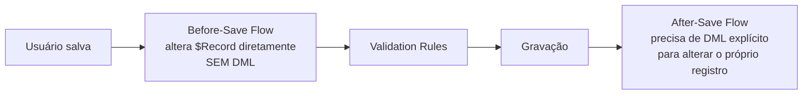

# 14 · Automação declarativa — Flow e companhia

`Nível: intermediário` · `Atualizado: 11/08/2026` · `API 67.0`

Automação sem código é a razão de administradores Salesforce serem uma profissão. Também é
a origem de uma classe inteira de problemas de performance que ninguém sabe diagnosticar.

---

## 1. As três gerações — e por que todas coexistem

| Geração | Ferramenta | Época | Estado em 2026 |
|---|---|---|---|
| 1ª | **Workflow Rules** | 2004 | ⛔ não se cria mais; migração forçada |
| 2ª | **Process Builder** | 2015 | ⛔ não se cria mais; migração forçada |
| 3ª | **Flow** | 2016→ | ✅ a única ferramenta a usar |

**Por que coexistem:** compatibilidade retroativa. Orgs de 2008 têm centenas de workflows
funcionando, e a Salesforce nunca desliga nada sem anos de aviso. Existe uma ferramenta
oficial de migração (*Migrate to Flow*) no Setup.

> **Se você está começando hoje:** aprenda **só Flow**. Aprenda a *reconhecer* Workflow e
> Process Builder porque você vai encontrá-los em orgs herdadas, e saiba que a resposta
> certa para "devo criar mais um?" é sempre não.

---

## 2. Tipos de Flow

| Tipo | Dispara | Uso típico |
|---|---|---|
| **Record-Triggered — Before Save** | antes de gravar | preencher campos do próprio registro. **Rápido** (~10× mais que after) |
| **Record-Triggered — After Save** | depois de gravar | criar/atualizar outros registros, enviar e-mail, chamar Apex |
| **Record-Triggered — Before Delete** | antes de excluir | validar, arquivar |
| **Screen Flow** | usuário abre | assistente guiado, telas passo a passo |
| **Scheduled-Triggered** | horário | processamento em lote noturno |
| **Platform Event-Triggered** | evento publicado | reação a eventos, integração |
| **Autolaunched (sem gatilho)** | chamado por outro Flow, Apex, API, botão | sub-rotina reutilizável |
| **Orchestration** | processo de várias etapas com pessoas | aprovações complexas, onboarding |

### 2.1 Before Save vs. After Save — a decisão de maior impacto



**Se o Flow só precisa alterar campos do registro que está sendo gravado, use Before Save.**
Ele altera a variável `$Record` em memória, sem gerar uma nova operação de gravação.
A diferença de performance é de uma ordem de grandeza — a Salesforce mediu isso e é o
conselho oficial. Um After-Save Flow que atualiza o próprio registro gera **um segundo
ciclo completo** de gravação, com triggers, validações e rollups de novo.

---

## 3. A ordem de execução, com Flows no lugar certo

Retomando o diagrama de [10-fundamentos.md](10-fundamentos.md) §6, com detalhe:

```text
 1. Carrega o registro do banco (ou inicializa)
 2. Aplica os valores novos vindos da requisição
 3. Regras do sistema (obrigatoriedade, tipo, maxlength)
 4. ► Flows Before-Save (record-triggered)
 5. ► Triggers BEFORE
 6. Regras do sistema de novo + ► Validation Rules
 7. Duplicate rules
 8. Salva no banco — SEM commit
 9. ► Triggers AFTER
10. Assignment rules
11. Auto-response rules
12. ► Workflow Rules (legado)  → se alterar campo, refaz 5,6,8,9
13. Escalation rules
14. ► Flows After-Save (record-triggered)
15. Entitlement rules
16. Rollup summary do pai → o PAI refaz todo o ciclo
17. Criteria-based sharing recalculado
18. COMMIT
19. Pós-commit: e-mail, jobs assíncronos, Platform Events (PublishAfterCommit)
```

**As três consequências que geram os bugs mais caros:**

1. **Flow Before-Save roda ANTES dos triggers.** Se você tem os dois no mesmo objeto, o
   trigger vê o que o Flow escreveu — e a maioria dos times não sabe disso.
2. **Rollup no pai reinicia o ciclo do pai.** Uma cadeia neto→filho→pai→avô pode fazer o
   ciclo rodar quatro vezes numa única gravação, consumindo CPU que você não escreveu.
3. **Ordem entre Flows do mesmo tipo:** você pode definir uma **prioridade de execução**
   (*Trigger Order*, 1 a 2.000) em cada Flow record-triggered. **Sem isso, a ordem é
   indefinida.** Se importa, defina — não confie na sorte.

---

## 4. Elementos de Flow — o que você usa de verdade

| Categoria | Elemento | Nota |
|---|---|---|
| **Lógica** | Assignment | atribui valor a variável — não grava nada |
| | Decision | if/else |
| | Loop | **cuidado**: DML e query dentro do laço é o pecado nº 1 |
| | Collection Filter / Sort | evita loops inteiros; use-os |
| **Dados** | Get Records | consulta (custa SOQL) |
| | Create / Update / Delete Records | grava (custa DML) |
| **Interação** | Screen | só em Screen Flow |
| | Action | e-mail, Apex `@InvocableMethod`, submeter aprovação, HTTP callout |
| | Subflow | chama outro Flow |
| **Assíncrono** | Scheduled Path | agenda uma parte para "X horas depois" |
| | Asynchronous Path | roda depois do commit — **é o único jeito de fazer callout em record-triggered flow** |
| **Erro** | Fault path | trate. Sem fault path, o usuário vê um erro incompreensível |

### 4.1 Bulkification em Flow

Flows record-triggered **são** bulkificados pela plataforma: um DML com 200 registros roda
o Flow uma vez, com uma coleção. **Mas você pode destruir isso.**

```text
❌ ERRADO                          ✅ CERTO
Loop sobre 200 registros           Get Records (1 consulta, todos de uma vez)
  └─ Get Records    ← 200 SOQL     Loop sobre a coleção em memória
  └─ Update Records ← 200 DML        └─ Assignment (só em memória)
                                   Update Records (1 DML, coleção inteira)
```

A regra é idêntica à do Apex: **nada de Get/Create/Update/Delete dentro de Loop**.
Use *Collection Filter* e *Collection Sort* para trabalhar com coleções sem laço.

---

## 5. Limites do Flow

Flows consomem os **mesmos governor limits** da transação — compartilhados com triggers,
validation rules e tudo mais. Além disso:

| Limite | Valor |
|---|---|
| Elementos executados por transação | 2.000 |
| Elementos executados por Flow (interview) | 2.000 |
| Interviews de Screen Flow por sessão | limite alto, mas existe |
| Flows agendados por hora | 250.000 por org / 24 h no total de execuções agendadas |
| Profundidade de subflows | 25 |

**O limite que realmente aparece** não é nenhum desses — é o **tempo de CPU de 10 s**.
Flow é interpretado, não compilado. Uma operação equivalente custa consistentemente mais
CPU em Flow do que em Apex. Numa org com 12 Flows no objeto `Account`, uma atualização em
massa de 200 contas estoura CPU sem que uma única linha de código sua esteja envolvida.

---

## 6. Flow vs. Apex — o critério honesto

| Critério | Flow | Apex |
|---|---|---|
| Quem mantém | admin | dev |
| Velocidade de mudança | minutos | deploy |
| Custo de CPU | **maior** | menor |
| Teste automatizado | limitado | completo (obrigatório) |
| Diff no Git | XML gigante, **ilegível** | legível |
| Busca textual ("onde uso este campo?") | difícil | trivial (`grep`) |
| Lógica complexa | vira um labirinto | expressiva |
| Volume alto | ruim | Batch resolve |
| Callout | só em caminho assíncrono ou via ação | direto |
| Reuso | subflow, limitado | classes, interfaces, herança |
| Depuração | Flow Debugger (bom) e logs | logs completos, checkpoints |

**Meu critério, em uma linha:** *se você consegue explicar a regra em três frases, use Flow;
se precisa de um diagrama, use Apex.*

**Segundo critério, mais objetivo:** se o Flow passar de **~20 elementos** ou tiver mais de
**dois níveis de Decision aninhada**, ele já está no território onde Apex é mais barato de
manter. Isso é opinião profissional, não regra oficial.

**E a regra inegociável:** **nunca implemente a mesma regra em Flow e em Apex.** Escolha um
lugar por objeto e por regra. Orgs com automação duplicada produzem bugs que ninguém
consegue reproduzir, porque a ordem entre as camadas muda com o contexto.

---

## 7. Chamando Apex de um Flow

```apex
public with sharing class CalcularDescontoAction {

    public class Entrada {
        @InvocableVariable(required=true label='ID da Oportunidade')
        public Id oportunidadeId;

        @InvocableVariable(label='Percentual máximo')
        public Decimal tetoPercentual;
    }

    public class Saida {
        @InvocableVariable(label='Desconto aprovado')
        public Decimal desconto;

        @InvocableVariable(label='Precisa de aprovação')
        public Boolean precisaAprovacao;
    }

    /**
     * @InvocableMethod recebe e devolve LISTAS — é assim que a plataforma bulkifica.
     * Um Flow que roda para 200 registros chama este método UMA vez com 200 entradas.
     * Escrever este método assumindo um item é o erro clássico.
     */
    @InvocableMethod(label='Calcular desconto' description='Calcula o desconto permitido.'
                     category='Vendas')
    public static List<Saida> calcular(List<Entrada> entradas) {
        Set<Id> ids = new Set<Id>();
        for (Entrada e : entradas) { ids.add(e.oportunidadeId); }

        Map<Id, Opportunity> opps = new Map<Id, Opportunity>([
            SELECT Id, Amount, Account.AnnualRevenue
            FROM Opportunity WHERE Id IN :ids WITH USER_MODE
        ]);

        List<Saida> saidas = new List<Saida>();
        for (Entrada e : entradas) {
            Opportunity o = opps.get(e.oportunidadeId);
            Decimal teto = e.tetoPercentual == null ? 15 : e.tetoPercentual;

            Saida s = new Saida();
            s.desconto = (o != null && o.Amount != null && o.Amount > 100000) ? teto : teto / 2;
            s.precisaAprovacao = s.desconto > 10;
            saidas.add(s);
        }
        return saidas;   // a ordem DEVE corresponder à das entradas
    }
}
```

**Três regras não negociáveis do `@InvocableMethod`:**
1. Recebe e devolve **listas**. A saída deve estar na **mesma ordem** da entrada.
2. Só **um** método `@InvocableMethod` por classe.
3. Se lançar exceção, o Flow inteiro falha — trate e devolva um campo de erro na saída,
   ou use fault path no Flow.

---

## 8. Approval Processes

Ainda são a ferramenta padrão para aprovações formais (desconto, contrato, despesa):

```text
Registro submetido
   → critério de entrada
   → Etapa 1: aprovador = gerente do dono
       ├── aprovado → Etapa 2
       └── rejeitado → ações de rejeição (bloqueia, notifica, muda status)
   → Etapa 2: aprovador = diretoria (fila)
       └── aprovado → ações finais (marca aprovado, desbloqueia, dispara Flow)
```

Características importantes:
- **travam o registro** durante a aprovação (só o aprovador e admins editam);
- suportam aprovação por e-mail, Chatter e Slack;
- podem ser submetidos por Flow ou Apex (`Approval.process()`);
- **não** foram descontinuados, mas o **Flow Orchestration** é a alternativa moderna para
  processos multi-etapa com pessoas e paralelismo.

---

## 9. Os cinco porquês: por que Flow substituiu Workflow e Process Builder?

**1. Por que a Salesforce descontinuou duas ferramentas de automação?**
Porque manter três motores de automação, cada um com regras de execução próprias, custa
caro e produz uma ordem de execução impossível de explicar aos clientes.

**2. Por que essa fragmentação existiu, então?**
Cada geração resolveu uma limitação da anterior. Workflow (2004) não fazia criação de
registro nem lógica ramificada. Process Builder (2015) fazia, mas não tinha tela nem
tratamento de erro. Flow unificou tudo.

**3. Por que não fizeram Flow logo de início?**
Porque em 2004 nem existia o vocabulário de produto para isso, e a Salesforce estava
otimizando para o admin não-técnico, com uma interface de "regra simples". Só depois ficou
claro que os clientes queriam programar — sem se chamarem programadores.

**4. Por que Flow é mais lento que Apex, então?**
Porque é **interpretado**: cada elemento é avaliado em tempo de execução por um motor
genérico que precisa checar tipos, permissões e contexto a cada passo. Apex é compilado
para bytecode. É o mesmo trade-off de qualquer interpretador contra compilador.

**5. E por que aceitar essa lentidão?**
Porque o gargalo do cliente quase nunca é CPU — é **tempo humano até a mudança entrar em
produção**. Um Flow que consome 3× mais CPU e entra em produção em 20 minutos, contra um
Apex que entra em duas semanas, é o melhor negócio na maioria das vezes. Só deixa de ser
quando o volume aparece.

*(Parada legítima: trade-off explícito entre custo de máquina e custo humano.)*

---

## 10. Armadilhas específicas de Flow

| Armadilha | Sintoma | Correção |
|---|---|---|
| Get/Update dentro de Loop | limite de SOQL/DML estourado com 200 registros | Collection Filter + DML fora do laço |
| After-Save alterando o próprio registro | ciclo duplo de gravação, CPU alta, risco de recursão | use **Before Save** |
| Sem fault path | usuário vê erro técnico incompreensível | adicione fault path e mensagem clara |
| Vários Flows no mesmo objeto sem *Trigger Order* | ordem indefinida, bugs intermitentes | defina a prioridade em cada um |
| Flow ativo em produção sem teste | quebra em massa | teste em sandbox com volume, sempre |
| Automação duplicada em Flow e trigger | comportamento imprevisível | uma regra, um lugar |
| Flow rodando como o **usuário que disparou** sem checagem | erro de permissão para uns e não para outros | configure "How to Run the Flow" conscientemente |
| Screen Flow com Get Records de 50 mil linhas | timeout na tela | filtre e pagine |

---

## Autoteste

1. Quais são as três gerações de automação, e por que todas ainda existem?
2. Qual a diferença entre Flow Before-Save e After-Save? Quando usar cada um, e por quê?
3. Onde os Flows entram na ordem de execução, em relação aos triggers e às validation rules?
4. Como se bulkifica um Flow? Qual é o erro equivalente ao "SOQL dentro de laço" do Apex?
5. Dê dois critérios objetivos para escolher Apex em vez de Flow.
6. Por que um `@InvocableMethod` recebe e devolve listas?
7. Por que Flow consome mais CPU que Apex? E por que isso costuma valer a pena?
8. O que acontece quando há dois Flows record-triggered no mesmo objeto sem *Trigger Order* definido?
