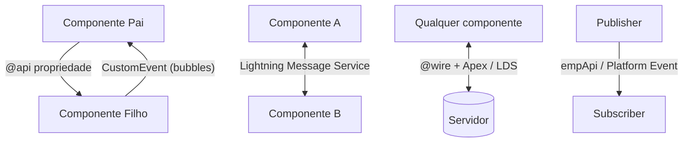

# 16 · Lightning Web Components e a camada de interface

`Nível: intermediário → avançado` · `Atualizado: 11/08/2026` · `API 67.0`

---

## 1. As quatro gerações de interface

| Geração | Época | Tecnologia | Estado em 2026 |
|---|---|---|---|
| **Salesforce Classic** | 2000–2015 | páginas geradas no servidor | ⛔ em retirada |
| **Visualforce** | 2007 | tags próprias + Apex controller, render no servidor | 🟡 legado; ainda necessário para PDF e alguns overrides |
| **Aura Components** | 2014 | framework próprio de componentes | 🟡 legado; não comece nada novo |
| **Lightning Web Components (LWC)** | 2019 | **Web Components padrão** + camada fina | ✅ o presente e o futuro |

**Por que LWC substituiu Aura — e a resposta é boa:** quando a Aura foi criada em 2014, os
padrões web de componentes (Custom Elements, Shadow DOM, ES Modules, Templates) não existiam
ou não eram suportados. A Salesforce teve que **inventar tudo**: sistema de módulos, herança
de componentes, data binding, o `.cmp`. Em 2019 os padrões existiam e eram suportados pelos
navegadores. LWC é essencialmente **Web Components padrão + o mínimo de camada proprietária
para funcionar dentro do Salesforce**.

Consequências práticas dessa decisão:
- LWC é **muito mais rápido** que Aura (menos abstração entre o seu código e o navegador);
- o que você aprende é **transferível** — é JavaScript e Web Components de verdade;
- desenvolvedores web se adaptam em dias, não em semanas.

---

## 2. Anatomia de um LWC

Um componente é uma pasta com o mesmo nome dos arquivos:

```text
lwc/meuComponente/
├── meuComponente.js          ← lógica (obrigatório)
├── meuComponente.html        ← template (obrigatório para renderizar)
├── meuComponente.js-meta.xml ← onde pode ser usado (obrigatório para deploy)
├── meuComponente.css         ← estilo (opcional, escopo isolado)
└── __tests__/                ← testes Jest (opcional, altamente recomendado)
    └── meuComponente.test.js
```

```javascript
import { LightningElement, api, track, wire } from 'lwc';
import buscarContas from '@salesforce/apex/ContaService.buscar';
import NOME_FIELD from '@salesforce/schema/Account.Name';
import USER_ID from '@salesforce/user/Id';
import ROTULO from '@salesforce/label/c.Meu_Rotulo';

export default class MeuComponente extends LightningElement {
    // @api  → propriedade PÚBLICA: o pai passa, o App Builder configura
    @api recordId;
    @api titulo = 'Padrão';

    // sem decorador → propriedade reativa (desde Spring '20, @track é raramente necessário)
    contador = 0;
    itens = [];

    // @track → só necessário para mutação PROFUNDA em objeto/array sem reatribuir
    @track configuracao = { filtro: { ativo: true } };

    // @wire → chamada reativa e cacheada a um serviço
    @wire(buscarContas, { termo: '$termoBusca' })
    resultado;

    // Getter: computado a cada render. Mantenha barato.
    get temItens() {
        return this.itens.length > 0;
    }
}
```

### 2.1 Ciclo de vida

| Hook | Quando | Use para |
|---|---|---|
| `constructor()` | criação | inicializar estado. **Não** acesse `this.template` nem propriedades `@api` |
| `connectedCallback()` | inserido no DOM | subscrições, carga inicial, `loadScript` |
| `renderedCallback()` | após **cada** render | manipular DOM de terceiros. **Cuidado: dispara em laço se você alterar estado aqui** |
| `disconnectedCallback()` | removido do DOM | **cancelar subscrições e timers** — obrigatório |
| `errorCallback(error, stack)` | erro em componente filho | *error boundary*: mostrar mensagem em vez de tela branca |

> **A falha mais comum:** subscrever em `connectedCallback` e esquecer o `unsubscribe` em
> `disconnectedCallback`. Cada navegação deixa uma subscrição órfã, e em algumas horas o
> componente "para de funcionar sem motivo" porque o limite de clientes foi atingido.

---

## 3. Template — as diretivas

```html
<template>
    <!-- Condicional (moderno, desde Spring '23). O antigo if:true ainda funciona. -->
    <template lwc:if={carregando}>
        <lightning-spinner></lightning-spinner>
    </template>
    <template lwc:elseif={temErro}>
        <p class="slds-text-color_error">{mensagemErro}</p>
    </template>
    <template lwc:else>
        <!-- Iteração: key É OBRIGATÓRIA e deve ser estável e única.
             Nunca use o índice do array como key — quebra a reconciliação. -->
        <template for:each={itens} for:item="item" for:index="i">
            <div key={item.id} class="slds-var-m-around_x-small">
                {item.nome}
                <lightning-button label="Remover"
                                  data-id={item.id}
                                  onclick={handleRemover}></lightning-button>
            </div>
        </template>

        <!-- iterator: dá acesso a first/last/value/index -->
        <template iterator:it={itens}>
            <li key={it.value.id} class={it.first ? 'primeiro' : ''}>
                {it.value.nome}
            </li>
        </template>
    </template>

    <!-- Slot: o pai injeta conteúdo aqui -->
    <slot name="rodape"></slot>
</template>
```

**Limitações do template que surpreendem quem vem de React/Vue:**

- **não há expressões**: `{item.valor * 2}` é inválido. Faça um getter no JS.
- **não há chamada de método**: `{formatar(item)}` é inválido. Getter, de novo.
- `{item.a.b.c}` funciona, mas encadeamento com `?.` não.
- não dá para passar parâmetro a um handler: use `data-*` e leia `event.target.dataset`.

Isso é deliberado: o template é **declarativo e estaticamente analisável**, o que permite
ao compilador otimizar a renderização. É o mesmo trade-off do Angular e do Vue com templates.

---

## 4. Comunicação entre componentes



| Direção | Mecanismo | Quando |
|---|---|---|
| Pai → filho | propriedade `@api`, ou `@api` método público | hierarquia direta |
| Filho → pai | `CustomEvent` | hierarquia direta |
| Irmãos / não relacionados | **Lightning Message Service (LMS)** | componentes distantes, ou LWC ↔ Aura ↔ Visualforce |
| Servidor → cliente, em tempo real | `lightning/empApi` + Platform Event / CDC | notificação assíncrona |
| Estado do registro | Lightning Data Service (`getRecord`, `updateRecord`) | **preferir a Apex** quando for CRUD simples |

```javascript
// Filho dispara
this.dispatchEvent(new CustomEvent('selecionar', {
    detail: { id: this.item.id },
    bubbles: true,      // sobe na árvore
    composed: false     // false = não atravessa o Shadow DOM. true só quando necessário.
}));
```
```html
<!-- Pai escuta: o nome do evento em minúsculas, prefixado por "on" -->
<c-filho onselecionar={handleSelecionar}></c-filho>
```

**Regra de nomenclatura de evento:** minúsculas, sem hífen, sem camelCase. `selecionar`,
não `onSelecionar` nem `item-selecionado`. O motivo é que o HTML não distingue maiúsculas.

---

## 5. Dados: LDS vs. Apex

### 5.1 Lightning Data Service — prefira quando couber

```javascript
import { getRecord, updateRecord, deleteRecord, createRecord } from 'lightning/uiRecordApi';
import NOME from '@salesforce/schema/Account.Name';
import RECEITA from '@salesforce/schema/Account.AnnualRevenue';

export default class Ficha extends LightningElement {
    @api recordId;

    @wire(getRecord, { recordId: '$recordId', fields: [NOME, RECEITA] })
    conta;

    get nome() {
        return this.conta?.data?.fields?.Name?.value;
    }

    async salvar() {
        await updateRecord({ fields: { Id: this.recordId, Name: 'Novo nome' } });
        // Nenhum Apex escrito. FLS, sharing e validações aplicados automaticamente.
    }
}
```

**Vantagens do LDS que quase ninguém aproveita:**
- **cache compartilhado** entre todos os componentes da página — se dois componentes pedem
  a mesma conta, há **uma** requisição;
- **FLS e sharing aplicados** sem uma linha de Apex;
- **atualização automática** de todos os componentes quando o registro muda;
- **suporte offline** no app móvel.

**Quando LDS não serve:** consultas com filtro complexo, agregação, múltiplos objetos numa
chamada, lógica de negócio. Aí é Apex.

Componentes de base que usam LDS e devem ser sua primeira escolha:
`lightning-record-form` (o mais simples), `lightning-record-edit-form` (mais controle),
`lightning-record-view-form`.

### 5.2 Apex — `@wire` vs. imperativo

```javascript
// Reativo: chama sozinho e re-chama quando o parâmetro muda. Só para leitura.
@wire(buscarContas, { termo: '$termo' })
resultado;   // { data, error }

// Imperativo: você chama quando quer. Obrigatório para escrita.
import { refreshApex } from '@salesforce/apex';

async handleSalvar() {
    try {
        await salvarConta({ conta: this.conta });
        await refreshApex(this.resultado);   // invalida o cache do @wire
    } catch (e) {
        this.erro = e.body?.message;
    }
}
```

> **A pegadinha nº 1 de LWC+Apex:** depois de gravar, a tabela não atualiza. A causa é o
> cache de `@AuraEnabled(cacheable=true)`. A correção é guardar o **objeto de resultado do
> wire** (não só `.data`) e chamar `refreshApex()` nele. `notifyRecordUpdateAvailable()`
> resolve o caso de LDS.

---

## 6. Segurança no cliente: Lightning Web Security

**Locker Service** (2016–) isolava componentes com uma técnica de *proxy* pesada, que
quebrava bibliotecas de terceiros e degradava performance.

**Lightning Web Security (LWS)** é o substituto, baseado em *virtualização de namespace*:
cada namespace vê um DOM virtualizado, mas as APIs do navegador funcionam de forma muito
mais próxima do padrão. Resultado: mais bibliotecas de terceiros funcionam, e é mais rápido.

O que continua bloqueado (e deve continuar):
- `eval()` e `Function()` com string;
- acesso ao DOM de outro namespace;
- alguns globais e APIs que permitiriam vazar contexto entre componentes.

**Para usar biblioteca externa** (Chart.js, uma lib de máscara, etc.):
1. suba como **Static Resource**;
2. carregue com `loadScript`/`loadStyle` de `lightning/platformResourceLoader`;
3. teste — nem tudo funciona, mesmo com LWS.

```javascript
import { loadScript } from 'lightning/platformResourceLoader';
import CHARTJS from '@salesforce/resourceUrl/chartjs';

renderedCallback() {
    if (this.jaCarregou) { return; }   // renderedCallback dispara MUITAS vezes
    this.jaCarregou = true;
    loadScript(this, CHARTJS + '/chart.min.js')
        .then(() => this.desenhar())
        .catch((e) => console.error(e));
}
```

---

## 7. Testes com Jest

```javascript
import { createElement } from '@lwc/engine-dom';
import PainelOrdens from 'c/painelOrdens';
import listarPorEquipamento from '@salesforce/apex/OrdemServicoService.listarPorEquipamento';

// Mock do método Apex — não há servidor no teste unitário
jest.mock(
    '@salesforce/apex/OrdemServicoService.listarPorEquipamento',
    () => ({ default: jest.fn() }),
    { virtual: true }
);

describe('c-painel-ordens', () => {
    afterEach(() => {
        while (document.body.firstChild) {
            document.body.removeChild(document.body.firstChild);
        }
        jest.clearAllMocks();
    });

    it('renderiza a tabela quando o Apex devolve dados', async () => {
        listarPorEquipamento.mockResolvedValue([
            { Id: 'a01', Name: 'OS-00001', Status__c: 'Aberta' }
        ]);

        const el = createElement('c-painel-ordens', { is: PainelOrdens });
        el.recordId = 'a00xxx';
        document.body.appendChild(el);

        await Promise.resolve();   // deixa a microtask do wire resolver

        const tabela = el.shadowRoot.querySelector('lightning-datatable');
        expect(tabela).not.toBeNull();
        expect(tabela.data.length).toBe(1);
    });
});
```

```bash
npm run test:unit          # sfdx-lwc-jest
npm run test:unit -- --watch
```

**Por que testar LWC com Jest importa:** o teste roda em **milissegundos**, sem org, sem
deploy, sem rede. Comparado ao ciclo "deploy → abrir a org → clicar", é uma diferença de
duas ordens de grandeza no tempo de feedback. É a maior alavanca de produtividade
disponível na plataforma, e a mais subutilizada.

---

## 8. Performance

| Prática | Por quê |
|---|---|
| `@AuraEnabled(cacheable=true)` em tudo que só lê | evita a ida ao servidor |
| Getters **baratos** | são reavaliados a cada render |
| Não mutar estado em `renderedCallback` | causa laço de render |
| `key` estável no `for:each` | permite reconciliação eficiente do DOM |
| Lazy-load de componentes pesados | `lwc:if` em vez de esconder com CSS |
| Debounce em campo de busca | evita uma chamada por tecla |
| Paginação em `lightning-datatable` | acima de ~1.000 linhas o DOM engasga |
| Static Resources minificados e versionados | um bundle, um cache |
| `lightning/navigation` em vez de `window.location` | não recarrega a aplicação inteira |

---

## 9. Quando ainda usar Visualforce ou Aura

| Necessidade | Solução |
|---|---|
| **Gerar PDF** | Visualforce (`renderAs="pdf"`) — **LWC não gera PDF nativamente** |
| Template de e-mail complexo | Visualforce Email Template |
| Sobrescrever certos botões padrão | ainda pode exigir Visualforce |
| Componente que precisa envolver um LWC em contexto legado | Aura como *wrapper* |
| `lightning:availableForFlowScreens` em cenário antigo | LWC já suporta; Aura só se houver restrição específica |

**Regra:** LWC por padrão. Visualforce **só** quando não houver alternativa — principalmente
PDF. Aura, apenas para manter o que já existe.

---

## 10. Os cinco porquês: por que Shadow DOM em LWC?

**1. Por que LWC usa Shadow DOM?**
Para isolar estilo e estrutura: o CSS de um componente não vaza para outro, e o DOM interno
não é acessível de fora.

**2. Por que isso importa numa plataforma como o Salesforce?**
Porque numa mesma página convivem componentes da Salesforce, do cliente e de **vários
fornecedores da AppExchange**, escritos por gente que nunca conversou. Sem isolamento, um
seletor CSS agressivo de um pacote quebraria a interface de outro.

**3. Por que isso é diferente de um app web comum?**
Num app comum, um único time controla todo o CSS e pode usar convenções (BEM, CSS Modules)
para evitar colisão. Aqui, **não há um time só** e não há como impor convenção a terceiros.
O isolamento precisa ser garantido pelo runtime, não pela disciplina.

**4. Qual é o custo desse isolamento?**
Estilizar componentes de base é difícil: você não alcança o interior deles com CSS comum.
A saída oficial são **CSS Custom Properties** (hooks de estilo do SLDS), que a Salesforce
expõe deliberadamente. Muita gente reclama, e a reclamação é legítima.

**5. Por que não abandonar o Shadow DOM, então?**
Porque o custo do vazamento é maior. Existe o modo *light DOM* (`static renderMode = 'light'`)
para casos específicos — integração com bibliotecas que precisam alcançar o DOM, ou SEO em
Experience Cloud — e ele existe justamente porque a Salesforce reconhece que o isolamento
nem sempre compensa. É uma escolha, não um dogma.

*(Parada legítima: trade-off de arquitetura explícito, com escape documentado.)*

---

## Autoteste

1. Por que LWC substituiu Aura? Dê a razão técnica, não a comercial.
2. Qual a diferença entre `@api`, `@track` e uma propriedade sem decorador?
3. Por que não se pode escrever `{item.valor * 2}` no template? Como se resolve?
4. Como um filho comunica algo ao pai? E dois componentes irmãos distantes?
5. Quando usar Lightning Data Service em vez de Apex? Cite três vantagens do LDS.
6. Depois de salvar, a tabela não atualiza. Qual é a causa e a correção?
7. O que é obrigatório fazer em `disconnectedCallback`, e o que acontece se você esquecer?
8. Por que testar LWC com Jest é a maior alavanca de produtividade da plataforma?
9. Qual é a única coisa para a qual Visualforce ainda é insubstituível?
10. Por que LWC usa Shadow DOM, e qual é o custo prático disso?
