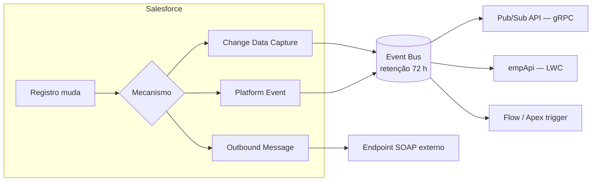

# 17 · Integração e APIs

`Nível: avançado` · `Atualizado: 11/08/2026` · `API 67.0`

Salesforce quase nunca é o único sistema da empresa. Integração é onde os projetos
descarrilam — não por falta de API, mas por escolha errada de padrão.

---

## 1. O catálogo de APIs

| API | Protocolo | Volume | Latência | Use para |
|---|---|---|---|---|
| **REST API** | REST/JSON | até ~2.000 reg./chamada | baixa | CRUD, integração moderna, mobile |
| **SOAP API** | SOAP/XML | idem | baixa | sistemas legados que só falam SOAP |
| **Bulk API 2.0** | REST + CSV | **milhões** | alta (assíncrona) | carga inicial, ETL noturno |
| **Composite API** | REST | até 25 sub-requisições | baixa | várias operações numa ida só |
| **GraphQL API** | GraphQL | moderado | baixa | front-ends que precisam de dados aninhados |
| **UI API** | REST | pequeno | baixa | construir UI fora do Salesforce respeitando layout e FLS |
| **Metadata API** | SOAP | — | alta | deploy de configuração |
| **Tooling API** | REST/SOAP | — | baixa | IDEs, análise de código, cobertura |
| **Streaming API (PushTopic/CDC)** | CometD/Bayeux | evento | tempo real | ser notificado de mudanças |
| **Pub/Sub API** | gRPC | alto | tempo real | Platform Events em escala; substitui CometD |
| **Connect REST API** | REST | — | baixa | Chatter, comunidades, feeds |
| **Apex REST / Apex SOAP** | você define | você define | baixa | contrato próprio, lógica customizada |

### 1.1 Composite — a API que economiza limites

```http
POST /services/data/v67.0/composite
Authorization: Bearer <token>
Content-Type: application/json

{
  "allOrNone": true,
  "compositeRequest": [
    {
      "method": "POST",
      "url": "/services/data/v67.0/sobjects/Account",
      "referenceId": "novaConta",
      "body": { "Name": "Metalúrgica Ribeirão", "Industry": "Manufacturing" }
    },
    {
      "method": "POST",
      "url": "/services/data/v67.0/sobjects/Contact",
      "referenceId": "novoContato",
      "body": {
        "LastName": "Ferreira",
        "AccountId": "@{novaConta.id}"
      }
    }
  ]
}
```

**Por que isso importa:** o `@{referenceId.id}` permite encadear operações **antes** de saber
o Id. Sem Composite, seriam duas chamadas (duas idas de rede, dois consumos do limite de
API) e um estado intermediário inconsistente se a segunda falhasse. Com `allOrNone: true`,
é atômico.

Variantes: `composite/batch` (até 25 sub-requisições independentes, sem encadeamento) e
`composite/sobjects` (até 200 registros do mesmo objeto num único CRUD).

### 1.2 Bulk API 2.0 — o fluxo

```bash
# 1. Criar o job
curl -X POST "$INSTANCE/services/data/v67.0/jobs/ingest" \
  -H "Authorization: Bearer $TOKEN" -H "Content-Type: application/json" \
  -d '{"object":"Account","operation":"upsert","externalIdFieldName":"Codigo_ERP__c","lineEnding":"LF"}'
# → devolve {"id":"750xx...","state":"Open"}

# 2. Enviar o CSV (até 150 MB)
curl -X PUT "$INSTANCE/services/data/v67.0/jobs/ingest/750xx.../batches" \
  -H "Authorization: Bearer $TOKEN" -H "Content-Type: text/csv" \
  --data-binary @contas.csv

# 3. Fechar (aí começa o processamento)
curl -X PATCH "$INSTANCE/services/data/v67.0/jobs/ingest/750xx..." \
  -H "Authorization: Bearer $TOKEN" -H "Content-Type: application/json" \
  -d '{"state":"UploadComplete"}'

# 4. Acompanhar
curl "$INSTANCE/services/data/v67.0/jobs/ingest/750xx..." -H "Authorization: Bearer $TOKEN"

# 5. Baixar os registros que falharam — NUNCA pule este passo
curl "$INSTANCE/services/data/v67.0/jobs/ingest/750xx.../failedResults/" \
  -H "Authorization: Bearer $TOKEN"
```

**Detalhes que decidem o sucesso de uma carga:**

- **`upsert` com External Id** é quase sempre a operação certa: idempotente por construção.
- **Serial vs. paralelo:** o padrão é paralelo. Se houver *lock contention* (master-detail,
  mesmo pai), passe para serial — mais lento, mas não falha.
- **Triggers rodam.** Uma carga de 5 milhões dispara seus triggers 25.000 vezes (lotes de
  200). Considere um interruptor de bypass para migração.
- **Bulk tem limites próprios**, separados do limite de chamadas de API. É por isso que
  carga em massa por REST comum é um erro de arquitetura.

---

## 2. Autenticação — OAuth 2.0 na prática

| Fluxo | Quando usar | Segredo envolvido |
|---|---|---|
| **JWT Bearer** | **servidor↔servidor, CI/CD** — sem usuário, sem senha, sem refresh | chave privada + certificado |
| **Client Credentials** | servidor↔servidor moderno, com usuário de execução definido | client secret |
| **Web Server (authorization code + PKCE)** | app web com usuário logando | client secret |
| **User-Agent (implicit)** | ⛔ **obsoleto**, não use | — |
| **Device** | TV, CLI, dispositivo sem navegador | — |
| **Username-Password** | ⛔ **desabilitado por padrão desde 2024** | senha + security token |
| **Refresh Token** | renovar acesso de longa duração | refresh token |

### 2.1 JWT Bearer — o fluxo correto para integração de sistema

```bash
# 1. Gerar chave e certificado (uma vez)
openssl req -x509 -sha256 -nodes -days 365 -newkey rsa:2048 \
  -keyout server.key -out server.crt \
  -subj "/C=BR/ST=SP/L=SP/O=Empresa/CN=integracao"
```

2. Criar uma **Connected App** no Salesforce, marcar *Use digital signatures*, subir o
   `server.crt`, e habilitar os escopos `api` e `refresh_token`.
3. Em *Manage → Edit Policies*, definir **Permitted Users = Admin approved users** e
   pré-autorizar o perfil/permission set do usuário de integração.

```bash
# 4. Login na CLI (o mesmo mecanismo que o seu código usa)
sf org login jwt --client-id <ConsumerKey> --jwt-key-file server.key \
  --username integracao@empresa.com --alias ci --instance-url https://login.salesforce.com
```

**Por que JWT e não usuário+senha:** não há senha para vazar, não há MFA para contornar,
o token expira em minutos, e a revogação é imediata (basta remover o certificado).
O fluxo username-password foi **desabilitado por padrão** justamente porque era o vetor
de comprometimento mais comum em integrações Salesforce.

### 2.2 Do lado de fora para dentro: Named Credentials

Para o Salesforce chamar um sistema externo, **nunca** guarde credencial em Custom Setting.
Use **Named Credential + External Credential** (ver [06-exemplos.md](06-exemplos.md) §9):

- o segredo fica em armazenamento gerenciado, **fora do Git e fora do metadado**;
- a plataforma injeta o header de autorização e **renova tokens OAuth sozinha**;
- o domínio fica automaticamente liberado (dispensa *Remote Site Setting*);
- suporta *per-user* (cada usuário com sua credencial) ou *named principal* (uma para todos).

---

## 3. Eventos: o Salesforce avisando o mundo



| Mecanismo | Payload | Você define o esquema? | Confiabilidade |
|---|---|---|---|
| **Platform Event** | campos que você criar | **sim** | ao menos uma vez; replay 72 h |
| **Change Data Capture (CDC)** | o registro alterado, com os campos mudados | não (é o objeto) | idem |
| **PushTopic** (legado) | resultado de uma SOQL | parcialmente | idem; evite em projeto novo |
| **Outbound Message** (legado) | campos escolhidos, em SOAP | parcialmente | **com retentativa por 24 h** |
| **Generic Streaming** | qualquer texto | sim | idem |

**Platform Event vs. CDC — como escolher:**

- **CDC** quando o consumidor quer saber "o registro X mudou, aqui está o novo estado".
  É replicação de dados. Você não escreve código para publicar.
- **Platform Event** quando você quer comunicar um **fato de negócio** ("pedido aprovado",
  "equipamento parou") com um contrato próprio, estável, desacoplado do modelo de dados.

> **Recomendação de arquitetura:** para integração entre sistemas, prefira **Platform Event**.
> CDC acopla o consumidor externo ao seu modelo de dados interno — no dia em que você
> renomear um campo, quebra a integração de outra empresa. Platform Event é um contrato
> que você controla e versiona.

**Outbound Message merece uma menção honesta:** é uma tecnologia velha (SOAP, configurada
em workflow) e ainda assim é o **único** mecanismo nativo com **retentativa automática por
24 horas** e garantia de entrega ordenada por registro. Para integrações críticas simples,
continua sendo uma escolha defensável — o que é raro numa tecnologia legada.

---

## 4. Padrões de integração — o que escolher

| Padrão | Sincronia | Quando | Risco |
|---|---|---|---|
| **Request–Reply** | síncrono | o usuário precisa da resposta agora | timeout de 120 s; acopla disponibilidade |
| **Fire and Forget** | assíncrono | notificar sem esperar | você não sabe se chegou |
| **Batch Data Sync** | assíncrono | ETL noturno, carga inicial | latência de horas |
| **Remote Call-In** | o externo chama o SF | o sistema externo manda | precisa de autenticação robusta |
| **Data Virtualization** | sob demanda | dado grande demais para copiar | latência do sistema externo vira sua |
| **Event-Driven** | assíncrono | desacoplamento real | complexidade operacional |

### 4.1 O checklist que separa integração amadora de profissional

Toda integração de produção precisa responder a estas sete perguntas:

1. **Idempotência.** Se a mesma mensagem chegar duas vezes, o que acontece?
   *(A resposta certa é "nada". Ver [06-exemplos.md](06-exemplos.md) §13.)*
2. **Retentativa.** Falhou. Quando tenta de novo, quantas vezes, com que intervalo?
3. **Ordem.** Importa? Se sim, como você a garante num barramento que não garante ordem?
4. **Falha parcial.** 1.000 registros, 3 falharam. O que acontece com os 997?
5. **Observabilidade.** Como alguém descobre que parou — antes do cliente ligar?
6. **Volume de pico.** A Black Friday manda 50× o normal. Você enfileira ou cai?
7. **Reprocessamento.** Como se refaz um dia inteiro que deu errado?

**Se você não tem resposta escrita para as sete, a integração não está pronta.**
Isso é a coisa mais útil deste arquivo.

---

## 5. Limites de API

| Limite | Valor |
|---|---|
| Chamadas de API por 24 h (DE) | 15.000 |
| Chamadas de API por 24 h (EE) | 100.000 + 1.000 por licença Salesforce (com teto) |
| Requisições concorrentes de longa duração (>20 s) | 25 |
| Timeout de callout **saindo** do Apex | 120 s (padrão 10 s — **configure**) |
| Callouts por transação Apex | 100 |
| Tempo total de callout por transação | 120 s |
| Tamanho do arquivo Bulk API 2.0 | 150 MB |
| Registros por chamada Composite | 25 sub-requisições / 200 registros em `composite/sobjects` |
| Platform Events publicados/hora | varia por edição e add-on |
| Clientes CometD concorrentes | varia por edição |

**O limite mais perigoso é o de 25 requisições concorrentes de longa duração.** Uma
integração mal feita que faz 30 consultas pesadas em paralelo **bloqueia a org inteira** —
inclusive os usuários na interface. É a causa mais comum de "o Salesforce está fora do ar"
que na verdade é "alguém fez uma integração ruim".

---

## 6. MuleSoft e a camada de integração

MuleSoft (adquirida em 2018) é um ESB/plataforma de API. Vale a pena quando:

- há **muitos** sistemas (5+) trocando dados entre si, não só com o Salesforce;
- é preciso transformar, enriquecer e orquestrar entre sistemas;
- há requisito de gestão de APIs: catálogo, políticas, throttling, versionamento.

**Não vale a pena** quando a integração é ponto a ponto e simples. É uma plataforma cara e
que exige especialista próprio. Uma integração Salesforce↔ERP direta, via Named Credential
e Platform Events, é mais barata e mais fácil de manter — e vejo com frequência MuleSoft
sendo vendido para problemas que não o exigem.

**Alternativas legítimas:** Apache Camel, Kafka + conectores, Azure Logic Apps, AWS
EventBridge + AppFlow, n8n, ou simplesmente código próprio bem escrito.

---

## 7. Os cinco porquês: por que não se pode fazer callout depois de DML?

O erro: `You have uncommitted work pending. Please commit or rollback before calling out.`

**1. Por que a plataforma proíbe isso?**
Porque um callout pode demorar até 120 segundos, e nesse período a transação de banco
estaria aberta, segurando bloqueios nas linhas que você alterou.

**2. Por que segurar bloqueios é tão grave aqui?**
Porque o banco é **compartilhado entre inquilinos**. Bloqueios longos em tabelas
compartilhadas degradam a performance de outras empresas no mesmo pod.

**3. Por que não usar uma transação separada para o callout?**
Porque a semântica ficaria ambígua: se o callout falhasse depois do commit, o dado já estaria
gravado e o sistema externo não teria sido avisado — exatamente a inconsistência que o
programador estaria tentando evitar ao colocá-los juntos.

**4. Então qual é o modelo correto?**
Grave primeiro, **commite**, e notifique **depois**, de forma assíncrona e com retentativa.
É o padrão *transactional outbox*, conhecido em sistemas distribuídos muito antes do
Salesforce — e é o que o Exemplo 13 de [06-exemplos.md](06-exemplos.md) implementa.

**5. E por que isso é *melhor*, e não só uma limitação?**
Porque força o desenvolvedor a encarar uma verdade de sistemas distribuídos: **não existe
transação atômica entre dois sistemas independentes**. Ou você aceita consistência
eventual com idempotência e retentativa, ou constrói um commit em duas fases — que é caro,
frágil e quase sempre exagerado. A plataforma empurra você para a solução correta ao
proibir a incorreta.

*(Parada legítima: lei de sistemas distribuídos + trade-off arquitetural explícito.)*

---

## 8. Armadilhas de integração

| Armadilha | Consequência | Correção |
|---|---|---|
| Usar REST comum para carga em massa | estoura o limite diário de API em minutos | Bulk API 2.0 |
| Timeout padrão de 10 s no callout | falha em endpoint lento e você culpa a rede | `req.setTimeout(60000)` |
| Sem chave de idempotência | registros duplicados | External Id `unique` + `upsert` |
| Sem retentativa | mensagens perdidas silenciosamente | fila + backoff exponencial |
| Sem circuit breaker | queima o limite diário contra um sistema fora do ar | ver [06-exemplos.md](06-exemplos.md) §13 |
| Credencial em Custom Setting | segredo no metadado e no Git | Named Credential |
| Integração com perfil de administrador | um token vazado = a org inteira | perfil mínimo, IP restrito |
| CDC exposto a terceiros | renomear um campo quebra o parceiro | Platform Event com contrato próprio |
| Não baixar `failedResults` do Bulk | você acha que carregou tudo | sempre baixe e trate |
| Triggers ativos durante migração | horas de processamento e limites estourados | interruptor de bypass |
| Usuário de integração dentro da hierarquia de papéis | ownership skew | papel isolado no topo, ou sem papel |

---

## Autoteste

1. Quando usar Bulk API 2.0 em vez de REST? Qual é o limite que decide?
2. O que a Composite API resolve que duas chamadas separadas não resolvem?
3. Por que o fluxo username-password foi desabilitado, e o que usar em CI?
4. Qual a diferença entre Platform Event e Change Data Capture? Qual você exporia a um parceiro externo, e por quê?
5. Liste as sete perguntas do checklist de integração de produção.
6. Por que 25 requisições concorrentes de longa duração é o limite mais perigoso?
7. Por que não se pode fazer callout depois de DML? Vá até o terceiro "porquê".
8. Qual é o padrão correto para "gravar e notificar um sistema externo"?
9. Quando MuleSoft se justifica, e quando ele é caro demais para o problema?
