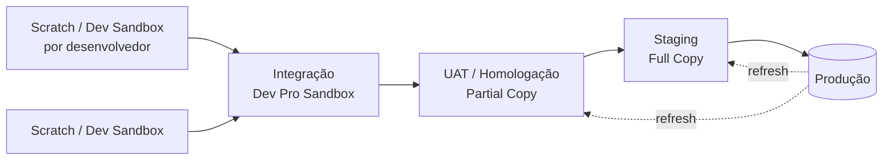

# 18 · DevOps e ciclo de vida da aplicação

`Nível: avançado` · `Atualizado: 11/08/2026` · `CLI 2.146.x`

DevOps em Salesforce é mais difícil que em stacks tradicionais, por três razões estruturais
que você precisa aceitar antes de desenhar qualquer pipeline:

1. **O "artefato" é metadado XML**, não um binário. Não há build reprodutível de verdade.
2. **O ambiente é mutável por interface.** Qualquer admin pode mudar produção às 15h.
3. **A plataforma se atualiza sozinha** três vezes por ano.

---

## 1. Os dois modelos de desenvolvimento

| | **Org Development** | **Package Development** |
|---|---|---|
| Fonte da verdade | a org (sandbox → produção) | o repositório Git |
| Ambiente de dev | sandbox | **scratch org** |
| Deploy | metadados soltos ou change set | pacote versionado (2GP) |
| Rastreamento de mudança | source tracking na sandbox | source tracking na scratch |
| Maturidade exigida | baixa | alta |
| Adequado a | orgs grandes e legadas | módulos novos, ISVs, greenfield |

**A realidade que ninguém admite em palestra:** a **maioria** das empresas está no modelo
Org Development, e vai continuar. Package Development é tecnicamente superior e exige uma
org modular, com dependências limpas — condição que orgs com 10 anos de história não têm.

> **Minha recomendação para uma org existente:** não tente converter tudo em pacotes.
> Adote Git + CLI + CI sobre o modelo org-based (isso já resolve 80% da dor) e use pacotes
> **unlocked** apenas para módulos **novos** e bem delimitados.

---

## 2. Ambientes



| Ambiente | Tipo | Dados | Atualização |
|---|---|---|---|
| Dev | Scratch ou Developer Sandbox | semeados | scratch: descartável; sandbox: 1×/dia |
| Integração | Developer Pro Sandbox | 1 GB | 1×/dia |
| UAT | Partial Copy Sandbox | amostra | 1× a cada 5 dias |
| Staging | **Full Copy Sandbox** | cópia completa | **1× a cada 29 dias** |
| Produção | — | reais | — |

**O gargalo real:** a Full Copy é o único ambiente que se parece com produção — e ela só
pode ser atualizada a cada 29 dias, num processo que em orgs grandes leva **dias**.
Isso condiciona o calendário de release da empresa inteira. Sandboxes Full Copy também são
caras: o número incluído depende da edição e add-ons.

---

## 3. Scratch orgs

```bash
sf org create scratch -f config/project-scratch-def.json -a dev1 -d 7 -y 7 --set-default
sf project deploy start -d force-app
sf apex run --file scripts/apex/seed.apex
sf org open
# ... trabalha ...
sf project retrieve start          # traz o que você mudou pela interface
sf org delete scratch -o dev1 -p
```

`config/project-scratch-def.json`:
```json
{
  "orgName": "Dev — módulo manutenção",
  "edition": "Developer",
  "language": "pt_BR",
  "features": ["EnableSetPasswordInApi", "PersonAccounts"],
  "settings": {
    "lightningExperienceSettings": { "enableS1DesktopEnabled": true },
    "securitySettings": { "passwordPolicies": { "enableSetPasswordInApi": true } }
  }
}
```

**Cotas** (dependem da edição do Dev Hub): numa Developer Edition, **3 scratch orgs ativas**
e **6 criações por dia**. Duração de 1 a 30 dias, padrão 7.

**A vantagem real:** a scratch org é criada **a partir do repositório**. Se ela funciona, o
repositório está completo. Isso transforma "funciona na minha sandbox" numa afirmação
verificável — que é exatamente o que falta no modelo org-based.

**A desvantagem real:** ela não tem os dados nem as customizações acumuladas da produção.
Código que depende de um record type que existe só em produção passa na scratch e quebra no
deploy. Por isso *scratch org* não elimina a necessidade de UAT.

---

## 4. Pacotes de segunda geração (2GP)

```bash
sf package create -n ModuloManutencao -t Unlocked -r force-app -o devhub
sf package version create -p ModuloManutencao -x manifest/package.xml \
   -k senhaDeInstalacao -w 60 -o devhub
sf package version promote -p ModuloManutencao@1.0.0-1 -o devhub
sf package install -p 04txx... -w 20 -o producao
```

| Tipo | Código visível | Cliente edita | Upgrade | Uso |
|---|---|---|---|---|
| **Unlocked** | sim | **sim** | sim | modularizar a própria org |
| **Managed** | não | não | sim | vender no AppExchange |
| Unmanaged (legado) | sim | sim | **não** | evitar |

**O valor de um pacote unlocked:** ele cria uma **fronteira**. Metadados dentro do pacote são
versionados juntos, e a instalação é atômica. Você deixa de fazer deploy de 4.000 arquivos
para fazer deploy de `ModuloVendas@2.3.0`.

**O custo:** dependências precisam ser explícitas e acíclicas. Numa org onde tudo referencia
tudo, decompor em pacotes é um projeto de meses. Não comece por aí.

---

## 5. Git para Salesforce

```text
main            ← espelha PRODUÇÃO. Protegido. Só recebe merge de release.
├── release/2026-09
│   ├── feature/OS-123-painel-ordens
│   └── feature/OS-124-sla-critico
└── hotfix/OS-130-correcao-urgente   ← sai de main, volta para main E release
```

**Regras que evitam a dor específica desta plataforma:**

1. **`.forceignore` com `**/profiles/**`.** Perfis são inversionáveis na prática.
2. **`core.autocrlf input`** em times com Windows — senão todo XML aparece modificado.
3. **Um `package.xml` por release**, ou use deploy por diferença (`sf-git-delta`).
4. **Nunca commite `.sf/` nem `.sfdx/`** — contêm tokens de acesso.
5. **Commits pequenos, com o número do ticket.** Rastrear "quem mudou este campo e por quê"
   é o principal ganho de ter Git aqui.

**Plugin comunitário essencial: `sfdx-git-delta`.** Gera um `package.xml` apenas com o que
mudou entre dois commits — transformando um deploy de 40 minutos num de 2.

```bash
sf plugins install sfdx-git-delta
sf sgd source delta --from "origin/main" --to "HEAD" --output-dir delta/
sf project deploy start -x delta/package/package.xml \
   --post-destructive-changes delta/destructiveChanges/destructiveChanges.xml
```

---

## 6. CI/CD

### 6.1 Pipeline mínimo viável

```yaml
# .github/workflows/ci.yml
name: CI

on:
  pull_request:
    branches: [main, 'release/**']

jobs:
  validar:
    runs-on: ubuntu-latest
    steps:
      - uses: actions/checkout@v4
        with:
          fetch-depth: 0          # sfdx-git-delta precisa do histórico completo

      - uses: actions/setup-node@v4
        with:
          node-version: '22'

      - name: Instalar a CLI (versão fixada — reprodutibilidade)
        run: npm install -g @salesforce/cli@2.146.3

      - name: Autenticar por JWT
        env:
          JWT_KEY: ${{ secrets.SF_JWT_KEY }}
          CLIENT_ID: ${{ secrets.SF_CLIENT_ID }}
          USERNAME: ${{ secrets.SF_USERNAME }}
        run: |
          echo "$JWT_KEY" > server.key
          sf org login jwt --client-id "$CLIENT_ID" --jwt-key-file server.key \
            --username "$USERNAME" --alias ci --set-default

      - name: Lint dos LWC
        run: npm ci && npm run lint

      - name: Testes unitários de LWC (Jest — rodam sem org, em segundos)
        run: npm run test:unit

      - name: Análise estática
        run: |
          sf plugins install code-analyzer
          sf code-analyzer run --workspace force-app --view detail --severity-threshold 3

      - name: Gerar delta
        run: |
          sf plugins install sfdx-git-delta
          sf sgd source delta --from "origin/${{ github.base_ref }}" --to HEAD --output-dir delta/

      - name: Validar o deploy (não grava nada)
        run: |
          sf project deploy validate -x delta/package/package.xml \
            -l RunLocalTests -w 90 --coverage-formatters json --results-dir coverage/

      - name: Publicar resultado dos testes
        if: always()
        uses: actions/upload-artifact@v4
        with:
          name: cobertura
          path: coverage/
```

### 6.2 Deploy de produção com quick deploy

```bash
# Durante o dia: valida (40–90 min numa org grande) e guarda o jobId
sf project deploy validate -x manifest/package.xml -l RunLocalTests -w 120 --json \
  | jq -r '.result.id' > .deploy-id

# Na janela de release: executa em segundos
sf project deploy quick -i "$(cat .deploy-id)" -w 30
```

**A validação vale por 10 dias.** Esse par de comandos é a diferença entre uma janela de
release de duas horas e uma de cinco minutos. É a prática de maior impacto operacional
deste arquivo.

---

## 7. O ciclo de release da plataforma

Três releases por ano — Spring, Summer, Winter — que você **não pode recusar**.

**O que você controla:**

| Controle | Como |
|---|---|
| Janela de atualização (dentro de uma faixa) | Trust/Status: cada instância tem data e janela publicadas |
| Testar antes | sandboxes recebem o preview **semanas antes**; algumas instâncias de sandbox são "preview" |
| **Critical Updates / Release Updates** | mudanças de comportamento que você pode ativar/testar antes da data de imposição |
| Versão de API do seu código | independente da versão da org |

**O que você não controla:** a data limite. Um *Release Update* imposto entra, com ou sem
você pronto.

**Rotina que recomendo, a cada release:**

1. Ler as *Release Notes* filtrando por *Release Updates* — são as que quebram.
2. Verificar `Setup → Release Updates`: a plataforma lista o que será imposto e quando.
3. Atualizar uma sandbox de preview e rodar a suíte de testes completa.
4. Testar manualmente os fluxos críticos de negócio (a suíte não cobre a UI).
5. Registrar as pendências com prazo, e tratá-las **antes** da data de imposição.

> **Anote para 2027–2028:** as versões de API **31.0 a 40.0** foram anunciadas para
> deprecação em **Summer '27** e retirada em **Summer '28**. Integrações antigas que ainda
> chamam essas versões vão **falhar**. Levante isso agora — encontrar todos os consumidores
> de uma API antiga leva meses numa empresa grande.

---

## 8. Ferramentas de DevOps do mercado

| Ferramenta | Modelo | Nota |
|---|---|---|
| **Salesforce CLI + Git + CI próprio** | grátis | mais controle, mais trabalho. É o que eu recomendo começar |
| **DevOps Center** | incluído | oficial, gratuito, orientado a admins. Simples demais para times grandes |
| Gearset | SaaS pago | o mais usado; comparação de metadados excelente |
| Copado | SaaS pago | nativo, forte em governança e compliance |
| Flosum | SaaS pago | nativo |
| AutoRABIT | SaaS pago | forte em regulados |
| Change Sets | incluído | ⛔ manual, sem versionamento, sem rollback. Último recurso |

> **Opinião profissional:** não compre ferramenta de DevOps antes de ter Git e CI
> funcionando com a CLI. Ferramenta paga sobre um processo inexistente automatiza o caos.
> Depois de 6 meses com CLI+Git, você saberá exatamente o que quer comprar — e talvez
> descubra que não precisa.

---

## 9. Migração e rollback

**A verdade desconfortável: não existe rollback de verdade no Salesforce.**

| Situação | O que dá para fazer |
|---|---|
| Código novo quebrado | fazer deploy da versão anterior (é um novo deploy, não um rollback) |
| Campo criado por engano | apagar (destructive changes) — **os dados vão junto** |
| Campo apagado por engano | recriar; **os dados estão perdidos** (15 dias na lixeira, para registros) |
| Dados corrompidos por um job | restaurar de backup — se você tiver um |
| Release da plataforma | **impossível reverter** |

**Consequências práticas, que definem a disciplina do time:**

1. **Backup não é opcional.** A Salesforce não garante restauração ponto a ponto no seu
   plano padrão; existe um serviço pago (Backup & Restore) e há ferramentas de terceiros
   (OwnBackup/Own, Odaseva, Gearset). Um export semanal via Bulk API é o **mínimo**
   defensável, e é gratuito.
2. **Deploy destrutivo exige revisão humana.** Nunca automatize `destructiveChanges` sem
   aprovação explícita.
3. **Feature flags** (Custom Metadata + checagem no código) permitem desligar
   comportamento sem deploy. É a coisa mais próxima de rollback que existe aqui.
4. **Toda migração de dados grande precisa de um plano de reversão escrito antes** —
   normalmente, guardar o estado anterior num objeto ou num CSV exportado.

---

## 10. Os cinco porquês: por que DevOps em Salesforce é mais difícil?

**1. Por que é mais difícil que numa stack tradicional?**
Porque o ambiente é **mutável fora do pipeline**: qualquer admin muda produção pela interface.

**2. Por que a plataforma permite isso, se atrapalha o DevOps?**
Porque a promessa central do produto, desde 1999, é **velocidade de mudança sem TI**.
Exigir pipeline para criar um campo destruiria o valor que faz as empresas comprarem.

**3. Por que não existe um "artefato" imutável como um `.jar` ou uma imagem de container?**
Porque o "código" é **metadado interpretado pela plataforma**, e a plataforma muda três vezes
por ano. Um artefato congelado não faria sentido: o mesmo XML se comporta diferente em
releases diferentes. Pacotes 2GP são a aproximação mais próxima disso.

**4. Por que não dá para reverter um deploy?**
Porque um deploy pode alterar **estrutura de dados**, e mudança de estrutura não é reversível
sem perda: apagar um campo apaga os valores. O "rollback" só seria possível com um snapshot
completo da org, que a plataforma não oferece por razões de custo e escala.

**5. E o que se faz, então?**
Investe-se em **prevenção** no lugar de reversão: validação antes do deploy, ambiente
espelhado, testes automatizados, feature flags e backup. O modelo mental correto não é
"tenho um botão de desfazer", é **"não posso errar, então valido antes"**. Quem transporta
o modelo mental de deploy de contêiner para cá se machuca.

*(Parada legítima: trade-off explícito entre agilidade e controle, decidido em 1999.)*

---

## Autoteste

1. Qual a diferença entre Org Development e Package Development? Qual você adotaria numa org de 10 anos?
2. Por que a Full Copy Sandbox é o gargalo do calendário de release?
3. Qual a vantagem estrutural da scratch org, e qual a limitação que ela **não** resolve?
4. O que faz o `sfdx-git-delta` e por que ele importa numa org grande?
5. Explique a estratégia `deploy validate` + `deploy quick`. Por quanto tempo a validação vale?
6. Por que não se deve versionar `Profile` no Git?
7. O que são Release Updates, e qual rotina você adotaria a cada release da plataforma?
8. Por que não existe rollback de verdade no Salesforce? Cite as três defesas práticas.
9. Qual é o prazo anunciado para a retirada das versões de API 31.0–40.0?
