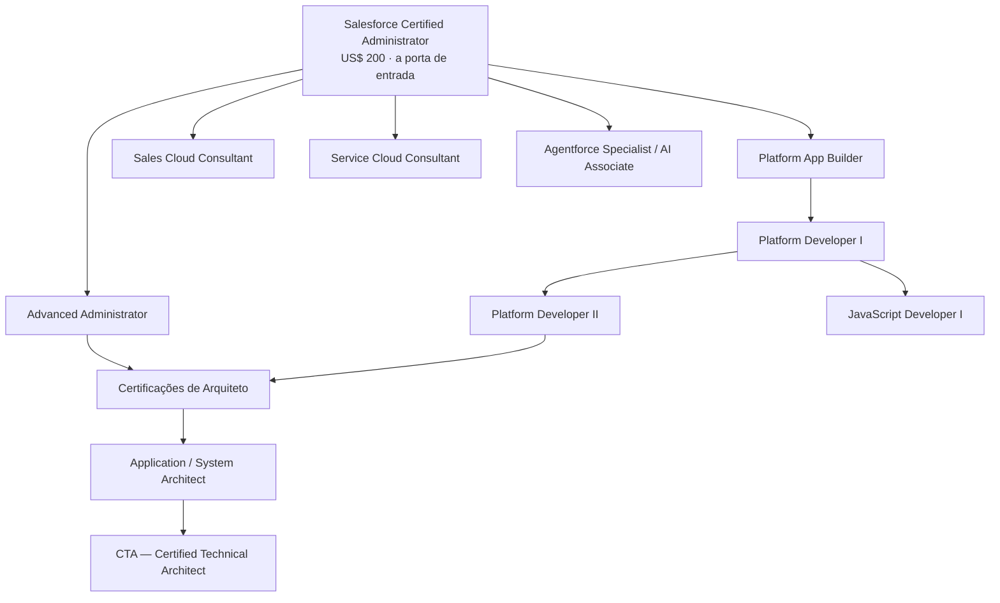

# 85 · Cursos gratuitos e certificações

`Nível: todos` · **`Pesquisado na web em 11/08/2026`**

> ⚠️ Links de curso expiram, canais param de publicar e preços de exame mudam.
> Tudo aqui foi verificado em **11/08/2026**. Se um link estiver morto, procure o título.

---

## 1. O ponto de partida obrigatório: Trailhead

**https://trailhead.salesforce.com** · **gratuito, sem limite, para sempre**

É a plataforma oficial de ensino da Salesforce. Não é material de apoio — é **o** currículo
oficial, e a prova de certificação é escrita sobre ele.

| Estrutura | O que é |
|---|---|
| **Module** | uma unidade de ~30–60 min, com teste e um desafio prático numa org |
| **Trail** | sequência de módulos formando uma trilha |
| **Superbadge** | projeto prático longo, avaliado automaticamente numa org real |
| **Trailmix** | playlist customizável |
| **Playground** | org descartável embutida nos exercícios |
| **Ranks** | Scout → Hiker → Explorer → Adventurer → Mountaineer → Expert → Ranger → Double Star Ranger… |

**Trilhas essenciais (nomes de busca no Trailhead):**

| Trilha | Para |
|---|---|
| *Admin Beginner* / **Administrador Iniciante** (existe em pt-BR) | primeiro contato |
| *Admin Intermediate* | segundo passo |
| *Prepare for Your Salesforce Administrator Credential* | preparação direta para a prova |
| *Develop for Salesforce* / *Apex Basics & Database* | primeiro código |
| *Build Lightning Web Components* | front-end |
| *Prepare for Your Platform Developer I Credential* | preparação para a prova de dev |
| *Salesforce Flow* | automação |
| *Get Started with Agentforce* | IA e agentes |

> **Superbadges são o que realmente importa no currículo.** Um badge comum se faz em 40
> minutos com o tutorial aberto. Um superbadge exige resolver um problema de negócio numa
> org, sem passo a passo, e é validado automaticamente. Recrutadores que conhecem a
> plataforma sabem a diferença. Faça pelo menos: *Business Administration Specialist*,
> *Security Specialist* e *Apex Specialist*.

**Idiomas:** boa parte do conteúdo do Trailhead está traduzida para **português do Brasil**
(há um seletor de idioma no rodapé). Módulos mais novos costumam sair primeiro em inglês.

---

## 2. Cursos gratuitos em **português**

### 2.1 Oficiais

| Recurso | Onde | Formato | Nota |
|---|---|---|---|
| **Trailhead em pt-BR** | https://trailhead.salesforce.com | texto + prática | **a melhor opção**. Selecione o idioma no rodapé |
| **Salesforce Brasil (YouTube)** | https://www.youtube.com/c/SalesforceBrasil | vídeo | canal oficial: webinars, casos de cliente, anúncios. **Não é curso estruturado** — é institucional. Útil para contexto de mercado, não para aprender a plataforma |
| **Trailblazer Community Brasil** | https://trailhead.salesforce.com/trailblazercommunity | fórum + grupos | grupos regionais e por tema, em português |
| **Documentação Salesforce em pt-BR** | https://help.salesforce.com | texto | parcialmente traduzida |

### 2.2 Comunidade brasileira no YouTube

O ecossistema em português cresceu muito, mas é **fragmentado**: quase não há um curso
completo, estruturado e gratuito em pt-BR comparável aos de inglês. O que existe são canais
com séries e vídeos avulsos, de qualidade variável.

| Tipo de conteúdo | Como encontrar | Ressalva |
|---|---|---|
| Séries "Salesforce para iniciantes" | busque no YouTube por *"Salesforce para iniciantes"*, *"Salesforce do zero"*, *"Conhecendo Salesforce"* | verifique a **data do vídeo** — material anterior a 2023 pode mostrar telas que não existem mais |
| Séries de Apex e LWC | busque por *"curso Apex Salesforce português"*, *"LWC português"* | confira se usam `sf` (atual) ou `sfdx` (antigo) — é o melhor indicador de atualidade |
| Preparação para certificação | busque por *"simulado administrador Salesforce português"* | cuidado com "dumps" — ver §5.4 |

> **Recomendação honesta e específica:** não existe hoje, em português, um curso gratuito
> em vídeo tão completo quanto o Trailhead. **Use o Trailhead em pt-BR como espinha dorsal**
> e o YouTube em português como apoio para os pontos que não fecharem. Investir tempo
> procurando "o curso perfeito em português" é tempo que você não está estudando.
>
> Se o inglês for uma barreira real, a sequência que funciona é: Trailhead em pt-BR →
> vídeos em pt-BR para desatar nós → tradutor de página para a documentação técnica.

### 2.3 Pagos que valem a menção (não gratuitos)

Existem cursos brasileiros bons e baratos na **Udemy** — tipicamente entre R$ 30 e R$ 100
em promoção. Buscas úteis: *"Salesforce: Do Zero ao Apex"*, *"Vire um Dev Salesforce"*,
*"Salesforce LWC"*. Não recomendo um específico porque a qualidade varia com a atualização,
e a Udemy muda o catálogo o tempo todo. **Critério de escolha:** veja a data da última
atualização do curso e se ele usa `sf` (CLI atual) ou `sfdx` (obsoleto).

---

## 3. Cursos gratuitos em **inglês**

Onde está a maior parte do conteúdo bom e gratuito.

| Recurso | Onde | Formato | Por que vale |
|---|---|---|---|
| **Trailhead** | https://trailhead.salesforce.com | texto + prática | o currículo oficial, completo |
| **Salesforce Developers (YouTube)** | https://www.youtube.com/@SalesforceDevs | vídeo | canal oficial de desenvolvedores: releases, LWC, Apex, arquitetura. **É onde a informação nova aparece primeiro** |
| **Apex Hours** | https://www.apexhours.com | vídeo + texto | comunidade indiana, sessões técnicas semanais gratuitas, cobertura muito boa de tópicos avançados. Uma das melhores fontes gratuitas do ecossistema |
| **Salesforce Ben** | https://www.salesforceben.com | texto | o blog de referência do ecossistema: carreira, certificações, análise de release, guias |
| **Trailhead Live** | https://trailhead.salesforce.com/live | vídeo ao vivo e gravado | sessões oficiais, incluindo preparação para certificação |
| **Salesforce Developer Docs** | https://developer.salesforce.com/docs | texto | referência definitiva. Não é curso, é a fonte |
| **Pluralsight — trilha Salesforce gratuita** | https://www.pluralsight.com/partners/salesforce | vídeo | a Salesforce mantém uma parceria com trilhas gratuitas; **confirme a disponibilidade atual**, pois o acordo já mudou de forma |
| **freeCodeCamp (YouTube)** | https://www.youtube.com/@freecodecamp | vídeo | publica cursos longos de Salesforce ocasionalmente; busque no canal |

**Como identificar conteúdo desatualizado em inglês** (mesmo critério do português):
- usa `sfdx force:source:push` em vez de `sf project deploy start` → anterior a 2023;
- fala de Process Builder ou Workflow como opção válida → anterior a 2022;
- mostra Salesforce Classic → anterior a 2019;
- ensina `WITH SECURITY_ENFORCED` sem mencionar `WITH USER_MODE` → anterior a 2026.

---

## 4. Cursos gratuitos em **francês**

O ecossistema francófono é menor, porém existe e tem material estruturado de qualidade.

| Recurso | Onde | Formato | Nota |
|---|---|---|---|
| **Trailhead en français** | https://trailhead.salesforce.com | texto + prática | boa parte do conteúdo traduzida; selecione *Français* |
| **Formation Salesforce Administrateur (ADX201) — CRM Dojo** | YouTube — busque *"Formation Salesforce Administrateur complète et gratuite ADX201"* | vídeo, playlist | curso completo e gratuito em francês, apresentado por Mohamed Lamrid (CRM Dojo). É a formação estruturada em francês mais citada |
| **Trailhead — trilha "Administrateur débutant"** | https://trailhead.salesforce.com/content/learn/trails/force_com_admin_beginner | texto + prática | a trilha de administrador iniciante em francês |
| **Salesforce France — tutoriel en ligne gratuit** | https://www.salesforce.com/fr/small-business/salesforce-tutorial/ | texto | material introdutório oficial |
| **Coursera (fr-FR)** | https://www.coursera.org/fr-FR | vídeo | cursos de Salesforce com interface e legendas em francês; **gratuito para assistir, pago para certificar** |

---

## 5. Certificações

### 5.1 Como funcionam

- Prova de múltipla escolha, com proctoring (presencial ou online supervisionado).
- Inscrição pelo **Trailhead Academy** (https://trailhead.salesforce.com/credentials),
  com uma conta gratuita.
- **Não expiram**, mas exigem **manutenção anual gratuita** — um módulo curto no Trailhead
  a cada release relevante. **Se você não fizer, a credencial é suspensa.**
- Muitas são oferecidas em **português do Brasil**, incluindo a de Administrador.

### 5.2 Preços (consultados em 11/08/2026)

| Item | Valor |
|---|---|
| **Administrator** (e a maioria das certificações de nível associado/profissional) | **US$ 200** + impostos locais |
| **Retake** (segunda tentativa em diante) | **US$ 100** + impostos |
| Certificações de nível arquiteto (CTA e afins) | até **US$ 6.000** |
| **Manutenção anual** | **gratuita** (módulo no Trailhead) |
| Faixa geral do catálogo (45+ certificações) | US$ 75 a US$ 6.000 |

> **Vouchers de desconto existem.** Eles aparecem em eventos (Dreamforce, World Tour,
> Dreamin' regionais), em campanhas de comunidade, e por meio do empregador (parceiros
> Salesforce têm cota de vouchers). Antes de pagar cheio, pergunte na comunidade regional
> e no seu empregador — 100% de desconto em campanhas promocionais não é raro.

### 5.3 O mapa das certificações e por onde começar

| Certificação | Nível | Para quem | Comentário franco |
|---|---|---|---|
| **Associate** (Salesforce Associate, AI Associate) | entrada | quem está começando do zero | fácil, barata, valor de mercado **baixo**. Serve como marco pessoal, não como credencial |
| **Administrator** | fundamental | **todo mundo** | **comece por aqui**, mesmo se você for desenvolvedor. É a certificação com maior demanda real |
| **Advanced Administrator** | intermediário | admins com experiência | boa; exige a Administrator |
| **Platform App Builder** | intermediário | quem constrói sem código | ponte natural entre admin e dev |
| **Platform Developer I** | intermediário | desenvolvedores | **a segunda mais valiosa**; Apex, SOQL, LWC |
| **Platform Developer II** | avançado | devs experientes | inclui componentes práticos; difícil |
| **JavaScript Developer I** | intermediário | quem faz LWC | valida JS puro, não só Salesforce |
| **Consultant** (Sales/Service/Experience/Field Service) | intermediário | consultores | valorizada em consultorias |
| **Agentforce Specialist** | intermediário | quem vai trabalhar com IA na plataforma | **a mais quente do momento**; a área muda rápido, então o conteúdo envelhece rápido também |
| **Architect** (Data, Sharing & Visibility, Integration, Identity…) | avançado | arquitetos | caras, difíceis, respeitadas |
| **CTA** | topo | poucos no mundo | prova de board de 4 horas defendendo uma arquitetura. Anos de preparação |

### 5.4 Preparação — o que funciona e o que não funciona

**Funciona:**
1. **Trailhead**, a trilha *"Prepare for Your ... Credential"* — é o currículo oficial.
2. **Prática numa org**. A prova pergunta sobre comportamento da plataforma, e quem só leu
   erra em pergunta de detalhe.
3. **Guia oficial do exame** (*Exam Guide*, PDF por certificação) — traz os **pesos por
   seção**. Estude proporcionalmente ao peso, não uniformemente.
4. **Simulados legítimos**: Focus on Force (pago, e é o mais recomendado pela comunidade),
   os quizzes do próprio Trailhead, e os simulados gratuitos de comunidades.
5. **Grupos de estudo** da Trailblazer Community.

**Não funciona (e é arriscado):**
- **"Dumps"** — bancos de questões reais vazadas. Além de serem frequentemente
  **desatualizados** (a Salesforce revisa as provas a cada release), o uso viola o
  **Code of Conduct** do programa de certificação. A penalidade é a **revogação de todas as
  suas credenciais** e banimento do programa. Não vale o risco, e a comunidade não tolera.
- Decorar respostas sem entender: a prova tem muita questão de cenário ("dado este
  requisito, qual solução?"), onde decorar não ajuda.

### 5.5 A certificação vale a pena?

**Fato:** vagas de Salesforce frequentemente listam certificação como requisito ou
diferencial, e parceiros Salesforce precisam de profissionais certificados para manter seu
nível de parceria — o que cria demanda estrutural.

**Minha opinião profissional, sem rodeio:**

- **Administrator: sim, sem dúvida.** É o filtro mais comum de currículo no ecossistema.
  É a melhor relação custo-benefício de qualquer certificação de TI que eu conheça.
- **Platform Developer I: sim**, se você vai programar.
- **Associate: opcional.** Faça se precisar de um marco motivacional; não espere efeito no
  currículo.
- **Consultant e Architect: quando fizerem sentido para a sua vaga**, não antes.
- **Certificação sem projeto real não emprega.** Ela abre a porta da entrevista; o que
  fecha a contratação é você conseguir falar sobre uma org que você construiu ou consertou.
  Faça o projeto final do [70-pratica.md](70-pratica.md), coloque no GitHub, e leve o link.

### 5.6 Manutenção

Todo ano, a Salesforce publica módulos de manutenção no Trailhead. São **gratuitos** e
curtos (30–60 min por credencial). Se você não fizer até o prazo, a credencial fica
**suspensa** — e volta quando você completar.

Configure um lembrete de calendário. É a forma mais boba de perder uma certificação que
custou US$ 200 e semanas de estudo.

---

## 6. Comunidade — onde tirar dúvida

| Onde | O quê |
|---|---|
| **Salesforce Stack Exchange** | https://salesforce.stackexchange.com — **a melhor fonte de respostas técnicas** do ecossistema |
| **Trailblazer Community** | https://trailhead.salesforce.com/trailblazercommunity — grupos oficiais, inclusive em português |
| **Dreamin' events** | eventos regionais organizados pela comunidade; há edições no Brasil |
| **Reddit r/salesforce** | discussão franca sobre carreira, salário e frustrações |
| **LinkedIn** | onde o ecossistema brasileiro se organiza na prática |

---

## 7. Roteiro de estudo sugerido

### Trilha Administrador (3–4 meses, ~10 h/semana)

| Semanas | O quê |
|---|---|
| 1–2 | Trailhead *Admin Beginner* + criar a DE + [01](01-introducao-leigo.md) e [10](10-fundamentos.md) deste material |
| 3–4 | [12-modelo-de-dados.md](12-modelo-de-dados.md) + Lab 1 de [70-pratica.md](70-pratica.md) |
| 5–6 | [13-seguranca-e-compartilhamento.md](13-seguranca-e-compartilhamento.md) + Lab 2 |
| 7–8 | [14-automacao-declarativa.md](14-automacao-declarativa.md) + Lab 3 |
| 9–10 | Relatórios + Lab 4 + superbadges |
| 11–12 | Trailhead *Prepare for Your Administrator Credential* + simulados |
| 13–14 | Revisão pelos pesos do Exam Guide + prova |

### Trilha Desenvolvedor (6–8 meses, ~10 h/semana)

| Meses | O quê |
|---|---|
| 1–2 | Tudo da trilha Admin até a semana 8 (você precisa da base) |
| 3 | [15-apex.md](15-apex.md) + [03](03-instalacao.md)/[04](04-como-comecar.md) + Labs 5 e 6 |
| 4 | [16-lightning-web-components.md](16-lightning-web-components.md) + Lab 7 |
| 5 | [17-integracao-e-apis.md](17-integracao-e-apis.md) + Labs 8 e 9 |
| 6 | [07-projeto-modelo/](07-projeto-modelo/README.md) + projeto próprio + [18](18-devops-e-alm.md) |
| 7–8 | Superbadge *Apex Specialist* + preparação e prova PD I |

---

## Autoteste

1. Qual é a diferença entre um badge comum e um superbadge, e qual importa no currículo?
2. Quanto custa a certificação Administrator e o retake, em 11/08/2026?
3. Como se identifica que um curso em vídeo está desatualizado? Cite quatro sinais.
4. Por que usar "dumps" é um mau negócio, mesmo ignorando a questão ética?
5. Qual certificação você faria primeiro, mesmo sendo desenvolvedor? Por quê?
6. O que acontece se você não fizer a manutenção anual da certificação?
7. Qual é a melhor fonte de respostas técnicas do ecossistema?
8. O que, além da certificação, fecha uma contratação?

---

### Fontes consultadas (11/08/2026)

- Trailhead — https://trailhead.salesforce.com
- Trailhead — *Administrateur débutant* (trilha em francês) — https://trailhead.salesforce.com/content/learn/trails/force_com_admin_beginner
- Salesforce Ben — *Complete List of Salesforce Certifications 2026* — https://www.salesforceben.com/salesforce-certifications/
- Apex Hours — *Complete Salesforce Certifications List in 2026* — https://www.apexhours.com/salesforce-certifications/
- passitexams — *Salesforce Certification Cost 2026: Fees, Retakes & ROI Guide* — https://passitexams.com/articles/salesforce-certification-cost/
- s2-labs — *How Much Does Salesforce Certification Cost in 2026?* — https://s2-labs.com/blog/salesforce-certification-cost/
- Salesforce Brasil (YouTube) — https://www.youtube.com/c/SalesforceBrasil
- Salesforce France — *Tutoriel Salesforce : formation en ligne gratuite* — https://www.salesforce.com/fr/small-business/salesforce-tutorial/
- YouTube — *Formation Salesforce Administrateur complète et gratuite (ADX201)* — https://www.youtube.com/playlist?list=PLDYZIiNbvhXz6WWB9bDJTrMjKqnk9FTQp
- Salesforce Ben — *11 Free Salesforce Training Resources* — https://www.salesforceben.com/salesforce-training-free/
