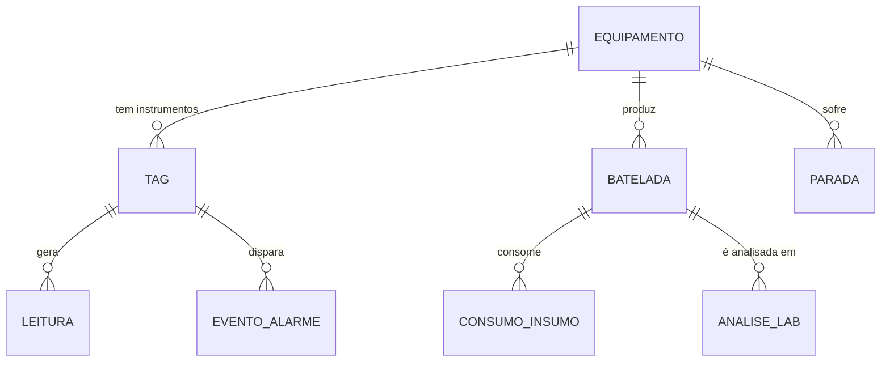

# 19 — Criar tabelas e modelar dados

Nível: intermediário · Data: 13/08/2026

Consultar é o que você faz todo dia. Modelar é o que você faz uma vez e paga
por dez anos. Um esquema ruim não se conserta com consulta boa.

---

## 1. `CREATE TABLE`

```sql
CREATE TABLE batelada (
    batelada_id    TEXT PRIMARY KEY,
    produto        TEXT NOT NULL,
    equipamento_id TEXT NOT NULL REFERENCES equipamento(equipamento_id),
    ts_inicio      TEXT NOT NULL,
    ts_fim         TEXT,
    carga_kg       REAL NOT NULL CHECK (carga_kg > 0),
    produzido_kg   REAL CHECK (produzido_kg IS NULL OR produzido_kg >= 0),
    status         TEXT NOT NULL
                        CHECK (status IN ('EM_ANDAMENTO','CONCLUIDA','ABORTADA')),
    operador       TEXT,
    CHECK (ts_fim IS NULL OR ts_fim > ts_inicio),
    CHECK ((status = 'EM_ANDAMENTO') = (ts_fim IS NULL))
) STRICT;
```

Cada restrição acima existe por um motivo. As duas últimas são as mais
interessantes: a primeira impede uma batelada que termina antes de começar; a
segunda amarra dois campos que sempre variam juntos — se está em andamento,
não tem fim; se tem fim, não está em andamento.

---

## 2. Restrições: a regra vive no banco

| Restrição | Garante |
|---|---|
| `PRIMARY KEY` | Único + não nulo |
| `UNIQUE` | Único (aceita `NULL`, às vezes vários) |
| `NOT NULL` | Obrigatório |
| `CHECK (expr)` | Regra de domínio |
| `REFERENCES` | Integridade referencial |
| `DEFAULT` | Valor quando omitido |
| `GENERATED ALWAYS AS (expr)` | Coluna calculada |

### Por que a regra tem de estar no banco, e não só no aplicativo

O aplicativo não é o único que escreve. Escrevem também: o script de carga, o
estagiário no DBeaver, a integração do ERP, o processo de migração, e você às
2 da manhã. **O banco é o único ponto por onde todos passam.**

Validação só no aplicativo é validação opcional. E validação opcional, em
dados que duram dez anos, é validação inexistente.

### `CHECK` que valem em planta

```sql
CHECK (temperatura_c > -273.15)                 -- física
CHECK (rendimento_pct BETWEEN 0 AND 100)        -- definição
CHECK (ts_fim IS NULL OR ts_fim > ts_inicio)    -- causalidade
CHECK (massa_kg >= 0)                           -- não existe massa negativa
CHECK (ph BETWEEN 0 AND 14)                     -- domínio da grandeza
CHECK (tag_id GLOB '[A-Z][A-Z]-[0-9][0-9][0-9]')  -- padrão ISA (SQLite)
```

⚠️ O `CHECK` do SQLite **não pode** referenciar outra tabela nem usar
subconsulta. Para regras entre tabelas, use gatilho (*trigger*) ou aceite que
a validação fica no aplicativo — e escreva isso no comentário do esquema.

### Chave estrangeira no SQLite

```sql
PRAGMA foreign_keys = ON;      -- POR CONEXÃO. Sem isso, REFERENCES é decoração.
```

Não há como ligar permanentemente no arquivo do banco. Toda aplicação que
conecta precisa emitir esse PRAGMA. É a pegadinha nº 1 do SQLite.

---

## 3. Normalização

**A regra informal, que resolve 95% dos casos:**

> Cada fato, em um lugar só. Se você precisa mudar a mesma informação em dois
> lugares, o modelo está errado.

### As formas normais, com exemplo de planta

**1FN — valores atômicos, sem lista dentro da célula**

```
❌  batelada_id | insumos
    B-001       | "resina 3000kg, solvente 1250kg"

✅  batelada_id | insumo    | massa_kg
    B-001       | resina    | 3000
    B-001       | solvente  | 1250
```

Com a versão errada, "qual o consumo total de solvente do mês?" exige análise
de texto. Com a certa, é `SUM`.

**2FN — nada depende de parte da chave composta**

```
❌  PK (batelada_id, insumo) e uma coluna `operador`
    → o operador depende só da batelada, não do insumo. Repete-se em 4 linhas.
✅  `operador` fica na tabela `batelada`.
```

**3FN — nada depende de coluna que não seja chave**

```
❌  leitura(tag_id, ts, valor, unidade, descricao_do_tag)
    → unidade e descrição dependem do tag, não da leitura.
       Repetidos 43.080 vezes por tag; mudar a descrição exige UPDATE em milhões de linhas.
✅  leitura(tag_id, ts, valor)  +  tag(tag_id, descricao, unidade)
```

**BCNF, 4FN, 5FN** existem e resolvem casos raros de dependência multivalorada.
Na prática industrial, 3FN resolve tudo que importa.

### Desnormalização deliberada

Normalizar é o padrão. Desnormalizar é uma **otimização consciente**, com custo
declarado.

| Caso | Ganho | Custo aceito |
|---|---|---|
| Gravar `batelada_id` direto na `leitura` | Elimina a junção temporal, que é cara | Espaço; e o valor precisa ser recalculado se a batelada for corrigida |
| Guardar `rendimento_pct` calculado | Não recalcula em todo relatório | Pode ficar inconsistente com `carga`/`produzido` |
| Tabela de resumo horário | Relatório 100× mais rápido | Duplicação; precisa de processo de consolidação |

**Regra:** desnormalize **depois** de medir, nunca antes. E documente
**por quê**, no comentário do esquema — senão daqui a dois anos alguém
"conserta" a duplicação e derruba o desempenho.

---

## 4. O esquema de uma planta, na prática



Três famílias de tabela, com naturezas muito diferentes:

| Família | Tabelas | Volume | Escrita | Muda? |
|---|---|---|---|---|
| **Cadastro** (dados mestres) | `equipamento`, `tag`, `produto`, `receita` | dezenas a milhares | rara | sim, e precisa de histórico |
| **Transação** (eventos) | `batelada`, `parada`, `analise_lab`, `evento_alarme` | milhares a milhões | contínua | quase nunca depois de fechada |
| **Série temporal** | `leitura` | centenas de milhões | constante | nunca |

Cada família pede projeto diferente: cadastro quer integridade e histórico;
transação quer chave natural e imutabilidade; série temporal quer chave
composta, compressão e retenção.

### Cadastro que muda: o problema das dimensões lentas

O limite de alarme do TI-101 mudou de 195 para 190 em março. Um relatório de
excursões de janeiro deve usar **195**, não 190.

Guardar só o valor atual perde a história. As três soluções clássicas
(*slowly changing dimensions*, do vocabulário de data warehouse):

| Tipo | O que faz | Quando |
|---|---|---|
| **SCD 1** | Sobrescreve; perde a história | Correção de erro de digitação |
| **SCD 2** | Nova linha com `valido_de`/`valido_ate` | **O certo para limites, receitas e especificações** |
| **SCD 3** | Guarda "valor anterior" numa coluna | Quando só a última mudança interessa |

```sql
CREATE TABLE tag_limite (
    tag_id     TEXT NOT NULL REFERENCES tag(tag_id),
    valido_de  TEXT NOT NULL,
    valido_ate TEXT,                       -- NULL = vigente
    lim_sup_alarme REAL,
    PRIMARY KEY (tag_id, valido_de)
) STRICT;

-- consulta usando o limite VIGENTE NA DATA DA LEITURA
SELECT l.ts, l.valor, lim.lim_sup_alarme
  FROM leitura l
  JOIN tag_limite lim
    ON lim.tag_id = l.tag_id
   AND l.ts >= lim.valido_de
   AND l.ts <  COALESCE(lim.valido_ate, '9999-12-31');
```

Isto é o que o SQL:2011 padronizou como **tabelas temporais**
(`FOR SYSTEM_TIME AS OF`), implementado em SQL Server, Oracle, DB2 e MariaDB —
mas não em PostgreSQL nem SQLite, onde se faz à mão como acima.

**Onde isso morde de verdade:** especificação de produto. Um lote fabricado em
2024 tem de ser julgado pela especificação vigente em 2024. Se você guarda só
a spec atual, o relatório de conformidade histórico está errado — e é
exatamente isso que o auditor vai pedir.

---

## 5. `ALTER TABLE` e migração

```sql
ALTER TABLE tag ADD COLUMN fabricante TEXT;
ALTER TABLE tag RENAME COLUMN descr TO descricao;      -- SQLite ≥ 3.25
ALTER TABLE tag DROP COLUMN obsoleta;                  -- SQLite ≥ 3.35
```

**O que o SQLite não faz:** mudar tipo de coluna, adicionar restrição,
adicionar `NOT NULL` a coluna existente. O padrão nesses casos:

```sql
BEGIN;
PRAGMA foreign_keys = OFF;                       -- durante a troca

CREATE TABLE tag_nova ( ... esquema novo ... ) STRICT;
INSERT INTO tag_nova SELECT ... FROM tag;
DROP TABLE tag;
ALTER TABLE tag_nova RENAME TO tag;
-- recrie índices, views e gatilhos que apontavam para a antiga

PRAGMA foreign_key_check;                        -- confira ANTES de confirmar
COMMIT;
PRAGMA foreign_keys = ON;
```

### Migrações versionadas

Toda mudança de esquema deve ser um **arquivo numerado, no git**:

```
sql/
  001-esquema-inicial.sql
  002-adiciona-fabricante.sql
  003-cria-tabela-limite.sql
```

E uma tabela que registra o que já foi aplicado:

```sql
CREATE TABLE schema_migration (
    versao   INTEGER PRIMARY KEY,
    aplicado TEXT NOT NULL DEFAULT (datetime('now'))
);
```

Ferramentas que fazem isso por você: **Flyway**, **Liquibase**, **Alembic**
(Python), **dbmate**, **golang-migrate**. Todas gratuitas em versão básica.

**Regra que evita a noite ruim:** toda migração precisa de um script de
**volta** escrito e testado, e um backup tomado antes. `ALTER TABLE ... DROP
COLUMN` não tem desfazer.

---

## 6. Convenções de nomenclatura

Não há regra certa. Há **consistência**, e ela vale mais que a escolha.

| Item | Sugestão | Por quê |
|---|---|---|
| Tabela | `minusculo_com_underscore`, **singular** | `leitura`, não `Leituras`. Singular porque a linha é uma leitura |
| Coluna | `minusculo_com_underscore` | Maiúscula obriga aspas em PostgreSQL |
| Chave primária | `<tabela>_id` | `tag_id`, e a FK tem o mesmo nome → `USING (tag_id)` funciona |
| Índice | `ix_<tabela>_<colunas>` | `ix_leitura_ts` |
| Índice único | `ux_...` | |
| View | `v_...` | Distingue de tabela na hora de ler |
| Booleano | `esta_...`, `tem_...` | `esta_ativo`, não `flag` |
| Timestamp | `ts_...` ou `..._em` | `ts_inicio`, `criado_em` |

⚠️ **Não use acento nem espaço em nome de coluna.** Funciona, exige aspas
sempre, e quebra em algum driver, em algum cliente, em algum export. Coloque o
nome bonito no `AS` da consulta ou na camada de relatório.

⚠️ **Evite palavras reservadas** como nome: `order`, `group`, `table`, `user`,
`value`, `key`, `end`. `PRAGMA` no SQLite, `user` no PostgreSQL.

---

## 7. Erros de modelagem que custam caro

| Erro | Sintoma daqui a um ano | Correção |
|---|---|---|
| Chave primária ausente | Duplicatas silenciosas; nada identifica a linha | Sempre declare, mesmo que artificial |
| Guardar número como texto | Ordenação errada, junção que não casa, `SUM` que falha | `STRICT` + tipo certo |
| Guardar data como `DD/MM/YYYY` | Ordenação alfabética errada; conversão em toda consulta | ISO-8601 |
| Coluna `observacao` que virou dado | Alguém escreveu "LOTE REJEITADO" em texto livre e agora é regra de negócio | Coluna própria, com domínio |
| Uma tabela por ano (`leitura_2024`, `leitura_2025`) | Toda consulta vira `UNION` de N tabelas | Uma tabela; partição, se o banco tiver |
| Sem coluna de auditoria | "Quem mudou isso e quando?" — sem resposta | `criado_em`, `criado_por`, `origem` |
| `SELECT *` no aplicativo | Quebra ao adicionar coluna | Liste as colunas |
| Sem fuso no timestamp | Uma hora perdida ou duplicada por ano | UTC |
| Unidade implícita | "kg ou lb?" — e alguém somou os dois | Unidade no cadastro do tag, ou no nome da coluna (`massa_kg`) |

A última é a que separa engenheiro de programador: **coluna de grandeza física
sem unidade documentada é bomba-relógio**. A Mars Climate Orbiter (1999) foi
perdida por causa disso — libra-força-segundo contra newton-segundo, US$ 125
milhões. Coloque a unidade no nome da coluna ou no cadastro, e uma `CHECK`
sobre a faixa plausível.

---

## Autoteste

1. Por que a regra de negócio deve estar no banco, e não só no aplicativo?
2. Escreva três `CHECK` úteis para uma tabela de leituras de processo.
3. O que é preciso fazer no SQLite para que `REFERENCES` funcione de verdade?
4. Explique 1FN, 2FN e 3FN com um exemplo de planta cada.
5. Quando desnormalizar, e o que precisa ser feito junto?
6. O limite de alarme mudou em março. Como fazer o relatório de janeiro usar o
   limite antigo?
7. Como se muda o tipo de uma coluna no SQLite?
8. Por que uma tabela por ano é má ideia?
9. Cite três erros de modelagem e o sintoma que cada um produz um ano depois.
10. Por que unidade de medida é um problema de modelagem, e não de documentação?

---

*Próximo: [20-dml-e-transacoes.md](20-dml-e-transacoes.md).*
