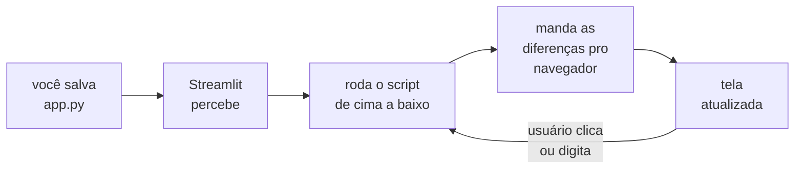

# 01 · O que é Streamlit — explicado para quem nunca programou uma tela

> **Nível:** iniciante · **Escrito em:** 02/09/2026 · Zero jargão. Todo termo em
> inglês vem traduzido na primeira aparição.

---

## A analogia: a planilha que virou site

Você já usou uma planilha. Você digita numa célula, e o gráfico ao lado muda
sozinho. Ninguém precisou "apertar atualizar", ninguém precisou saber o que é
HTML. Você mexeu num número, a planilha **recalculou tudo**, e a tela ficou certa.

O Streamlit é isso, com uma diferença: em vez de digitar em células, você
**escreve um roteiro em Python**, e ele vira uma página de internet que qualquer
pessoa abre no navegador.

O roteiro é literalmente linear, como uma receita de bolo:

```python
import streamlit as st

st.title("Minha primeira tela")
nome = st.text_input("Qual é o seu nome?")
st.write("Olá,", nome)
```

Três linhas. Isso já é um site: tem título, tem campo de digitação, e responde.

E o mecanismo é o mesmo da planilha: **quando o usuário mexe em qualquer coisa,
o Streamlit executa o roteiro inteiro de novo, de cima a baixo.** Guarde essa
frase. Ela explica 90% de tudo que o Streamlit faz — inclusive as coisas
estranhas. Voltaremos a ela sem parar.

---

## Para que serve

Streamlit serve para transformar **código Python que já existe** em algo que
outra pessoa consegue usar.

O caso típico, e é o caso da maioria absoluta dos usuários:

> Você é analista, cientista de dados, engenheiro, pesquisador. Você tem um
> script que lê uma planilha, faz uma conta, gera um gráfico. Funciona. Mas quem
> precisa do resultado é o seu chefe, o cliente, o médico, o professor — alguém
> que não vai abrir um terminal, não vai instalar Python e não vai rodar
> `python analise.py`.
>
> Você tem três saídas: (a) mandar o gráfico por e-mail toda semana para sempre;
> (b) aprender desenvolvimento web — HTML, CSS, JavaScript, React, um servidor,
> uma API, hospedagem, e mais uns seis meses; (c) escrever mais vinte linhas de
> Python e mandar um link.

Streamlit é a opção (c).

### Onde ele é usado de verdade

- **Painéis internos** (*dashboards*): vendas, estoque, produção, indicadores.
  De longe o uso mais comum.
- **Demonstração de modelo**: você treinou um modelo de aprendizado de máquina e
  quer que a área de negócio teste com dados dela.
- **Ferramenta interna**: uma tela para a equipe de suporte consultar e corrigir
  registros, sem dar acesso ao banco de dados.
- **Protótipo para validar uma ideia** antes de investir num sistema de verdade.
- **Interface de chat com IA** — desde 2023, um uso enorme; o Streamlit tem
  componentes prontos para conversa.

### Onde ele **não** serve

Sendo honesto desde o primeiro arquivo, porque isso poupa meses:

- **Site público com muita gente.** Cada visitante consome memória no servidor,
  o tempo todo, mesmo parado. Isso não escala como um site comum escala.
- **Site que precisa aparecer no Google.** O conteúdo é montado depois que a
  página carrega; buscador nenhum enxerga direito.
- **Aplicativo de celular** ou qualquer coisa que precise funcionar sem internet.
- **Tela com controle fino de pixel.** Você tem um tema, um sistema de colunas e
  bom gosto. Se o requisito é "igual ao Figma, exatamente", o caminho é outro.
- **Formulário longo com muitas regras** (cadastro em vinte passos, com validação
  cruzada). Dá para fazer, e vai doer.

O arquivo [31-quando-nao-usar-streamlit.md](31-quando-nao-usar-streamlit.md) trata
disso com números e comparação lado a lado.

---

## Por que ele existe — o problema que fez alguém inventar isso

Isto não é curiosidade: entender o problema original explica o formato da
ferramenta.

Em 2018, três engenheiros — Adrien Treuille, Thiago Teixeira e Amanda Kelly —
trabalhavam com aprendizado de máquina (Adrien tinha vindo da Zoox, de carros
autônomos). O problema deles era mundano e universal:

Um cientista de dados escreve um script. Para ver o resultado, roda no terminal.
Para mostrar a outra pessoa, precisa de uma interface. Para fazer uma interface,
precisa aprender **um modelo de programação completamente diferente** — o modelo
de "eventos e callbacks": você declara um botão, registra uma função que roda
quando o botão é clicado, e mantém à mão uma pilha de variáveis que guardam o
estado atual da tela.

Isso é natural para quem programa interface. É antinatural para quem programa
análise, porque análise é um **roteiro de cima para baixo**: carrega, limpa,
calcula, mostra.

A aposta do Streamlit foi: *e se a interface também fosse um roteiro de cima para
baixo, e a gente simplesmente rodasse o roteiro de novo a cada interação?*

Parece desperdício — e é, deliberadamente. Trocaram eficiência de computador por
eficiência de programador. Em 2019 computador era barato e programador não. A
aposta deu certo: a versão pública saiu em outubro de 2019, e em março de 2022 a
Snowflake comprou a empresa por cerca de **US$ 800 milhões**.

Todo o resto do Streamlit — o cache, o `session_state`, os `fragments` — é
consequência de administrar o custo dessa escolha. Se você entender isso, nada no
Streamlit vai parecer arbitrário. A história completa está em
[11-historia.md](11-historia.md).

---

## Como é, na prática, o dia a dia

Você abre um arquivo `app.py`, escreve Python, e roda:

```bash
streamlit run app.py
```

Abre o navegador em `http://localhost:8501`. Você edita o arquivo, salva, e a
página **se atualiza sozinha**. É o ciclo mais curto que existe em programação de
interface: salvar e olhar.



Repare na seta de volta: **clique do usuário e salvamento de arquivo entram no
mesmo lugar.** É o mesmo caminho. Por isso o modelo é simples.

---

## O vocabulário mínimo (sete palavras)

Você não precisa de mais que isto para começar.

| Palavra | O que é, em uma frase |
|---|---|
| **script** | o seu arquivo `.py`; o roteiro que o Streamlit executa |
| **rerun** (reexecução) | rodar o roteiro inteiro de novo, do começo; acontece a cada interação |
| **widget** (controle) | qualquer coisa com que o usuário mexe: botão, campo, seletor, controle deslizante |
| **session** (sessão) | uma aba de navegador aberta na sua app; cada uma tem seu próprio estado |
| **session state** (estado da sessão) | uma caixinha de memória que **sobrevive** ao rerun |
| **cache** | guardar o resultado de uma conta cara para não refazer a cada rerun |
| **fragment** (fragmento) | um pedaço da tela que reexecuta sozinho, sem reexecutar o resto |

Três delas — rerun, session state, cache — são o curso inteiro. As outras quatro
você aprende de graça pelo caminho.

---

## Um exemplo que já mostra o modelo inteiro

Não decore. Só leia e veja se o comportamento faz sentido.

```python
import streamlit as st

st.title("Conversor de temperatura")

celsius = st.slider("Celsius", min_value=-50, max_value=50, value=25)
fahrenheit = celsius * 9 / 5 + 32

st.metric("Fahrenheit", f"{fahrenheit:.1f} °F")
```

Você arrasta o controle. O que acontece?

1. O navegador avisa o servidor: "o controle chamado *Celsius* agora vale 30".
2. O Streamlit **roda o script inteiro de novo**, do `import` até a última linha.
3. Na linha do `st.slider`, em vez de devolver 25, ele devolve **30** — porque
   agora ele *sabe* que o usuário mexeu.
4. `fahrenheit` é recalculado. `st.metric` desenha o valor novo.
5. O Streamlit compara a tela antiga com a nova e manda só a diferença.

Não existe "função que roda quando o controle muda". Existe **o script inteiro
rodando de novo, com o controle devolvendo outro valor**. É por isso que dá para
escrever interface como quem escreve análise.

E é por isso que, se a linha 2 do seu script for `dados = pd.read_csv(arquivo_de_2GB)`,
arrastar o controle vai reler 2 GB. É aí que entra o cache — e é aí que começa o
[04-como-comecar.md](04-como-comecar.md).

---

## Streamlit em uma frase

> Uma biblioteca Python que transforma um script linear numa página web, rodando
> o script inteiro a cada interação — trocando eficiência de máquina por
> eficiência de quem escreve.

---

## O que você precisa saber antes de continuar

Pouco, mas não nada. O próximo arquivo,
[02-pre-requisitos.md](02-pre-requisitos.md), lista exatamente o quê, separa o
indispensável do que só ajuda, e diz onde aprender cada coisa que faltar — com
uma estimativa de tempo honesta, não otimista.

---

## Autoteste

1. Explique, para alguém que nunca programou, o que acontece quando um usuário
   clica num botão de uma app Streamlit.
2. Por que a analogia com planilha funciona? Em que ponto ela **deixa** de funcionar?
3. Cite três situações em que Streamlit é a escolha certa e três em que não é.
4. Qual foi o problema concreto, de 2018, que fez o Streamlit existir?
5. O que o Streamlit trocou por quê? Qual foi o custo dessa troca?
6. Sem olhar a tabela: o que é um *rerun*? E por que `session_state` precisa existir?
7. No exemplo do conversor, por que não existe uma "função de callback do slider"?
