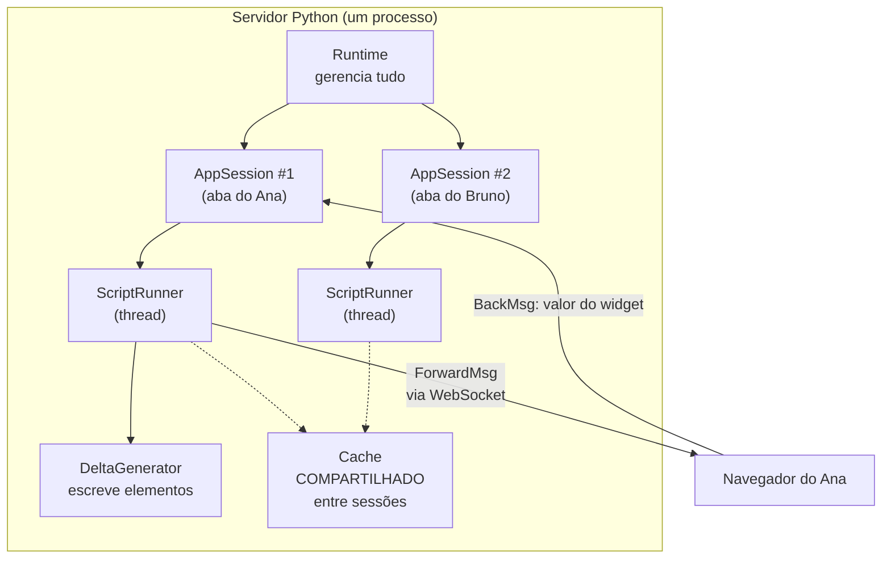

# 10 · Fundamentos — o modelo mental completo

> **Nível:** iniciante a intermediário · **Escrito em:** 02/09/2026

Este arquivo define, de forma precisa, o vocabulário do resto do curso. A partir
daqui todo termo já foi definido antes de ser usado.

---

## 1. As cinco entidades



| Entidade | O que é | Vive quanto tempo |
|---|---|---|
| **Runtime** | o processo do servidor | enquanto o `streamlit run` estiver de pé |
| **AppSession** | uma aba de navegador conectada | do carregamento da página até fechar a aba (+ `disconnectedSessionTTL`) |
| **ScriptRunner** | a thread que executa o seu script para uma sessão | um por sessão |
| **DeltaGenerator** | o objeto que recebe os `st.*` e produz elementos | um por rerun (mais os dos contêineres) |
| **Cache** | `cache_data` / `cache_resource` | **no processo**, atravessa sessões |

**A consequência mais importante desse desenho:** `st.session_state` é **por
sessão** (por aba), e o cache é **por processo** (todo mundo). Confundir os dois
produz dois bugs opostos: dado de um usuário aparecendo para outro (cache usado
como estado), e configuração se perdendo (estado usado como cache).

---

## 2. O ciclo de vida de uma interação

Passo a passo, o que acontece quando o usuário arrasta um controle:

```
1. Navegador   → detecta a mudança do widget
2. Navegador   → envia um BackMsg (protobuf) pelo WebSocket:
                 "o widget com id X agora vale 30"
3. AppSession  → grava o valor no WidgetState da sessão
4. AppSession  → pede ao ScriptRunner um novo run
5. ScriptRunner→ (se um run está em andamento, interrompe: SCRIPT_STOPPED_FOR_RERUN)
6. ScriptRunner→ executa o script do topo
7. st.slider   → em vez do valor inicial, lê o WidgetState e devolve 30
8. cada st.*   → produz um Delta e o enfileira
9. ForwardMsgQueue → agrupa e envia os deltas pelo WebSocket
10. Navegador  → aplica os deltas na árvore de elementos
11. ScriptRunner→ SCRIPT_FINISHED
```

Os nomes dos passos 5, 9 e 11 não são invenção deste curso — são os eventos do
`ScriptRunnerEvent` no código do Streamlit 1.63.0
(`SCRIPT_STARTED`, `SCRIPT_STOPPED_FOR_RERUN`, `SCRIPT_STOPPED_WITH_SUCCESS`,
`FRAGMENT_STOPPED_WITH_SUCCESS`, `ENQUEUE_FORWARD_MSG`, `SHUTDOWN`).

**Repare no passo 5.** Se o usuário arrasta o controle rápido, o run em andamento
é **abandonado no meio** e um novo começa. Isso tem uma consequência prática
séria: se o seu script escreve num arquivo ou num banco no meio do caminho, essa
escrita pode ter acontecido pela metade. Escrita deve ser **transacional** e, de
preferência, disparada por botão (que é um evento pontual), não por controle
contínuo.

---

## 3. Os três tipos de "memória"

Esta é a tabela que resolve a maioria das dúvidas de arquitetura:

| Onde | Escopo | Sobrevive a... | Use para |
|---|---|---|---|
| **variável comum** | um rerun | nada | contas intermediárias |
| **`st.session_state`** | uma aba | reruns; **não** sobrevive a fechar a aba nem a reiniciar o servidor | quem está logado, o que foi selecionado, um rascunho |
| **`st.cache_data`** | o processo, por chave de argumentos | reruns e sessões; **não** sobrevive a reiniciar (salvo `persist="disk"`) | resultado de consulta, arquivo lido |
| **`st.cache_resource`** | o processo, um objeto | reruns e sessões | conexão, cliente, modelo |
| **banco / arquivo** | a máquina (ou a nuvem) | tudo | dados de verdade |

A regra: **se o usuário não pode perder, vai para o banco.** `session_state` e
cache são conveniência de desempenho, não persistência.

---

## 4. Widget: identidade, valor e evento

Um widget é três coisas:

1. **Uma identidade** — como o Streamlit sabe que "este slider deste rerun" é
   "aquele slider do rerun anterior".
2. **Um valor** — guardado no `WidgetState` da sessão.
3. **Um evento opcional** — a função em `on_change` / `on_click`.

### Como a identidade é calculada

No Streamlit 1.63.0, a identidade sai de `_compute_element_id`, que faz um hash
(BLAKE2b de 16 bytes, com MD5 como reserva em builds FIPS) de:

- o **tipo** do elemento (`"slider"`, `"selectbox"`, ...);
- a **`key`** do usuário, quando houver;
- os **argumentos** do comando (label, opções, min, max...) — **exceto** quando há
  `key` e o widget usa identidade por chave;
- o **hash do script ativo** (para o mesmo widget em páginas diferentes ter IDs
  diferentes);
- o **`form_id`** e o contêiner-raiz (para o mesmo widget poder existir no corpo e
  na barra lateral).

**A mudança de 2026 que você precisa conhecer.** Até a versão 1.53, mudar o
`label` ou as `options` de um widget mudava o ID — e o valor escolhido pelo
usuário **se perdia**. Desde a 1.54, quando você passa uma `key`, ela é a
identidade principal e os demais argumentos deixam de entrar no hash.

Tradução prática: **use `key=` em todo widget de app real.** Sem `key`, trocar o
texto do rótulo apaga o que o usuário tinha escolhido, e o bug parece
sobrenatural.

E é por isso que dois widgets idênticos sem `key` colidem:

```python
st.text_input("Nome")
st.text_input("Nome")     # mesmo tipo + mesmos argumentos = mesmo ID
# StreamlitDuplicateElementKey / DuplicateWidgetID
```

---

## 5. `DeltaGenerator`: por que `st.write` devolve algo

Todo comando de escrita devolve um `DeltaGenerator` — um "cursor" que aponta para
uma posição na árvore de elementos. Isso permite escrever **fora de ordem**:

```python
cabecalho = st.empty()          # reserva o lugar
dados = carregar_lento()        # demora
cabecalho.metric("Total", len(dados))   # escreve LÁ EM CIMA, depois
```

E é o que faz `with st.container():` funcionar: o `with` troca o cursor ativo.

**A árvore de elementos** é literalmente uma árvore: cada elemento tem um
`delta_path` (uma lista de índices). O navegador recebe `Delta`s com o caminho e
aplica na posição. Por isso a ordem em que você chama os `st.*` é a ordem na
tela — e por isso um `if` que às vezes escreve e às vezes não pode fazer o
conteúdo "pular" de lugar entre reruns (use `st.empty()` para estabilizar).

---

## 6. Sessão, usuário e concorrência

**Uma aba = uma sessão.** Abrir a mesma app em duas abas dá dois `session_state`
independentes. Recarregar a página (F5) **cria uma sessão nova** — e perde o
estado. (Existe `disconnectedSessionTTL`, que guarda a sessão por um tempo após a
queda da conexão, para sobreviver a um blip de rede; não confunda com F5.)

**O servidor é um processo só, com uma thread por sessão.** Consequências:

- variáveis globais do seu módulo são **compartilhadas por todos os usuários**.
  Escrever numa global é escrever para todo mundo. Isto é um bug de segurança
  esperando acontecer:

  ```python
  usuario_atual = None      # GLOBAL — o último login sobrescreve o de todos
  ```

- o **GIL** do Python significa que duas sessões fazendo conta pesada em Python
  puro competem pelo mesmo núcleo. Consultas a banco e I/O liberam o GIL; laços
  de Python puro não.
- por isso um processo Streamlit atende bem **dezenas** de usuários simultâneos
  fazendo pouca coisa, e mal **poucos** usuários fazendo muita coisa. Escalar é
  rodar mais processos com sessão fixa (*sticky sessions*) — ver
  [28-deploy-e-operacao.md](28-deploy-e-operacao.md).

---

## 7. O protocolo, em uma página

O navegador e o servidor conversam por **WebSocket**, trocando mensagens
**Protocol Buffers**. Duas direções:

- **ForwardMsg** (servidor → navegador). Os campos incluem `delta` (um elemento
  novo ou alterado), `new_session`, `page_config_changed`, `script_finished`,
  `navigation`, `auto_rerun`, `logo`, `auth_redirect`, `dataframe_chunk`
  (o carregamento sob demanda de tabelas grandes, da 1.61) — a lista completa
  está no `ForwardMsg.proto` do pacote instalado.
- **BackMsg** (navegador → servidor). Basicamente: "reexecute com este estado de
  widgets", "envie o arquivo", "limpe o cache".

**Por que WebSocket e não HTTP comum.** O servidor precisa **empurrar** conteúdo
sem o cliente pedir (um `st.write` no meio de um laço aparece na hora). Isso é
*server push*, e HTTP requisição-resposta não faz.

**A consequência operacional** é enorme e pega todo mundo no deploy: qualquer
proxy, balanceador ou CDN no caminho **precisa** repassar WebSocket e ter tempo
limite longo. O sintoma de não fazer isso é a página em "Connecting..." ou uma
reconexão a cada 60 segundos. Ver [28](28-deploy-e-operacao.md).

**Por que Protocol Buffers e não JSON.** Um DataFrame de 100 mil linhas em JSON
seria dezenas de megabytes de texto. Os dados tabulares vão em **Apache Arrow**
(formato colunar binário) dentro do protobuf. É por isso que `pyarrow` é uma
dependência obrigatória do Streamlit e responde por boa parte dos 480 MB de
instalação.

---

## 8. A pergunta dos cinco porquês: por que reexecutar tudo?

**1. Por que o Streamlit reexecuta o script inteiro?**
Para que a interface possa ser escrita como um roteiro linear, igual a um script
de análise.

**2. Por que isso importa?**
Porque o público-alvo — cientistas de dados, analistas, engenheiros — já pensa em
roteiro linear. Aprender o modelo de eventos/callbacks é uma mudança de
paradigma, e mudança de paradigma custa semanas.

**3. Por que não dava para ter as duas coisas?**
Porque interface reativa fina exige saber **o que depende do quê**. React resolve
com um grafo explícito de componentes e um `useState`. Fazer isso em Python
exigiria ou análise estática do código (frágil), ou o usuário declarar as
dependências à mão (que é o modelo do Dash, com seus `@callback(Output, Input)`)
— e aí você não escreve mais um roteiro linear.

**4. Por que reexecutar era aceitável em 2019?**
Porque o custo dominante nesse tipo de app é I/O (ler arquivo, consultar banco), e
esse custo dá para **memorizar** com cache. O que sobra — montar a tela — é
barato. E porque CPU de servidor era barata perto de tempo de engenheiro.

**5. Por que, então, existem `fragment`, `cache` e `session_state`?**
Porque a conta nem sempre fecha. Cada um desses recursos é um **remendo
deliberado** no custo do modelo:
`cache` corta o custo de I/O; `session_state` recupera a continuidade que o rerun
destrói; `fragment` limita o alcance do rerun.

**A parada legítima:** é um **trade-off de projeto documentado**, não uma
limitação técnica inevitável. O Streamlit escolheu simplicidade de escrita; o
Dash escolheu granularidade de execução; o Reflex escolheu compilar Python para
React. Nenhum está errado — estão respondendo a perguntas diferentes. A
comparação honesta está em
[31-quando-nao-usar-streamlit.md](31-quando-nao-usar-streamlit.md).

---

## 9. Vocabulário formal

| Termo | Definição precisa |
|---|---|
| **rerun** | uma execução completa do script, do topo até o fim ou até `st.stop()` |
| **fragment rerun** | execução de apenas uma função decorada com `@st.fragment` |
| **widget state** | o dicionário `{id do widget: valor}` mantido pela sessão |
| **session state** | o dicionário do usuário, `st.session_state`, que inclui as chaves de widget |
| **delta** | uma instrução de "adicione/substitua o elemento no caminho P" |
| **delta path** | a posição de um elemento na árvore (`[0, 3, 1]`) |
| **ForwardMsg** | mensagem servidor → navegador |
| **BackMsg** | mensagem navegador → servidor |
| **DeltaGenerator** | o cursor Python que produz deltas |
| **ScriptRunner** | a thread que executa o script de uma sessão |
| **AppSession** | a conexão de uma aba, com seu estado |
| **magic** | a escrita automática de uma expressão solta numa linha |
| **cache key** | o hash dos argumentos de uma função cacheada |

---

## 10. Cinco frases para levar

1. **O script roda inteiro a cada interação.** Tudo o mais é consequência.
2. **`session_state` é por aba; cache é por processo.** Não troque.
3. **Widget sem `key` tem identidade frágil.** Em app real, sempre dê `key`.
4. **Variável global é compartilhada por todos os usuários.** Nunca guarde estado
   de usuário nela.
5. **É WebSocket.** Todo o sofrimento de deploy vem daí, e é previsível.

---

## Autoteste

1. Desenhe (ou descreva) os 11 passos entre o clique do usuário e a tela nova.
2. `session_state` e cache: qual é por aba, qual é por processo? Dê um bug
   concreto de trocar os dois.
3. Como o Streamlit calcula a identidade de um widget? O que mudou na 1.54 e por
   que isso importa na prática?
4. Por que dois `st.text_input("Nome")` colidem, e por que `key=` resolve?
5. Para que serve o `DeltaGenerator` devolvido por `st.write`? Dê um uso concreto.
6. Por que WebSocket, e qual é a consequência disso no dia do deploy?
7. Por que os dados tabulares vão em Arrow e não em JSON?
8. Aplique os cinco porquês: por que o Streamlit reexecuta tudo, e qual é a
   parada legítima do raciocínio?
9. Por que uma variável global do módulo é perigosa numa app com vários usuários?
