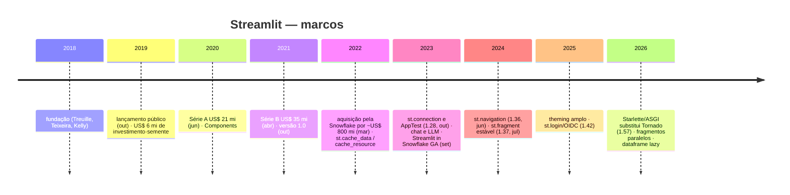

# 11 · História — como o Streamlit chegou até aqui

> **Nível:** iniciante · **Escrito em:** 02/09/2026
> Datas e valores conferidos na web em 02/09/2026; fontes no rodapé.
> Onde a fonte é imprecisa, está dito no texto.

História de ferramenta não é curiosidade: **explica o formato dela**. Quase toda
decisão estranha do Streamlit tem uma data e um motivo.

---

## Linha do tempo

---

## 1. O que existia antes, e por que não bastava

Para entender por que o Streamlit pegou, é preciso ver o que ele substituiu.

| Antes | O que era | Por que não resolvia |
|---|---|---|
| **Jupyter Notebook** (2014) | caderno interativo | é a ferramenta do analista, não do usuário. Mostrar um notebook para o diretor comercial não é uma opção. E o estado do notebook depende da ordem em que você rodou as células — o que gera resultados irreprodutíveis |
| **Flask / Django + HTML** | frameworks web de verdade | funcionam, e exigem aprender HTML, CSS, JS, rotas, templates, um servidor. Semanas de trabalho para um painel de uma tela |
| **Dash** (Plotly, 2017) | apps de dados em Python | o modelo é declarar callbacks com `Input`/`Output` explícitos. Poderoso e granular; verboso e com curva de aprendizado real |
| **Bokeh Server / Panel** | visualização com servidor | forte em gráficos, fraco em "app" |
| **Voilà** (2019) | transforma notebook em app | herda os problemas do notebook |
| **Shiny** (R, 2012) | o padrão-ouro do mundo R | não existia em Python (só chegou em 2022, como Shiny for Python) |
| **Tableau / Power BI** | BI comercial | ótimo para arrastar e soltar; ruim quando a lógica é Python (modelo de ML, cálculo customizado). E é pago por usuário |

O buraco era específico: **um jeito de um programador Python transformar um script
em interface, em minutos, sem mudar de paradigma.**

---

## 2. 2018 — a origem

Adrien Treuille, Thiago Teixeira e Amanda Kelly fundam a empresa em 2018. Treuille
vinha da academia (doutorado em animação por simulação física, professor na
Carnegie Mellon) e da Zoox, de carros autônomos.

A observação que originou o produto, contada por eles em várias entrevistas:
nos times de aprendizado de máquina, cada engenheiro construía a própria
ferramenta interna, do zero, sempre igual, e ela sempre morria. As "ferramentas"
eram scripts com `matplotlib` que só o autor sabia rodar.

A hipótese: **se fazer a ferramenta custasse 20 linhas, ela deixaria de ser
descartável.**

---

## 3. Outubro de 2019 — o lançamento e o post que viralizou

O lançamento público foi em **1º de outubro de 2019**, com um investimento-semente
de **US$ 6 milhões** e o lema *"turn Python scripts into beautiful ML tools"*.

O post de lançamento no Medium — *"Turn Python Scripts into Beautiful ML Tools"* —
apresentava as duas ideias que ninguém tinha juntado:

1. **rerun do script inteiro** a cada interação;
2. **cache com `@st.cache`** para tornar o item 1 viável.

Repare: as duas nasceram **juntas**, no dia zero. O cache não é um recurso
posterior de otimização; é a metade da ideia. Sem ele, o modelo de rerun seria
inutilizável, e o Streamlit teria morrido em três meses.

---

## 4. 2020–2021 — a escada de recursos

| Ano | O que apareceu | Problema que resolvia |
|---|---|---|
| 2020 | **Streamlit Components** | permitir componentes em React, feitos pela comunidade — porque a API nunca teria tudo |
| 2020 | **Streamlit Sharing** (depois Community Cloud) | "eu fiz, e agora, como mostro?" — o deploy era o gargalo seguinte |
| 2021 | **`st.session_state`** | o rerun destruía qualquer continuidade. Foi o recurso mais pedido da história do projeto |
| 2021 | **versão 1.0** (outubro) | compromisso de estabilidade de API |
| 2021 | **multipágina** (pasta `pages/`) | apps deixaram de caber numa tela |

`st.session_state` merece um parágrafo. Durante dois anos, a resposta oficial para
"como guardo um valor entre reruns?" envolvia gambiarras com `@st.cache` mutável
— um uso torto que produzia bugs sutis. A chegada do `session_state` foi o
reconhecimento explícito de que **o modelo puro de rerun sem memória não fecha**.

---

## 5. Março de 2022 — a Snowflake compra

Em **1º de março de 2022** a Snowflake anunciou a aquisição por cerca de
**US$ 800 milhões**. (Nota de precisão: a maioria das fontes públicas — incluindo
o anúncio e a cobertura de imprensa — fala em ~US$ 800 milhões; documentos
financeiros posteriores da Snowflake mencionam ~US$ 710 milhões de valor
atribuído. A diferença é típica: preço anunciado inclui componentes de retenção e
ações, o valor contábil não. Trate "cerca de 800 milhões" como a cifra pública.)

**Por que a Snowflake comprou.** A Snowflake vende armazém de dados na nuvem e
cobra por computação. Toda aplicação que roda perto do dado é computação vendida.
Streamlit era, e é, a forma mais rápida de fazer uma aplicação em cima de dados.
A lógica é a mesma da Microsoft com o Power BI.

**O que isso significa para você, na prática** — e aqui vou ser explícito sobre o
que é fato e o que é minha leitura:

- **Fato:** o Streamlit continua sob licença **Apache 2.0**, aberto, e as versões
  saem a cada duas ou três semanas.
- **Fato:** existe um produto pago, *Streamlit in Snowflake* (SiS), disponível
  desde setembro de 2023, que roda a app dentro do armazém e é cobrado em
  créditos de computação.
- **Fato:** vários recursos aparecem primeiro com o Snowflake em mente —
  `SnowflakeConnection`, conexões com escopo de sessão (1.53).
- **Opinião minha, fundamentada:** o risco de fornecedor aqui é **baixo, mas não
  zero**. A licença Apache 2.0 permite bifurcar (*fork*) e a comunidade é grande.
  Por outro lado, quem decide o roteiro é a Snowflake, e a direção do produto
  favorece quem é cliente dela. Se o seu plano de contingência para "a Snowflake
  muda de ideia" é "a comunidade mantém", saiba que manter um projeto deste
  tamanho é caro, e nenhuma bifurcação relevante existe hoje.

---

## 6. 2022–2023 — profissionalização

| Versão | Data | O que trouxe | Por quê |
|---|---|---|---|
| 1.18 | 2023 | `st.cache_data` e `st.cache_resource` **substituem** `st.cache` | o `@st.cache` original tentava adivinhar se o valor era dado ou recurso, e errava. A separação explícita acabou com uma classe inteira de bugs |
| 1.22–1.28 | 2023 | `st.connection` | conectar a banco era um `@st.cache_resource` copiado de blog em blog, com pool errado |
| **1.28** | **30/10/2023** | **`AppTest`** (framework de testes) | app de Streamlit não tinha teste. Este foi o momento em que a ferramenta passou a ser levada a sério em produção |
| 1.24–1.31 | 2023 | `st.chat_message`, `st.chat_input`, `st.write_stream` | o boom dos LLMs. Metade das apps novas do ecossistema viraram interface de chat |

O ano de 2023 é o divisor: antes, Streamlit era ferramenta de protótipo; depois,
começou a ser infraestrutura interna de empresa.

---

## 7. 2024–2025 — os remendos no modelo de execução

| Versão | Data | O quê |
|---|---|---|
| **1.36** | **21/06/2024** | `st.navigation` + `st.Page` — multipágina declarativo, com controle em Python |
| **1.37** | **26/07/2024** | `st.fragment` estável — reexecução parcial |
| 1.35 | 2024 | `st.dialog` — modal |
| 1.42 | 2025 | `st.login()` / OIDC, `st.user` |
| 1.4x–1.5x | 2025 | *theming* extenso: fontes, raio de borda, cores de gráfico, tema separado da barra lateral |

`st.fragment` é o recurso mais importante desse período, porque ataca o custo
central do modelo. É a admissão de que "reexecutar tudo" nem sempre serve — sem
abandonar o modelo, oferecendo um escopo menor onde ele dói.

`st.navigation` é a admissão de que a pasta mágica `pages/` era simples demais:
não dava para decidir em Python quem vê o quê.

---

## 8. 2026 — o ano da troca de motor

Os marcos de 2026, com data (fonte: notas de versão oficiais):

| Versão | Data | O quê | Por que importa |
|---|---|---|---|
| 1.53 | 14/01/2026 | conexões Snowflake com escopo de sessão; **`st.App`** (ponto de entrada ASGI); `st.user.tokens` | o `st.App` abre a porta para embutir a app numa aplicação ASGI maior |
| 1.54 | 04/02/2026 | cores de gráfico via tema; **identidade de widget por chave** | acabou com o bug de "mudei o rótulo e o usuário perdeu a seleção" |
| 1.55 | 03/03/2026 | contêineres dinâmicos com `on_change`; **widget ligado a query params** | painel compartilhável por URL, sem código |
| 1.56 | 31/03/2026 | `st.menu_button`, `st.iframe`, `filter_mode` em seletores, seleção programática em dataframe | |
| **1.57** | **29/04/2026** | **Starlette vira o servidor padrão** (saindo do Tornado); `st.bottom`; `:shimmer[]` | mudança de motor. ASGI é o padrão do Python moderno; abre integração com FastAPI e afins |
| 1.58 | 28/05/2026 | **execução paralela de fragmentos**; `st.pagination`; `streamlit skills` | fragmentos independentes deixam de esperar uns pelos outros |
| 1.59 | 06/07/2026 | `ButtonColumn`, estatísticas de coluna, `st.skeleton`, **`st.mermaid_chart`** | diagrama nativo, sem dependência |
| 1.60 | 21/07/2026 | `client.disableDataExport`, endurecimento de segurança, `st.tabs(height=)` | requisitos corporativos |
| 1.61 | 04/08/2026 | **`st.dataframe` com carregamento sob demanda**; **`refresh_mode="background"` no cache**; `icon` em `st.metric` | tabela grande deixa de travar o navegador; cache que não faz o usuário esperar |
| 1.62 | 19/08/2026 | validação no cliente e tipos (`email`, `url`, `phone`, `search`) em `st.text_input`; `wrap` em layouts | |
| 1.63 | 01/09/2026 | versão de referência deste curso | |

**A troca do Tornado pelo Starlette (1.57) é o marco técnico do ano.** O Tornado
foi o servidor assíncrono do Python nos anos 2010; o ecossistema inteiro migrou
para ASGI (Starlette, FastAPI, Uvicorn). Consequências práticas: o Streamlit
instalado hoje **não traz Tornado**; código que estendia o servidor via Tornado
quebrou; e `st.App` permite montar a app dentro de outra aplicação ASGI.

---

## 9. O padrão que se repete (e como prever o futuro)

Olhando quinze anos de ferramentas de dados e sete de Streamlit, o padrão é claro:

1. Alguém troca **flexibilidade por facilidade** e ganha adoção rápida.
2. Os usuários crescem e batem no limite da simplificação.
3. A ferramenta acrescenta **escapes** para os casos difíceis
   (`session_state`, `fragment`, `components`, `st.App`).
4. A ferramenta fica mais complexa, e abre espaço para a próxima simplificação.

O Streamlit está firmemente no passo 3. `st.App`, fragmentos paralelos e
componentes customizados são escapes: eles servem exatamente para quem já não
cabe no modelo simples.

**Minha previsão, e é opinião:** o Streamlit não vai virar um framework web
completo — e não deveria. O caminho natural é ele ficar cada vez melhor em ser o
**frontend** de um backend que você escreve à parte. É por isso que o
[projeto-modelo](07-projeto-modelo/) deste curso separa `nucleo/` de `paginas/`:
essa separação é boa hoje e será obrigatória amanhã.

---

## Autoteste

1. Que problema concreto de 2018 originou o Streamlit?
2. Por que o cache nasceu **junto** com o modelo de rerun, e não depois?
3. O que a chegada do `st.session_state` (2021) admitiu sobre o modelo original?
4. Por que a Snowflake comprou o Streamlit? Qual é o incentivo econômico?
5. Qual foi a diferença entre `@st.cache` e o par `cache_data`/`cache_resource`, e
   que classe de bug isso eliminou?
6. Por que 2023 é o ano divisor entre "protótipo" e "produção"?
7. O que muda, na prática, com a troca de Tornado por Starlette em 2026?
8. Que mudança de 2026 acabou com o bug de "mudei o rótulo e o usuário perdeu a
   seleção"?
9. Descreva o padrão de quatro passos e diga em qual deles o Streamlit está.

---

## Fontes consultadas (02/09/2026)

- Notas de versão oficiais, 2023–2026 — <https://docs.streamlit.io/develop/quick-reference/release-notes>
- TechCrunch, lançamento em 01/10/2019 — <https://techcrunch.com/2019/10/01/streamlit-launches-open-source-machine-learning-application-development-framework/>
- Anúncio da Série A (US$ 21 mi), blog do Streamlit — <https://medium.com/streamlit/announcing-streamlits-21m-series-a-ae05daa6c885>
- Crunchbase — perfil da empresa e da aquisição pela Snowflake (01–02/03/2022)
- Anúncios oficiais das versões 1.28.0, 1.36.0 e 1.37.0 — <https://discuss.streamlit.io>
- Metadados do pacote 1.63.0 instalado (dependências, ausência de Tornado) — verificação local
