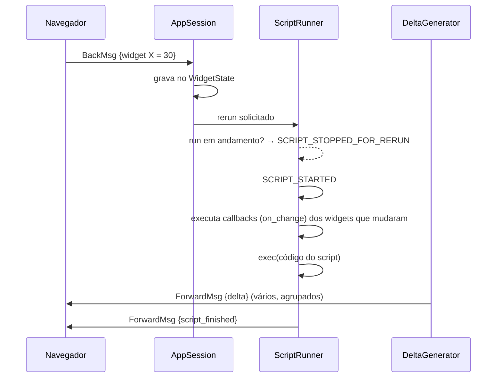

# 12 · O modelo de execução — o arquivo mais importante do curso

> **Nível:** intermediário · **Escrito em:** 02/09/2026 · Streamlit 1.63.0

Se você só puder ler um arquivo do Bloco B, leia este. Quase todo bug estranho de
Streamlit é uma consequência não compreendida do que está aqui.

---

## 1. A regra, formalizada

> Um **rerun** é a execução completa do script da aplicação, do topo até o fim,
> em uma thread dedicada à sessão, com um `WidgetState` fixado no início da
> execução.

Três palavras merecem atenção:

- **completa**: não há execução parcial (exceto fragmentos, ver [15](15-fragments-e-performance.md));
- **thread dedicada**: cada sessão tem a sua; o processo é um só;
- **fixado no início**: o estado dos widgets não muda no meio do rerun. Se o
  usuário mexer em algo durante a execução, o run atual é **abandonado** e outro
  começa.

---

## 2. O que dispara um rerun

| Gatilho | Observação |
|---|---|
| usuário mexe em qualquer widget | o padrão |
| `st.rerun()` | disparado por você |
| arquivo do script salvo, com *run on save* | só em desenvolvimento |
| `@st.fragment(run_every=...)` vence o prazo | rerun **do fragmento**, não do app |
| `st.switch_page()` | troca de página é um rerun |
| o navegador reconecta depois de queda | pode ser rerun completo |
| **F5 / recarregar a página** | **sessão nova**: `session_state` zerado, cache preservado |

**O que NÃO dispara rerun:**

- `st.link_button` (é um link, não um botão de ação);
- `st.download_button` com `on_click="ignore"`;
- widgets **dentro de um `st.form`** (só o `form_submit_button` dispara);
- `st.dataframe`/`st.plotly_chart` com `on_select="ignore"` (o padrão);
- escrever em `st.session_state` (mudar o estado **não** reexecuta nada por si).

---

## 3. A ordem exata dos acontecimentos



**O detalhe que quase ninguém sabe e que resolve muita coisa:** os *callbacks*
(`on_change`, `on_click`) rodam **antes** do corpo do script, no mesmo rerun.

Consequência prática enorme: dentro de um callback você **pode** escrever na
chave de um widget, porque o widget ainda não foi criado neste rerun. Fora do
callback, depois do widget existir, não pode.

```python
def ao_mudar():
    # roda ANTES do script: aqui a chave "b" ainda não pertence a nenhum widget
    st.session_state.b = st.session_state.a * 2

st.number_input("A", key="a", on_change=ao_mudar)
st.number_input("B", key="b")           # já lê o valor novo
```

---

## 4. O que sobrevive e o que morre a cada rerun

```python
import streamlit as st

x = 0                                  # MORRE — recriada a cada rerun
st.session_state.setdefault("y", 0)    # SOBREVIVE (por aba)

@st.cache_data
def z():                               # SOBREVIVE (por processo, por argumentos)
    return caro()

GLOBAL = []                            # SOBREVIVE — e é COMPARTILHADA por todos
                                       # os usuários. Quase sempre um bug.
```

O último caso merece destaque. Uma variável no escopo do módulo é criada quando o
módulo é importado — **uma vez por processo**. Ela não é reinicializada a cada
rerun e não é por sessão. Guardar dados de usuário nela é vazamento de dados
entre usuários.

O mesmo vale para o objeto guardado em `@st.cache_resource`: **é o mesmo objeto
para todo mundo.** Se você guarda ali um dicionário e o modifica, modificou para
todas as sessões.

---

## 5. `st.stop()`, `st.rerun()` e o fluxo

### `st.stop()`

Levanta uma exceção interna (`StopException`) que o `ScriptRunner` captura. O
resultado é um rerun que terminou com sucesso, mas cedo. **Nada abaixo executa.**

Uso canônico — a guarda:

```python
if not autenticado():
    st.error("Faça login.")
    st.stop()

if not tem_permissao(usuario, "admin"):
    st.error("Acesso negado.")
    st.stop()

if dados.empty:
    st.info("Sem dados no período.")
    st.stop()

# daqui para baixo, tudo é verdade
```

Sem `st.stop()`, isso vira uma pirâmide de `if/else` de quatro níveis.

### `st.rerun()`

Levanta `RerunException`: descarta o resto do run e começa outro imediatamente.

**Quando usar:** depois de mudar o estado de um jeito que exige redesenhar a
página inteira — gravou no banco, fez login, fechou um diálogo.

**A armadilha clássica — laço infinito:**

```python
# NUNCA: rerun incondicional
st.rerun()                     # o app roda para sempre, a 100% de CPU
```

Sempre condicione a um evento ou a uma mudança de estado:

```python
if st.button("Salvar"):
    gravar()
    st.rerun()                 # ok: só no clique
```

`st.rerun(scope="fragment")` reexecuta só o fragmento atual.

---

## 6. Por que a tela "pisca" e o que fazer

A cada rerun a árvore inteira é reconstruída. O Streamlit envia **deltas**, não a
página inteira, e o navegador tenta reaproveitar os elementos — mas quando o
número ou a ordem dos elementos muda, o navegador remonta, e você vê o pisca.

Quatro remédios, do mais barato ao mais caro:

1. **Estabilize a estrutura.** Use `st.empty()` para reservar o lugar de algo
   condicional, em vez de escrever/não escrever.
2. **`@st.fragment`** no bloco que muda muito.
3. **Cache** no que é caro — o pisca é a espera, não o desenho.
4. **`st.skeleton()`** para dar um estado de carregamento honesto em vez de vazio.

---

## 7. Concorrência: o que roda ao mesmo tempo

| Cenário | O que acontece |
|---|---|
| dois usuários, duas abas | duas threads, um processo, um GIL |
| um usuário, duas abas | duas sessões independentes, dois `session_state` |
| o mesmo usuário mexe rápido | o run anterior é abandonado (`SCRIPT_STOPPED_FOR_RERUN`) |
| fragmentos com `parallel=True` (1.58+) | executam em paralelo, num pool com `runner.parallelMaxWorkers` |

### O que o GIL significa aqui

O *Global Interpreter Lock* permite **uma** thread executando bytecode Python por
vez. Portanto:

- **conta pesada em Python puro** (laço com milhões de iterações) **bloqueia** as
  outras sessões;
- **I/O** (banco, HTTP, leitura de arquivo) **libera** o GIL — outras sessões
  rodam normalmente;
- **numpy / pandas / pyarrow** liberam o GIL nas operações vetorizadas em C.

Tradução: um `df.groupby(...).sum()` de 5 milhões de linhas atrapalha pouco; um
`for i in range(10_000_000)` em Python trava todo mundo.

### Threads suas dentro do script

Se você criar uma thread e chamar `st.*` dentro dela, ela **não** tem
`ScriptRunContext` e o comando é ignorado, com um aviso no log:

```
Thread 'X': missing ScriptRunContext!
```

Isso é intencional e está documentado no próprio código do Streamlit. O padrão
correto é: a thread **calcula e devolve**; quem escreve na tela é o script.
Ver [24-tarefas-longas-e-concorrencia.md](24-tarefas-longas-e-concorrencia.md).

---

## 8. "Magic": a expressão solta

```python
df                     # equivale a st.write(df)
"## Título"            # equivale a st.write("## Título")
```

Isso funciona porque o Streamlit **reescreve a árvore sintática (AST)** do seu
script antes de executá-lo, envolvendo expressões soltas num `st.write`.

É delicioso em notebook e perigoso em código de produção: uma variável esquecida
numa linha vira conteúdo na tela do usuário. Desligue em projeto sério:

```toml
[runner]
magicEnabled = false
```

---

## 9. Custo: quanto o rerun realmente custa

Medição do modelo, com números de ordem de grandeza (medidos na máquina de
referência, 02/09/2026; os seus vão variar):

| Operação | Custo típico por rerun |
|---|---|
| montar 50 elementos simples | ~5 a 20 ms |
| `st.dataframe` com 10 mil linhas | ~50 a 150 ms (serialização Arrow) |
| `st.dataframe` com 1 milhão de linhas | segundos, e o navegador sofre — use `lazy=True` |
| consulta SQL sem cache | o que o banco levar; **é quase sempre o gargalo** |
| `pd.read_csv` de 100 MB | ~1 a 3 s |
| gráfico Plotly com 200 pontos | ~20 ms |
| gráfico Plotly com 100 mil pontos | segundos, e o navegador engasga |

**A conclusão prática:** o rerun em si é barato. O que custa é **I/O** e
**volume de dados enviado ao navegador**. Por isso a ordem de otimização é:

1. filtre **no banco**, não em Python;
2. **cacheie** o I/O;
3. **agregue** antes de mandar para a tela (ninguém lê 100 mil pontos);
4. só então pense em fragment.

Quem começa pelo passo 4 otimiza o lugar errado.

---

## 10. Diagnóstico: descobrir o que está lento

```python
import time
import streamlit as st

t0 = time.perf_counter()
dados = carregar()
t1 = time.perf_counter()
agregado = calcular(dados)
t2 = time.perf_counter()

with st.sidebar.expander("desempenho"):
    st.write({"carregar": f"{t1-t0:.3f}s", "calcular": f"{t2-t1:.3f}s"})
```

Complementos:

- `@st.cache_data(show_time=True)` mostra o tempo na própria mensagem do cache;
- `[server] enableExpensiveMemoryStats = true` liga estatísticas de memória;
- `[runner] postScriptGC` controla a coleta de lixo depois de cada run — deixe
  ligado se a app usa muita memória, desligue se você precisa de latência mínima;
- para perfilar de verdade: rode `python -m cProfile` na função de carga,
  **fora** do Streamlit. Perfilar dentro do app mistura o custo do framework.

---

## 11. Os cinco porquês do rerun

**1. Por que o script inteiro?** Para que a interface seja um roteiro linear.

**2. Por que roteiro linear é tão valioso?** Porque elimina a necessidade de
manter à mão um modelo mental do estado da tela. Num app de eventos, o estado da
tela é a soma de todos os callbacks já executados — e é isso que torna interface
difícil.

**3. Por que isso é possível?** Porque a tela é **derivada** dos dados:
`tela = f(estado)`. Se `f` é pura e barata, recalcular tudo é mais simples que
atualizar em partes.

**4. Por que `f` nem sempre é barata?** Porque na prática ela inclui I/O — e I/O
não é barato nem previsível. Daí o cache, que memoriza `f` nos pontos caros.

**5. Por que, então, não memorizar tudo automaticamente?** Porque memorizar exige
saber se o valor mudou, e isso exige **hash** de objetos Python arbitrários — que
é um problema difícil e às vezes indecidível (uma conexão de banco não tem hash
significativo; uma função tem *bytecode* mas capta variáveis livres). O Streamlit
resolve pedindo que **você** classifique: dado (`cache_data`) ou recurso
(`cache_resource`).

**Parada legítima:** é um limite teórico e de engenharia. Determinar se uma função
Python arbitrária é pura e quais são suas dependências é, no caso geral,
indecidível (redutível ao problema da parada). A saída de qualquer sistema real é
pedir uma anotação humana — e é exatamente o que o decorador de cache é.

---

## Autoteste

1. Defina "rerun" com precisão, incluindo o que acontece com o `WidgetState`.
2. Liste cinco gatilhos de rerun e três coisas que **não** disparam rerun.
3. Em que momento os `on_change` rodam? Por que isso permite escrever na chave de
   um widget dentro do callback e não fora?
4. Por que uma variável global do módulo é um risco de vazamento entre usuários?
5. Quando usar `st.stop()` e quando usar `st.rerun()`? Que erro produz laço
   infinito?
6. Por que a tela pisca, e quais são os quatro remédios em ordem de custo?
7. O que o GIL implica para duas sessões: uma fazendo `groupby` no pandas e outra
   fazendo um laço Python de 10 milhões de iterações?
8. O que acontece se você chamar `st.write` dentro de uma thread criada por você?
9. Qual é a ordem correta de otimização, e por que começar por `fragment` é errado?
10. Por que o Streamlit não consegue cachear tudo automaticamente? Qual é a parada
    teórica do argumento?
