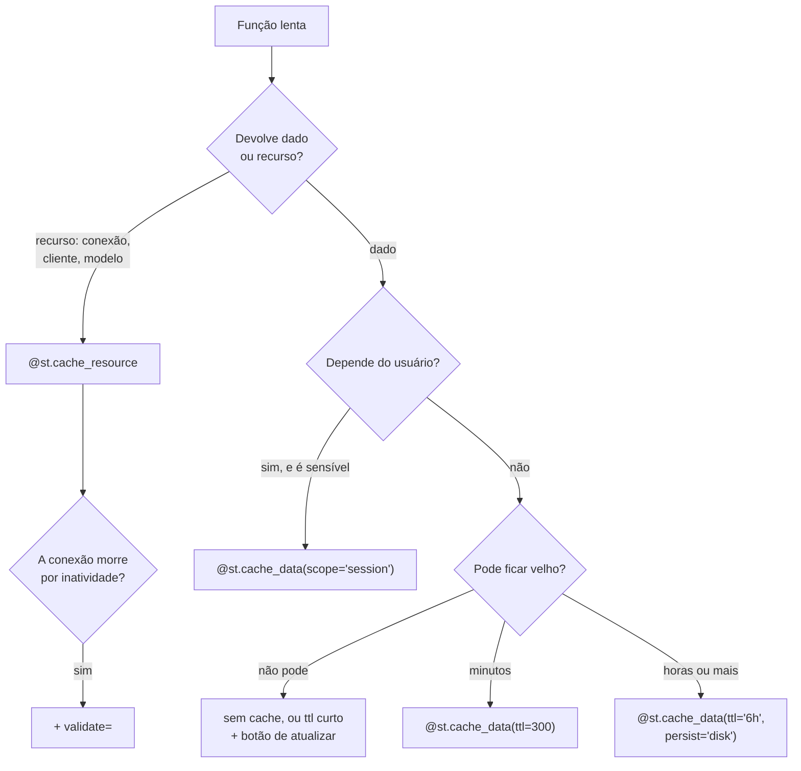

# 14 · Cache e dados — a diferença entre 40 segundos e 0,2 segundo

> **Nível:** intermediário · **Escrito em:** 02/09/2026 · Streamlit 1.63.0

Cache não é otimização opcional no Streamlit. É metade do modelo: sem ele, rerun
completo seria inviável. Este arquivo explica como funciona por dentro, para você
parar de tratá-lo como magia.

---

## 1. As duas ferramentas, e a escolha entre elas

| | `@st.cache_data` | `@st.cache_resource` |
|---|---|---|
| Guarda | uma **cópia serializada** do retorno | **a referência** ao objeto |
| Cada chamador recebe | uma cópia nova | **o mesmo objeto** |
| Escopo | processo, indexado pelos argumentos | processo |
| Serializa? | sim (pickle, ou Arrow para DataFrames) | não |
| Mutação afeta os outros? | **não** | **sim** |
| Para | DataFrame, dict, list, resultado de consulta, arquivo lido | conexão, cliente de API, modelo de ML, `Lock`, pool |

**A regra em uma frase:** se você pode ter dois, é dado; se precisa ser um só, é
recurso.

### Por que a cópia importa

```python
@st.cache_data
def carregar():
    return pd.read_csv("vendas.csv")

df = carregar()
df["novo"] = 1          # seguro: você mexeu na SUA cópia
```

```python
@st.cache_resource        # ERRADO para DataFrame
def carregar():
    return pd.read_csv("vendas.csv")

df = carregar()
df["novo"] = 1          # você acabou de alterar o dado de TODOS os usuários
```

O custo da cópia é real (serializar 500 MB não é grátis), e é o preço da
segurança. Se ele doer, o problema é que 500 MB não deveriam estar na memória do
servidor — leia menos, não troque de decorador.

---

## 2. Como a chave de cache é calculada

A chave é o hash dos **argumentos** da função (mais o código da função). O
Streamlit implementa um *hasher* próprio, em `runtime/caching/hashing.py`, que
sabe tratar explicitamente, entre outros:

`pandas.Series` e `DataFrame`, `polars.Series` e `DataFrame`, `numpy.ndarray`,
`PIL.Image`, `re.Pattern`, `io.StringIO`/`BytesIO`, `functools.partial`,
`UploadedFile`, modelos Pydantic, `Mock`.

Quando ele não sabe, levanta `UnhashableTypeError`, e você tem três saídas:

```python
# 1. prefixo _ : o argumento NÃO entra na chave
@st.cache_data
def consultar(_conexao, sql: str, params: tuple):
    return pd.read_sql(sql, _conexao, params=params)

# 2. hash_funcs: você ensina como resumir aquele tipo
@st.cache_data(hash_funcs={MinhaClasse: lambda o: o.id})
def processar(obj): ...

# 3. mude a assinatura para receber só tipos simples (o melhor)
@st.cache_data
def consultar(url: str, sql: str, params: tuple): ...
```

**A opção 1 é a mais usada e a mais perigosa.** Com `_conexao`, se você trocar de
banco sem mudar o `sql`, o cache devolve o resultado do banco antigo. Regra:
argumentos com `_` só para coisas que **não mudam o resultado**.

**Argumentos precisam ser hasheáveis e, na prática, imutáveis.** Passe `tuple`,
não `list`; `frozenset`, não `set`. Uma `list` funciona (o hasher percorre), mas
duas listas iguais criam a mesma chave e uma lista mutada silenciosamente vira
outra chave — confusão garantida.

---

## 3. Parâmetros, um a um

```python
@st.cache_data(
    ttl="5m",                    # int (segundos), timedelta, ou "1d2h3m"
    max_entries=200,             # descarta a mais antiga (LRU)
    show_spinner="Consultando...",
    show_time=True,              # mostra a duração — ótimo para diagnóstico
    persist="disk",              # sobrevive ao reinício do processo
    hash_funcs={...},
    scope="global",              # "global" (todos) | "session" (por aba)
    refresh_mode="foreground",   # "foreground" | "background"
)
def consultar(...): ...
```

### `ttl` — a decisão de negócio disfarçada de parâmetro

Escolher TTL é decidir **quão velho o número pode estar**. Isso é uma decisão de
negócio, não técnica. Pergunte ao usuário: "se este número estiver 5 minutos
atrasado, alguém toma a decisão errada?"

| Natureza | TTL sugerido |
|---|---|
| dado histórico fechado | `None` (nunca expira) + botão de recarregar |
| painel gerencial | 5 a 15 minutos |
| painel operacional | 30 a 120 segundos |
| monitoramento | 5 a 30 segundos, ou fragment com `run_every` |
| tabela de referência | 1 hora ou mais |

**Cache sem TTL num painel operacional é a causa nº 1 de "o número está errado".**
Não está errado: está velho. E é pior que errado, porque ninguém desconfia.

### `scope="session"`

Novidade importante para app com login: com `scope="session"`, o cache é **por
aba**, e o dado de um usuário nunca aparece para outro.

```python
@st.cache_data(ttl=300, scope="session")
def meus_pedidos(usuario_id: int):
    return consultar_pedidos(usuario_id)
```

> **Aviso de segurança:** com `scope="global"` (o padrão), se o `usuario_id` for
> um argumento, o isolamento existe por causa da chave — mas basta um argumento
> esquecido, ou um `_` mal colocado, para um usuário ver o dado de outro. Em app
> multiusuário com dado sensível, use `scope="session"`. Ver
> [29-seguranca.md](29-seguranca.md).

### `refresh_mode="background"` (1.61+)

Quando o TTL expira, o valor velho continua sendo servido e a atualização
acontece numa thread. O usuário nunca espera.

```python
@st.cache_data(ttl=60, refresh_mode="background")
def indicadores(): ...
```

Controles em `config.toml`: `runner.cacheBackgroundRefreshMaxWorkers` e
`runner.cacheBackgroundRefreshTTLMultiplier` (quanto tempo além do TTL o valor
velho ainda pode ser servido).

**O risco, e precisa ser dito:** o usuário vê dado mais velho que o TTL sugere.
Para painel gerencial, ótimo. Para "qual o saldo agora", não use.

### `persist="disk"`

O valor vai para o disco (em `~/.streamlit/cache`) e sobrevive ao reinício do
processo. Transforma "o primeiro usuário do dia espera 40 s" em "ninguém espera".

Cuidados: ocupa disco; **não** é criptografado; e no Community Cloud o disco é
efêmero.

### `@st.cache_resource(validate=...)` e `on_release`

```python
def viva(con) -> bool:
    try:
        con.execute("SELECT 1")
        return True
    except Exception:
        return False

@st.cache_resource(validate=viva, on_release=lambda c: c.close())
def conexao():
    return criar_conexao()
```

`validate` roda a cada acerto de cache: se devolver `False`, o objeto é
descartado e recriado. É a resposta certa para conexão que o banco derrubou por
inatividade — o bug clássico de app que "funciona de manhã e quebra à tarde".

---

## 4. Invalidação

```python
consultar.clear()                    # toda a função
consultar.clear(2026, "SP")          # só esta entrada
st.cache_data.clear()                # tudo, de todo mundo
st.cache_resource.clear()            # todos os recursos
```

**A regra de ouro:** depois de **escrever** no banco, limpe o cache de **leitura**
correspondente. Esquecer disso produz o bug mais frustrante do CRUD: "eu salvei e
não apareceu".

```python
def criar_pedido(dados):
    repositorio.inserir(dados)
    pedidos_em_cache.clear()          # ← esta linha
```

Prefira `.clear()` da função específica a `st.cache_data.clear()`: o segundo
apaga o cache de todo mundo, inclusive de dados caros que não mudaram.

---

## 5. Onde filtrar: a decisão que mais importa

Este é o erro de desempenho nº 1 em painel de Streamlit.

```python
# ERRADO — traz tudo e filtra em Python
@st.cache_data
def tudo():
    return pd.read_sql("SELECT * FROM pedidos", con)     # 4 milhões de linhas

df = tudo()
df = df[(df.data >= inicio) & (df.data <= fim)]
```

```python
# CERTO — o banco filtra, e ele tem índice para isso
@st.cache_data(ttl=300)
def periodo(inicio, fim):
    return pd.read_sql(
        "SELECT * FROM pedidos WHERE data BETWEEN %(i)s AND %(f)s",
        con, params={"i": inicio, "f": fim})
```

| | filtrar em Python | filtrar no banco |
|---|---|---|
| memória do servidor | 4 M de linhas × N sessões | só o recorte |
| tempo do primeiro acesso | dezenas de segundos | milissegundos, com índice |
| usa índice? | não | sim |
| cabe no Community Cloud (~1 GB)? | não | sim |

**Quando trazer tudo é aceitável:** quando "tudo" cabe confortavelmente em
memória (dezenas de milhares de linhas), o dado muda pouco, e você vai fazer
muitos recortes diferentes. Aí uma leitura cacheada e vários filtros em pandas
é mais rápido que dez idas ao banco.

**A regra:** meça o tamanho. `df.memory_usage(deep=True).sum() / 1e6` diz os MB.
Acima de ~200 MB, filtre no banco.

---

## 6. Agregue antes de mandar para a tela

O segundo gargalo é o volume enviado ao navegador.

```python
# ERRADO: 500 mil pontos num gráfico. O navegador congela.
st.plotly_chart(px.line(df, x="ts", y="valor"))

# CERTO: agregue para a resolução que a tela tem (~1.000 pontos bastam)
serie = df.set_index("ts")["valor"].resample("1h").mean().reset_index()
st.plotly_chart(px.line(serie, x="ts", y="valor"))
```

Ninguém enxerga 500 mil pontos em 800 pixels. Agregar não é perder informação —
é escolher a resolução certa.

Para tabelas grandes, o Streamlit 1.61 trouxe `st.dataframe(..., lazy=True)`, que
carrega as linhas sob demanda. Ainda assim: se o usuário precisa de 1 milhão de
linhas na tela, ele não precisa de uma tela, precisa de um arquivo.

---

## 7. Memória: o que derruba o app

Sintomas de estouro: aba morre, "This app has gone over its resource limits" no
Community Cloud, ou o contêiner é morto pelo `OOMKiller`.

Causas, em ordem de frequência:

1. **DataFrame grande no cache** × várias entradas de cache × várias sessões.
   `max_entries` limita, mas cada entrada continua inteira.
2. **Lista que só cresce** em `session_state` (histórico de chat, série de
   monitoramento). Sempre limite: `historico[-500:]`.
3. **`cache_data` sem `ttl` nem `max_entries`** — cresce até acabar a memória.
4. **Sessões abandonadas.** Abas fechadas mal são coletadas se
   `disconnectedSessionTTL` for alto.
5. **`persist="disk"`** que enche o disco (não a memória, mas derruba igual).

Diagnóstico:

```python
import sys
st.write({k: f"{sys.getsizeof(v)/1e6:.1f} MB" for k, v in st.session_state.items()})
st.write(f"DataFrame: {df.memory_usage(deep=True).sum()/1e6:.1f} MB")
```

Redução barata de memória em pandas:

```python
df["categoria"] = df["categoria"].astype("category")   # texto repetido: -80% fácil
df["qtd"] = pd.to_numeric(df["qtd"], downcast="integer")
df = df[["colunas", "que", "eu", "uso"]]               # não carregue o que não usa
```

---

## 8. Fluxograma de decisão



---

## 9. Erros comuns e o que significam

| Mensagem / sintoma | Causa | Correção |
|---|---|---|
| `UnhashableParamError` | argumento que o hasher não conhece | prefixo `_`, `hash_funcs`, ou mude a assinatura |
| `CachedStFunctionWarning` | você chamou `st.*` dentro de função cacheada | tire a escrita de tela de dentro; a função cacheada devolve dado |
| "salvei e não apareceu" | não invalidou o cache depois de escrever | `funcao.clear()` |
| o número está velho | sem TTL | defina TTL conforme o negócio |
| a app estoura memória | cache sem limite, ou dado grande demais | `ttl`, `max_entries`, filtre no banco |
| conexão morta à tarde | recurso cacheado que o banco derrubou | `validate=` |
| dado de um usuário aparece para outro | `cache_data` global sem o usuário na chave | `scope="session"` |
| `MarshallComponentException` / pickle error | tentou cachear objeto não serializável com `cache_data` | use `cache_resource` |

---

## Autoteste

1. `cache_data` × `cache_resource`: qual copia, qual compartilha? Dê um bug real
   de cada troca errada.
2. Como o Streamlit calcula a chave de cache? O que ele faz com um `DataFrame`
   passado como argumento?
3. Para que serve o prefixo `_` num parâmetro, e qual é o perigo dele?
4. Como você escolhe um TTL? Por que é decisão de negócio?
5. O que `scope="session"` resolve, e por que isso é uma questão de segurança?
6. O que `refresh_mode="background"` faz, e em que caso **não** usar?
7. Você acabou de gravar um pedido. Que linha não pode faltar?
8. Filtrar no banco ou em Python? Qual é o critério objetivo para decidir?
9. Cite três causas comuns de estouro de memória e como diagnosticar cada uma.
10. Para que serve `validate=` no `cache_resource`, e que bug clássico ele evita?
