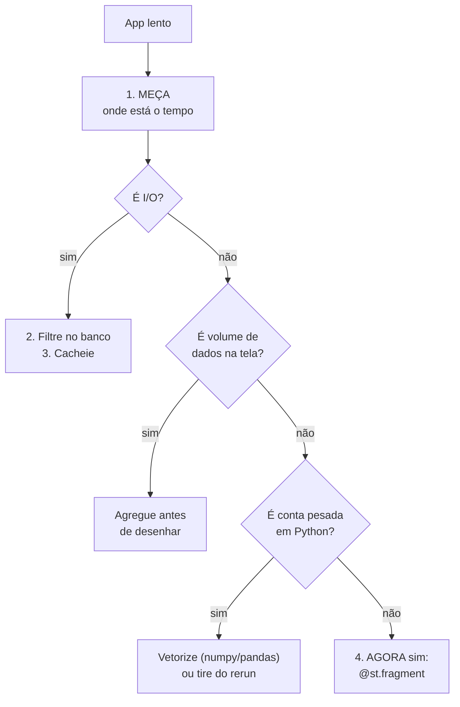

# 15 · Fragments e desempenho

> **Nível:** intermediário a avançado · **Escrito em:** 02/09/2026 · Streamlit 1.63.0

`@st.fragment` é o remendo mais inteligente do Streamlit no custo do próprio
modelo. Mas é o **quarto** passo da otimização, não o primeiro — e usá-lo cedo
demais esconde o problema real.

---

## 1. A ordem correta de otimizar



Colocar `@st.fragment` numa função que faz uma consulta de 8 segundos não deixa a
consulta mais rápida — só faz o resto da página parar de piscar enquanto ela
demora. Às vezes é o que você quer; frequentemente não é.

---

## 2. O que um fragmento é

Uma função decorada que **reexecuta sozinha**. Quando o usuário mexe num widget
criado *dentro* dela, o Streamlit reexecuta apenas a função — não o script.

```python
@st.fragment
def bloco():
    n = st.slider("Pontos", 10, 500, 100, key="n")
    st.line_chart(gerar(n))          # mexer no slider reexecuta SÓ isto

carregar_dados_caros()               # não reexecuta
bloco()
st.write("nem isto")
```

Assinatura completa na 1.63.0:

```python
st.fragment(func=None, *, run_every=None, parallel=False, key=None)
```

| Parâmetro | O que faz |
|---|---|
| `run_every` | reexecuta sozinho a cada intervalo (`"2s"`, `30`, `timedelta`) |
| `parallel` | 1.58+: o fragmento roda em paralelo com outros, num pool |
| `key` | identidade estável; permite `st.rerun(scope=<key>)` de fora |

---

## 3. As regras que doem

**1. Um fragmento só escreve no lugar dele.** Ele tem um contêiner próprio na
árvore. Um `st.write` dentro de um fragmento não pode aparecer fora dele.

**2. `st.rerun()` dentro de um fragmento reexecuta o app inteiro.** Para
reexecutar só o fragmento: `st.rerun(scope="fragment")`.

**3. Widgets de fora do fragmento, lidos dentro, ficam com valor da última
execução completa.** O fragmento não reexecuta quando eles mudam.

```python
uf = st.selectbox("UF", ufs, key="uf")     # fora

@st.fragment
def bloco():
    st.write(uf)          # ⚠ valor congelado da última execução do APP
```

Correção: leia do `session_state` dentro do fragmento — assim ele sempre pega o
valor atual:

```python
@st.fragment
def bloco():
    st.write(st.session_state["uf"])       # ok
```

**4. Escrita em `session_state` dentro do fragmento é visível para o app inteiro.**
É o canal de comunicação de dentro para fora.

**5. Não aninhe fragmentos.** Não é suportado.

**6. `st.dialog` e `st.fragment` não se combinam bem.** O diálogo já é um
fragmento por dentro.

---

## 4. Onde vale a pena

| Situação | Ganho |
|---|---|
| bloco com controles próprios (eixos de um gráfico, granularidade) | **alto** |
| monitor que se atualiza sozinho (`run_every`) | **alto** — é a única forma correta |
| tabela paginada, dentro de uma página com KPIs caros | **alto** |
| formulário longo dentro de painel pesado | médio |
| bloco de leitura pura, sem widget dentro | **nenhum** |
| a página inteira num fragmento | **nenhum**, e você perdeu o `st.stop()` |

---

## 5. `run_every` — atualização automática, com a conta na mão

```python
@st.fragment(run_every="5s")
def fila():
    n = consultar_tamanho_da_fila()
    st.metric("Na fila", n, border=True,
              delta_color="inverse")     # subir é ruim
```

**Faça a conta antes de escolher o intervalo:**

```
5 s  →  720 execuções/hora  ×  cada usuário conectado
2 s  → 1.800 execuções/hora ×  cada usuário conectado
```

Com 20 pessoas com a aba aberta e `run_every="2s"`, são **36 mil consultas por
hora**. Se cada uma custa 20 ms de banco, é 12 minutos de banco por hora só para
esse painel. Some cache com TTL igual ao intervalo, ou aumente o intervalo.

**A conta que quase ninguém faz:** a aba esquecida aberta durante o fim de semana
continua consultando. `run_every` sem TTL de cache já derrubou banco de produção.

---

## 6. Fragmentos paralelos (1.58+)

```python
@st.fragment(parallel=True)
def vendas():
    st.metric("Vendas", consultar_vendas())      # 2 s

@st.fragment(parallel=True)
def estoque():
    st.metric("Estoque", consultar_estoque())    # 3 s

vendas(); estoque()      # ~3 s no total, não 5 s
```

O pool é controlado por `runner.parallelMaxWorkers`.

**Só ganha quando o trabalho libera o GIL** — isto é: I/O (banco, HTTP) e
operações vetorizadas de numpy/pandas. Dois fragmentos fazendo laço Python puro
**não** ganham nada, porque disputam o mesmo GIL.

**Cuidado:** dentro de um fragmento paralelo você está em outra thread. Objetos
não seguros para threads (uma conexão SQLite compartilhada, por exemplo) podem
quebrar. Use conexão por thread — é o que o
[projeto-modelo faz](07-projeto-modelo/nucleo/db.py).

---

## 7. Medindo de verdade

```python
import time
import streamlit as st

if "perf" not in st.session_state:
    st.session_state.perf = {}

class Cronometro:
    def __init__(self, nome): self.nome = nome
    def __enter__(self): self.t = time.perf_counter(); return self
    def __exit__(self, *a):
        st.session_state.perf[self.nome] = time.perf_counter() - self.t

with Cronometro("consulta"):
    df = consultar()
with Cronometro("agregação"):
    kpis = agregar(df)

with st.sidebar.expander("desempenho"):
    for nome, seg in sorted(st.session_state.perf.items(), key=lambda x: -x[1]):
        st.write(f"`{nome}` — {seg*1000:.0f} ms")
```

Complementos:

- `@st.cache_data(show_time=True)` — mostra a duração na própria mensagem;
- `[server] enableExpensiveMemoryStats = true` — estatísticas de memória;
- para perfilar a lógica de verdade, rode `cProfile` **fora** do Streamlit, na
  função pura do seu `nucleo/`. Perfilar dentro do app mistura o custo do
  framework com o seu.

---

## 8. Um orçamento de desempenho

Metas que eu uso, e que a maior parte dos painéis internos consegue cumprir:

| Ação | Meta | Limite tolerável |
|---|---|---|
| primeira carga da página | < 2 s | 5 s |
| trocar um filtro (com cache quente) | < 300 ms | 1 s |
| trocar um filtro (cache frio) | < 2 s | 5 s |
| memória por sessão | < 100 MB | 300 MB |
| pontos num gráfico | < 2.000 | 10.000 |
| linhas numa tabela na tela | < 10.000 | use `lazy=True` |

Acima do "limite tolerável", o usuário troca o painel por uma planilha. Isso não é
figura de linguagem: é o que acontece.

---

## 9. As dez otimizações que mais rendem, em ordem

1. **Filtrar no banco** em vez de em Python.
2. **`@st.cache_data` com TTL** na função de carga.
3. **Agregar** antes de desenhar (`resample`, `groupby`).
4. **Selecionar colunas** (`SELECT` explícito, não `SELECT *`).
5. **`astype("category")`** em colunas de texto repetido.
6. **`st.form`** onde a interação não precisa ser imediata.
7. **`@st.fragment`** nos blocos com controle próprio.
8. **`lazy=True`** em `st.dataframe` grande.
9. **`persist="disk"`** no que é caro e muda pouco.
10. **`refresh_mode="background"`** para o usuário nunca esperar o TTL.

Se depois desses dez o app ainda está lento, o problema não é Streamlit: é a
consulta, o volume ou a arquitetura. Ver
[31-quando-nao-usar-streamlit.md](31-quando-nao-usar-streamlit.md).

---

## Autoteste

1. Por que `@st.fragment` é o quarto passo da otimização, e não o primeiro?
2. O que acontece se um fragmento lê uma variável de widget definida fora dele?
   Qual é a correção?
3. `st.rerun()` dentro de um fragmento faz o quê? E como reexecutar só o fragmento?
4. Faça a conta: 15 usuários, `run_every="3s"`, consulta de 30 ms. Quanto de banco
   por hora?
5. Quando `parallel=True` **não** dá ganho nenhum, e por quê?
6. Cite três metas do orçamento de desempenho e o que acontece ao estourá-las.
7. Liste, em ordem, as cinco otimizações que mais rendem.
