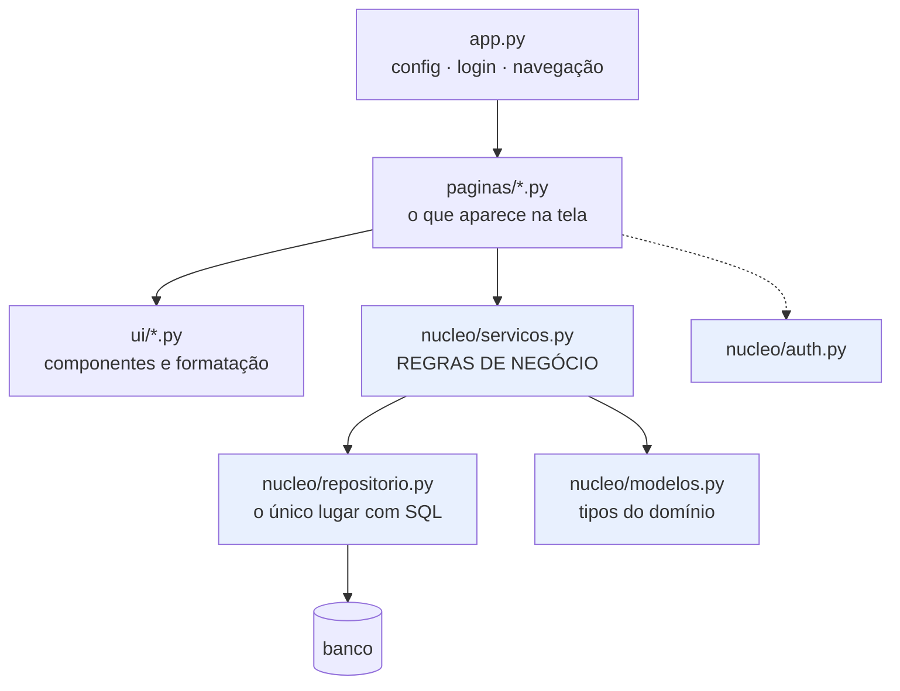

# 23 · Arquitetura de uma app que vai durar

> **Nível:** avançado · **Escrito em:** 02/09/2026
> Este arquivo é o mais opinativo do curso. Está marcado onde é opinião.

Toda app de Streamlit começa com um `app.py`. Muitas terminam com um `app.py` de
2.000 linhas que ninguém quer tocar. Este arquivo é sobre como evitar isso — e
sobre quando **não** vale a pena evitar.

---

## 1. A única regra que importa

> **Nenhum arquivo com regra de negócio importa `streamlit`.**

Se você seguir só isso e ignorar o resto do arquivo, já terá 80% do benefício.

**Por quê, concretamente:**

| Benefício | Como aparece |
|---|---|
| **testável** | `pytest` roda a regra em milissegundos, sem servidor, sem navegador |
| **reutilizável** | a mesma função serve ao app, a um endpoint FastAPI, a um job noturno, a um notebook |
| **legível** | dá para ler a regra sem entender rerun, cache e `session_state` |
| **substituível** | o dia em que o Streamlit não servir mais, você troca a camada de cima |
| **depurável** | o erro é um erro de Python normal, não "algo estranho no rerun" |

O [projeto-modelo](07-projeto-modelo/) tem essa regra escrita no docstring do
`nucleo/__init__.py`, e os 27 testes de `test_servicos.py` são a prova de que ela
está sendo cumprida: se alguém importar `streamlit` lá dentro, os testes começam a
precisar de contexto de execução e quebram.

---

## 2. As camadas



Em azul: o que **não** importa `streamlit`.

| Camada | Responsabilidade | Pode importar `streamlit`? |
|---|---|---|
| `app.py` | configurar, autenticar, navegar | sim |
| `paginas/` | montar a tela, orquestrar | sim |
| `ui/` | componentes visuais, formatação | sim |
| `nucleo/servicos.py` | regras, agregações, validação | **não** |
| `nucleo/repositorio.py` | acesso a dados, SQL | **não** |
| `nucleo/modelos.py` | tipos | **não** |
| `nucleo/config.py` | configuração validada | **não** |

**A direção das setas nunca se inverte.** `nucleo` não conhece `paginas`.
`repositorio` não conhece `servicos`. Se você precisar inverter, o desenho está
errado.

---

## 3. Quando **não** fazer isso

Sendo honesto, porque arquitetura em excesso também mata projeto:

| Situação | Faça |
|---|---|
| script de 80 linhas, um gráfico, uso pessoal | **um arquivo só**. Não invente camadas |
| protótipo para validar uma ideia esta semana | um arquivo, no máximo dois |
| painel de leitura, sem escrita, 3 gráficos | `app.py` + um `dados.py` com as consultas cacheadas |
| **qualquer coisa que escreva no banco** | camadas |
| **qualquer coisa com mais de uma pessoa mexendo** | camadas |
| **qualquer coisa que vá durar mais de seis meses** | camadas |

**Regra prática, opinião minha:** a partir de ~300 linhas, ou no momento em que
aparece a primeira escrita no banco, separe. Antes disso, a separação custa mais
do que rende.

---

## 4. Estrutura de arquivos recomendada

```
projeto/
├── app.py                    # ≤ 150 linhas. Se crescer, algo está no lugar errado.
├── paginas/
│   ├── _comum.py             # cache, filtros, guardas
│   ├── painel.py
│   └── pedidos.py
├── ui/
│   ├── componentes.py        # KPI, gráficos, tabelas — o visual, num lugar só
│   └── formatos.py           # moeda, data, número
├── nucleo/
│   ├── config.py             # ambiente → objeto validado
│   ├── modelos.py            # dataclasses
│   ├── db.py                 # conexão, transação, migração
│   ├── repositorio.py        # SQL
│   ├── servicos.py           # regras
│   └── auth.py
├── testes/
│   ├── conftest.py
│   ├── test_servicos.py      # rápido, sem UI
│   └── test_app.py           # AppTest
├── .streamlit/config.toml
├── requirements.txt          # versões FIXADAS
├── Dockerfile
└── README.md                 # como rodar, em comandos exatos
```

---

## 5. Configuração: validada na partida

```python
@dataclass(frozen=True)
class Config:
    caminho_banco: Path
    ambiente: str
    iteracoes_hash: int

def carregar(env: dict[str, str] | None = None) -> Config:
    env = dict(os.environ if env is None else env)
    ambiente = env.get("PAINEL_AMBIENTE", "dev")
    if ambiente not in {"dev", "prod"}:
        raise ErroDeConfiguracao(f"PAINEL_AMBIENTE='{ambiente}' inválido.")
    ...
```

Três propriedades, e cada uma resolve um problema real:

1. **Falha na partida**, não no meio do uso. Um `os.environ["X"]` perdido numa
   função só estoura quando alguém clica naquele botão, em produção, na sexta.
2. **Documenta**: olhando o `Config`, você sabe **todas** as variáveis que a app
   usa. `grep os.environ` espalhado não te diz isso.
3. **Injetável**: `carregar({"PAINEL_BANCO": "/tmp/teste.db"})` permite testar com
   outra configuração sem tocar no ambiente global — que é o que faz o
   `conftest.py` do projeto-modelo.

---

## 6. Erros: falhar com dignidade

**Três níveis, e cada um tem um destino diferente:**

```python
# 1. Erro esperado, do domínio → mensagem para o usuário
class SaldoInsuficiente(Exception): ...

try:
    servicos.debitar(conta, valor)
except SaldoInsuficiente as e:
    st.error(str(e), icon=":material/account_balance_wallet:")

# 2. Erro de infraestrutura → mensagem genérica + log detalhado
except OperationalError:
    logger.exception("banco indisponível")
    st.error("Serviço temporariamente indisponível. Tente em alguns minutos.",
             title="Dados indisponíveis", icon=":material/cloud_off:")
    st.stop()

# 3. Erro inesperado → deixe estourar em dev; esconda em prod
```

```toml
[client]
showErrorDetails = "none"     # produção: nada de traceback na tela do usuário
```

**Por que esconder o traceback:** ele mostra caminhos de arquivo, nomes de
funções, trechos de SQL e, às vezes, valores. É reconhecimento gratuito para quem
quiser atacar a app — e é ilegível para quem só queria ver o relatório.

**Registre em log, com contexto:**

```python
import logging
logger = logging.getLogger("painel")
logger.exception("falha ao gravar pedido", extra={"usuario": u.email, "id": pid})
```

---

## 7. Padrões que funcionam

### Repositório

Todo SQL num lugar só. O resto da app fala em funções:

```python
def buscar_pedidos(caminho, *, inicio, fim, status=()) -> list[dict]: ...
def inserir_pedido(caminho, pedido: dict) -> int: ...
```

**Ganho concreto:** trocar SQLite por PostgreSQL toca **dois** arquivos.
**Custo:** uma camada de indireção. Vale a partir de ~10 consultas.

### Serviço

A regra de negócio, sem tela e sem SQL:

```python
def calcular_kpis(atual: pd.DataFrame, anterior: pd.DataFrame) -> KPIs:
    # "pedido cancelado não conta como receita" mora AQUI, em um lugar só
```

É isso que evita o clássico "o painel bate com o financeiro em janeiro e não bate
em fevereiro": a regra estava duplicada em dois lugares e alguém mudou um.

### Validação no serviço, não no formulário

```python
def validar_pedido(dados: dict) -> list[str]:
    """Devolve os problemas. Vazio = tudo certo."""
```

Chamada pelo formulário **e** pela importação de CSV **e** por um script de carga.
Validar no formulário é validar num lugar só — e a importação de CSV vai gravar
lixo.

### Injeção de dependência de pobre

```python
def carregar_pedidos(caminho: Path, inicio, fim): ...    # recebe o caminho
```

Em vez de ler um global. Isso é o que permite ao teste passar um banco temporário.
Não precisa de framework de injeção; um parâmetro basta.

---

## 8. `st.App`: embutir numa aplicação ASGI maior

Desde a 1.53, com a mudança para Starlette, existe:

```python
from streamlit import App

app = App("app.py", routes=[...], middleware=[...], lifespan=...)
```

Isso permite montar a app Streamlit dentro de uma aplicação ASGI maior, com
rotas próprias e *middleware*.

**Casos de uso reais:** acrescentar um endpoint `/health` customizado; pôr um
middleware de autenticação ou de log; servir uma API pequena ao lado do painel.

**Opinião:** é um recurso novo, e a documentação ainda é fina. Não construa a
arquitetura da empresa em cima dele hoje. Para "API + painel", a arquitetura que
eu recomendo continua sendo **dois processos**: FastAPI de um lado, Streamlit do
outro, ambos importando o mesmo `nucleo/`. É mais simples de raciocinar, escalar
e depurar — e é exatamente o desenho que a separação de camadas deste arquivo já
te dá de graça.

---

## 9. Qualidade

```toml
# pyproject.toml
[tool.ruff]
line-length = 100

[tool.ruff.lint]
select = ["E", "F", "I", "B", "S", "UP"]   # S = segurança (bandit)

[tool.pytest.ini_options]
testpaths = ["testes"]
pythonpath = ["."]
```

CI mínimo que pega quase tudo:

```yaml
# .github/workflows/ci.yml
name: ci
on: [push, pull_request]
jobs:
  testar:
    runs-on: ubuntu-latest
    steps:
      - uses: actions/checkout@v4
      - uses: astral-sh/setup-uv@v5
      - run: uv sync --frozen
      - run: uv run ruff check .
      - run: uv run pytest -q
```

Os testes de `AppTest` rodam nesse CI sem navegador — é o que torna isso barato.

---

## 10. Sinais de que a arquitetura está errada

- `app.py` com mais de 300 linhas;
- `import streamlit` dentro de `nucleo/`;
- a mesma consulta SQL escrita em dois arquivos;
- nenhum teste, porque "não dá para testar Streamlit" (dá — ver [30](30-testes.md));
- `st.session_state` usado como banco de dados;
- uma função que faz consulta, calcula e desenha, tudo junto;
- copiar e colar entre páginas em vez de extrair para `_comum.py`;
- `try/except Exception: pass`;
- a regra de negócio está num `if` dentro de um `with st.form`.

---

## Autoteste

1. Qual é a única regra de arquitetura que importa, e quais são os cinco
   benefícios dela?
2. Em que situações **não** vale a pena separar em camadas?
3. Desenhe a direção das dependências entre as camadas. O que nunca pode acontecer?
4. Três propriedades de uma configuração validada na partida.
5. Quais são os três níveis de erro e o destino de cada um?
6. Por que a validação mora no serviço e não no formulário?
7. Que ganho concreto o padrão repositório dá, e a partir de quando ele compensa?
8. O que é `st.App` e por que eu recomendo cautela com ele hoje?
9. Cite cinco sinais de que a arquitetura de uma app Streamlit está errada.
