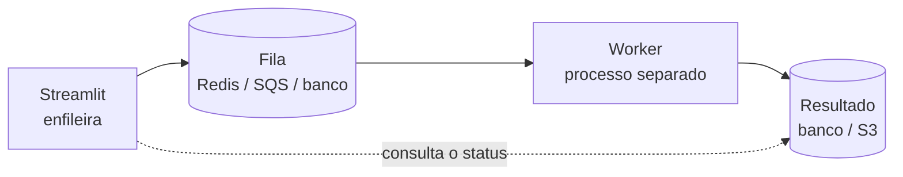

# 24 · Tarefas longas, threads e concorrência

> **Nível:** avançado · **Escrito em:** 02/09/2026 · Streamlit 1.63.0

O modelo do Streamlit assume que o script termina rápido. Quando não termina, é
preciso saber exatamente o que acontece — porque o comportamento surpreende.

---

## 1. O que acontece com uma tarefa longa

```python
resultado = processar_por_5_minutos()      # bloqueia a sessão inteira
st.write(resultado)
```

Durante esses 5 minutos:

- **a sessão do usuário fica travada** — nenhum widget responde;
- o WebSocket continua vivo (há ping periódico), então ele não é desconectado;
- se ele mexer em qualquer coisa, o run é **abandonado** e recomeça do zero;
- **as outras sessões continuam funcionando**, salvo se a tarefa for CPU pura em
  Python (aí o GIL prejudica todo mundo).

Esse último ponto é importante: uma tarefa de I/O longa (esperar um banco, uma
API) não trava os outros usuários. Um laço Python de milhões de iterações trava.

---

## 2. Feedback: o mínimo obrigatório

```python
with st.spinner("Consultando o banco...", show_time=True):
    dados = consulta_lenta()
```

```python
with st.status("Processando lote...", expanded=True) as s:
    st.write("1/3 — lendo arquivo")
    ...
    st.write("2/3 — validando")
    ...
    s.update(label="Concluído em 42 s", state="complete")
```

```python
barra = st.progress(0.0, text="0%")
for i, item in enumerate(itens, start=1):
    processar(item)
    barra.progress(i / len(itens), text=f"{i}/{len(itens)}")
```

**Regra:** acima de **1 segundo**, mostre algo. Acima de **10 segundos**, mostre
**progresso**, não só um spinner — a pessoa precisa saber que não travou.

---

## 3. O botão "parar" que não para

```python
if st.button("Parar"):
    st.session_state.parar = True

for item in itens:
    if st.session_state.get("parar"):       # ← nunca vira True durante o laço
        break
    processar(item)
```

**Por que não funciona:** o clique só chega ao servidor como um novo rerun, e o
rerun só começa quando o atual termina ou é interrompido. Dentro do laço, o
`session_state` não muda.

**O que funciona de verdade:** tirar o trabalho de dentro do rerun. Ou seja: as
seções 4 e 6.

---

## 4. Threads: as regras

O código do Streamlit é explícito sobre isso: a execução do script acontece numa
*script thread*, e chamar funções do Streamlit de outra thread "provavelmente não
vai funcionar corretamente por falta de `ScriptRunContext`".

Na prática:

```python
import threading

def trabalho():
    st.write("oi")            # IGNORADO, com aviso no log:
                              # "Thread 'X': missing ScriptRunContext!"

threading.Thread(target=trabalho).start()
```

**O padrão correto: a thread calcula e devolve; o script escreve.**

```python
from concurrent.futures import ThreadPoolExecutor
import streamlit as st

@st.cache_resource
def executor() -> ThreadPoolExecutor:
    return ThreadPoolExecutor(max_workers=4)

if st.button("Iniciar", type="primary"):
    st.session_state.tarefa = executor().submit(trabalho_pesado, parametros)

tarefa = st.session_state.get("tarefa")
if tarefa is not None:
    if tarefa.done():
        try:
            st.success("Concluído.")
            st.dataframe(tarefa.result())
        except Exception as e:
            st.error(f"A tarefa falhou: {e}")
        del st.session_state.tarefa
    else:
        st.info("Processando...", icon=":material/hourglass:")
        # sem isto, a página fica parada esperando o usuário clicar em algo
        time.sleep(2)
        st.rerun()
```

**Três cuidados obrigatórios:**

1. O `ThreadPoolExecutor` em `cache_resource` é **compartilhado por todas as
   sessões**. Dimensione pensando no total de usuários, não em um.
2. `tarefa.result()` **relança** a exceção que aconteceu na thread. Sem o
   `try/except`, o erro aparece como um traceback confuso.
3. Objetos não seguros para threads (uma conexão SQLite compartilhada) quebram.
   Use conexão por thread — é o que o
   [`nucleo/db.py`](07-projeto-modelo/nucleo/db.py) faz com `threading.local()`.

### O padrão de polling com `st.fragment`

Melhor que `time.sleep` + `st.rerun`, porque só o bloco de status pisca:

```python
@st.fragment(run_every="2s")
def acompanhar():
    t = st.session_state.get("tarefa")
    if t is None:
        return
    if t.done():
        st.success("Concluído.")
        st.session_state.resultado = t.result()
        del st.session_state.tarefa
        st.rerun()                     # rerun do APP, para redesenhar tudo
    else:
        st.info("Processando...")
```

---

## 5. Fragmentos paralelos (1.58+)

```python
@st.fragment(parallel=True)
def bloco_a(): st.metric("A", consultar_a())      # 2 s de I/O

@st.fragment(parallel=True)
def bloco_b(): st.metric("B", consultar_b())      # 3 s de I/O

bloco_a(); bloco_b()                              # ~3 s, não 5 s
```

Só ganha quando o trabalho **libera o GIL**: I/O, ou operações vetorizadas de
numpy/pandas. Dois laços Python puros disputam o mesmo GIL e não ganham nada.

Pool controlado por `runner.parallelMaxWorkers`.

---

## 6. A resposta certa para trabalho pesado: tirar do app

Para qualquer coisa que passe de ~30 segundos, a arquitetura correta **não** é
threads dentro do Streamlit. É uma fila.



```python
# no app: só enfileira
if st.button("Gerar relatório completo"):
    job_id = fila.enfileirar("relatorio_completo", {"periodo": periodo,
                                                    "usuario": u.email})
    st.session_state.job = job_id
    st.toast("Relatório na fila. Avisamos quando ficar pronto.")

# e acompanha
if job := st.session_state.get("job"):
    estado = fila.status(job)
    if estado == "pronto":
        st.download_button("Baixar", fila.resultado(job), "relatorio.xlsx")
    else:
        st.info(f"Estado: {estado}")
```

**Ferramentas:** Celery + Redis (o padrão), RQ (mais simples), Dramatiq, ou uma
tabela de fila no próprio PostgreSQL (`SELECT ... FOR UPDATE SKIP LOCKED`) — que
para volumes moderados é surpreendentemente adequada e não acrescenta
infraestrutura.

**Ganhos:** o deploy do app não mata o trabalho em andamento; dá para escalar
workers separadamente; dá para repetir uma tarefa que falhou; o usuário fecha a
aba e o trabalho continua.

---

## 7. Trabalho agendado

Streamlit **não** tem agendador, e não deveria ter: a app só executa quando
alguém abre uma aba.

| Precisa | Use |
|---|---|
| atualizar dado a cada X | `cron` / systemd timer / Airflow / GitHub Actions gravando no banco; o app só lê |
| relatório diário por e-mail | job separado |
| atualizar a tela sozinha | `@st.fragment(run_every=...)` — mas só o que já está no banco |

**Anti-padrão que eu já vi em produção:** usar `@st.fragment(run_every="1h")` para
disparar uma carga de dados. Se ninguém abrir a aba, a carga não acontece. Se dez
pessoas abrirem, ela acontece dez vezes.

---

## 8. Estado compartilhado entre sessões

```python
@st.cache_resource
def estado_global() -> dict:
    return {"contador": 0}

# CUIDADO: várias threads escrevendo no mesmo dicionário
estado_global()["contador"] += 1        # condição de corrida
```

Se você **precisa** disso, proteja:

```python
@st.cache_resource
def trava() -> threading.Lock:
    return threading.Lock()

with trava():
    estado_global()["contador"] += 1
```

**Mas quase sempre a resposta certa é outra:** estado compartilhado que importa
vai para o **banco**, que já sabe fazer transação e travamento. Estado global em
memória some no reinício e não sobrevive a mais de um processo.

---

## 9. Limites e tempos de espera

```toml
[server]
websocketPingInterval = 20      # mantém a conexão viva
disconnectedSessionTTL = 120    # segundos guardando a sessão após queda
maxUploadSize = 200             # MB
maxMessageSize = 200            # MB
```

E, no proxy reverso, o tempo limite **precisa** ser maior que a sua tarefa mais
longa. O padrão do nginx é 60 segundos:

```nginx
proxy_read_timeout 3600s;
proxy_send_timeout 3600s;
```

Sem isso, uma tarefa de 5 minutos derruba a conexão aos 60 segundos e o usuário
vê "Connecting..." — e nunca sabe se a tarefa terminou. Ver
[28-deploy-e-operacao.md](28-deploy-e-operacao.md).

---

## Autoteste

1. O que acontece com a sessão, com as outras sessões e com o WebSocket durante
   uma tarefa de 5 minutos?
2. Por que o botão "Parar" dentro de um laço não funciona?
3. O que acontece se você chamar `st.write` numa thread criada por você? Qual é o
   padrão correto?
4. Três cuidados ao usar `ThreadPoolExecutor` num app Streamlit.
5. Quando `parallel=True` dá ganho e quando não dá?
6. A partir de quanto tempo a resposta certa é uma fila? Cite os quatro ganhos.
7. Por que `@st.fragment(run_every="1h")` é um péssimo agendador?
8. Quando estado compartilhado em `cache_resource` é aceitável, e qual é a
   alternativa quase sempre melhor?
9. Que configuração do nginx é obrigatória para tarefas longas, e qual é o sintoma
   de não fazê-la?
