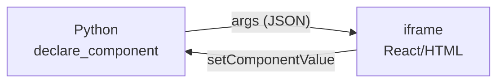

# 25 · Componentes customizados

> **Nível:** avançado · **Escrito em:** 02/09/2026 · Streamlit 1.63.0

Quando a API não tem o que você precisa, há três saídas — e a maioria das pessoas
pula direto para a terceira, que é a mais cara.

---

## 1. As três saídas, em ordem de custo

| Saída | Interativo? | Esforço | Quando |
|---|---|---|---|
| **1. `st.html` / `st.iframe`** | não (só exibe) | minutos | visual estático, incorporar página externa |
| **2. Componente da comunidade** | sim | minutos | alguém já fez |
| **3. Componente próprio** (React) | sim | dias | você precisa mesmo |

**Vá nessa ordem.** Escrever um componente bidirecional significa assumir a
manutenção de um pacote npm, de um build e de uma compatibilidade com versões
futuras do Streamlit. É um compromisso real.

---

## 2. HTML estático

```python
st.html("<div style='padding:12px;border-radius:8px;background:#eef'>Olá</div>")
st.html(Path("cartao.html"))                    # aceita caminho de arquivo
st.iframe("https://exemplo.com/painel", height=600)     # 1.56+
```

`st.html` **não executa JavaScript** por padrão. Há `unsafe_allow_javascript=True`
— e ele merece o nome: com ele, qualquer conteúdo que entre no HTML vira código
executado no navegador do usuário. Nunca use com conteúdo que venha do usuário ou
do banco. Ver [29-seguranca.md](29-seguranca.md).

**Limitação central:** HTML estático **não conversa de volta** com o Python. Um
botão dentro de um `st.html` não dispara rerun nem devolve valor. Se precisa
disso, é componente de verdade.

---

## 3. Componentes da comunidade

Catálogo oficial: <https://streamlit.io/components>.

Os que eu efetivamente uso, e para quê:

| Pacote | Resolve |
|---|---|
| `streamlit-aggrid` | tabela com agrupamento, pivot, edição avançada, milhões de linhas |
| `streamlit-folium` | mapas Leaflet com camadas e interação |
| `streamlit-option-menu` | menu lateral com aparência de navegação de app |
| `streamlit-extras` | coleção de utilidades pequenas |
| `streamlit-echarts` | gráficos ECharts (bons para gauge, sankey, grafo) |
| `streamlit-ace` | editor de código na tela |

**Como avaliar antes de adotar** — cada item é onde eu já me queimei:

1. **Última atualização.** Componente parado há mais de um ano costuma quebrar na
   próxima versão do Streamlit (a API de componentes muda pouco, mas o *front* do
   Streamlit muda bastante).
2. **Compatibilidade declarada** com a sua versão.
3. **Tamanho do bundle JavaScript** — alguns pesam mais que o Streamlit.
4. **Mantenedores.** Um mantenedor único é risco.
5. **Licença.** Nem todo componente é MIT. `streamlit-aggrid` embute o AG Grid,
   cuja versão Enterprise é **paga**; a Community é suficiente para a maioria dos
   casos, mas confira antes de usar recursos que exigem a licença comercial.
6. **Segurança.** Você está executando JavaScript de terceiro no navegador dos
   seus usuários, com acesso ao que está na tela.

---

## 4. Componente próprio: como funciona



O componente roda num **iframe isolado**. Comunicação:

- **Python → componente**: os argumentos, serializados em JSON;
- **componente → Python**: `Streamlit.setComponentValue(v)`, que dispara um rerun
  e faz a função devolver `v`.

**Consequência do iframe:** o componente **não** enxerga o DOM da página, não
pode ler outros widgets e não pode mexer no layout do Streamlit. Isso é
proposital — é o que impede um componente de terceiro de ler a sua tela inteira.

---

## 5. O mínimo funcional, sem build

Dá para fazer um componente bidirecional só com HTML e JavaScript, sem npm.

```
meu_componente/
├── __init__.py
└── frontend/
    └── index.html
```

```python
# meu_componente/__init__.py
from pathlib import Path
import streamlit.components.v1 as components

_dir = Path(__file__).parent / "frontend"
_componente = components.declare_component("contador", path=str(_dir))

def contador(rotulo: str, inicial: int = 0, key: str | None = None) -> int:
    """Devolve o valor atual do contador."""
    return _componente(rotulo=rotulo, inicial=inicial, key=key, default=inicial)
```

```html
<!-- meu_componente/frontend/index.html -->
<!DOCTYPE html>
<html>
<head><meta charset="utf-8"><style>
  body { font-family: system-ui; margin: 0; padding: 8px; }
  button { font-size: 18px; padding: 4px 14px; cursor: pointer; }
</style></head>
<body>
  <span id="rotulo"></span>
  <button id="menos">−</button>
  <b id="valor">0</b>
  <button id="mais">+</button>

  <script>
    let valor = 0;

    function enviar() {
      document.getElementById("valor").textContent = valor;
      // esta é a única forma de devolver valor ao Python:
      Streamlit.setComponentValue(valor);
    }

    function aoRenderizar(event) {
      const args = event.detail.args;
      document.getElementById("rotulo").textContent = args.rotulo;
      if (valor === 0) { valor = args.inicial; }
      document.getElementById("valor").textContent = valor;
      // OBRIGATÓRIO: informar a altura, senão o iframe fica com 0 px
      Streamlit.setFrameHeight(document.body.scrollHeight);
    }

    document.getElementById("mais").onclick  = () => { valor += 1; enviar(); };
    document.getElementById("menos").onclick = () => { valor -= 1; enviar(); };

    Streamlit.events.addEventListener(Streamlit.RENDER_EVENT, aoRenderizar);
    Streamlit.setComponentReady();     // sem isto, o componente nunca aparece
  </script>
</body>
</html>
```

```python
from meu_componente import contador
n = contador("Quantidade:", inicial=3, key="c1")
st.write("Valor no Python:", n)
```

**As três linhas que todo mundo esquece**, e cada uma produz um sintoma diferente:

| Falta | Sintoma |
|---|---|
| `Streamlit.setComponentReady()` | o componente nunca renderiza; iframe em branco |
| `Streamlit.setFrameHeight(...)` | o componente aparece com altura 0 ou cortado |
| `default=` na chamada Python | a primeira execução devolve `None` e quebra o código abaixo |

---

## 6. Componente com React e build

Para algo maior, use o modelo oficial:
<https://github.com/streamlit/component-template>.

```bash
git clone https://github.com/streamlit/component-template
cd component-template/template/my_component/frontend
npm install
npm start          # servidor de desenvolvimento na 3001
```

```python
_DESENVOLVIMENTO = True     # troque para False ao empacotar

if _DESENVOLVIMENTO:
    _componente = components.declare_component("meu", url="http://localhost:3001")
else:
    _componente = components.declare_component("meu", path=str(_dir / "build"))
```

**Para publicar:** `npm run build`, depois inclua a pasta `build/` no pacote
Python (via `MANIFEST.in` ou `include-package-data`) e publique no PyPI.

**Aviso sobre o esforço real, e é opinião:** um componente publicado é um projeto
com dois ecossistemas (Python e npm), dois processos de build e dois de release.
Antes de começar, pergunte se o problema não se resolve com uma coluna de
`column_config`, um `st.iframe`, ou um componente que já existe. Em quatro anos
usando Streamlit, escrevi componente próprio duas vezes — e uma delas eu não
precisava.

---

## 7. Quando o componente próprio se justifica

- integração com um SDK JavaScript que não tem equivalente em Python (um mapa
  proprietário, um player de vídeo específico, um visualizador DICOM);
- interação que o Streamlit não modela: arrastar e soltar entre listas, desenhar
  sobre uma imagem, editar um grafo;
- necessidade de estado no navegador que não pode ir e voltar ao servidor a cada
  interação (um editor de texto rico com centenas de eventos por minuto).

---

## 8. Armadilhas

| Armadilha | Sintoma | Correção |
|---|---|---|
| esquecer `setComponentReady()` | iframe em branco | chame ao final do script |
| esquecer `setFrameHeight` | altura 0 ou corte | chame a cada render |
| argumentos não serializáveis | erro na chamada | só JSON: números, strings, listas, dicts |
| CSS do componente vazando | não vaza — é iframe | é limitação, não bug |
| tema não acompanha | o componente não sabe do tema | leia `event.detail.theme` |
| componente com `key` duplicada | valores trocados | dê `key` única |
| componente parado quebra na atualização | erro no navegador após `pip install -U streamlit` | fixe a versão do Streamlit **e** do componente |

Ler o tema dentro do componente:

```javascript
function aoRenderizar(event) {
  const tema = event.detail.theme;      // {base, primaryColor, backgroundColor, ...}
  document.body.style.color = tema.textColor;
  document.body.style.background = tema.backgroundColor;
}
```

---

## Autoteste

1. Quais são as três saídas quando a API não tem o que você precisa, e por que a
   ordem importa?
2. Por que `st.html` não resolve um botão que precisa devolver valor ao Python?
3. Descreva o caminho de ida e volta entre Python e componente.
4. Por que o componente roda num iframe, e qual é a consequência boa disso?
5. Quais são as três chamadas JavaScript obrigatórias, e o sintoma de esquecer
   cada uma?
6. Seis critérios para avaliar um componente da comunidade antes de adotá-lo.
7. Cite dois casos em que escrever um componente próprio se justifica.
8. Como um componente descobre o tema do usuário?
