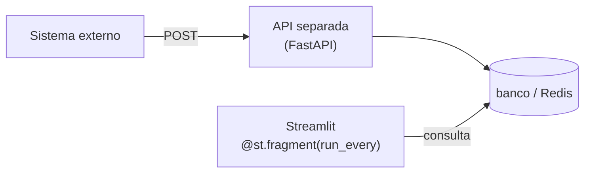

# 27 · Tempo real, streaming e interfaces de chat

> **Nível:** intermediário a avançado · **Escrito em:** 02/09/2026 · Streamlit 1.63.0

"Tempo real" no Streamlit quer dizer três coisas diferentes. Confundi-las produz
os piores anti-padrões do ecossistema.

| O que você quer | Ferramenta |
|---|---|
| texto que aparece aos poucos (resposta de LLM) | `st.write_stream` |
| bloco que se atualiza sozinho | `@st.fragment(run_every=...)` |
| receber um evento de fora (webhook, fila) | **o Streamlit não faz isso** — ver seção 5 |

---

## 1. `st.write_stream`

```python
def gerar():
    for pedaco in fonte():
        yield pedaco

texto_completo = st.write_stream(gerar())
```

Ele escreve pedaço a pedaço e **devolve o texto completo** ao final — que é o que
você guarda no histórico. Aceita gerador, gerador assíncrono ou qualquer iterável.

Com um cliente de LLM (o formato é o mesmo em praticamente todos):

```python
def responder(mensagens):
    with cliente.messages.stream(model=..., messages=mensagens, max_tokens=1024) as fluxo:
        yield from fluxo.text_stream

with st.chat_message("assistant"):
    resposta = st.write_stream(responder(historico))
```

**Detalhes que importam:**

- se o gerador levantar exceção no meio, o que já foi escrito **permanece** na
  tela. Trate dentro do gerador e produza uma mensagem de erro legível;
- o custo da API é cobrado mesmo que o usuário feche a aba no meio;
- o parâmetro `cursor=` controla o cursor piscante ao final do texto.

---

## 2. Interface de chat completa

```python
import streamlit as st

st.title("Assistente")

if "mensagens" not in st.session_state:
    st.session_state.mensagens = []

# 1. Redesenha o histórico. A cada rerun a tela é reconstruída — o histórico
#    em session_state é a ÚNICA fonte da verdade.
for m in st.session_state.mensagens:
    with st.chat_message(m["papel"]):
        st.markdown(m["texto"])

# 2. Entrada, fixada no rodapé pelo próprio Streamlit
if pergunta := st.chat_input("Pergunte algo", accept_file=True,
                             file_type=["pdf", "txt"], max_chars=4000):
    st.session_state.mensagens.append({"papel": "user", "texto": pergunta})
    with st.chat_message("user"):
        st.markdown(pergunta)

    with st.chat_message("assistant"):
        try:
            resposta = st.write_stream(responder(st.session_state.mensagens))
        except Exception as e:
            resposta = f"Não consegui responder: {e}"
            st.error(resposta)

    st.session_state.mensagens.append({"papel": "assistant", "texto": resposta})
```

**Os cinco itens que faltam em quase todo tutorial de chat:**

1. **Limite do histórico.** Uma lista que só cresce estoura memória **e** custo de
   token. Corte: `st.session_state.mensagens[-40:]`, ou resuma o começo.
2. **Tratamento de erro.** API de LLM falha: limite de taxa, timeout, filtro de
   conteúdo. Sem `try`, o usuário vê um traceback.
3. **Custo visível.** Registre tokens por conversa. Chat interno sem medição já
   gerou fatura desagradável em muita empresa.
4. **Botão de limpar.** Sem ele, o usuário recarrega a página — e perde tudo,
   inclusive o login.
5. **Persistência.** `session_state` some no F5. Se a conversa importa, grave no
   banco com um identificador de conversa.

Para o conteúdo de IA em si (prompt, RAG, agentes, avaliação), este repositório
tem assuntos próprios: [`engenharia-de-prompt`](../engenharia-de-prompt/00-MAPA.md)
e [`agentes-de-ia`](../agentes-de-ia/00-MAPA.md).

---

## 3. Atualização automática

```python
@st.fragment(run_every="5s")
def painel_ao_vivo():
    dados = consultar_ultimos()          # já cacheado, com ttl ~= run_every
    st.metric("Na fila", dados["fila"], border=True, delta_color="inverse")
    st.line_chart(dados["serie"])

painel_ao_vivo()
```

**Faça a conta antes de escolher o intervalo:**

| Intervalo | Execuções/hora, por usuário conectado |
|---|---|
| 1 s | 3.600 |
| 5 s | 720 |
| 30 s | 120 |
| 60 s | 60 |

Com 20 abas abertas e `run_every="5s"`, são 14.400 consultas por hora. Some cache
com TTL igual ao intervalo — assim as 20 abas compartilham **uma** consulta por
ciclo, não 20.

**A aba esquecida.** Uma aba aberta na sexta continua consultando o fim de semana
inteiro. Isso já derrubou banco de produção. Mitigações: intervalos maiores, TTL
de cache, e `disconnectedSessionTTL` baixo.

### O anti-padrão

```python
# NUNCA
while True:
    espaco.metric("CPU", medir())
    time.sleep(1)
```

Isso trava a sessão para sempre: nenhum outro widget responde, o script nunca
termina, e o usuário não consegue nem trocar de página. Antes do `st.fragment`
era o jeito conhecido; hoje não há desculpa.

---

## 4. Progresso ao vivo de um processo

```python
espaco = st.empty()                   # reserva o lugar
for i, item in enumerate(itens, 1):
    resultado = processar(item)
    espaco.info(f"{i}/{len(itens)} — {item}: {resultado}")   # SUBSTITUI
```

`st.empty()` é o que permite substituir em vez de empilhar. Sem ele, um processo
de 500 itens escreve 500 linhas.

Para um log que cresce (e que o usuário quer ver inteiro), use um contêiner com
rolagem automática:

```python
with st.container(height=300, autoscroll=True):
    for linha in log:
        st.text(linha)
```

---

## 5. O que o Streamlit **não** faz: receber eventos de fora

Este é o limite mais importante deste arquivo.

O Streamlit **não tem** endpoint HTTP para você chamar de fora. Não dá para um
sistema externo fazer `POST /webhook` na sua app e ver a tela de alguém mudar.

**O que fazer:**



O evento vai para um armazenamento; a app **consulta**. É *polling*, e para 99%
dos painéis internos é perfeitamente adequado — com 5 segundos de intervalo,
ninguém percebe a diferença.

**Se você precisa mesmo de push de verdade** (milissegundos, milhares de eventos),
o Streamlit não é a ferramenta. Ver
[31-quando-nao-usar-streamlit.md](31-quando-nao-usar-streamlit.md).

**E `st.App`?** Desde a 1.53 é possível montar a app num aplicativo ASGI com rotas
próprias, o que tecnicamente permite um endpoint de webhook no mesmo processo.
Mas o endpoint ainda não tem como "empurrar" para uma sessão específica — ele
grava em algum lugar e a sessão consulta. O desenho acima continua valendo.

---

## 6. Assíncrono (`async`)

O script do Streamlit é **síncrono**. Para chamar código assíncrono:

```python
import asyncio

@st.cache_resource
def laco() -> asyncio.AbstractEventLoop:
    return asyncio.new_event_loop()

resultado = laco().run_until_complete(minha_corrotina())
```

Ou, mais simples e quase sempre suficiente:

```python
resultado = asyncio.run(minha_corrotina())
```

**Cuidado:** `asyncio.run` cria e destrói um laço de eventos a cada chamada. Se a
sua biblioteca guarda estado ligado ao laço (um cliente HTTP assíncrono, por
exemplo), isso quebra. Nesse caso, guarde o laço **e** o cliente em
`cache_resource`, juntos.

Desde a 1.57 o servidor é ASGI (Starlette/Uvicorn), o que torna o suporte a
`async` menos hostil que na era Tornado — mas o **seu script** continua sendo
executado de forma síncrona.

---

## 7. Armadilhas

| Armadilha | Sintoma | Correção |
|---|---|---|
| `while True` + `sleep` | sessão travada para sempre | `@st.fragment(run_every=)` |
| histórico de chat sem limite | memória e custo crescendo | corte a lista |
| `run_every` sem cache | N usuários = N× consultas | `ttl` ≈ `run_every` |
| aba esquecida aberta | consulta no fim de semana inteiro | intervalo maior, TTL de sessão |
| esperar webhook no Streamlit | não existe | API separada + polling |
| escrever log sem `st.empty()` | 500 linhas na tela | reserve o espaço |
| `asyncio.run` com cliente persistente | erro de laço fechado | guarde laço e cliente juntos |
| streaming sem `try` | traceback no meio da resposta | trate dentro do gerador |

---

## Autoteste

1. Quais são os três sentidos de "tempo real" no Streamlit, e a ferramenta de cada
   um?
2. O que `st.write_stream` devolve, e por que isso importa para o histórico?
3. Cite os cinco itens que faltam em quase todo tutorial de chat.
4. Faça a conta: 30 abas, `run_every="2s"`. Quantas execuções por hora? Como
   reduzir para uma consulta por ciclo?
5. Por que `while True` + `sleep` é o pior anti-padrão do Streamlit?
6. Para que serve `st.empty()` num laço de progresso?
7. Um sistema externo precisa avisar a app de um evento. Desenhe a solução.
8. Que cuidado `asyncio.run` exige com clientes assíncronos persistentes?
