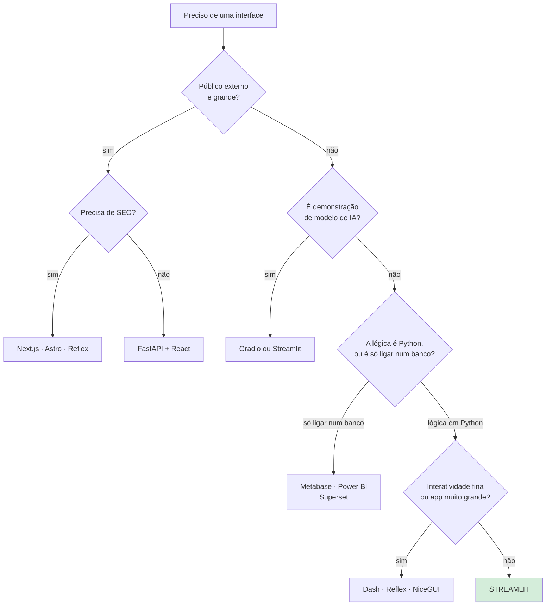

# 31 · Quando **não** usar Streamlit

> **Nível:** intermediário · **Escrito em:** 02/09/2026
> Este arquivo é opinativo por natureza. Onde é medição, está dito; onde é
> julgamento profissional, está marcado.

Todo curso de ferramenta tem a obrigação de dizer onde ela não serve. Sem isso,
ele é propaganda.

---

## 1. Os seis sinais de que você escolheu errado

Se três destes forem verdade no seu projeto, reconsidere:

1. **Você está lutando contra o rerun.** Mais de cinco `st.fragment`, muitos
   `st.rerun()`, `session_state` com trinta chaves para simular estado de tela.
2. **Você está injetando CSS para conseguir o layout.** O layout que você precisa
   não é o que a ferramenta oferece.
3. **Você escreveu (ou quer escrever) três componentes customizados.** Você está
   fazendo um app React com um invólucro de Python.
4. **O público é externo e grande.** Cada visitante custa memória no servidor, o
   tempo todo.
5. **Você precisa de SEO.** O conteúdo é montado por JavaScript depois do
   carregamento; buscador não indexa.
6. **A interação precisa ser em milissegundos.** Cada interação é uma ida ao
   servidor.

---

## 2. Comparação honesta com as alternativas

| | **Streamlit** | **Dash** | **Reflex** | **Gradio** | **NiceGUI** | **FastAPI + React** |
|---|---|---|---|---|---|---|
| Modelo | rerun do script | callbacks explícitos | estado → React compilado | blocos de entrada/saída | eventos, estilo Vue | separação total |
| Linhas para um painel simples | **~50** | ~120 | ~90 | ~30 | ~80 | ~400 |
| Curva de aprendizado | **muito baixa** | média | média | **muito baixa** | média | alta |
| Granularidade de execução | página (ou fragmento) | **por callback** | **por componente** | por função | **por evento** | total |
| Controle de layout | limitado | bom | **total** | limitado | bom | **total** |
| Escala de usuários | dezenas por processo | centenas | centenas | dezenas | centenas | **milhares** |
| SEO | não | não | **sim** (SSR) | não | não | **sim** |
| Precisa de JavaScript? | não | não | não | não | não | **sim** |
| Maturidade / comunidade | **muito grande** | grande | crescente | grande (IA) | média | **enorme** |
| Melhor para | painel e app de dados | painel analítico complexo | app web em Python | demo de modelo | painel/IoT interno | produto |

Os números de linhas são de ordem de grandeza, para o mesmo painel de KPI +
gráfico + filtro; variam com o gosto de quem escreve.

### Quando cada uma ganha

**Dash** ganha quando a interatividade é fina e o app é grande: você declara
`@callback(Output(...), Input(...))` e só aquilo executa. É mais verboso e mais
previsível. Se você já usou `st.fragment` cinco vezes na mesma página, o Dash
provavelmente era a escolha.

**Reflex** ganha quando você quer um app web de verdade — rotas, SEO, layout
livre — sem escrever JavaScript. Ele compila Python para React. O preço: um
modelo mental próprio, e um projeto mais novo que os outros.

**Gradio** ganha em demonstração de modelo de IA. Fluxo entrada → função → saída,
integração pronta com Hugging Face, e um link público em uma linha. Para painel
de dados, perde.

**NiceGUI** ganha em app interno com interação por eventos, e é o mais próximo de
"programar interface" sem sair do Python. Comunidade menor.

**Panel / Holoviz** ganha no mundo científico: integração profunda com HoloViews,
Datashader e volumes grandes de dados. Curva mais íngreme.

**Shiny for Python** ganha se a equipe vem do R, ou se você quer o modelo reativo
de verdade (com dependências declaradas). Ecossistema Python ainda menor.

**FastAPI + React (ou Next.js)** ganha quando é um **produto**: muitos usuários,
requisitos de design, SEO, mobile, equipe de front-end. Custa 5 a 10 vezes mais
trabalho, e é o certo mesmo assim quando o produto justifica.

**Power BI / Metabase / Superset / Looker** ganham quando a necessidade é BI
clássico: conectar a um banco, arrastar campos, agendar relatório, governar
permissão por linha. Se o painel não tem lógica em Python, Streamlit está
resolvendo com código um problema que uma ferramenta de BI resolve com
configuração — e a manutenção recai sobre você.
Ver [`power-bi`](../power-bi/00-MAPA.md).

---

## 3. Os casos concretos

### "Preciso de um site público com SEO"

**Não use Streamlit.** O conteúdo é montado depois do carregamento; o buscador vê
uma página quase vazia. Use Next.js, Astro, Hugo, ou Reflex.

### "Preciso servir 5.000 usuários simultâneos"

**Provavelmente não.** Cada sessão é uma conexão WebSocket viva e memória de
servidor ocupada o tempo todo. Um processo atende bem dezenas de sessões pouco
ativas. 5.000 simultâneos exige dezenas de processos, sessão fixa, e um custo de
infraestrutura que provavelmente supera o de reescrever.

**A pergunta certa:** são 5.000 **simultâneos** ou 5.000 **cadastrados**? Um
painel interno com 5.000 funcionários costuma ter 30 abas abertas ao mesmo tempo
— e isso o Streamlit atende bem.

### "Preciso de um formulário de 40 campos com validação cruzada"

**Dá, e vai doer.** Cada campo dispara rerun (mitigável com `st.form`, ao custo de
perder a reação ao vivo). Considere um formulário HTML de verdade, ou uma
ferramenta específica.

### "Preciso de um aplicativo de celular"

**Não.** Streamlit é responsivo, não é aplicativo. Sem funcionamento offline, sem
notificação, sem acesso a recursos do aparelho.

### "Preciso de tempo real de verdade (milissegundos)"

**Não.** O melhor que se faz é *polling* com `run_every`. Para *push* real, é
WebSocket próprio com FastAPI, ou uma plataforma de tempo real.

### "Preciso de um design específico, aprovado pelo marketing"

**Não.** Você tem tema, colunas e bom gosto. "Igual ao Figma, exatamente" é outro
caminho.

### "É um painel interno, com dados de um banco, para 40 pessoas"

**Sim. É exatamente para isso.** Não reescreva em React.

### "É uma demonstração de um modelo de ML para a área de negócio"

**Sim** — ou Gradio, que é ainda mais direto para esse caso específico.

### "É uma ferramenta interna com CRUD, login e papéis"

**Sim, com arquitetura.** É o que o [projeto-modelo](07-projeto-modelo/) mostra.
Sem a separação de camadas de [23](23-arquitetura-de-app-real.md), vira dívida em
seis meses.

---

## 4. A rota de saída

Se você já tem uma app grande e concluiu que era o caminho errado, a saída barata
**é a arquitetura em camadas**:

```
nucleo/   ← 70% do valor está aqui, e não sabe o que é Streamlit
paginas/  ← 30%, e é o que você reescreve
```

Se o `nucleo/` está separado, migrar para FastAPI + React significa escrever a
camada de apresentação nova e **reaproveitar as regras**. Se está tudo num
`app.py` de 2.000 linhas, é reescrever tudo.

**É por isso que a separação de camadas vale mesmo em app pequena:** ela é a
apólice de seguro contra a decisão que você tomou com a informação de hoje.

---

## 5. Um fluxograma de decisão



---

## 6. A opinião, explícita

Depois de alguns anos usando e revisando código alheio, é isto que eu penso:

**O Streamlit é subestimado para ferramenta interna e superestimado para produto.**

A maior parte dos projetos que dão errado com Streamlit não escolheu errado a
ferramenta — escolheu errado a **arquitetura**: colocou tudo num arquivo, não
separou camadas, não escreveu teste, e aos oito meses tinha um `app.py` de 2.000
linhas que ninguém queria tocar. Aí a conclusão vira "Streamlit não escala", que é
uma meia-verdade confortável.

A outra metade escolheu errado mesmo: era um produto, com usuários externos e
requisitos de design, e virou uma luta contra o rerun.

**A regra que eu uso:** se o público é interno, a lógica é Python e o número de
usuários simultâneos cabe em duas ou três dezenas, Streamlit é a escolha certa —
e você economiza meses. Fora disso, pense duas vezes.

---

## Autoteste

1. Cite os seis sinais de que a escolha foi errada. Quantos bastam para
   reconsiderar?
2. Quando Dash ganha do Streamlit? E Reflex? E Gradio?
3. Por que Streamlit não serve para site público com SEO?
4. Qual é a pergunta certa por trás de "preciso de 5.000 usuários"?
5. Quando uma ferramenta de BI é melhor que uma app de Streamlit?
6. Qual é a rota de saída barata, e por que ela precisa ser preparada antes?
7. Segundo a opinião da seção 6, qual é a causa mais comum de projeto que dá
   errado com Streamlit?
