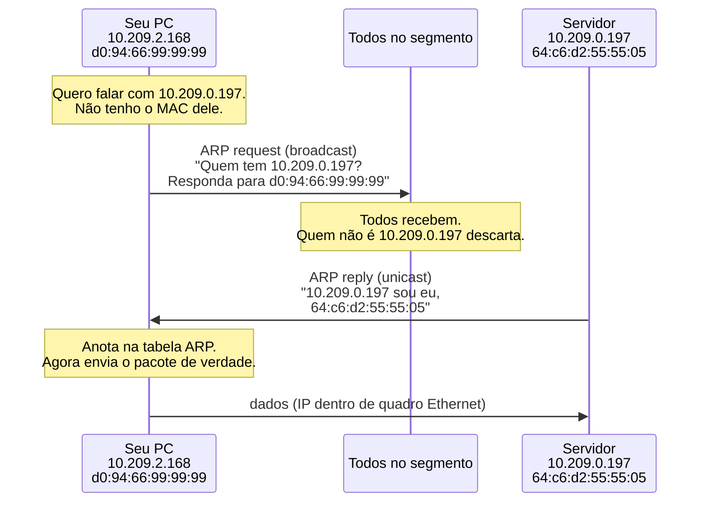

# 01 · O que é a tabela ARP — para quem nunca ouviu falar

> **Nível:** iniciante · zero jargão nas primeiras páginas
> **Data:** 14/08/2026

---

## A pergunta em uma frase

**A tabela ARP é a lista de "quem é quem" que o seu computador mantém para saber a
quem entregar fisicamente um pacote dentro da sua própria rede local.**

Se essa frase já bastou, pule para o [10-fundamentos](10-fundamentos.md). Se não,
continue: o resto deste arquivo constrói a ideia do zero absoluto.

---

## 1. A analogia do prédio

Imagine um prédio de apartamentos com um porteiro e cem moradores.

Você quer entregar um envelope para **"o apartamento 302"**. Você sabe o número do
apartamento. Mas o porteiro não entrega por número de apartamento — ele entrega **na mão
da pessoa**, e para isso precisa saber **qual rosto** mora no 302.

Então ele faz o óbvio: pega o interfone geral, aperta o botão que toca em **todos** os
apartamentos ao mesmo tempo e grita:

> — Quem é do 302? Se identifique.

Cento e um interfones tocam. Cem moradores ignoram, porque não moram no 302. Um responde:

> — Sou eu, Maria, cara redonda, cabelo curto.

O porteiro entrega o envelope para a Maria. E — aqui está o ponto inteiro — **ele anota
num caderninho**:

```
302  →  Maria (cara redonda, cabelo curto)
```

Da próxima vez que chegar envelope para o 302, ele **não toca o interfone geral**. Consulta
o caderninho e entrega direto. O caderninho economiza cem toques de interfone por envelope.

Esse caderninho é a **tabela ARP**.

| No prédio | Na rede |
|---|---|
| Número do apartamento (302) | **Endereço IP** (`10.209.0.197`) |
| Rosto da pessoa (Maria) | **Endereço MAC** (`64:c6:d2:55:55:05`) |
| Interfone geral | **broadcast** — mandar para todos de uma vez |
| A pergunta "quem é do 302?" | **ARP request** (requisição ARP) |
| A resposta "sou eu, Maria" | **ARP reply** (resposta ARP) |
| O caderninho do porteiro | **tabela ARP** (ou *cache* ARP, ou *tabela de vizinhos*) |
| O porteiro apagar anotações velhas | **envelhecimento** (*aging*) das entradas |

E o detalhe que muita gente não percebe: o caderninho **apaga sozinho**. Moradores se mudam.
Se o porteiro confiasse numa anotação de dois anos atrás, entregaria envelope para quem já
nem mora mais ali. Então ele risca anotações antigas de tempos em tempos e pergunta de novo.
A tabela ARP faz exatamente isso — e o capítulo [14](14-a-tabela-por-dentro.md) é inteiro
sobre esse "de tempos em tempos".

---

## 2. Por que existem dois endereços, afinal?

Essa é a pergunta que realmente incomoda quem está começando. Se cada máquina já tem um
endereço IP, **para que serve um segundo endereço?**

A resposta é histórica e prática, e vale a pena entendê-la porque explica quase tudo o que vem
depois.

### O endereço MAC: quem você é

O **MAC** (*Media Access Control*, controle de acesso ao meio) é um número de 48 bits gravado
de fábrica na placa de rede. Escreve-se em hexadecimal, seis pares:

```
d0:94:66:99:99:99
└──────┘ └──────┘
   OUI     série
(fabricante)
```

Os três primeiros bytes são o **OUI** (*Organizationally Unique Identifier*) — um bloco que o
IEEE vendeu a um fabricante específico. `d0:94:66` é da Dell. `00:50:56` é da VMware.
`6c:31:0e` é da Cisco. Os três últimos, o fabricante distribui como quiser.

Características do MAC:

- é **plano**: não tem hierarquia, não dá para dizer "todos os MAC que começam com X estão em
  São Paulo". É como número de CPF: identifica, mas não localiza;
- em tese acompanha o **hardware** a vida inteira (na prática, é reconfigurável por software,
  e isso importa — veja [18-seguranca](18-seguranca.md));
- só faz sentido **dentro de um mesmo segmento de rede** — o mesmo "prédio".

### O endereço IP: onde você está

O **IP** é um número atribuído por configuração (manual ou automática, via DHCP). É
**hierárquico**: `10.209.2.168/20` diz que a máquina está na rede `10.209.0.0/20`. Um
roteador consegue olhar para um IP e decidir "isso não é aqui, mande para o norte" sem
conhecer a máquina.

É como endereço postal: `Rua X, 500, Bairro Y, Cidade Z`. Dá para roteá-lo por etapas,
sem que ninguém conheça o mundo inteiro.

### Por que não usar só um dos dois?

**Por que não só MAC?** Porque MAC não é roteável. Para entregar um pacote pelo MAC no
mundo inteiro, todo roteador da Internet precisaria de uma tabela com todos os ~50 bilhões
de dispositivos já fabricados. Impossível. A hierarquia do IP é o que faz a Internet caber
na memória dos roteadores.

**Por que não só IP?** Porque, no fim do caminho, alguém precisa **colocar elétrons no fio**
(ou fótons na fibra, ou ondas no ar) endereçados a **uma placa específica**. A placa de rede
não entende IP — ela é um chip que compara os primeiros 6 bytes do quadro que chega com o
seu próprio MAC e descarta o que não for para ela. É uma decisão de hardware, tomada em
nanossegundos, sem software envolvido.

> **A tensão fundamental:** IP resolve o problema de *achar* a máquina no mundo.
> MAC resolve o problema de *entregar* a ela no fio. São dois problemas diferentes,
> resolvidos por duas camadas diferentes — e o **ARP é a cola entre elas**.

Essa cola tinha de existir. Ela poderia ter sido feita de outro jeito (e foi, em outras
redes — veja [11-historia](11-historia.md)), mas alguma cola era inevitável.

---

## 3. Onde exatamente entra o ARP

**ARP** significa *Address Resolution Protocol* — Protocolo de Resolução de Endereços. Está
descrito na [RFC 826](https://www.rfc-editor.org/info/rfc826), de **novembro de 1982**,
escrita por David C. Plummer. Tem cerca de dez páginas. É um dos protocolos mais simples,
mais antigos e mais inalterados de toda a Internet: o que você roda hoje no seu notebook é
essencialmente o mesmo de 1982.

O que ele faz, em três atos:



Repare no que **não** aparece aí:

- **não há autenticação.** Ninguém prova nada. Quem responder primeiro, e com credibilidade
  suficiente para o sistema operacional, ganha. Isso não é um bug — é uma decisão de projeto
  de 1982, tomada num contexto onde a rede local era um cabo coaxial dentro de um laboratório
  entre pessoas que se conheciam. É também a origem de metade dos ataques de rede local que
  existem ([18-seguranca](18-seguranca.md));
- **não há servidor.** Não existe "o servidor ARP". Cada máquina responde por si.
  É um protocolo distribuído sem coordenação central;
- **não há confirmação.** Quem pergunta não confirma que recebeu; quem responde não sabe se
  a resposta chegou.

---

## 4. Vendo a coisa de verdade, agora

Chega de analogia. Abra um terminal.

**Linux:**

```bash
ip neigh show
```

**Windows** (Prompt de Comando ou PowerShell):

```powershell
arp -a
```

**macOS:**

```bash
arp -a -n
```

No Linux desta máquina, o resultado real foi este:

```
10.209.1.101 dev enp2s0 lladdr 10:bf:48:11:11:01 STALE
10.209.0.199 dev enp2s0 lladdr a4:d7:3c:22:22:02 STALE
10.209.1.98  dev enp2s0 lladdr 00:50:56:ab:33:03 STALE
10.209.0.1   dev enp2s0 lladdr 6c:31:0e:44:44:04 REACHABLE
10.209.0.197 dev enp2s0 lladdr 64:c6:d2:55:55:05 STALE
10.209.2.12  dev enp2s0 lladdr 9c:6b:00:66:66:06 STALE
10.209.0.195 dev enp2s0 lladdr 58:38:79:77:77:07 STALE
10.209.2.134 dev enp2s0 lladdr d0:94:66:88:88:08 REACHABLE
10.209.1.32  dev enp2s0 lladdr 00:50:56:ab:99:09 REACHABLE
10.209.1.31  dev enp2s0 lladdr 00:50:56:ab:aa:0a REACHABLE
10.209.1.102 dev enp2s0                          FAILED
```

> **Sobre os endereços mostrados neste curso.** Todas as saídas de comando deste material
> foram executadas de verdade, nesta máquina (Ubuntu 22.04.5, kernel 6.8.0-136, iproute2
> 5.15.0), em 14/08/2026. Por privacidade da rede em que a máquina está, **os três últimos
> octetos de cada MAC foram substituídos por valores fictícios**. Os três primeiros — o OUI,
> que identifica o fabricante — são reais e foram preservados, porque são informação pública
> do IEEE e é justamente o que interessa didaticamente. Os IPs são privados
> (RFC 1918) e ficaram como estão. Tempos, estados e transições são reais e não foram tocados.

Vamos ler linha por linha a quarta:

```
10.209.0.1 dev enp2s0 lladdr 6c:31:0e:44:44:04 REACHABLE
└────────┘ └────────┘ └────┘ └───────────────┘ └───────┘
    IP      interface    │       endereço MAC    estado
                        "link layer address"
```

- **`10.209.0.1`** — o IP do vizinho. Neste caso é o *gateway*, o roteador de saída da rede.
- **`dev enp2s0`** — por qual placa de rede ele é alcançável. Uma mesma máquina com duas placas
  tem tabelas independentes por placa: o vizinho `10.209.0.1` na placa A e na placa B seriam
  duas entradas distintas.
- **`lladdr`** — abreviação de *link-layer address*, endereço de camada de enlace. É o MAC.
- **`REACHABLE`** — o estado. O sistema teve **confirmação recente** de que esse mapeamento
  está correto e funcionando.

E agora, a parte interessante: **o que essa tabela conta sobre a rede.**

Passando cada OUI pela base pública do IEEE (a mesma que o `nmap` embute em
`/usr/share/nmap/nmap-mac-prefixes`):

| MAC (OUI) | Fabricante | Leitura provável |
|---|---|---|
| `6c:31:0e` | Cisco Systems | o gateway é um roteador/switch Cisco |
| `00:50:56` | VMware | três máquinas virtuais em um hipervisor VMware |
| `d0:94:66` | Dell | outra estação Dell — a mesma marca desta máquina |
| `58:38:79` | Ricoh | quase certamente uma **impressora** |
| `10:bf:48` | ASUSTek | um desktop ou placa-mãe ASUS |

Onze linhas de terminal e você já sabe que existe um roteador Cisco, um cluster VMware e uma
impressora Ricoh nesse segmento — **sem escanear nada, sem mandar um único pacote**. Foi tudo
recolhido passivamente pela própria pilha de rede ao longo do dia.

É por isso que a tabela ARP é a primeira coisa que um administrador experiente olha ao chegar
numa rede desconhecida — e uma das primeiras que um atacante olha depois de comprometer uma
máquina.

---

## 5. Os estados: o caderninho tem cores

Você reparou que algumas entradas dizem `REACHABLE`, outras `STALE`, uma diz `FAILED`. Isso
**não** faz parte da RFC 826 — é uma sofisticação que o Linux (e o Windows moderno, e o macOS)
acrescentou, emprestada do protocolo equivalente do IPv6 ([RFC 4861](https://www.rfc-editor.org/info/rfc4861)).
Chama-se **NUD**: *Neighbor Unreachability Detection*, detecção de inalcançabilidade de vizinho.

Traduzindo os estados para o porteiro:

| Estado | O porteiro diria | O que significa |
|---|---|---|
| `REACHABLE` | "Vi a Maria há pouco, ela está lá" | mapeamento confirmado há menos de ~30 s |
| `STALE` | "Tenho a anotação, mas é antiga" | ainda vale, mas será verificada no próximo uso |
| `DELAY` | "Vou usar e observar se dá certo" | período de graça antes de perguntar de novo |
| `PROBE` | "Interfonando direto para o 302" | perguntando ativamente, em *unicast* |
| `INCOMPLETE` | "Toquei o interfone geral, aguardo" | perguntou em broadcast, ninguém respondeu ainda |
| `FAILED` | "Ninguém mora no 302" | perguntou o número de vezes previsto, silêncio |
| `PERMANENT` | "Escrito a caneta, não apagar" | entrada estática, configurada à mão |

E aqui vai um experimento **real**, medido nesta máquina. Peguei uma entrada em `STALE`,
mandei um único `ping` e observei a entrada a cada segundo:

```
antes    10.209.0.197 ... STALE
t=00     10.209.0.197 ... DELAY
t=01..05 10.209.0.197 ... DELAY
t=06     10.209.0.197 ... REACHABLE      ← confirmou
t=07..34 10.209.0.197 ... REACHABLE
t=35     10.209.0.197 ... STALE          ← ~29 s depois, envelheceu
```

Cinco segundos em `DELAY` — que é exatamente o valor de
`net.ipv4.neigh.default.delay_first_probe_time = 5`. Vinte e nove segundos em `REACHABLE` —
que é o `base_reachable_time_ms = 30000` com a aleatoriedade que o kernel aplica de propósito.
Nada disso é folclore: é o kernel seguindo parâmetros que você pode ler e mudar. O
[14-a-tabela-por-dentro](14-a-tabela-por-dentro.md) destrincha cada um.

E o caso do vizinho que não existe, também medido:

```
t=00..03  10.209.15.254 dev enp2s0  INCOMPLETE   ← 3 perguntas em broadcast, 1 por segundo
t=04      10.209.15.254 dev enp2s0  FAILED       ← desistiu
```

Três tentativas — `mcast_solicit = 3` — uma por segundo — `retrans_time_ms = 1000`.
O protocolo desiste em ~3 segundos e guarda o fracasso. Guardar o fracasso é o que impede
que cada pacote para um IP morto gere uma nova tempestade de broadcast.

---

## 6. Para que isso serve na sua vida

Vale a pena saber disso mesmo que você não seja administrador de rede? Sim, por cinco motivos
concretos:

1. **"A internet caiu" que não é a internet.** Se o `ping` para o gateway falha mas a entrada
   ARP dele está `FAILED`, o problema é físico/local (cabo, switch, VLAN), não do provedor.
   Isso corta o tempo de diagnóstico pela metade. Veja [19-diagnostico](19-diagnostico.md).

2. **Inventário sem escanear.** Quer saber o que existe na rede sem disparar alarme de
   segurança? A tabela ARP é passiva e já está preenchida.

3. **O IP duplicado.** Duas máquinas com o mesmo IP produzem um sintoma que parece bruxaria:
   funciona, some, volta, some. A tabela ARP oscilando entre dois MAC é a assinatura
   inconfundível — e a única forma barata de detectar isso.

4. **Segurança.** *ARP spoofing* é o ataque de rede local mais antigo que ainda funciona em
   2026, em quase toda rede corporativa mal configurada. Entender a tabela é entender por que
   ele funciona, como detectá-lo e como bloqueá-lo ([18-seguranca](18-seguranca.md)).

5. **Nuvem e containers.** Docker, Kubernetes, VPC da AWS/Azure — todos reimplementam,
   emulam ou suprimem o ARP de algum jeito. Bugs bizarros de conectividade em Kubernetes
   com frequência terminam numa tabela de vizinhos estourada
   (`neighbour table overflow`). Veja [17-arp-em-redes-reais](17-arp-em-redes-reais.md).

---

## 7. Os nomes que você vai encontrar

O mesmo objeto tem vários nomes, dependendo de quem fala. Todos significam a mesma coisa:

| Nome | Quem usa |
|---|---|
| **tabela ARP** | o mundo em geral, Windows, Cisco |
| **cache ARP** (*ARP cache*) | a RFC 826, e a literatura |
| **tabela de vizinhos** (*neighbour table*) | o kernel Linux e o `iproute2` |
| **cache de vizinhança** | documentação de IPv6 |
| **tabela de adjacências** | roteadores, em alguns contextos |

No Linux moderno, "tabela ARP" é tecnicamente um subconjunto: existe **uma** tabela de vizinhos,
que guarda tanto os mapeamentos IPv4 (aprendidos por ARP) quanto os IPv6 (aprendidos por NDP).
`ip neigh show` mostra as duas. `arp -n` só mostra a parte IPv4.

E a confusão mais frequente de todas, que vale resolver já:

> **Tabela ARP ≠ tabela MAC do switch.**
>
> A **tabela ARP** vive num *host* e responde: *"IP → qual MAC?"*.
> A **tabela MAC** (ou tabela CAM) vive num *switch* e responde: *"MAC → qual porta física?"*.
>
> São duas tabelas diferentes, em equipamentos diferentes, com perguntas diferentes.
> Elas cooperam: o ARP descobre o MAC, o switch descobre por onde mandá-lo.
> Confundir as duas é o erro nº 1 em prova de certificação e em entrevista de emprego.
> Detalhado em [17-arp-em-redes-reais](17-arp-em-redes-reais.md).

---

## 8. O que este curso vai cobrir

Você acabou de ver a camada 1 de 12. As outras onze estão nos arquivos seguintes:
o formato binário exato do pacote ARP, byte a byte; por que Plummer o desenhou assim em 1982;
a máquina de estados do kernel; ARP gratuito, proxy ARP, RARP e InARP; o que muda em Windows,
macOS e roteadores; ARP em VLAN, em Wi-Fi, em VRRP, em Docker e na nuvem; o ataque de
envenenamento e as defesas reais; um roteiro de diagnóstico; o sucessor IPv6; e os limites
teóricos — por que o custo de broadcast é o que decide o tamanho máximo de um domínio de
camada 2, e por que nenhum protocolo desse tipo pode ser ao mesmo tempo seguro, sem estado
e sem infraestrutura.

O mapa está em [00-MAPA.md](00-MAPA.md).

---

## Autoteste

1. Por que uma rede precisa de dois endereços por máquina (IP e MAC) em vez de um só? Dê o
   argumento nos dois sentidos: por que só MAC não funciona, e por que só IP não funciona.
2. Uma máquina precisa falar com `8.8.8.8`, que está na Internet. Ela vai emitir um ARP request
   perguntando "quem tem 8.8.8.8?" Sim ou não — e por quê?
3. Qual a diferença entre a tabela ARP de um computador e a tabela MAC de um switch?
4. O que significa uma entrada no estado `FAILED`, e por que o sistema se dá ao trabalho de
   guardar um fracasso em vez de simplesmente apagar a entrada?
5. Olhando `00:50:56:ab:33:03`, o que dá para afirmar sobre essa máquina antes mesmo de
   falar com ela?
6. O protocolo ARP não tem autenticação. Isso é um defeito de projeto? Argumente pelos dois
   lados, considerando o contexto de 1982.
7. Sua entrada ARP para o gateway está em `STALE` e você consegue navegar normalmente.
   Há algum problema? Explique.

*(Respostas: 1 → seção 2; 2 → não, ARP só resolve endereços **do mesmo segmento**; para
`8.8.8.8` a máquina resolve o MAC do **gateway** — veja [13](13-o-ciclo-de-resolucao.md);
3 → seção 7; 4 → seção 5; 5 → seção 4; 6 → seção 3 e [11-historia](11-historia.md);
7 → nenhum, `STALE` é um estado normal e utilizável — seção 5.)*

---

**Fontes consultadas:** RFC 826 (rfc-editor.org, consultado em 14/08/2026);
base de OUI do IEEE via `/usr/share/nmap/nmap-mac-prefixes` (28.524 prefixos, nmap instalado
localmente). Saídas de comando executadas nesta máquina em 14/08/2026.

**Próximo:** [02-pre-requisitos.md](02-pre-requisitos.md) · ou pule direto para
[04-como-comecar.md](04-como-comecar.md) se já tem um terminal aberto.
