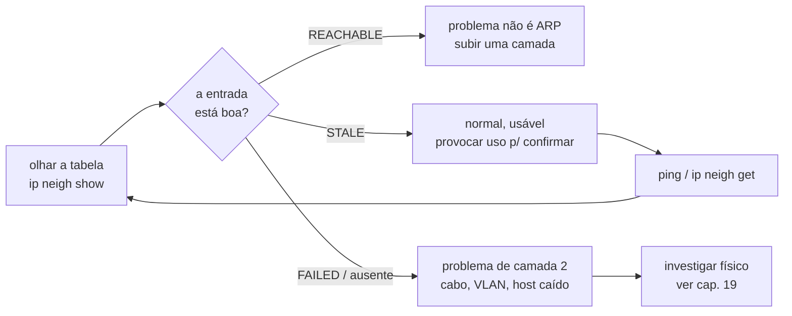

# 04 · Como começar — do terminal ao primeiro ciclo ARP na tela

> **Nível:** iniciante
> **Data:** 14/08/2026
> Assume o ambiente do [03-instalacao](03-instalacao.md). Para **só ler** a tabela você não
> instalou nada — os comandos abaixo já existem no seu sistema.

O objetivo deste arquivo: em quinze minutos, você vai **ver** a tabela ARP, **entender** cada
campo, **provocar** um ciclo de resolução e **observar** a máquina de estados mudando ao vivo.
Tudo com saídas reais desta máquina (Ubuntu 22.04.5, iproute2 5.15.0, 14/08/2026).

---

## 1. O "hello world": mostre a tabela

```bash
ip neigh show
```

Saída real (MAC com os 3 últimos octetos mascarados por privacidade — veja o aviso em
[01](01-introducao-leigo.md) §4):

```
10.209.0.1   dev enp2s0 lladdr 6c:31:0e:44:44:04 REACHABLE
10.209.1.31  dev enp2s0 lladdr 00:50:56:ab:aa:0a REACHABLE
10.209.0.197 dev enp2s0 lladdr 64:c6:d2:55:55:05 STALE
10.209.1.102 dev enp2s0                          FAILED
...
```

**Deu certo?** Se apareceu ao menos uma linha, sim. Se apareceu **nada**:

- sua máquina pode estar isolada (só ela na rede) — gere tráfego: `ping -c1 <ip-do-gateway>`;
- descubra o gateway com `ip route | grep default` e pingue-o;
- se ainda vazio, veja a [rota de resgate](02-pre-requisitos.md#6-rota-de-resgate).

Equivalentes nos outros sistemas:

```bash
arp -a -n              # macOS e Linux (comando legado)
```
```powershell
Get-NetNeighbor        # Windows PowerShell
arp -a                 # Windows (clássico)
```

---

## 2. Ler uma linha inteira

Peça uma entrada só, com todos os detalhes:

```bash
ip -s -d neigh show 10.209.0.1
```
```
10.209.0.1 dev enp2s0 lladdr 6c:31:0e:44:44:04 ref 1 used 12395/0/12395 probes 1 REACHABLE
```

Decodificando cada pedaço:

| Campo | Valor | Significado |
|---|---|---|
| IP | `10.209.0.1` | endereço de camada 3 do vizinho |
| `dev` | `enp2s0` | interface por onde é alcançável |
| `lladdr` | `6c:31:0e:44:44:04` | o MAC (o que a tabela existe para descobrir) |
| `ref` | `1` | quantas rotas referenciam esta entrada |
| `used A/B/C` | `12395/0/12395` | tempos, em segundos desde: último **uso** / última **confirmação** / última **atualização** |
| `probes` | `1` | quantas sondagens ativas foram feitas |
| estado | `REACHABLE` | o estado NUD (próxima seção) |

O `used a/b/c` é a informação que o `arp -a` esconde e que resolve diagnósticos: se o segundo
número (tempo desde a última confirmação) é grande, o mapeamento está velho e prestes a ser
reverificado.

---

## 3. Contar e filtrar (o que você mais vai usar)

```bash
# quantas entradas, agrupadas por estado
ip -j neigh show | python3 -c "import json,sys,collections; \
print(dict(collections.Counter(x['state'][0] for x in json.load(sys.stdin) if x.get('state'))))"
```
Saída real desta máquina:
```
{'FAILED': 3, 'STALE': 7, 'REACHABLE': 4}
```

Filtrar por estado, direto no `ip`:
```bash
ip neigh show nud reachable    # só as confirmadas agora
ip neigh show nud failed       # só os IPs que não responderam
ip neigh show nud stale        # as que serão reverificadas no próximo uso
```

Filtrar por interface:
```bash
ip neigh show dev enp2s0
```

> **Descoberta útil:** `ip neigh show nud failed` é um mini-mapa dos IPs que *deveriam* existir
> (alguém tentou falar com eles) mas **não responderam**. Numa rede saudável essa lista é curta.
> Cheia, indica varredura em curso, host caído ou configuração errada.

---

## 4. Resolver um vizinho sob demanda (sem `ping`)

O `ip neigh get` força a pilha a **resolver** um IP naquele instante e devolver o resultado —
útil para saber "quem é o MAC deste IP agora?" sem os efeitos colaterais do `ping`:

```bash
ip neigh get 10.209.0.1 dev enp2s0
# 10.209.0.1 dev enp2s0 lladdr 6c:31:0e:44:44:04 REACHABLE
```

Se o IP não existe, ele tenta resolver e falha explicitamente — bom para testar alcance de
camada 2 sem depender de o host responder a `ping` (muitos hosts bloqueiam ICMP mas **têm** de
responder ARP para funcionar na rede).

---

## 5. O ciclo de trabalho do dia a dia

O laço mental de quem usa isto a sério:



Na prática, três comandos resolvem 90% dos casos:

```bash
ip neigh show <ip>                 # 1. qual é o estado?
ping -c1 <ip>                      # 2. provoca resolução/confirmação
ip neigh show <ip>                 # 3. mudou de estado? o MAC apareceu?
```

---

## 6. Ver a máquina de estados **ao vivo** (o experimento que ensina)

Este é o exercício que faz o assunto "cair a ficha". Escolha um vizinho que já esteja em
`STALE`, mande **um** ping e observe a entrada a cada segundo:

```bash
T=10.209.0.197                     # troque por um IP STALE da SUA tabela
ip neigh show $T                   # confirme que está STALE
ping -c1 -W1 $T >/dev/null
for i in $(seq 0 40); do
  printf "t=%02d  %s\n" "$i" "$(ip neigh show $T)"
  sleep 1
done
```

Saída **real** medida nesta máquina:

```
antes    10.209.0.197 ... STALE
t=00     10.209.0.197 ... DELAY        ← usou a entrada velha; entra em período de graça
t=01..05 10.209.0.197 ... DELAY        ← 5 s de espera (delay_first_probe_time)
t=06     10.209.0.197 ... REACHABLE    ← recebeu confirmação: mapeamento válido
t=07..34 10.209.0.197 ... REACHABLE    ← ~29 s de vida útil
t=35     10.209.0.197 ... STALE        ← expirou; volta a "velho mas usável"
```

Você acabou de ver, com os próprios olhos, o kernel:

1. **usar** um mapeamento `STALE` sem esperar (o pacote saiu na hora — a rede não travou);
2. **suspeitar** dele e entrar em `DELAY` por exatos 5 segundos;
3. **confirmar** silenciosamente e promover a `REACHABLE`;
4. **envelhecer** ~30 segundos depois, de volta a `STALE`.

Cada número aí tem nome e você pode lê-lo:
```bash
sysctl net.ipv4.neigh.enp2s0.delay_first_probe_time   # = 5
sysctl net.ipv4.neigh.enp2s0.base_reachable_time_ms   # = 30000
```
O porquê de cada um está em [14-a-tabela-por-dentro](14-a-tabela-por-dentro.md).

E o caso do vizinho **inexistente**, também medido:
```bash
ping -c1 -W1 10.209.15.254 >/dev/null &
for i in $(seq 0 6); do printf "t=%02d %s\n" "$i" "$(ip neigh show 10.209.15.254)"; sleep 1; done
```
```
t=00..03  10.209.15.254 dev enp2s0  INCOMPLETE    ← perguntou em broadcast, 3x, 1/s
t=04..06  10.209.15.254 dev enp2s0  FAILED        ← desistiu e guardou o fracasso
```

---

## 7. Os primeiros cinco erros de **uso** (não de instalação)

Depois do ambiente pronto, estes são os tropeços clássicos:

1. **"A tabela está vazia, o ARP está quebrado!"** — Não. ARP é sob demanda. Uma tabela vazia
   só quer dizer que a máquina ainda não falou com ninguém. `ping` no gateway e olhe de novo.

2. **"Tem `FAILED`, deu erro."** — `FAILED` é um estado **normal e informativo**: alguém tentou
   um IP que não respondeu. Só é problema se for um IP que *deveria* responder. Não é defeito
   da sua máquina.

3. **Confundir `ip neigh show` (tudo, IPv4+IPv6) com `arp -n` (só IPv4).** Se um endereço "some"
   entre um comando e outro, provavelmente é IPv6 e você usou a ferramenta só-IPv4. Use
   `ip neigh` para ver os dois.

4. **Tentar alterar a tabela sem privilégio.** `ip neigh flush all` como usuário comum devolve:
   ```
   Failed to send flush request: Operation not permitted
   ```
   *(erro real reproduzido nesta máquina)*. **Ler** não precisa de root; **alterar** precisa.
   Prefixe `sudo`.

5. **Achar que a entrada ARP prova que o serviço funciona.** ARP `REACHABLE` prova só que a
   **placa** do outro lado respondeu — camada 2. O sistema operacional dele pode estar
   travado, o serviço (web, SSH) caído, o firewall bloqueando. ARP bom + `ping` bom + serviço
   ruim é um cenário comum. ARP é o **primeiro** degrau, não o último.

---

## 8. Um gostinho de alterar a tabela (precisa de `sudo`)

Só para você ver que é possível — o uso sério está no [05](05-manual-de-uso.md):

```bash
# adicionar uma entrada estática (permanente, não envelhece)
sudo ip neigh add 10.209.0.50 lladdr aa:bb:cc:dd:ee:ff dev enp2s0 nud permanent
ip neigh show 10.209.0.50
# 10.209.0.50 dev enp2s0 lladdr aa:bb:cc:dd:ee:ff PERMANENT

# remover a entrada de teste
sudo ip neigh del 10.209.0.50 dev enp2s0
```

> Não deixe entradas estáticas de brincadeira na tabela — se o MAC real daquele IP mudar, sua
> máquina vai insistir no MAC errado e "perder" o host. Entradas `PERMANENT` têm usos legítimos
> (§ no [05](05-manual-de-uso.md) e defesa anti-spoofing no [18](18-seguranca.md)), mas exigem
> manutenção manual.

---

## 9. Onde ir depois

- receitas curtas e prontas: [06-exemplos.md](06-exemplos.md);
- entender *por que* cada estado existe: [13-o-ciclo-de-resolucao.md](13-o-ciclo-de-resolucao.md)
  e [14-a-tabela-por-dentro.md](14-a-tabela-por-dentro.md);
- o pacote byte a byte: [12-anatomia-do-pacote.md](12-anatomia-do-pacote.md);
- projeto prático que lê e enriquece a tabela: [07-projeto-modelo/](07-projeto-modelo/);
- diagnóstico de problemas reais: [19-diagnostico.md](19-diagnostico.md).

---

## Autoteste

1. Sua tabela ARP está vazia. Isso é um problema? O que você faz para preenchê-la?
2. Qual comando mostra há quantos segundos uma entrada foi confirmada pela última vez?
3. No experimento da seção 6, por que o pacote de `ping` foi entregue **imediatamente**, mesmo
   com a entrada em `STALE`?
4. Por quê `ip neigh show` pode mostrar mais entradas que `arp -n` na mesma máquina?
5. Você vê `10.209.5.5 ... FAILED`. Cite dois cenários bem diferentes que produzem isso.
6. `ping` funciona e a entrada ARP está `REACHABLE`, mas o site naquele IP não abre. O ARP está
   com defeito? Onde você investiga agora?
7. Como você resolveria o MAC de um IP **sem** enviar um `ping` (útil se o host bloqueia ICMP)?

*(Respostas: 1 → seção 1; 2 → `ip -s neigh show <ip>`, seção 2; 3 → `STALE` é usável, seção 6;
4 → IPv6/NDP, seção 7; 5 → host caído / IP inexistente / varredura, seções 3 e 6; 6 → não;
suba para camada 3–7, seção 7.5; 7 → `ip neigh get`, seção 4.)*

---

**Fontes:** execuções reais nesta máquina (Ubuntu 22.04.5, iproute2 5.15.0), 14/08/2026.

**Próximo:** [05-manual-de-uso.md](05-manual-de-uso.md)
