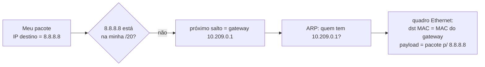

# 10 · Fundamentos — o vocabulário e os modelos mentais

> **Nível:** iniciante → intermediário
> **Data:** 14/08/2026
> Aqui os termos ganham definição precisa. Tudo que vier depois se apoia neste arquivo.

---

## 1. As camadas — onde o ARP mora

Toda comunicação em rede é organizada em **camadas**: cada uma resolve um problema e entrega o
resultado à de cima, sem que uma precise conhecer os detalhes da outra. Dois modelos convivem:

| OSI | TCP/IP | Endereça com | Exemplo | Unidade |
|---|---|---|---|---|
| 7 Aplicação | Aplicação | nome/URL | HTTP, DNS | mensagem |
| 4 Transporte | Transporte | porta | TCP, UDP | segmento |
| **3 Rede** | **Internet** | **IP** | IPv4, IPv6, ICMP | **pacote** |
| **2 Enlace** | **Enlace** | **MAC** | Ethernet, Wi-Fi | **quadro** (*frame*) |
| 1 Física | (Enlace) | — | cabo, rádio | bits |

O ARP vive **entre a camada 3 e a camada 2** — literalmente. Ele não é bem "camada 3" nem "camada
2": é o **tradutor** que a camada 3 chama quando precisa entregar algo à camada 2 e só tem um IP.
Alguns o chamam de "camada 2,5". A definição operacional é melhor:

> **ARP é a função que responde à pergunta "para colocar este pacote IP no fio, em qual MAC
> eu endereço o quadro?"**

- **camada 3 (IP)** sabe *onde* está o destino no mundo, mas não sabe entregar num fio;
- **camada 2 (Ethernet)** sabe entregar num fio, mas só entende MAC;
- **ARP** converte o IP do próximo salto no MAC correspondente.

---

## 2. Endereço IP, MAC, e "próximo salto"

- **Endereço IP** — identificador de camada 3, hierárquico e roteável. Já definido em
  [01](01-introducao-leigo.md) §2 e [02](02-pre-requisitos.md) §2.
- **Endereço MAC** — identificador de camada 2, plano, de 48 bits. Idem.
- **Próximo salto** (*next hop*) — o **dispositivo imediatamente seguinte** no caminho até o
  destino. Este é o conceito que desfaz a confusão nº 1 do assunto.

> **A regra de ouro do ARP:** você **nunca** resolve por ARP o MAC de um destino remoto. Você
> resolve o MAC do **próximo salto** — que, para destinos fora da sua sub-rede, é sempre o
> **gateway**.

Exemplo. Sua máquina (`10.209.2.168/20`, gateway `10.209.0.1`) quer falar com `8.8.8.8`:

O quadro Ethernet vai endereçado ao **MAC do gateway**, mas o pacote IP dentro dele ainda diz
`8.8.8.8`. O gateway remove o quadro, olha o IP, e repete o processo para o **próximo** salto.
O MAC muda a cada salto; o IP de destino permanece o mesmo do começo ao fim. Isso está detalhado
em [13-o-ciclo-de-resolucao](13-o-ciclo-de-resolucao.md).

---

## 3. Broadcast, unicast, multicast — os três modos de endereçar

- **Unicast**: um destinatário. O quadro tem o MAC exato de uma placa.
- **Broadcast**: todos no segmento. MAC de destino `ff:ff:ff:ff:ff:ff`. **Toda** placa do
  domínio de broadcast recebe e processa. É caro: interrompe todo mundo.
- **Multicast**: um grupo. MAC começando com `01:00:5e` (IPv4) ou `33:33` (IPv6).

O ARP request é **broadcast** (não sei quem é o dono, pergunto a todos). O ARP reply é
**unicast** (sei exatamente quem perguntou). Essa assimetria — pergunta cara, resposta barata —
é o que torna o ARP escalável dentro de um segmento e **inescalável** entre segmentos grandes
(o custo de broadcast é o teto teórico do tamanho de camada 2 — [60](60-teoria-avancada.md) §3).

---

## 4. Domínio de broadcast, domínio de colisão, segmento

- **Segmento / domínio de broadcast**: o conjunto de dispositivos que recebem o broadcast uns dos
  outros. Um switch **não** separa domínios de broadcast (repassa broadcast por todas as portas);
  um **roteador** separa. Uma **VLAN** separa logicamente dentro de um mesmo switch.
- **O ARP só funciona dentro de um domínio de broadcast.** Sua fronteira é a fronteira do ARP.
  Por isso "resolver o gateway" é a saída para tudo que está fora: o gateway é a porta do
  domínio.

Consequência prática que amarra tudo:

> **O tamanho da sua sub-rede (a máscara) = o tamanho do seu domínio de broadcast = o alcance do
> seu ARP.** Uma `/24` tem 254 hosts trocando broadcast; uma `/16`, 65 mil. Por isso `/16` de
> camada 2 única é considerado erro de projeto ([02](02-pre-requisitos.md) §2.2).

---

## 5. Cache, entrada, estado, envelhecimento

- **Cache ARP / tabela de vizinhos**: a estrutura em memória que guarda mapeamentos IP→MAC
  aprendidos, para não perguntar de novo a cada pacote.
- **Entrada**: uma linha do cache — um IP, seu MAC, a interface, o estado.
- **Estado (NUD)**: o rótulo que diz o quão confiável é a entrada agora (`REACHABLE`, `STALE`,
  …). Detalhado em [14](14-a-tabela-por-dentro.md). **Não** faz parte da RFC 826 — é uma
  sofisticação posterior emprestada do IPv6.
- **Envelhecimento** (*aging*): a política de expirar entradas velhas, porque mapeamentos mudam
  (host trocado, DHCP reatribuiu IP). Sem envelhecimento, um cache mentiria eternamente.

---

## 6. Os cinco "porquês" do ARP

Aplicando a regra dos cinco porquês do preset ao conceito central.

**P: Por que uma máquina precisa de ARP?**
R: Porque tem um IP de destino no mesmo segmento e precisa do MAC para montar o quadro Ethernet.

**P: Por que precisa do MAC, se já tem o IP?**
R: Porque a placa de rede (o hardware) só reconhece quadros endereçados ao seu próprio MAC.
Ela compara 6 bytes em nanossegundos e descarta o resto. Não existe hardware Ethernet que
filtre por IP — IP é conceito de software, camada acima.

**P: Por que a placa filtra por MAC e não por IP?**
R: Decisão de projeto da Ethernet (Metcalfe & Boggs, Xerox PARC, 1973–1980): o endereçamento de
enlace tinha de ser **independente do protocolo de camada 3** que rodasse por cima. Em 1980 não
havia só IP — havia IPX, AppleTalk, DECnet, XNS. A Ethernet precisava carregar qualquer um.
Um endereço de hardware neutro, mais um campo "EtherType" dizendo qual protocolo vem dentro,
resolveu isso. (Ver [11-historia](11-historia.md).)

**P: Por que o endereço de hardware é separado do de rede, então?**
R: Porque resolvem problemas opostos. O de rede precisa ser **hierárquico** para caber na
tabela de um roteador (a Internet não caberia numa tabela plana). O de hardware precisa ser
**único e imutável de fábrica** para não haver colisão num barramento compartilhado sem
configuração. Um número não pode ser as duas coisas ao mesmo tempo. (Ver
[60-teoria-avancada](60-teoria-avancada.md) §1.)

**P: Por que não delegar essa tradução a um servidor central, em vez de broadcast?**
R: **Parada legítima — decisão histórica documentada.** Plummer, em 1982, projetou o ARP para
uma Ethernet local sem infraestrutura: um cabo coaxial num laboratório. Exigir um servidor
central seria criar um ponto único de falha e um problema de bootstrap ("como acho o servidor
ARP sem ARP?"). Broadcast num meio compartilhado era **grátis** — todos já ouviam o cabo. A
troca "custo de broadcast por ausência de infraestrutura" foi a decisão de projeto. Ela envelhece
mal em redes grandes e comutadas (onde broadcast não é mais grátis), e é por isso que
tecnologias modernas *suprimem* o ARP com uma camada de controle central — voltando, em círculo,
à ideia do servidor (ver [65-estado-da-arte](65-estado-da-arte.md), ARP suppression em EVPN).

---

## 7. Modelo mental para guardar

Três frases que, memorizadas, resolvem 90% das dúvidas:

1. **"IP para achar, MAC para entregar."** Camadas diferentes, problemas diferentes.
2. **"ARP resolve o próximo salto, nunca o destino final."** Fora da sub-rede → resolve o gateway.
3. **"O request é para todos; a resposta, para um."** Broadcast pergunta, unicast responde — e é
   por isso que o tamanho do domínio de broadcast é o limite de tudo.

---

## Autoteste

1. Em que "camada" o ARP opera, e por que a resposta exata é menos útil que a operacional?
2. Sua máquina quer falar com um servidor na Internet. De qual MAC ela precisa, e por quê?
3. Por que o request ARP é broadcast e o reply é unicast? Que consequência de escala isso tem?
4. O que separa dois domínios de broadcast: um switch ou um roteador? E uma VLAN?
5. Por que o endereço de hardware (MAC) e o de rede (IP) não podem ser o mesmo número?
6. Aplique os cinco porquês para explicar por que a placa filtra por MAC e não por IP.
7. Uma `/16` de camada 2 única é problemática. Ligue isso ao conceito de domínio de broadcast.

---

**Fontes:** RFC 826; RFC 1122 (requisitos de host); Tanenbaum/Wetherall e Kurose/Ross (ver
[90-bibliografia](90-bibliografia.md)).

**Próximo:** [11-historia.md](11-historia.md)
