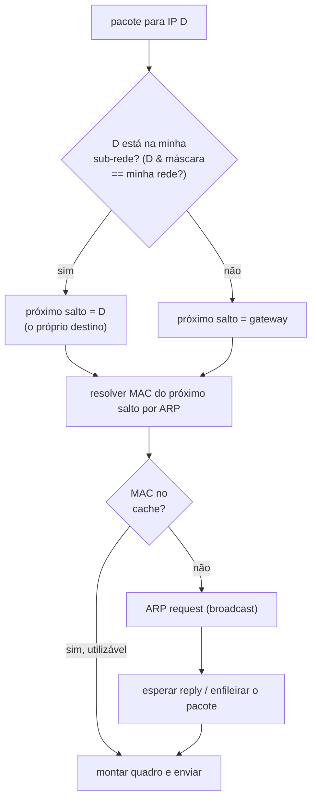
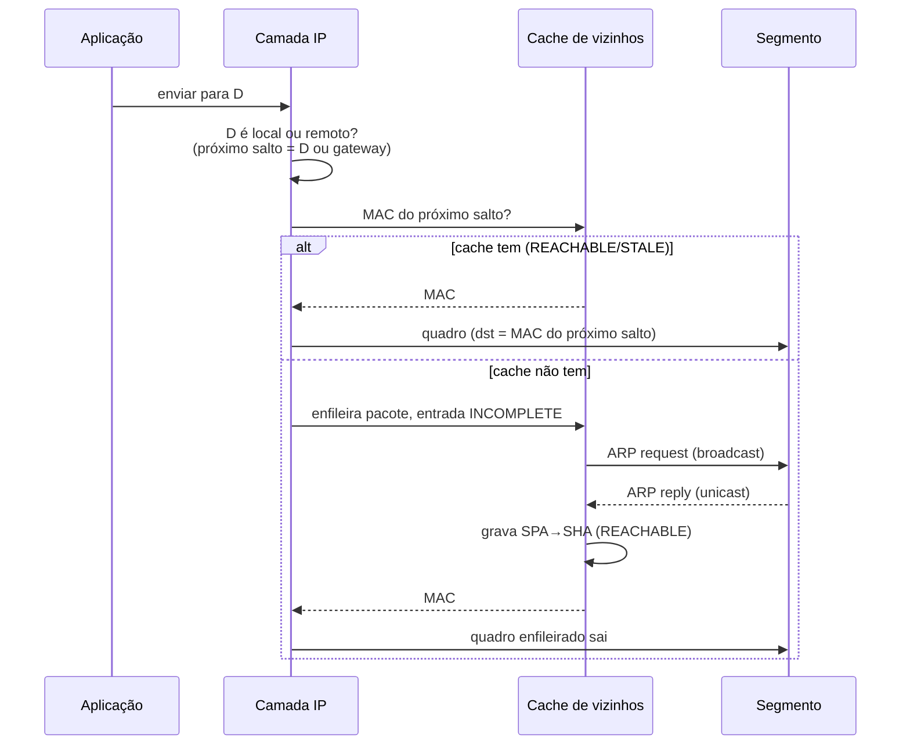

# 13 · O ciclo de resolução — do pacote que quer sair ao quadro no fio

> **Nível:** intermediário
> **Data:** 14/08/2026
> Este arquivo junta tudo: o que acontece, passo a passo, quando um programa manda um pacote.

---

## 1. O gatilho: um pacote precisa sair

Você abre `http://10.209.0.197`. O navegador entrega ao sistema um pedido para o IP
`10.209.0.197`. A pilha de rede precisa transformar isso num **quadro Ethernet no fio**. Antes
de qualquer coisa, ela faz **a pergunta que decide tudo**:

> **O destino está na minha sub-rede, ou fora dela?**



O cálculo é o do [02](02-pre-requisitos.md) §2.2: `D AND máscara == minha_rede AND máscara`?

- **Sim** → próximo salto é o próprio `D`. Resolvo o MAC de `D`.
- **Não** → próximo salto é o **gateway**. Resolvo o MAC do **gateway** (nunca o de `D`!).

Este é o ponto onde 90% das confusões sobre ARP se dissolvem. O ARP **sempre** resolve o
próximo salto, e o próximo salto é ou o destino (se local) ou o gateway (se remoto).

---

## 2. Dois cenários, lado a lado

**Cenário A — destino local.** Máquina `10.209.2.168/20` fala com `10.209.0.197`:

```
10.209.0.197 está em 10.209.0.0/20?  → SIM
próximo salto = 10.209.0.197
ARP: "quem tem 10.209.0.197?"  → reply: 64:c6:d2:55:55:05
quadro Ethernet: dst MAC = 64:c6:d2:55:55:05, payload = pacote IP p/ 10.209.0.197
```

**Cenário B — destino remoto.** A mesma máquina fala com `8.8.8.8`:

```
8.8.8.8 está em 10.209.0.0/20?  → NÃO
próximo salto = gateway 10.209.0.1
ARP: "quem tem 10.209.0.1?"  → reply: 6c:31:0e:44:44:04
quadro Ethernet: dst MAC = 6c:31:0e:44:44:04, payload = pacote IP p/ 8.8.8.8  ← IP não muda!
```

No cenário B, note: **o MAC de destino é o do gateway, mas o IP de destino continua `8.8.8.8`**.
O gateway recebe o quadro, vê que o IP não é dele, consulta sua tabela de rotas, descobre o
**próximo** salto, resolve o MAC *daquele* por ARP, e reencaminha. E assim por diante. **O IP de
destino atravessa a Internet inteira intacto; o par de MACs é trocado a cada salto.**

---

## 3. Quando há cache: o caminho rápido

Na imensa maioria das vezes, o MAC do próximo salto **já está no cache**. Aí não há ARP nenhum:
a pilha lê a entrada, monta o quadro e envia. O ARP só entra quando:

- não há entrada (primeiro contato, ou entrada expirada e removida);
- há entrada mas em estado que exige (re)confirmação — e mesmo assim, se `STALE`, o pacote sai
  **na hora** com o MAC antigo enquanto a confirmação corre em paralelo (visto no
  [04](04-como-comecar.md) §6).

Ou seja: **o ARP quase nunca está no caminho crítico**. Ele paga um custo alto (broadcast) uma
vez e colhe o benefício (cache) milhares de vezes. Essa razão custo/benefício é o que o torna
viável.

---

## 4. Quando não há cache: a resolução completa

1. A pilha **enfileira** o pacote que quer sair (não o descarta) e dispara um ARP request em
   broadcast para o IP do próximo salto.
2. A entrada entra em `INCOMPLETE`.
3. Se ninguém responde em ~1 s, repete (até `mcast_solicit` = 3 vezes).
4. **Reply chega** → a pilha grava SPA→SHA no cache (estado `REACHABLE`), **desenfileira** o
   pacote e o envia. Latência típica: sub-milissegundo numa LAN (medido: o primeiro `ping`
   após resolução completa e os seguintes têm RTT quase idêntico, ~0,3–0,5 ms).
5. **Nenhum reply após 3 tentativas** → a entrada vira `FAILED`, o pacote enfileirado é
   descartado, e a aplicação recebe o erro ("Destination Host Unreachable", vindo na verdade do
   próprio host, não da rede). Guardar o `FAILED` evita nova tempestade de broadcast a cada
   pacote subsequente.

A fila tem tamanho limitado (`unres_qlen`, padrão 101 pacotes nesta máquina). Se você despeja
tráfego para muitos IPs não resolvidos de uma vez, pacotes são descartados na fila — sintoma de
varredura ou de aplicação mal comportada.

---

## 5. Aprendizado passivo — a rede se ensina

Detalhe da RFC 826 que muita gente ignora: ao **receber** um ARP request (mesmo um que não é
para você), você pode aprender o par SPA→SHA de quem perguntou. Assim, quando A pergunta por B
em broadcast, **todos** no segmento aprendem o MAC de A de graça. É eficiente — e é a porta de
entrada do ARP spoofing, porque significa que caches são atualizados por pacotes não
solicitados ([18](18-seguranca.md)).

O comportamento exato varia: Linux, por padrão, **atualiza** uma entrada existente ao ver
tráfego, mas **não cria** entrada nova a partir de um request de terceiros a menos que
`arp_accept=1`. Isso limita um pouco a poluição de cache. Ver [16](16-arp-em-cada-sistema.md).

---

## 6. O ciclo inteiro, em uma figura



---

## 7. Amarrando aos estados

Cada passo deste ciclo corresponde a um estado NUD (próximo capítulo):

| Passo | Estado |
|---|---|
| enfileirei e perguntei em broadcast | `INCOMPLETE` |
| recebi reply, mapeamento fresco | `REACHABLE` |
| ~30 s depois, sem novo tráfego confirmado | `STALE` |
| usei uma entrada `STALE`, período de graça | `DELAY` |
| graça acabou, sondando em unicast | `PROBE` |
| perguntei 3× e ninguém respondeu | `FAILED` |

O [14-a-tabela-por-dentro](14-a-tabela-por-dentro.md) destrincha por que cada um existe e como
os tempos são calculados.

---

## Autoteste

1. Sua máquina `192.168.1.10/24` fala com `192.168.1.99` e depois com `1.1.1.1`. De qual(is)
   MAC(s) ela precisa em cada caso?
2. No cenário remoto, o que muda no quadro a cada salto e o que permanece igual do começo ao fim?
3. Por que o ARP "quase nunca está no caminho crítico"?
4. O que a pilha faz com o pacote enquanto espera o reply? E se o reply nunca vem?
5. Por que o sistema guarda uma entrada `FAILED` em vez de simplesmente esquecer?
6. Explique como "a rede se ensina" e por que isso é também um risco.
7. Um pacote para um IP remoto foi entregue ao MAC do gateway. Quem "conserta" o fato de o IP de
   destino não ser o do gateway?

---

**Fontes:** RFC 826; RFC 1122; código do subsistema `neighbour` do Linux (net/core/neighbour.c);
execuções locais em 14/08/2026.

**Próximo:** [14-a-tabela-por-dentro.md](14-a-tabela-por-dentro.md)
