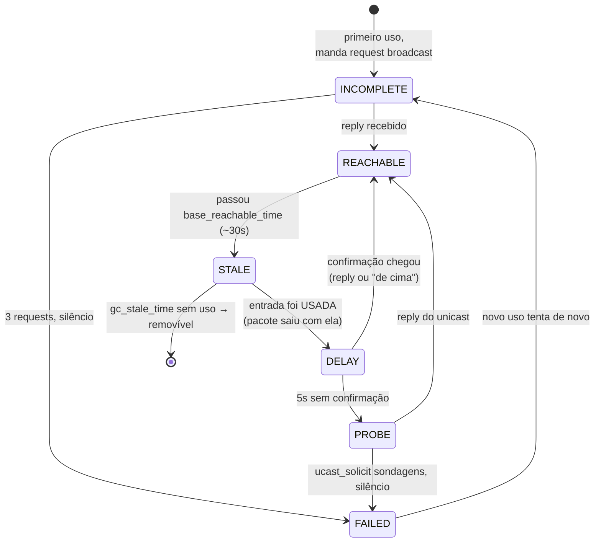

# 14 · A tabela por dentro — a máquina de estados NUD e o coletor de lixo

> **Nível:** avançado
> **Data:** 14/08/2026
> Este é o capítulo-planalto do curso ([02](02-pre-requisitos.md) §6 avisa). Vá devagar; rode
> os experimentos. Todos os números aqui foram lidos e medidos nesta máquina.

---

## 1. O que é NUD, e por que não está na RFC 826

**NUD** = *Neighbor Unreachability Detection* (detecção de inalcançabilidade de vizinho). É a
máquina de estados que decide **quando confiar, quando reverificar e quando desistir** de uma
entrada. Ela veio do **IPv6** (RFC 4861, §7) e o Linux a **retroaplicou ao IPv4** — por isso o
seu `ip neigh` mostra `REACHABLE`/`STALE` mesmo para ARP, algo que a RFC 826 nunca previu (ali
o cache era só "tem ou não tem, e envelhece").

O problema que o NUD resolve: um mapeamento IP→MAC pode ficar **errado sem aviso** — o host do
outro lado trocou de placa, migrou de VM, ou o DHCP reatribuiu o IP. Um cache ingênuo continuaria
mandando quadros para um MAC que não existe mais. O NUD detecta isso ativamente, mas **sem**
perguntar toda hora (o que geraria broadcast demais). O equilíbrio entre "confiar" e "verificar"
é toda a sofisticação.

---

## 2. Os estados e as transições



Traduzindo cada estado:

| Estado | Confiável? | Manda pacote? | O que está fazendo |
|---|---|---|---|
| `INCOMPLETE` | não | não (enfileira) | perguntou em broadcast, aguarda 1º reply |
| `REACHABLE` | sim | sim, direto | confirmado nos últimos ~30 s |
| `STALE` | provavelmente | **sim, na hora** | válido mas não confirmado há um tempo |
| `DELAY` | provavelmente | sim | usou uma STALE; período de graça antes de sondar |
| `PROBE` | duvidoso | sim | sondando ativamente em unicast |
| `FAILED` | não | não | desistiu; guarda o fracasso |
| `PERMANENT` | por decreto | sim | estática, nunca envelhece |
| `NOARP` | por decreto | sim | não precisa de ARP (broadcast/multicast) |

A sutileza mais importante, que o [04](04-como-comecar.md) §6 mostrou ao vivo:

> **`STALE` envia o pacote imediatamente.** O kernel não trava o tráfego para reverificar.
> Ele usa o MAC velho na hora **e** inicia a verificação em paralelo (`DELAY`→`PROBE`). Se a
> verificação falhar, aí sim corrige. Otimiza para o caso comum (o mapeamento continua válido)
> sem sacrificar correção no caso raro.

---

## 3. Os tempos, lidos da máquina

```bash
sysctl net.ipv4.neigh.enp2s0.base_reachable_time_ms   # 30000
sysctl net.ipv4.neigh.enp2s0.delay_first_probe_time   # 5
sysctl net.ipv4.neigh.enp2s0.gc_stale_time            # 60
sysctl net.ipv4.neigh.enp2s0.retrans_time_ms          # 1000
sysctl net.ipv4.neigh.enp2s0.mcast_solicit            # 3
sysctl net.ipv4.neigh.enp2s0.ucast_solicit            # 3
```

| Parâmetro | Valor | Papel |
|---|---|---|
| `base_reachable_time_ms` | 30000 | tempo-base em `REACHABLE`. **O real é aleatório entre 0,5× e 1,5× disso** (15–45 s) |
| `delay_first_probe_time` | 5 | segundos em `DELAY` antes de ir a `PROBE` |
| `retrans_time_ms` | 1000 | intervalo entre requests/probes |
| `mcast_solicit` | 3 | quantos requests broadcast em `INCOMPLETE` antes de `FAILED` |
| `ucast_solicit` | 3 | quantas sondagens unicast em `PROBE` antes de `FAILED` |
| `gc_stale_time` | 60 | quanto uma `STALE` sem uso sobrevive antes de virar removível |

**Por que `base_reachable_time` é aleatorizado (0,5×–1,5×)?** Para evitar **sincronização**: se
todas as entradas expirassem exatamente aos 30 s, uma rajada de tráfego criaria uma rajada
sincronizada de reverificações 30 s depois — um "efeito manada" periódico. A aleatoriedade
espalha as reverificações no tempo. É o mesmo princípio do *jitter* em retransmissões e do
`RANDOM_DELAY` em cron. **Parada legítima: decisão de engenharia contra ressonância.**

Você viu isso no [04](04-como-comecar.md) §6: a entrada ficou `REACHABLE` por ~29 s (dentro da
faixa 15–45 s) e o `DELAY` durou exatos 5 s.

---

## 4. Confirmação "de cima" — o atalho que evita broadcast

Aqui está a peça mais elegante do NUD. Uma entrada pode ir de `DELAY`/`STALE` a `REACHABLE`
**sem nenhum pacote ARP**, se uma camada superior confirmar que a comunicação está funcionando.

Exemplo: se o TCP recebe um ACK do outro lado, isso **prova** que o vizinho está vivo e o MAC
está certo — senão o pacote não teria chegado e voltado. O kernel usa esse sinal
(`dst_confirm` / `neigh_confirm`) para promover a entrada a `REACHABLE` de graça.

Consequência: numa conexão TCP ativa, o cache fica `REACHABLE` **sem gerar um único ARP extra**,
porque o próprio tráfego de dados serve de prova de vida. O ARP só reaparece quando o tráfego
para por tempo suficiente. Isso reduz drasticamente o broadcast numa rede movimentada — e é
invisível para quem só olha a tabela.

---

## 5. Experimento: forçar cada transição *(medido)*

```bash
T=<um IP vizinho real da sua rede>
sudo ip neigh flush dev enp2s0        # zera; força recomeço (precisa root)
ip neigh show $T                       # (nada — sem entrada)
ping -c1 $T >/dev/null                  # dispara INCOMPLETE → REACHABLE
ip neigh show $T                       # REACHABLE
# espere ~40s sem tráfego:
sleep 40; ip neigh show $T             # STALE
ping -c1 $T >/dev/null                  # STALE → DELAY → (confirma) REACHABLE
```

Sem `root`, você ainda observa `STALE→DELAY→REACHABLE→STALE` (o do [04](04-como-comecar.md) §6);
só não consegue o `flush` que força `INCOMPLETE` do zero.

---

## 6. Entradas estáticas e NOARP

- **`PERMANENT`**: criada à mão (`ip neigh add ... nud permanent`). **Ignora ARP recebido** —
  base da defesa anti-spoofing ([18](18-seguranca.md)). Custo: manutenção manual se o MAC mudar.
- **`NOARP`**: mapeamentos que não precisam de resolução — broadcast (`255.255.255.255`),
  multicast (`224.0.0.x` → `01:00:5e:...`), e o IPv6 multicast (`33:33:...`). O kernel os
  calcula, não os pergunta. Você os vê com `ip neigh show nud noarp`:
  ```
  224.0.0.251 dev enp2s0 lladdr 01:00:5e:00:00:fb NOARP
  255.255.255.255 dev enp2s0 lladdr ff:ff:ff:ff:ff:ff NOARP
  ```
  *(saída real desta máquina)*. O MAC multicast é derivado do IP por uma regra fixa, sem ARP —
  ver [15](15-variacoes-do-protocolo.md) §5.

---

## 7. O coletor de lixo (garbage collector) e os `gc_thresh`

A tabela não pode crescer sem limite — é memória do kernel. Um GC a poda. Três limiares:

```bash
sysctl net.ipv4.neigh.default.gc_thresh1   # 128
sysctl net.ipv4.neigh.default.gc_thresh2   # 512
sysctl net.ipv4.neigh.default.gc_thresh3   # 1024
```

| Limiar | Padrão | Comportamento |
|---|---|---|
| `gc_thresh1` | 128 | **abaixo disto o GC nem roda** — entradas são preservadas mesmo ociosas |
| `gc_thresh2` | 512 | limite flexível; acima dele, o GC fica agressivo (poda após 5 s) |
| `gc_thresh3` | 1024 | **teto rígido**: acima, o kernel **recusa criar entradas novas** |

O evento que estoura isto — `neighbour: arp_cache: neighbor table overflow!` no `dmesg` — é a
falha nº 1 em roteadores Linux e nós de Kubernetes densos ([06](06-exemplos.md) exemplo 14). O
sintoma é cruel: destinos **já em cache** continuam funcionando, destinos **novos** falham, então
"metade da rede cai" de forma intermitente e difícil de diagnosticar.

Ajuste para redes grandes (permanente em `/etc/sysctl.d/`):
```
net.ipv4.neigh.default.gc_thresh1 = 4096
net.ipv4.neigh.default.gc_thresh2 = 8192
net.ipv4.neigh.default.gc_thresh3 = 16384
```

Mas — e isto é o essencial — **aumentar o teto trata o sintoma, não a causa**. A causa é um
domínio de broadcast grande demais. A raiz teórica está em [60](60-teoria-avancada.md) §3: número
de entradas cresce com o número de hosts alcançáveis, e broadcast cresce pior. A cura de
engenharia é **segmentar** (mais sub-redes, mais roteamento, menos camada 2). Aumentar
`gc_thresh` é o paliativo enquanto você resegmenta.

---

## 8. Onde isso vive no kernel

O subsistema é genérico (`net/core/neighbour.c`) e serve tanto ao ARP (`net/ipv4/arp.c`) quanto
ao NDP (`net/ipv6/ndisc.c`) — a mesma máquina de estados, dois protocolos de resolução. Isso
explica por que `ip neigh` unifica IPv4 e IPv6: **é uma tabela só**, com dois "resolvedores"
plugados. Você inspeciona os parâmetros com `ip ntable show`:
```
inet arp_cache
    dev enp2s0
    refcnt 16 reachable 29877 base_reachable 30000 retrans 1000
    gc_stale 60000 delay_probe 5000 queue 101 ...
```
*(saída real; `reachable 29877` é o valor aleatorizado corrente — dentro da faixa 15–45 s.)*

---

## Autoteste

1. Por que `REACHABLE` dura um tempo **aleatório** entre ~15 e ~45 s, e não fixos 30 s?
2. Uma entrada está `STALE` e você usa. O pacote espera a reverificação? Descreva a sequência de
   estados.
3. Como uma entrada vai a `REACHABLE` **sem** trocar nenhum pacote ARP?
4. O que exatamente acontece quando o nº de vizinhos ultrapassa `gc_thresh3`? Por que o sintoma
   é "só destinos novos falham"?
5. Diferencie `PERMANENT` de `NOARP`: quem cria cada um e por quê?
6. Por que a mesma tabela serve IPv4 e IPv6? O que isso diz sobre o design do kernel?
7. Sua equipe aumenta `gc_thresh3` e o overflow some por uns meses, depois volta. Qual é a causa
   raiz que ninguém tratou?

---

**Fontes:** RFC 4861 §7 (NUD); `man 7 arp`; `net/core/neighbour.c` e `arp.c` do kernel Linux;
`sysctl`/`ip ntable` reais desta máquina (kernel 6.8.0-136), 14/08/2026.

**Próximo:** [15-variacoes-do-protocolo.md](15-variacoes-do-protocolo.md)
